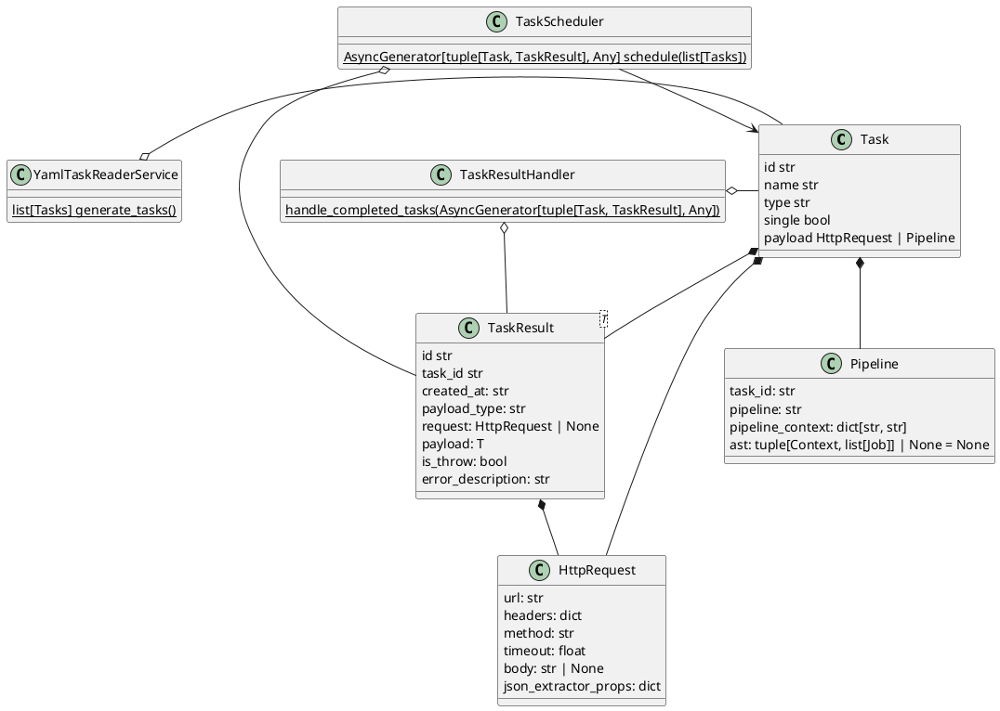

# PipeDSL: Pipeline Framework

A lightweight and flexible pipeline framework for orchestrating HTTP requests using YAML configuration.

## 🧩 What is PipeDSL?

**PipeDSL** is a minimalistic yet powerful tool that allows you to define and run sequences of HTTP requests as pipelines using simple YAML
files. It enables chaining, parallel execution, dynamic argument passing, and data extraction from responses using JSONPath expressions.

Whether you're building integrations, automating API workflows, or testing endpoints — Kiki helps streamline your tasks with ease.

---

## 🚀 Quick Start

```bash
pip install PipeDSL
```

```python
import asyncio

from PipeDSL import TaskScheduler
from PipeDSL import YamlTaskReader

config = """
tasks:
  - type: http
    id: 1
    name: Easy Example #1
    url: https://api.google.com/
    method: get
"""

tasks = YamlTaskReader.generate_tasks(config_body=config)
results = TaskScheduler.schedule(tasks)


async def main():
    async for task, result_task in results:
        print(task, result_task)


asyncio.run(main())
```

---

## 📁 Configuration Examples

### Simple Single Job

```yaml
tasks:
  - type: http
    id: 16b4e67a-2f61-4dc2-916a-052c72c58fd5
    name: Easy Example #1
    url: https://api.test.com/
    method: get
```

### Two Sequential Jobs

```yaml
  - type: http
    name: Fist
    url: 'https://api.test.com/1'
    id: first
    single: false

  - type: http
    name: Second
    url: 'https://api.test.com/2'
    id: second
    single: false

  - type: pipeline
    name: Two job
    id: open_movies
    pipeline: "first() >> second()"
```

### Passing Arguments Between Tasks

```yaml
  - type: http
    name: Get item
    url: '!{{1}}/get-some'
    id: first
    single: false
    json_extractor_props:
      id: 'id'

  - type: http
    name: Get item2
    url: '!{{1}}/get-some/!{{2}}'
    id: second
    single: false

  - type: pipeline
    name: Pipeline
    id: pipeline
    pipeline: "first(pipeline_context.endpoint) >> second(pipeline_context.endpoint, first.id)"
    pipeline_context:
      endpoint: 'https://api.test.com/'
```

### Group Task Execution with Different Arguments

```yaml
  - type: http
    name: Get item
    url: 'https://api.test.com/get-some'
    id: first
    single: false
    json_extractor_props:
      ids: '$.results[*].id'

  - type: http
    name: Get item2
    url: '!https://api.test.com/get-some/!{{1}}?param=!{{2}}'
    id: second
    single: false

  - type: pipeline
    name: Pipeline
    id: pipeline
    pipeline: "first() >> [first.ids, pipeline_context.params] * [second($1, $2)]"
    pipeline_context:
      params:
        - a
        - b
```

---

## ⚙️ Task Properties Reference

| Property               | Description                                                                                                    |
|------------------------|----------------------------------------------------------------------------------------------------------------|
| `json_extractor_props` | JSONPath expressions to extract values from response (see [jsonpath-ng](https://github.com/h2non/jsonpath-ng)) |
| `type`                 | Either `http` or `pipeline`                                                                                    |
| `name`                 | Human-readable task name (for reports)                                                                         |
| `id`                   | Unique identifier for the task (no spaces allowed)                                                             |
| `single`               | Boolean; set to `true` if the task not call in pipeline                                                        |
| `url`                  | Required for HTTP-type tasks                                                                                   |

---

## 🧠 Supported Features

- ✅ Sequential & parallel task execution
- ✅ Dynamic value injection using `!{{n}}` placeholders
- ✅ Response parsing via [JSONPath-ng](https://github.com/h2non/jsonpath-ng)
- ✅ Complex pipeline definitions using DSL-like syntax
- ✅ Context-aware execution with `pipeline_context`
- ✅ Docker-ready and easy to deploy

---

## 📐 Architecture Overview



## 🛡️ License

This project is licensed under the **Apache License, Version 2.0** – see [LICENSE](LICENSE) for details.