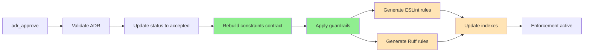

# ADR Kit

Document architectural decisions. Enforce them automatically.

[](https://www.python.org/downloads/)
[](https://opensource.org/licenses/MIT)
[](#testing--validation)

## The Problem

Your team decides "use React Query for all data fetching." Three months later, new code uses axios and fetch(). No one remembers the decision or why it was made. Code reviews catch some violations, but not all.

## The Solution

ADR Kit makes architectural decisions enforceable:

1. **Document decisions** in standard MADR format
2. **Extract policies** from decision documents automatically
3. **Generate lint rules** that prevent violations
4. **Integrate with AI agents** for autonomous ADR management

**Example**: An ADR that says `disallow: [axios]` becomes an ESLint rule that blocks axios imports with a message pointing to your ADR.

## Quick Start

### Install

```bash
uv tool install adr-kit
```

### Initialize Your Project

```bash
cd your-project
adr-kit init
```

### Choose Your Path

**Path A: Greenfield (New Project)**
Start creating ADRs as you make architectural decisions.

```bash
# Setup AI agent to help you
adr-kit setup-cursor  # or setup-claude

# Then in Cursor/Claude Code:
# "Create an ADR for our decision to use React with TypeScript"
```

**Path B: Brownfield (Existing Project)**
Analyze existing codebase to discover decisions already made.

```bash
# Setup AI agent
adr-kit setup-cursor  # or setup-claude

# Then in Cursor/Claude Code:
# "Analyze my project for architectural decisions that need ADRs"
# AI will detect your tech stack and propose ADRs
```

## How It Works

### Design Pattern: MCP Tools → Workflows → Internal Functions

```
AI Agent
  ↓
MCP Tool (6 simple interfaces)
  ↓
Workflow (multi-step automation)
  ↓
Internal Functions (automatic)
  ├─ generate_adr_index()
  ├─ generate_eslint_config()
  ├─ generate_ruff_config()
  ├─ apply_guardrails()
  └─ rebuild_contract()
```

**Why this matters**: When you approve an ADR, one MCP tool call triggers a 9-step automation pipeline. You don't manually generate indexes or lint rules—it all happens automatically.

### The 6 MCP Tools

ADR Kit exposes 6 MCP tools for AI agents. Each tool triggers a comprehensive workflow:

| MCP Tool | When To Use | What It Does |
|----------|-------------|--------------|
| `adr_analyze_project` | Starting with existing codebase | Detects technologies, proposes ADRs for existing decisions |
| `adr_preflight` | Before making technical choice | Returns ALLOWED/REQUIRES_ADR/BLOCKED |
| `adr_create` | Documenting a decision | Creates ADR file with conflict detection |
| `adr_approve` | After human review | **Triggers full automation**: contract rebuild, lint rules, guardrails, indexes |
| `adr_supersede` | Replacing existing decision | Manages relationships, updates old ADR to superseded |
| `adr_planning_context` | Before implementing feature | Returns relevant ADRs, constraints, technology recommendations |

### The Approval Automation Pipeline

When you approve an ADR, this happens automatically:



**No manual steps required**. Index generation, lint rule creation, and config updates all happen automatically.

## Example: Complete Lifecycle

### Greenfield (New Project)

```bash
# 1. Initialize
adr-kit init
adr-kit setup-cursor

# 2. Make a decision
# In Cursor: "I want to use React Query for data fetching"

# 3. AI calls adr_preflight({choice: "react-query"})
# Returns: REQUIRES_ADR (no existing ADR for this)

# 4. AI calls adr_create({title: "Use React Query", ...})
# Creates: docs/adr/ADR-0001-react-query.md (status: proposed)

# 5. You review the ADR
# In Cursor: "Approve ADR-0001"

# 6. AI calls adr_approve({adr_id: "ADR-0001"})
# Automatically:
#   - Updates status to "accepted"
#   - Rebuilds constraints contract
#   - Generates ESLint rules blocking axios
#   - Applies guardrails to .eslintrc.adrs.json
#   - Updates adr-index.json

# 7. Enforcement active
# Developer tries: import axios from 'axios'
# ESLint error: "Use React Query instead (ADR-0001)"
```

### Brownfield (Existing Project)

```bash
# 1. Initialize
cd existing-project
adr-kit init
adr-kit setup-cursor

# 2. Analyze existing architecture
# In Cursor: "Analyze my project for architectural decisions"

# 3. AI calls adr_analyze_project()
# Detects: React, TypeScript, Express, PostgreSQL, Docker
# Generates tech-specific analysis prompts

# 4. AI creates ADRs for existing decisions
# ADR-0001: Use React for Frontend
# ADR-0002: Use TypeScript for Type Safety
# ADR-0003: Use PostgreSQL for Data Storage
# ADR-0004: Use Docker for Containerization

# 5. You review all proposed ADRs
# In Cursor: "Approve ADR-0001 through ADR-0004"

# 6. AI approves each one (4 automation pipelines run)
# Now your existing decisions are documented AND enforced

# 7. Future decisions follow greenfield workflow
```

## Brownfield Analysis Details

ADR Kit includes sophisticated technology detection for brownfield projects:

**Detected Technologies** (20+):
- **Frontend**: React, Vue, Angular, Svelte
- **Backend**: Express.js, FastAPI, Django, Flask, Spring
- **Databases**: PostgreSQL, MySQL, MongoDB, Redis
- **Languages**: TypeScript, JavaScript, Python, Rust, Go
- **Tools**: Docker, Kubernetes

**How It Works**:
```python
# Scans for config files
package.json → Detects React, TypeScript, Express
requirements.txt → Detects FastAPI, PostgreSQL
Dockerfile → Detects Docker

# Generates technology-specific prompts
"React: Document component architecture, state management decisions"
"PostgreSQL: Document schema design, migration strategy"
"Docker: Document containerization approach"
```

**Different prompts based on existing ADRs**:
- **0 ADRs found** → "Identify ALL architectural decisions in this project"
- **N ADRs found** → "Find decisions MISSING from existing ADR set"

## ADR Format with Structured Policies

ADRs use MADR format with policy extensions for enforcement:

```markdown
---
id: ADR-0001
title: Use React Query for data fetching
status: proposed
date: 2025-10-01
deciders: [frontend-team, tech-lead]
tags: [frontend, data-fetching]
policy:
  imports:
    prefer: [react-query, @tanstack/react-query]
    disallow: [axios]
  rationales:
    - "Standardize data fetching patterns"
---

## Context
Custom data fetching is scattered across components...

## Decision
Use React Query for all data fetching.

## Consequences
### Positive
- Standardized caching, built-in loading states
### Negative
- Additional dependency, learning curve
```

**After approval, this automatically generates**:

```json
// .eslintrc.adrs.json (auto-generated, don't edit)
{
  "rules": {
    "no-restricted-imports": [
      "error",
      {
        "paths": [
          {
            "name": "axios",
            "message": "Use React Query instead (ADR-0001)"
          }
        ]
      }
    ]
  }
}
```

## AI Agent Integration

### Setup for Cursor IDE

```bash
# Automatic configuration
adr-kit setup-cursor
```

Or manually add to `.cursor/mcp.json`:
```json
{
  "mcpServers": {
    "adr-kit": {
      "command": "adr-kit",
      "args": ["mcp-server"]
    }
  }
}
```

### Setup for Claude Code

```bash
# Automatic configuration
adr-kit setup-claude
```

Or manually add to Claude Code MCP settings.

### Example Conversations

**Scenario 1: Before Making a Decision**
```
You: "I want to use PostgreSQL for this project"
AI: [calls adr_preflight({choice: "postgresql"})]
AI: "This requires an ADR. Let me help you create one..."
AI: [calls adr_create()]
AI: "Created ADR-0003 for PostgreSQL. Review and approve?"
```

**Scenario 2: Analyzing Existing Project**
```
You: "What architectural decisions should we document?"
AI: [calls adr_analyze_project()]
AI: "I found: React, TypeScript, Next.js, PostgreSQL"
AI: "Creating ADRs for each decision..."
AI: [creates 4 ADRs]
AI: "Review these proposed ADRs?"
```

**Scenario 3: Getting Context for Task**
```
You: "I need to implement user authentication"
AI: [calls adr_planning_context({task: "implement authentication"})]
AI: "Based on ADR-0005, you must use Auth0"
AI: "Here's the authentication pattern to follow..."
```

## Manual CLI Usage (Without AI)

For direct usage without AI agents:

```bash
# Validation
adr-kit validate                # Validate all ADRs
adr-kit validate --id ADR-0001  # Validate specific ADR

# Policy management
adr-kit contract-build          # Build constraints contract
adr-kit contract-status         # View current contract
adr-kit preflight postgresql    # Manual preflight check

# Enforcement
adr-kit guardrail-apply        # Apply lint rules
adr-kit guardrail-status       # Check guardrail status

# Maintenance
adr-kit update                  # Check for updates
adr-kit mcp-health             # Test MCP server
```

## Advanced: What's Automatic vs Manual

### Automatic (Triggered by Approval)

When you call `adr_approve()` or AI agent approves an ADR:
- ✅ Index generation (`generate_adr_index()`)
- ✅ ESLint rule generation (`generate_eslint_config()`)
- ✅ Ruff rule generation (`generate_ruff_config()`)
- ✅ Guardrail application (`GuardrailManager.apply_guardrails()`)
- ✅ Constraints contract rebuild (`ConstraintsContractBuilder.build()`)
- ✅ Codebase validation

**You never manually call these functions**. They're internal to the approval workflow.

### Manual (When Needed)

- 🔧 Project initialization (`adr-kit init`)
- 🔧 Validation (`adr-kit validate`)
- 🔧 Health checks (`adr-kit mcp-health`)
- 🔧 Manual preflight checks (`adr-kit preflight <choice>`)

## Advanced: Semantic Search

ADR Kit includes built-in semantic search for finding related ADRs:

**Status**: Fully implemented, currently used as optional fallback
- Uses sentence-transformers (`all-MiniLM-L6-v2`)
- Stores embeddings in `.project-index/adr-vectors/`
- Finds ADRs by meaning, not just keywords

**Current behavior**: Primary method is keyword matching, semantic search available as enhancement

**Future**: Will become primary method for conflict detection

## Directory Structure

```
your-project/
├── docs/adr/                      # ADR files
│   ├── ADR-0001-react-query.md
│   ├── ADR-0002-typescript.md
│   └── adr-index.json            # Auto-generated index
├── .adr-kit/                     # System files
│   └── constraints_accepted.json  # Merged policies
├── .project-index/               # Indexes
│   └── adr-vectors/              # Semantic search embeddings (optional)
├── .eslintrc.adrs.json           # Auto-generated lint rules
└── pyproject.toml                # Auto-managed [tool.ruff] section
```

**Important**: Files in `.adr-kit/` and `.eslintrc.adrs.json` are auto-generated. Don't edit them manually.

## Installation Options

### Recommended: Global Install

```bash
uv tool install adr-kit
```

Use ADR Kit across all your projects. The `adr-kit` command is available system-wide.

### Virtual Environment Install

```bash
cd your-project
uv venv
source .venv/bin/activate
uv pip install adr-kit
```

Project-specific installation.

### Quick Trial (No Install)

```bash
uvx adr-kit --help
uvx adr-kit init
```

Try ADR Kit without installing.

## CI/CD Integration

```yaml
# .github/workflows/adr.yml
name: ADR Validation

on: [push, pull_request]

jobs:
  validate:
    runs-on: ubuntu-latest
    steps:
      - uses: actions/checkout@v4

      - name: Install uv
        uses: astral-sh/setup-uv@v4
        with:
          enable-cache: true

      - name: Install ADR Kit
        run: uv tool install adr-kit

      - name: Validate ADRs
        run: adr-kit validate

      - name: Check lint rules are current
        run: git diff --exit-code .eslintrc.adrs.json
```

## Testing & Validation

ADR Kit includes comprehensive test coverage:

### Quick Health Check

```bash
adr-kit mcp-health
```

Expected output:
- ✅ FastMCP dependency: OK
- ✅ MCP server: OK
- ✅ Workflow backend system: OK
- 📡 6 MCP Tools available

### Test Coverage

- **Unit Tests**: Individual workflow components
- **Integration Tests**: MCP server ↔ workflow integration
- **End-to-End Tests**: Complete lifecycle (analyze → create → approve)
- **Error Scenarios**: Permission errors, malformed input
- **Performance Tests**: Large projects, memory efficiency

Each workflow is testable Python code:
```python
workflow = CreationWorkflow(adr_dir="/test")
result = workflow.execute(creation_input)
assert result.success is True
```

## FAQ

**Q: Do I need to use AI agents?**
A: No. CLI works standalone. But AI agents make it much more useful—they can analyze your codebase, propose ADRs, and manage the entire lifecycle.

**Q: What if I don't use JavaScript/Python?**
A: ADRs are still valuable for documentation. Policy enforcement is limited to supported linters (ESLint, Ruff, import-linter).

**Q: Can I use this with existing ADRs?**
A: Yes. ADR Kit reads standard MADR format. Add the `policy:` section to enable enforcement.

**Q: How much setup time?**
A: 5-10 minutes for basic setup. Brownfield analysis: 15-30 minutes depending on project size.

**Q: Greenfield vs Brownfield—what's the difference?**
A: **Greenfield** = new project, create ADRs as you make decisions.
**Brownfield** = existing project, use `adr_analyze_project()` to find and document existing decisions.

**Q: Is semantic search working?**
A: Yes, fully implemented. Currently used as optional fallback. Keyword matching is primary method.

**Q: Does this work offline?**
A: Yes. No external API calls. Semantic search uses local models (sentence-transformers).

**Q: What's the difference between MCP tools and CLI commands?**
A: **MCP tools** (6) are for AI agents. **CLI commands** (20+) are for manual use, debugging, and CI/CD. Different interfaces for different purposes.

## What's Coming

- Enhanced semantic search as primary conflict detection method
- Additional linter integrations (import-linter templates)
- ADR templates for common decision types
- Static site generation for ADR documentation

See [.agent/GAP_ANALYSIS.md](.agent/GAP_ANALYSIS.md) for detailed feature status and roadmap.

## Learn More

- **MADR Format**: [Markdown ADR Specification](https://adr.github.io/madr/)
- **MCP Protocol**: [Model Context Protocol](https://modelcontextprotocol.io)
- **Getting Started Guide**: [GETTING_STARTED.md](GETTING_STARTED.md) *(coming soon)*
- **Workflows Deep Dive**: [WORKFLOWS.md](WORKFLOWS.md) *(coming soon)*
- **AI Integration Guide**: [AI_INTEGRATION.md](AI_INTEGRATION.md) *(coming soon)*
- **Core Concepts**: [CONCEPTS.md](CONCEPTS.md) *(coming soon)*

## Development

For development on ADR Kit itself:

```bash
# Clone and setup
git clone https://github.com/yourusername/adr-kit
cd adr-kit

# Install in editable mode
uv pip install -e ".[dev]"

# Run tests
pytest

# Development commands (see Makefile)
make dev-setup     # Initial setup
make test-all      # Run all tests
make quality       # Format + lint + test
```

See [CLAUDE.md](CLAUDE.md) for developer documentation.

## License

MIT License - see [LICENSE](LICENSE) file for details.
