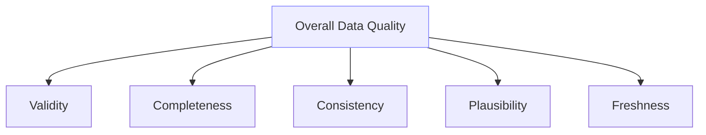

This page summarizes three core ideas you need on Day‑0:
- How to reference a standard (name vs path)
- The five assessment dimensions
- Protection modes for the decorator

Use this as a single reference and link to it from other pages instead of duplicating explanations.

## Standards: name vs path

There are two ways to reference a standard depending on the interface:

- Decorator (logical name)
  - Use the standard&#39;s logical name (omit the .yaml extension).
  - Example: `standard="invoice_data_standard"`
- CLI (filesystem path)
  - Use a file path to the standard YAML on disk.
  - Example: `examples/standards/invoice_data_ADRI_standard.yaml`

Why two forms?
- Code (decorator) should be stable and human‑readable: logical names travel well in source control and reviews.
- CLI commands operate on actual files: paths make it explicit which artifact is being read/written.

Examples:
- Decorator
  ```python
  from adri.decorator import adri_protected

  @adri_protected(
      standard="invoice_data_standard",   # logical name (no .yaml)
      data_param="invoice_rows",          # your function&#39;s data parameter
      on_failure="warn"                   # protection mode (see below)
  )
  def process_invoices(invoice_rows: list[dict]):
      ...
  ```
- CLI
  ```bash
  # Generate a standard from sample data
  adri generate-standard examples/data/invoice_data.csv \
    -o examples/standards/invoice_data_ADRI_standard.yaml

  # Assess data against a standard
  adri assess \
    --standard examples/standards/invoice_data_ADRI_standard.yaml \
    --data examples/data/test_invoice_data.csv
  ```

## The five dimensions

ADRI computes scores across five complementary dimensions. Together they roll up into an overall quality signal.

- Validity: values conform to declared types and formats
- Completeness: required fields are present and populated
- Consistency: values respect relationships and invariants across rows/fields
- Plausibility: values fall within reasonable real‑world ranges or patterns
- Freshness: data is timely relative to expectations



Tip:
- Start with validity and completeness for a fast Day‑0 win.
- Expand to consistency, plausibility, and freshness as you harden your pipelines.

## Protection modes

Protection modes control what happens when validations fail at runtime (via the decorator).

| Mode     | Behavior                                                                 | Typical use                                           |
|----------|---------------------------------------------------------------------------|-------------------------------------------------------|
| raise    | Fail fast. Raise an error and block the protected function.               | Production enforcement; stop bad data early.          |
| warn     | Log warnings and proceed with the function.                               | Staging/experimentation; surface issues without fail. |
| continue | Proceed silently and record results in logs only.                         | Local/dev flows; never block.                         |

```mermaid
flowchart TB
  A[Assessment Score] -->|≥ min_score| ALLOW[ALLOW: run function]
  A -->|< min_score| FAIL[Quality Failure]
  FAIL -->|on_failure = "raise"| RAISE[BLOCK: raise error]
  FAIL -->|on_failure = "warn"| WARN[Proceed + warn]
  FAIL -->|on_failure = "continue"| CONTINUE[Proceed silently + log]
  style ALLOW fill:#e8ffe8,stroke:#4CAF50
  style RAISE fill:#ffe8e8,stroke:#f44336
  style WARN fill:#fff8e1,stroke:#ff9800
  style CONTINUE fill:#e3f2fd,stroke:#2196f3
```

Notes:
- Default policy is configurable; commonly "raise" in production.
- Set on the decorator with `on_failure="raise" | "warn" | "continue"`.

Example:
```python
@adri_protected(standard="invoice_data_standard", data_param="invoice_rows", on_failure="raise")
def process_invoices(invoice_rows):
    ...
```

## Quick reference

- Use a logical name for the decorator (no .yaml).
- Use a filesystem path for CLI commands.
- Canonical example variable: `invoice_rows`.
- Dimensions: validity, completeness, consistency, plausibility, freshness.
- Protection modes: raise | warn | continue.
