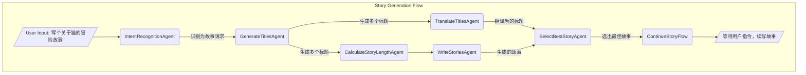

# AgentOS 2 开发指南：以“故事生成”为例

本文档将引导您使用 AgentOS 2 框架，通过从零开始解构一个完整的“故事生成”工作流（`story_generate_example`），帮助您掌握其核心概念和开发实践。

**最终目标**：构建一个能够理解用户意图，动态生成、评估并续写故事的智能工作流。

---

## 目录
1.  [最终流程概览](#1-最终流程概览)
2.  [环境与配置](#2-环境与配置)
3.  [执行工作流](#3-执行工作流)
4.  [核心流程拆解](#4-核心流程拆解)
    -   [4.1 意图识别：动态流程的起点](#41-意图识别动态流程的起点)
    -   [4.2 并行与批处理：生成故事素材](#42-并行与批处理生成故事素材)
    -   [4.3 汇总与决策：选出最佳故事](#43-汇总与决策选出最佳故事)
    -   [4.4 流程串联：进入故事续写](#44-流程串联进入故事续写)
5.  [重要更新与语义变更](#5-重要更新与语义变更)
6.  [AgentOS 2 核心概念总结](#6-agentos-2-核心概念总结)
7.  [测试与调试](#7-测试与调试)

---

## 1. 最终流程概览

`story_generate_example` 的执行流程并非一成不变，它会根据用户的输入动态构建。下图展示了当用户请求写一个故事时，框架动态构建出的核心工作流：


这个流程体现了 AgentOS 2 的几大核心特性：
-   **动态编排**：`IntentRecognitionAgent` 根据用户意图，用代码动态构建了后续的整个 `Story Generation Flow`。
-   **并行执行**：`TranslateTitlesAgent` 和 `CalculateStoryLengthAgent` 在 `GenerateTitlesAgent` 执行完毕后会同时开始执行，提升效率。
-   **数据汇总**：`SelectBestStoryAgent` 会等待它的两个上游 (`TranslateTitlesAgent` 和 `WriteStoriesAgent`) 都执行完毕，然后将它们的输出结果合并处理。
-   **流程嵌套**：`SelectBestStoryAgent` 在最后又启动了另一个独立的流程 `ContinueStoryFlow`。

---

## 2. 环境与配置

### 2.1 环境安装
如果您是开发者，推荐使用 editable 模式安装，这样您的代码修改可以立即生效。
```bash
# 激活您的虚拟环境
conda activate ./env 

# 在项目根目录执行
pip install -e ./agent_os2
```

### 2.2 配置文件
AgentOS 2 通过项目根目录下的 `aos_config` 文件夹寻找配置。

#### `agent_settings.json`：注册你的 Agent
此文件告诉框架去哪里寻找 Agent 的代码。每个顶级键（如 `"story_generation_example"`）就是一个 **agents_key**，用于组织和隔离不同的 Agent 集合。
```json
// aos_config/agent_settings.json
{
    "story_generation_example":[
        "./examples/story_generate_example/agents",
        "./examples/story_generate_example/flows"
    ],
    "continue_story_example":[
        "./examples/story_generate_example/agents/continue_story"
    ]
}
```
-   当 `Flow` 被创建并指定 `agents_key="story_generation_example"` 时，框架会自动加载该 key 下所有路径中的 Agent 类，并根据 **文件名到类名的映射规则** (例如 `generate_titles.py` -> `GenerateTitlesAgent` -> 注册为 `generate_titles`) 进行注册。

#### `model_settings.json`：配置你的大模型
此文件用于配置大模型（或其他外部API）的访问信息。
```json
// aos_config/model_settings.json
{
    "google-chat":{
        "api_key":"YOUR_GEMINI_API_KEY",
        "models":[
            "gemini-2.5-flash"
        ]
    }
}
```
-   AgentOS 2 会根据 Agent 中指定的模型名称（如 `gemini-2.5-flash`），在此文件中查找对应的 `api_key` 等信息，并找到其所属的处理器（如 `"google-chat"`）。

---

## 3. 执行工作流

`intent_recognition.py` 文件的末尾提供了一个完美的执行入口示例，它展示了启动一个 AgentOS 2 流程是多么简单。

```python
// agent_os2/examples/story_generate_example/agents/intent_recognition.py
if __name__ == "__main__":
    import asyncio
    from agent_os2 import execute_with_visualization, Flow

    user_input = input("请问你需要什么帮助？")

    # 1. 创建 Flow 实例
    main_flow = Flow(
        "main_flow",
        agents_key="story_generation_example",  # 指定Agent的命名空间
        expected_shared_context_keys={"user_input"}, // 声明需要从顶层注入的共享数据
        is_debug=True
    )
    
    # 2. 向 Flow 中添加入口 Agent
    main_flow.add_agent("intent_recognition")
    
    # 3. 使用可视化执行器启动流程
    result = await execute_with_visualization(
        main_flow, 
        shared_context={"user_input": user_input} // 注入共享数据
    )
    print(result)
```

-   **`Flow(...)`**: 创建一个流程编排器。`agents_key` 参数至关重要，它告诉 Flow 去哪里寻找名为 `"intent_recognition"` 的 Agent。
-   **`add_agent(...)`**: 将一个 Agent 添加到流程中。由于 `main_flow` 中只有一个 Agent，它将成为入口 Agent。
-   **`execute_with_visualization(...)`**: 这是推荐的执行方式。它不仅会运行流程，还会在 `./memory/statistics_...` 目录下生成一个 `visualization.html` 文件，让你能直观地看到每个节点的输入、输出和执行流程。

---

## 4. 核心流程拆解

### 4.1 意图识别：动态流程的起点

一切始于 `IntentRecognitionAgent`。它的核心职责是判断用户的输入是想写故事，还是普通聊天。

```python
// IntentRecognitionAgent.py
class IntentRecognitionAgent(BaseAgent):
    def setup(self):
        self.user_info = "正在分析用户意图..."
        # 提示词，要求模型输出JSON
        self.prompts = {"user": "...", "system": "..."} 
        self.strict_mode = True  # 开启严格模式，自动解析模型输出的JSON

    async def post_process(self, ..., model_result, ...):
        intent = model_result.get("intent", "general_response")
        
        if intent == "story":
            # 返回包含了 actions 命令的字典
            command_data = {
                "actions": [{"add_branch": {"dsl": 
                    # 这是一个YAML格式的字符串，定义了一个完整的Flow
                    """
                    story_generation_flow:
                        agents:
                            generate_titles: { name: generate_titles }
                            ...
                        edges:
                            - generate_titles -> calculate_story_length
                            ...
                    """
                }}]
            }
            return {"user_input": shared_context.get("user_input")}, command_data
        else:
            # 取消后续所有步骤
            return model_result, {"actions":[{"cancel_next_steps": True}]}
```

-   **`setup()` 方法**: 在这里初始化 Agent 的运行时属性。`self.prompts` 定义了给大模型的指令，而 `self.strict_mode = True` 是一个非常有用的特性，它告诉框架自动将模型返回的字符串解析为 JSON 对象（如果失败会自动重试）。注意：`parse_model_result` 现在是异步方法，如果需要重写该方法，请使用 `async def parse_model_result(...)`。
-   **`post_process()` 方法**: 这是 Agent 的核心逻辑所在。`model_result` 参数接收了 `strict_mode` 解析后的 Python 字典。
-   **`agent_command`**: `post_process` 的第二个返回值是一个命令字典。这里使用了 `actions` 命令中的 `add_branch`，其内容是一个用 **DSL (Domain-Specific Language)** 字符串定义的完整 `Flow`。这使得 AgentOS 2 具备了 **运行时动态修改和构建工作流** 的强大能力。
-   **`source_context` 传递**: `post_process` 的第一个返回值 `{"user_input": ...}` 会作为 **`source_context`** (上游数据) 传递给 `story_generation_flow` 的入口 Agent (`generate_titles`)。

### 4.2 并行与批处理：生成故事素材

当 `story_generation_flow` 被动态构建并执行后，`GenerateTitlesAgent` 作为入口开始运行。它生成多个标题后，数据流会同时流向 `TranslateTitlesAgent` 和 `CalculateStoryLengthAgent`。我们以 `TranslateTitlesAgent` 为例，深入了解 **批处理（Batch Processing）**。

```python
// TranslateTitlesAgent.py
class TranslateTitlesAgent(BaseAgent):
    def setup(self):
        # 关键！设置批处理字段
        self.batch_field = "src.titles"  
        self.prompts = {
            # 提示词模板中使用了特殊的 %batch_index% 占位符
            "user": "Input: {src.titles[%batch_index%]}\nOutput:",
            ...
        }
        self.strict_mode = True
    
    async def post_process(self, ..., llm_result, batch_id, ...):
        # 在批处理模式下，post_process 会为每个元素独立执行一次
        # batch_id 参数是当前处理的元素在原始列表中的索引
        ...
        return {"translated_story_titles": [combined_translation]}, {}
```

-   **`self.batch_field = "src.titles"`**: 这是开启批处理的"开关"。它告诉框架：`source_context` 中的 `titles` 字段是一个列表，请为该列表中的 **每一个元素** 都独立运行一次本 Agent 的处理流程（从提示词解析到 `post_process`）。
-   **`%batch_index%`**: 这是一个特殊的模板变量，只在批处理模式下可用。它会被替换为当前正在处理的元素的索引，允许我们精确地从列表中取出对应的数据，如 `{src.titles[%batch_index%]}`。
-   **并发执行**: 框架会 **并发** 地执行所有批处理任务（受 `concurrent_limit` 参数限制），极大地提升了处理同类数据的效率。
-   **结果合并**: 所有批次执行完毕后，框架会将每一次 `post_process` 的返回结果，通过 **追加模式（Append-Priority）** 合并成一个单一的结果对象，然后传递给下游 Agent。例如，如果每个批次返回 `{"translated_story_titles": ["some_translation"]}`，最终合并的结果会是 `{"translated_story_titles": ["t1", "t2", "t3", ...]}`。

`WriteStoriesAgent` 也使用了类似 `batch_field` 的机制来并行地撰写多个故事。

### 4.3 汇总与决策：选出最佳故事

`SelectBestStoryAgent` 是数据流的汇合点。它有两个上游：`WriteStoriesAgent` 和 `TranslateTitlesAgent`。

```python
// SelectBestStoryAgent.py
class SelectBestStoryAgent(BaseAgent):
    def setup(self):
        self.prompts = {
            # 提示词模板同时使用了来自不同上游的数据
            "user": """
            Input: 
            stories: {src.stories},
            translated_story_titles: {src.translated_story_titles},
            titles: {ctx.titles}
            Output: 
            """,
            ...
        }
    ...
```

-   **执行时机**: AgentOS 2 的调度器会确保 `SelectBestStoryAgent` 直到 `WriteStoriesAgent` 和 `TranslateTitlesAgent` **全部执行完毕** 后才会开始执行。
-   **`source_context` 合并**: 来自两个上游的 `source_context` 会被 **追加模式** 自动合并。`WriteStoriesAgent` 的输出 `{"stories": [...]}` 和 `TranslateTitlesAgent` 的输出 `{"translated_story_titles": [...]}` 会被合并成 `{"stories": [...], "translated_story_titles": [...]}`，然后作为 `source_context` 传递给 `SelectBestStoryAgent`。
-   **上下文访问**: 在提示词中，我们看到了 `{src.stories}` 和 `{src.translated_story_titles}`，这正是从合并后的 `source_context` 中取值。同时，它也可能从共享上下文（`{ctx.*}`）中获取其他需要的数据。

### 4.4 流程串联：进入故事续写

在选出最佳故事后，`SelectBestStoryAgent` 的使命并未结束。它还需要将评选出的故事信息保存下来，并启动下一个流程，让用户可以基于这个故事进行续写。

```python
// SelectBestStoryAgent.py
async def post_process(self, ..., llm_result, ...):
    # ... 从 llm_result 中解析出最佳故事的各项信息 ...
    
    return {}, {
        # 命令1：修改 shared_context
        "memory_modify": {
            "best_story_title": best_story_title,
            "best_story_content": best_story_content,
            ...
        },
        # 命令2：启动下一个 Flow
        "actions": [{
            "add_branch":{
                "name":"continue_story_flow"
            }
        }]
    }
```

-   **`memory_modify` 命令**: 该命令用于 **替换模式** 更新共享上下文（`shared_context`）。这里，它将最佳故事的标题、内容等核心信息存入了共享内存。
-   **启动 `continue_story_flow`**: 再次使用 `actions` 命令，这次是添加一个名为 `"continue_story_flow"` 的分支。这个 Flow 在 `story_generation_example` 这个 `agents_key` 下也被注册了。
-   **`shared_context` 继承**: `continue_story_flow` 在定义时，通过 `expected_shared_context_keys` 声明了它需要从上层继承 `best_story_title`, `best_story_content` 等数据。因此，`SelectBestStoryAgent` 通过 `memory_modify` 存入共享上下文的数据，可以无缝地被 `continue_story_flow` 继承和使用，从而实现了两个独立 Flow 之间的状态传递。

---

## 5. 重要更新与语义变更

### 5.1 参数名称变更：从 Args 到 source_context

为了更准确地反映框架语义，AgentOS 2 统一将所有参数名从 `input_args` 和 `args` 改为 `source_context`：

- **旧版本**: `input_args` 或 `args` 代表上游传来的数据
- **新版本**: `source_context` 代表上游传来的数据，通过 `{src.*}` 模板访问

这个变更使得参数命名更加直观，明确表示这是来自上游 Agent 的上下文数据。

### 5.2 parse_model_result 异步化

`BaseAgent` 的 `parse_model_result` 方法现已改为异步方法：

```python
# 新版本（异步）
async def parse_model_result(self, runtime_contexts: dict[str, Any], model_result: Any, batch_id: int | None = None) -> Any:
    # 如果需要异步操作，现在可以使用 await
    if not isinstance(model_result, str):
        return model_result
    return parse_str_to_json_with_preprocess(model_result)
```

**重要提示**：
- 如果您重写了 `parse_model_result` 方法，请确保使用 `async def` 声明
- 在方法内部使用异步操作时，记得添加 `await` 关键字
- 调用父类方法时，使用 `await super().parse_model_result(...)`

---

## 6. AgentOS 2 核心概念总结

通过 `story_generate_example`，我们接触到了 AgentOS 2 的所有核心概念：

-   **`Flow`**: 流程的“编排者”，通过 `add_agent` 和 `add_edge`（或DSL）定义工作流的静态结构。
-   **`BaseAgent`**: 任务的“行动者”，通过重写 `setup` 和 `post_process` 方法来定义具体行为。
-   **上下文系统**:
    -   **`source_context` (`{src.*}`)**: 节点间的"接力棒"，用于上下游数据传递。
    -   **`shared_context` (`{ctx.*}`)**: Flow 内部的“共享白板”，用于同一流程内跨节点的数据共享。
    -   **`extra_contexts`**: 全局的“工具箱”，用于传递数据库连接、外部API客户端等全局对象。
-   **`agent_command`**: Agent 控制流程的“遥控器”，允许在运行时修改共享上下文 (`memory_modify`/`memory_append`) 和流程结构 (`actions`)。
-   **提示词模板**: 强大而灵活的模板引擎，能够深度访问和解析各种上下文数据，是连接数据与大模型的桥梁。
-   **批处理 (`batch_field`)**: 并行处理同类数据的“加速器”，能够极大地提升工作流效率。

---

## 7. 测试与调试

-   **可视化**: 永远将 `execute_with_visualization` 作为你的首选执行器，它是最强大的调试工具。
-   **独立测试**: 为每个 Agent 文件编写 `if __name__ == "__main__"` 测试块，就像 `intent_recognition.py` 中那样。这可以让你在不运行整个复杂流程的情况下，独立测试和调试单个 Agent 的功能。
-   **日志**: 关注 `./memory/` 目录下的日志文件，特别是 `debug_info.md`，它记录了每个 Agent 执行时的详细上下文信息（需在 `Flow` setting 中开启 `is_debug=True`）。
