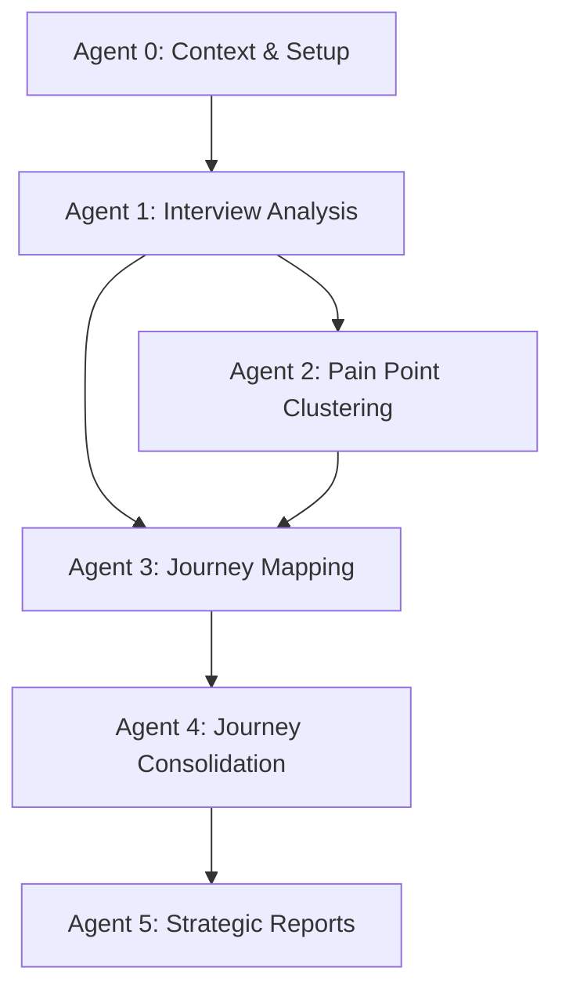

# Problem Space Agents (Phase 1)

## Overview

The Problem Space consists of 6 specialized agents (Agents 0-5) that systematically analyze customer research data to identify and document core problems, pain points, and current-state processes. This phase transforms raw interview data into strategic problem statements and actionable insights.

## Agent Sequence & Responsibilities

### 🔍 Agent 0: Product & Service Design Specialist
**Input:** Project documentation, context files  
**Output:** Broad context analysis, project scaffolding  
**Purpose:** Initial project understanding and structure setup

**Key Tasks:**
- Review `/0-documentation/0a-projectdocs/` files
- Create `/0-documentation/broad-context.md` with project scope
- Scaffold `/1-problem/` directory structure
- Hand off to Agent 1 with status summary

### 📋 Agent 1: Qualitative Research Specialist  
**Input:** Interview files from `/0-documentation/0b-Interviews/`  
**Output:** Structured interview analyses  
**Purpose:** Extract insights from customer interviews

**Key Tasks:**
- Process all interview files individually
- Create `(name-or-area)-analysis.md` for each interview
- Extract people, processes, pain points, needs, opportunities
- Use interview-analysis-template.md structure

### 🎯 Agent 2: Pain Point Analysis Specialist
**Input:** Interview analyses from Agent 1  
**Output:** Clustered pain point breakdowns  
**Purpose:** Identify and categorize pain points by theme

**Key Tasks:**
- Cluster pain points by theme/area/process
- Create breakdown files per cluster in `/1b1-painpoints-breakdown/`
- Map pain points to process stages
- Generate consolidated pain point mapping

### 🗺️ Agent 3: As-Is Journey Mapper
**Input:** Interview analyses + pain point breakdowns  
**Output:** Individual As-Is journey maps  
**Purpose:** Document current-state processes and workflows

**Key Tasks:**
- Create journey maps for each source file
- Map stages: tools, pain points, needs, opportunities
- Use journey-mapping-template.md structure
- Request user confirmation before proceeding

### 🔄 Agent 4: Journey Consolidation Specialist
**Input:** Individual journey breakdowns from Agent 3  
**Output:** Unified consolidated As-Is journey  
**Purpose:** Harmonize multiple journeys into single view

**Key Tasks:**
- Analyze patterns across individual journeys
- Harmonize process stages and terminology
- Consolidate pain points and opportunities
- Create unified `/1c-asis-journey/asis-journey.md`

### 📊 Agent 5: Strategic Report Generator
**Input:** All previous analyses and consolidated journey  
**Output:** Executive-ready strategic reports  
**Purpose:** Synthesize findings into actionable business reports

**Key Tasks:**
- Generate pain point report with impact analysis
- Create comprehensive problem statement report
- Produce Figma-ready journey visualization specs
- Provide strategic recommendations and next steps

## Workflow Dependencies



## File Structure Created

```
1-problem/
├── 1a-interview-analysis/
│   ├── (name1)-analysis.md
│   ├── (name2)-analysis.md
│   └── ...
├── 1b-painpoints/
│   ├── 1b1-painpoints-breakdown/
│   │   ├── (cluster1).md
│   │   ├── (cluster2).md
│   │   └── ...
│   └── painpoint-mapping.md
├── 1c-asis-journey/
│   ├── 1c2-asis-breakdown/
│   │   ├── (source1)-journey.md
│   │   ├── (source2)-journey.md
│   │   └── ...
│   └── asis-journey.md
└── 1d-problem-output/
    ├── pain-report.md
    ├── problem-report.md
    └── journey-output.md
```

## Templates & Dependencies

### Required Templates
- `_output-structure/problem-space/interview-analysis-template.md`
- `_output-structure/problem-space/pain-point-analysis-template.md`
- `_output-structure/problem-space/journey-mapping-template.md`
- `_output-structure/problem-space/report-template.md`

### Supporting Files
- `_output-structure/problem-space/model-structure.md`
- `_output-structure/workflow-rules.md`

## Usage Instructions

### 1. Prerequisites
Ensure the following exist before starting:
- `/0-documentation/0a-projectdocs/` with context files
- `/0-documentation/0b-Interviews/` with interview transcripts
- All required template files in `_output-structure/`

### 2. Execution Modes
- **End-to-End:** Sequential execution without interruption
- **Step-by-Step:** Agent-by-agent with approval gates

### 3. Trigger Commands
```
start workflow
begin analysis  
run agents
start process
execute workflow
```

### 4. Quality Gates
- **Agent 3 → Agent 4:** Explicit user confirmation required
- **Phase 1 → Phase 2:** Mandatory checkpoint before solution design

## Output Quality Standards

### Data Integrity Requirements
- ✅ **Source Attribution:** All findings reference original interview files
- ✅ **Conservative Language:** No invented metrics or unsubstantiated claims
- ✅ **Evidence-Based:** All conclusions supported by interview data
- ✅ **Assumption Transparency:** Clear documentation of inferences vs. facts

### Deliverable Standards
- **Interview Analyses:** Complete coverage of all interview files
- **Pain Point Clusters:** Logical grouping with impact assessment
- **Journey Maps:** Stage-by-stage breakdown with touchpoints
- **Strategic Reports:** Executive-ready with actionable recommendations

## Success Metrics

### Completeness
- [ ] All interview files processed into structured analyses
- [ ] Pain points clustered and mapped to process stages
- [ ] Current-state journey documented comprehensively
- [ ] Strategic reports generated with clear recommendations

### Quality
- [ ] Consistent terminology across all deliverables
- [ ] Cross-references maintained for traceability
- [ ] Business impact quantified where possible
- [ ] Actionable insights identified for Phase 2

### Handoff Readiness
- [ ] Problem statement clearly articulated
- [ ] Pain point priorities established
- [ ] Current-state baseline documented
- [ ] Solution space requirements defined

## Common Issues & Solutions

### Missing Interview Files
**Issue:** No files in `/0-documentation/0b-Interviews/`  
**Solution:** Agent 1 creates placeholder noting absence for downstream agents

### Inconsistent Data Quality
**Issue:** Interview files in different formats  
**Solution:** Agent 1 extracts key information consistently using template structure

### Complex Journey Variations
**Issue:** Multiple different processes across interviews  
**Solution:** Agent 4 documents variations and creates conditional journey tracks

### Conflicting Pain Points
**Issue:** Different perspectives on same issue  
**Solution:** Document both perspectives with context in consolidation phase

## Integration Points

### Workflow Orchestrator
- Automated agent sequencing and dependency management
- Quality validation between agents
- Progress tracking and resumption capability

### Solution Phase (Phase 2)
- Problem reports feed into opportunity identification
- Pain point mapping drives solution prioritization
- Journey baseline enables future-state design

## Version History

- **v1.1.0** - Current stable version with template dependencies
- **v1.0.0** - Initial agent specification and workflow design

---

**Next Phase:** After Problem Space completion, proceed to [Solution Space Agents](../solution-space/) (Agents 6-8) for opportunity identification and strategic solution design.
