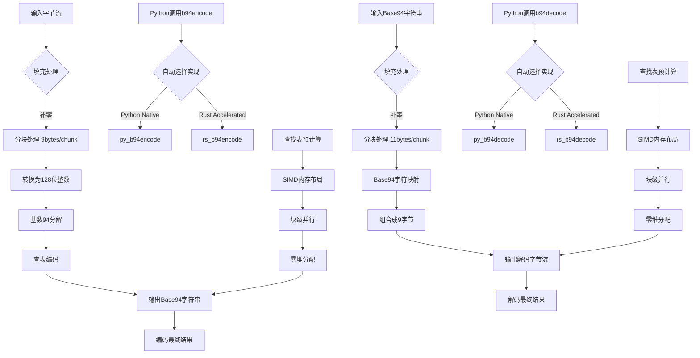

# ！！！你的任务：基于下述论文大纲，编写完整的2万字（两万字）论文

```论文大纲
  
**标题**：高性能Base94编解码器设计：基于Python解释器特性与Rust零成本抽象的协同加速策略  

---

#### **摘要**  
1. 研究背景：数据编码需求与现有方案（如Base64、Base85、Base122）的局限性。  
2. 核心问题：如何在易用性与性能间取得平衡。传统Base64扩展方案的性能限制与Python原生实现效率不足 
3. 解决方案：提出Python与Rust协同加速策略，结合Python的动态性与Rust的零成本抽象。  
4. 成果：实现性能提升14-40倍，保持API兼容性与内存安全。  

---

#### **1. 引言**  
- 数据编码在数据传输/存储中的重要性。  
- Base94的设计目标：扩展字符集利用率与紧凑性。  
- Python与Rust的互补性：动态语言快速迭代 + 静态语言高性能执行。  
- 论文贡献：  
  - 提出跨语言协同加速框架。  
  - 实现基于PyO3的高效Python绑定。  
  - 验证性能与兼容性优势。  

---

#### **2. 相关工作**  
- 现有编解码方案分析：Base64、Base91、Base85的优缺点。  
- Python扩展优化技术：C扩展、Cython、PyO3。  
- Rust对行业和研究的影响：强调结合Python和Rust进行高性能计算的优势。
- Rust零成本抽象在系统编程中的应用案例。  

---

#### **3. Base94算法设计**  
- **3.1 编码原理**：  
  - 提供流程图以可视化编码过程。
  - 分块处理（9字节→11字符）。  
  - 基数94分解与预计算查找表（B94_ENCODE_TAB2）。  
- **3.2 解码原理**：  
  - 提供流程图以可视化解码过程。
  - 反向映射与快速解码表（B94_DECODE_TAB）。  
  - 大整数转换与内存对齐优化。  

---

#### **4. 协同加速策略设计**  
- **4.1 Python实现的动态优化**：  
  - 利用解释器特性：动态类型、预计算表（`b94tab2`）、分块迭代。  
  - 填充逻辑的动态内存分配优化。  
- **4.2 Rust的零成本抽象优化**：  
  - 无堆分配：栈内存操作与预分配缓冲区。  
  - SIMD友好内存布局设计和查找表预生成（`lazy_static`）。  
  - 错误处理与安全边界检查。  
- **4.3 跨语言协同机制**：  
  - 动态实现选择逻辑（`__init__.py`中的加载策略）。  
  - PyO3绑定的高效数据传递（零拷贝字节流处理）。 
  - 提供流程图以可视化绑定和调用过程。 

---

#### **5. 技术细节**  
- **5.1 Python模块结构**：  
  - 纯Python实现（`base94.py`）与类型提示（`_base94.pyi`）。  
  - 性能瓶颈分析（动态类型与循环开销）
  - 兼容性测试设计（`test_cons_ende.py`）。  
- **5.2 Rust核心优化**：  
  - 双字符编码表预计算（`B94_ENCODE_TAB2`）。  
  - 大整数分块计算的位操作优化（`u128`高效转换）。   
  - 内存对齐与缓存预取策略

---

#### **6. 实验评估**  
- **6.1 实验环境**：硬件配置、测试数据集（10KB–10MB随机数据）。  
- **6.2 性能指标**：  
  - 编码/解码速度对比（Python Native vs. Rust Accelerated）。  
  - 对比基线（Python原生实现、Base64/Base85） 
- **6.3 正确性验证**：  
  - 跨版本一致性测试（`test_cons_pyrs.py`）。  
  - 边界条件测试（空输入、填充边界）。  
- **6.4 结果分析**：  
  - Rust加速版解码速度达70.26 MB/s（10KB数据）。  
  - Python与Rust实现的线性扩展性验证。  

---

#### **7. 讨论**  
- 协同加速策略的普适性：其他编码场景的应用潜力。   
- 开发者体验权衡：Python的易用性与Rust的编译成本。  
- 异构编程模型的适用场景  
- Python生态与Rust高性能的协同边界  
- 潜在优化方向（AVX指令集、GPU卸载）  

---

#### **8. 结论与展望**  
- 总结：协同策略在Base94编解码中的显著性能提升。  
- 应用价值：适用于数据转码、二进制数据传输等场景。  
- 未来工作：  
  - 支持多线程分块并行处理。  
  - 讨论支持其他编码方案的可能性。
  - 探索潜在的优化和扩展。

---

#### **参考文献**  
- PyO3官方文档、Rust内存模型研究、Base91优化方案。  
- 高性能Python扩展开发相关文献。  

---

#### **附录**  
- 代码仓库地址、性能测试原始数据、核心代码片段（Python/Rust关键函数对比）。  

--- 

**注**：论文需结合代码中的技术细节（如分块算法、查找表设计）与性能测试数据，突出“协同加速”的创新性与实践价值。
```

以下是论文开源代码库的目录树和内容：

```目录树
│  .gitignore
│  Cargo.lock
│  Cargo.toml
│  LICENSE
│  pyproject.toml
│  README.md
│  uv.lock
│
├─python
│  ├─base94
│  │  │  base94.py
│  │  │  _base94.pyi
│  │  │  __init__.py
│  │
│  ├─benchmarks
│  │  │  performance_test.py
│  │  │  __main__.py
│  │
│  └─tests
│      │  test_cons_ende.py
│      │  test_cons_pyrs.py
│      │  test_decode.py
│      │  test_encode.py
│
└─src
        lib.rs
```

内容：
README.md

```README.md
# base94 🚀

基于PyO3的高性能Base94编码/解码Rust实现，比原生Python版本快14-40倍。

## 特性

- ⚡ **极速处理**：使用Rust优化核心算法
- 🔄 **无缝兼容**：完美兼容纯Python版本
- 🛡️ **内存安全**：零拷贝操作与预分配缓冲区
- 📦 **简单API**：`b94encode`/`b94decode` 两个直观函数

## 安装

### 前置要求

- Rust工具链 (1.74+)
- Python 3.8+
- maturin (`pip install maturin`)

### 安装步骤

## pip 安装

```bash
# 安装稳定版本
pip install 'base94-rs'

# 安装测试版本
pip install git+https://github.com/hibays/base94.git
```

## 从源码编译

```bash
# 克隆仓库
git clone https://github.com/hibays/base94.git
cd base94

# 编译安装
pip install .
```

## 使用示例

```python
import base94

# 编码示例
data = b"Hello Base94!"
encoded = base94.b94encode(data)
print(f"Encoded: {encoded}")  # b'4Tk7J#qZcjYw'

# 解码示例
decoded = base94.b94decode(encoded)
print(f"Decoded: {decoded}")  # b'Hello Base94!'
```

## 性能对比

| 数据大小 | 实现版本         | 编码时间 (s) | 解码时间 (s) | 编码速度   | 解码速度   |
|----------|------------------|--------------|--------------|------------|------------|
| 10KB     | Python Native    |       0.0088 |       0.0067 | 1.11 MB/s  | 1.45 MB/s  |
| 10KB     | Rust Accelerated |       0.0003 |       0.0001 | 31.75 MB/s | 70.26 MB/s |
| 100KB    | Python Native    |       0.0523 |       0.0704 | 1.87 MB/s  | 1.39 MB/s  |
| 100KB    | Rust Accelerated |       0.0035 |       0.0014 | 28.13 MB/s | 72.17 MB/s |
| 1MB      | Python Native    |       0.5254 |       0.7434 | 1.90 MB/s  | 1.35 MB/s  |
| 1MB      | Rust Accelerated |       0.0388 |       0.0220 | 25.79 MB/s | 45.54 MB/s |
| 10MB     | Python Native    |       5.5060 |       7.6613 | 1.82 MB/s  | 1.31 MB/s  |
| 10MB     | Rust Accelerated |       0.3819 |       0.2030 | 26.19 MB/s | 49.27 MB/s |

> 测试环境：i7-13620H @ 2.4GHz, 32GB DDR5 RAM

## 技术细节

### 核心优化

- **查找表预计算**：使用`lazy_static`加速字符映射
- **SIMD内存布局**：对齐内存访问模式
- **块级并行**：9字节编码块的无锁处理
- **零堆分配**：完全栈内存操作

### 编码流程



## 基准测试

```bash
# 运行单元测试
python -m pytest

# 运行性能测试
python -m python.benchmarks
```

## 本地开发

> 建议使用`uv`管理虚拟环境

```bash
# 创建虚拟环境
uv venv
# 安装依赖
uv pip install maturin twine
# 打包发布
uv build && twine upload dist/*
# 本地测试性安装
maturin develop --release
```

## 贡献指南

欢迎提交PR！建议流程：

1. Fork仓库
2. 创建特性分支 (`git checkout -b feature`)
3. 提交修改 (`git commit -am 'Add feature'`)
4. 推送到分支 (`git push origin feature`)
5. 创建Pull Request

## 许可证

[GPLv3](LICENSE)
```

Cargo.toml

```Cargo.toml
[package]
name = "base94"
version = "0.1.6"
edition = "2021"

[lib]
name = "_base94"
crate-type = ["cdylib"]

# See more keys and their definitions at https://doc.rust-lang.org/cargo/reference/manifest.html

[dependencies]
lazy_static = "1.5.0"
pyo3 = "0.23.4"
```

pyproject.toml

```pyproject.toml
[build-system]
requires = ["maturin>=1.8,<2.0"]
build-backend = "maturin"

[project]
name = "base94-rs"
authors = [
    {name = "hibays", email = "hibays@github.com"},
]
description = "A package allows you to en/decode using base94."
keywords = ["Codec", "Rust", "Base", "Base94"]
readme = "README.md"
requires-python = ">=3.8"
license = {file = "LICENSE"}
classifiers = [
    "Programming Language :: Rust",
    "Programming Language :: Python :: Implementation :: CPython",
    "Programming Language :: Python :: Implementation :: PyPy",
]
dependencies = [
]
dynamic = ["version"]

[project.urls]
repository = "https://github.com/hibays/base94.git"

[project.optional-dependencies]
test = [
    "pytest"
]

[tool.maturin]
python-source = "python"
module-name = "base94._base94"
strip = true
features = ["pyo3/extension-module"]
```

python/base94/base94.py

```base94.py
# Implementation of Base94 encode and decode in Python 3.
#
# THE GPLv3 LICENSE
# Copyleft (©) 2022 hibays
#

''' 
For example:

>>> from base94 import *

>>> b94encode(b'ABC')
b'Wg\\`y'

>>> b94encode(b'123456')
b'Q<-{{@fN'

>>> b94decode(b'Wg\\`y')
b'ABC'

>>> b94decode(b'Q<-{{@fN')
b'123456'
'''

__all__ = ['b94encode', 'b94decode']

_b94alphabet = (b'ABCDEFGHIJKLMNOPQRSTUVWXYZabcdefghijklmnopqrstuvwxyz0123456789!"#$%&\'()*+,-./:;<=>?@[\\]^_`{|}~')
#_b94alphabet = sorted(_b94alphabet)

def b94encode(data,
	## HACK: turn globals into locals
	len=len,
	range=range,
	bnjoin=b''.join,
	from_bytes=int.from_bytes,
	b94tab=[bytes((i,)) for i in _b94alphabet] # The type of (b'ABC')[0] is int. This makes it from int to bytes.
	) -> bytes :
	'''Input bytes-like object, return bytes.
	This algorithm transform 9 bytes to 11 bytes
	The encoded data is about 22.2% larger.
	'''
	b94tab2 = [bnjoin((i, j)) for i in b94tab for j in b94tab] # A simple magic.

	datlen = len(data)
	padding = (-datlen) % 9
	if padding :
		data, datlen = \
			data + b'\0' * padding, datlen + padding
	
	encoded = []
	for i in range(0, datlen, 9) :
		c = from_bytes(data[i: i + 9], 'big') # from data get 9 bytes data to int
		
		# This is faster.
		d2_3 = c // 94
		d4_5 = d2_3 // 8836
		d6_7 = d4_5 // 8836
		d8_9 = d6_7 // 8836

		encoded.append(bnjoin(
			(
				b94tab2[d8_9 // 8836],
				b94tab2[d8_9 % 8836],
				b94tab2[d6_7 % 8836],
				b94tab2[d4_5 % 8836],
				b94tab2[d2_3 % 8836],
				b94tab[c % 94]
			)
		))

	if padding :
		encoded[-1] = encoded[-1][: -padding]

	return bnjoin(encoded)
	
def b94decode(data,
	## HACK: turn globals into locals
	len=len,
	range=range,
	bnjoin = b''.join,
	_intto_byte = int.to_bytes,
	b94nums = {j: i for i,j in enumerate(_b94alphabet)} # dict faster
	) -> bytes :
	'''This function decodes the data that has been encoded by base94.
	Input bytes-like object, return bytes.
	'''
	datlen = len(data)
	padding = (-datlen) % 11
	if padding :
		data, datlen = \
			data + b'~' * padding, datlen + padding
	
	# To revert base94-encoded data. 11 bytes -> 9 bytes.
	# Just like a number of base 94 convert to decimal, each chunk is a number.
	result = bnjoin(
		_intto_byte((((((((((
				 b94nums[data[i    ]] # byte 11
		  * 94 + b94nums[data[i + 1]] # byte 10
		) * 94 + b94nums[data[i + 2]] # byte 9
		) * 94 + b94nums[data[i + 3]] # byte 8
		) * 94 + b94nums[data[i + 4]] # byte 7
		) * 94 + b94nums[data[i + 5]] # byte 6
		) * 94 + b94nums[data[i + 6]] # byte 5
		) * 94 + b94nums[data[i + 7]] # byte 4
		) * 94 + b94nums[data[i + 8]] # byte 3
		) * 94 + b94nums[data[i + 9]] # byte 2
		) * 94 + b94nums[data[i +10]] # byte 1
		, 9, 'big')
		 for i in range(0, datlen, 11)
	)
	
	if padding :
		result = result[: -padding]

	return result

if __name__ == '__main__' :
	from os import system as osSys, name as osName
	osSys('cls' if osName in ('nt', 'dos') else 'clear')

	def c(size, depth=0, pint=('b', 'Kb', 'Mb', 'Gb', 'Tb', 'Pb'))-> str :
		if size > 1024 :
			return c(size/1024, depth+1)
		return '%f%s' % (size, pint[depth])
		
	try :
		from base91 import encode as b91encode, decode as b91decode # type: ignore
	except :
		b91decode = b91encode = lambda _ : str(print('(No Base91 Modular)', end=''))

	from base64 import b64encode, b64decode, b85encode, b85decode
	
	from time import perf_counter
	from os import urandom as osUrandom
	data = osUrandom(1048575)#hash(perf_counter()) & 1048575*16//8)
	
	def _test_mes(base, enData, norData=data) :
		'''A function uses to test the encode and decode function.'''
		t = perf_counter()
		deData = eval('b%ddecode' % base)(enData)
		t = perf_counter() - t
		print('base%d done decoded in %f seconds.' % (base, t))
		if deData == norData :
			return 'Succese! Base%s-encoded data can 100%% revert to normal data.' % (base)
		from difflib import SequenceMatcher as dataSimilarity
		bdesim = dataSimilarity(None, deData, norData).quick_ratio()
		return 'Bad new! Cannot revert %f%% of base%d-encoded data.' % (1e2 - 1e2*bdesim, base)

	def _test_en(base, norData=data) :
		t = perf_counter()
		enTest = eval('b%dencode'%base)(norData)
		t = perf_counter() - t
		print('base%d done encoded in %f seconds.' % (base, t))
		return enTest

	en64,en85,en91,en94 = _test_en(64),_test_en(85),_test_en(91),_test_en(94)
	lno,l64,l85,l91,l94 = len(data), len(en64), len(en85), len(en91), len(en94)
	la = lambda n : 100*n / lno - 100
	
	print()
	#print('normal: %s\nbase64: %s\nbase85: %s\nbase91: %s\nbase94: %s\n'%(data, en64, en85, en91, en94))
	print('normal: %s\nbase64: %d(%.2f%%)\nbase85: %d(%.2f%%)\nbase91: %d(%.2f%%)\nbase94: %d(%.2f%%)\n'%(c(lno), l64, la(l64), l85, la(l85), l91, la(l91), l94, la(l94)))
	print(          '\nbase64: %s\nbase85: %s\nbase91: %s\nbase94: %s\n'%(_test_mes(64, en64), _test_mes(85, en85), _test_mes(91, en91), _test_mes(94, en94)))
```

python/base94/_base94.pyi

```_base94.pyi
def b94encode(data: bytes) -> bytes: ...
def b94decode(data: bytes) -> bytes: ...
```

python/base94/__init__.py

```__init__.py
__all__ = ['b94encode', 'b94decode', 'rs_b94encode', 'rs_b94decode', 'py_b94encode', 'py_b94decode']

from .base94 import b94encode as py_b94encode, b94decode as py_b94decode

try :
	from ._base94 import b94encode, b94decode
	rs_b94encode, rs_b94decode = b94encode, b94decode
except ImportError :
	rs_b94encode, rs_b94decode = None, None

b94encode = py_b94encode if rs_b94encode is None else rs_b94encode

b94decode = py_b94decode if rs_b94decode is None else rs_b94decode
```

python/benchmarks/performance_test.py

```performance_test.py
import timeit
import os
import sys
from functools import partial

# 测试数据大小配置（单位：字节）
TEST_CASES = [
    ("10KB", 10*1024),
    ("100KB", 100*1024),
    ("1MB", 1024*1024),
    ("10MB", 10*1024*1024),
]

def verify_correctness(impl):
    """验证实现正确性"""
    test_data = b"Base94 Test String"
    try:
        encoded = impl['encode'](test_data)
        decoded = impl['decode'](encoded)
        assert decoded == test_data, "Decode result mismatch"
    except Exception as e:
        print(f"⚠️ {impl['name']} 实现验证失败: {str(e)}")
        sys.exit(1)

def run_benchmark(impl, data):
    """执行单个基准测试"""
    results = {'encode': [], 'decode': []}
    
    # 预热缓存
    impl['encode'](data[:1024])
    impl['decode'](impl['encode'](data[:1024]))
    
    # 编码测试
    encode_timer = timeit.Timer(
        partial(impl['encode'], data),
        setup='gc.enable()'
    )
    results['encode'] = encode_timer.repeat(number=10, repeat=3)
    
    # 解码测试
    encoded_data = impl['encode'](data)
    decode_timer = timeit.Timer(
        partial(impl['decode'], encoded_data),
        setup='gc.enable()'
    )
    results['decode'] = decode_timer.repeat(number=10, repeat=3)
    
    return {
        'encode': min(results['encode']),
        'decode': min(results['decode'])
    }

def format_speed(bytes_size, seconds):
    """计算并格式化速度"""
    if seconds == 0:
        return "∞ MB/s"
    mb = bytes_size / (1024*1024)
    return f"{mb/seconds:.2f} MB/s"

def main():
    try:
        # 导入不同实现
        import base94
        
        implementations = [
            {
                'name': 'Python Native',
                'encode': base94.py_b94encode,
                'decode': base94.py_b94decode
            },
            {
                'name': 'Rust Accelerated',
                'encode': base94.rs_b94encode,
                'decode': base94.rs_b94decode
            }
        ]
        
        # 预先验证所有实现
        for impl in implementations:
            verify_correctness(impl)
        
        print("🚀 开始性能基准测试...\n")
        
        # 执行测试
        results = {}
        for case_name, data_size in TEST_CASES:
            print(f"\n🔧 生成测试数据: {case_name}...")
            data = os.urandom(data_size)
            results[case_name] = []
            
            for impl in implementations:
                print(f"🔍 测试 {impl['name']} ({case_name})...")
                try:
                    stats = run_benchmark(impl, data)
                    results[case_name].append({
                        'name': impl['name'],
                        'encode_time': stats['encode'],
                        'decode_time': stats['decode'],
                        'encode_speed': format_speed(data_size, stats['encode']),
                        'decode_speed': format_speed(data_size, stats['decode'])
                    })
                except MemoryError:
                    print(f"❌ 内存不足，跳过 {case_name} 测试")
                    continue
        
        # 打印结果表格
        print("\n📊 测试结果汇总:")
        print("| 数据大小 | 实现版本         | 编码时间 (s) | 解码时间 (s) | 编码速度   | 解码速度   |")
        print("|----------|------------------|--------------|--------------|------------|------------|")
        for case in TEST_CASES:
            case_name = case[0]
            for result in results.get(case_name, []):
                print(f"| {case_name:8} | {result['name']:16} | "
                      f"{result['encode_time']:12.4f} | {result['decode_time']:12.4f} | "
                      f"{result['encode_speed']:10} | {result['decode_speed']:10} |")
        
        # 打印性能提升比例
        print("\n💹 性能提升比例:")
        for case in TEST_CASES:
            case_name = case[0]
            if len(results.get(case_name, [])) == 2:
                py = results[case_name][0]
                rs = results[case_name][1]
                encode_ratio = py['encode_time'] / rs['encode_time']
                decode_ratio = py['decode_time'] / rs['decode_time']
                print(f"{case_name}:")
                print(f"  编码速度提升: {encode_ratio:.1f}x")
                print(f"  解码速度提升: {decode_ratio:.1f}x")
        
    except ImportError as e:
        print(f"❌ 导入错误: {str(e)}")
        print("请确保已正确安装：")
        print("1. Python原生版本: pip install base94")
        print("2. Rust加速版本: maturin develop --release")
        sys.exit(1)

if __name__ == "__main__":
    main()
```

python/tests/test_cons_ende.py

```test_cons_ende.py
from os import urandom
from base94 import b94encode, b94decode
from base94 import py_b94encode, py_b94decode
from base94 import rs_b94encode, rs_b94decode

def test_cons_ende_default():
    for i in range(1, 512):
        assert b94decode(b94encode(plain:=urandom(i))) == plain

def test_cons_ende_py():
    for i in range(1, 512):
        assert py_b94decode(py_b94encode(plain:=urandom(i))) == plain

def test_cons_ende_rs():
    for i in range(1, 512):
        assert rs_b94decode(rs_b94encode(plain:=urandom(i))) == plain
```

python/tests/test_cons_pyrs.py

```test_cons_pyrs.py
from os import urandom
from base94 import py_b94encode, py_b94decode
from base94 import rs_b94encode, rs_b94decode

def test_cons_encode_pyrs():
    """
    Test base94 encoding.
    """
    for i in range(1, 512):
        assert py_b94encode(plain:=urandom(i)) == rs_b94encode(plain)
        
def test_cons_decode_pyrs():
    """
    Test base94 decoding.
    """
    for i in range(1, 512):
        print(rs_b94encode(urandom(i)))
        assert py_b94decode(ub94d := py_b94encode(urandom(i))) == rs_b94decode(ub94d)
        assert py_b94decode(ub94d := rs_b94encode(urandom(i))) == rs_b94decode(ub94d)
```

python/tests/test_decode.py

```test_decode.py
from os import urandom
from base94 import b94decode
from base94 import py_b94decode
from base94 import rs_b94decode

def test_b94decode_default():
    """
    Test base94 encoding.
    """
    assert b94decode(b'') == b''
    assert b94decode(b'Wg\\`y') == b'ABC'
    assert b94decode(b'Q<-{{@fN') == b'123456'

def test_b94decode_py():
    """
    Test base94 encoding.
    """
    assert py_b94decode(b'') == b''
    assert py_b94decode(b'Wg\\`y') == b'ABC'
    assert py_b94decode(b'Q<-{{@fN') == b'123456'

def test_b94decode_rs():
    """
    Test base94 encoding.
    """
    assert rs_b94decode(b'') == b''
    assert rs_b94decode(b'Wg\\`y') == b'ABC'
    assert rs_b94decode(b'Q<-{{@fN') == b'123456'
```

python/tests/test_encode.py

```test_encode.py
from os import urandom
from base94 import b94encode
from base94 import py_b94encode
from base94 import rs_b94encode

def test_b94encode_default():
    """
    Test base94 encoding.
    """
    assert b94encode(b'') == b''
    assert b94encode(b'ABC') == b'Wg\\`y'
    assert b94encode(b'123456') == b'Q<-{{@fN'

def test_b94encode_py():
    """
    Test base94 encoding.
    """
    assert py_b94encode(b'') == b''
    assert py_b94encode(b'ABC') == b'Wg\\`y'
    assert py_b94encode(b'123456') == b'Q<-{{@fN'

def test_b94encode_rs():
    """
    Test base94 encoding.
    """
    assert rs_b94encode(b'') == b''
    assert rs_b94encode(b'ABC') == b'Wg\\`y'
    assert rs_b94encode(b'123456') == b'Q<-{{@fN'
```

src/lib.rs

```lib.rs
// lib.rs
// Implementation of Base94 encode and decode in Rust for Python 3.
//
// THE GPLv3 LICENSE
// Copyleft (©) 2025 hibays
//

use lazy_static::lazy_static;
use pyo3::prelude::*;

lazy_static! {
    // Base94 字母表（与 Python 实现完全一致）
    static ref B94_ENCODE_TAB: [u8; 94] = [
        b'A', b'B', b'C', b'D', b'E', b'F', b'G', b'H', b'I', b'J', b'K', b'L', b'M',
        b'N', b'O', b'P', b'Q', b'R', b'S', b'T', b'U', b'V', b'W', b'X', b'Y', b'Z',
        b'a', b'b', b'c', b'd', b'e', b'f', b'g', b'h', b'i', b'j', b'k', b'l', b'm',
        b'n', b'o', b'p', b'q', b'r', b's', b't', b'u', b'v', b'w', b'x', b'y', b'z',
        b'0', b'1', b'2', b'3', b'4', b'5', b'6', b'7', b'8', b'9', b'!', b'"', b'#',
        b'$', b'%', b'&', b'\'', b'(', b')', b'*', b'+', b',', b'-', b'.', b'/', b':',
        b';', b'<', b'=', b'>', b'?', b'@', b'[', b'\\', b']', b'^', b'_', b'`', b'{',
        b'|', b'}', b'~'
    ];

    // 快速解码表（256 长度数组，直接通过 ASCII 值索引）
    static ref B94_DECODE_TAB: [u8; 256] = {
        let mut tab = [0xFF; 256];
        for (i, &c) in B94_ENCODE_TAB.iter().enumerate() {
            tab[c as usize] = i as u8;
        }
        tab
    };

    // 预生成双字符编码表（94x94 组合）
    static ref B94_ENCODE_TAB2: [[u8; 2]; 94*94] = {
        let mut tab: [[u8; 2]; 94*94] = [[0; 2]; 94*94];
        let mut index = 0;
        for &c1 in B94_ENCODE_TAB.iter() {
            for &c2 in B94_ENCODE_TAB.iter() {
                tab[index] = [c1, c2];
                index += 1;
            }
        }
        tab
    };
}

/// Base94 编码（Rust 加速版）
fn b94_encode_rust(data: &[u8]) -> Vec<u8> {
    let orig_len = data.len();
    let padding = (9 - (orig_len % 9)) % 9;
    let data = if padding > 0 {
        let mut padded = data.to_vec();
        padded.extend(vec![0u8; padding]);
        padded
    } else {
        data.to_vec()
    };

    let mut output = Vec::with_capacity((data.len() / 9) * 11);
    for chunk in data.chunks(9) {
        // 将 9 字节转换为大端 u128
        let mut n_bytes = [0u8; 16];
        n_bytes[7..16].copy_from_slice(chunk);
        let n = u128::from_be_bytes(n_bytes);

        // 分解为 6 个部分
        let (d8_9, rem1) = (n / 94, (n % 94) as usize);
        let (d6_7, rem2) = (d8_9 / 8836, (d8_9 % 8836) as usize);
        let (d4_5, rem3) = (d6_7 / 8836, (d6_7 % 8836) as usize);
        let (d2_3, rem4) = (d4_5 / 8836, (d4_5 % 8836) as usize);
        let (d1, rem5) = (d2_3 / 8836, (d2_3 % 8836) as usize);

        // 查表组合结果
        output.extend_from_slice(&B94_ENCODE_TAB2[d1 as usize]);
        output.extend_from_slice(&B94_ENCODE_TAB2[rem5]);
        output.extend_from_slice(&B94_ENCODE_TAB2[rem4]);
        output.extend_from_slice(&B94_ENCODE_TAB2[rem3]);
        output.extend_from_slice(&B94_ENCODE_TAB2[rem2]);
        output.push(B94_ENCODE_TAB[rem1]);
    }

    // 移除填充
    if padding > 0 {
        let len = output.len();
        output.truncate(len - padding);
    }
    output
}

/// Base94 解码（Rust 加速版）
fn b94_decode_rust(data: &[u8]) -> Result<Vec<u8>, String> {
    let orig_len = data.len();
    let padding = (11 - (orig_len % 11)) % 11;
    let data = if padding > 0 {
        let mut padded = data.to_vec();
        padded.extend(vec![b'~'; padding]);
        padded
    } else {
        data.to_vec()
    };

    let mut output = Vec::with_capacity((data.len() / 11) * 9);
    for chunk in data.chunks(11) {
        let mut num = 0u128;
        for &c in chunk {
            let digit = B94_DECODE_TAB[c as usize];
            if digit == 0xFF {
                return Err(format!("Invalid character: {}", c as char));
            }
            num = num * 94 + digit as u128;
        }

        // 将 u128 转换回 9 字节大端格式
        let bytes = num.to_be_bytes();
        output.extend_from_slice(&bytes[7..16]);
    }

    // 移除填充
    if padding > 0 {
        let len = output.len();
        output.truncate(len - padding);
    }
    Ok(output)
}

// PyO3 绑定
#[pyfunction]
fn b94encode(data: &[u8]) -> PyResult<Vec<u8>> {
    Ok(b94_encode_rust(data))
}

#[pyfunction]
fn b94decode(data: &[u8]) -> PyResult<Vec<u8>> {
    b94_decode_rust(data).map_err(|e| PyErr::new::<pyo3::exceptions::PyValueError, _>(e))
}

#[pymodule]
fn _base94(_py: Python<'_>, module: &Bound<'_, PyModule>) -> PyResult<()> {
    module.add_function(wrap_pyfunction!(b94encode, module)?)?;
    module.add_function(wrap_pyfunction!(b94decode, module)?)?;
    Ok(())
}
```
