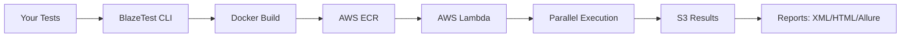

<div align="center">

# ⚡ BlazeTest

**Parallel Test Execution on AWS Lambda - Run Your Tests 10x Faster**

[](https://badge.fury.io/py/blazetest-beta)
[](https://www.python.org/downloads/)
[](LICENSE)
[](https://aws.amazon.com/lambda/)
[](https://www.docker.com/)

[Features](#-key-features) • [Quick Start](#-quick-start) • [Installation](#-installation) • [Documentation](#-configuration) • [Examples](#-getting-started---running-blazetest-locally)

</div>

---

## 📖 Table of Contents

- [Overview](#-overview)
- [The Problem](#-the-problem)
- [The Solution](#-the-solution)
- [Key Features](#-key-features)
- [Architecture](#-architecture)
- [Quick Start](#-quick-start)
- [Installation](#-installation)
- [Configuration](#-configuration)
- [Getting Started](#-getting-started---running-blazetest-locally)
- [CLI Reference](#-cli-command-reference)
- [Troubleshooting](#troubleshooting)

---

## 🎯 Overview

**BlazeTest** is a powerful CLI tool that **supercharges your test execution** by running tests in parallel on AWS Lambda. Transform hours-long test suites into minutes with unlimited parallelization and pay-per-use pricing.

### 🔥 The Problem

Running large test suites is **painful**:
- ⏰ **Hours or days** to complete test runs
- 💰 **Expensive** dedicated servers running 24/7
- 🐌 **Sequential execution** wastes time
- 📊 **Poor visibility** into test results and logs
- 🔄 **Manual retry** of flaky tests

### ✨ The Solution

BlazeTest solves these problems by:
- ⚡ **Parallel execution** on AWS Lambda (unlimited concurrency)
- 💵 **Pay-per-use** pricing (only pay when tests run)
- 🔄 **Automatic retry** of flaky tests
- 📊 **Rich reporting** (JUnit XML, HTML, Allure)
- 🚀 **Fast deployment** with Docker + BuildKit caching
- 📈 **Real-time progress** bars and live statistics

---

## 🌟 Key Features

<table>
<tr>
<td width="50%">

### ⚡ **Unlimited Parallelization**
Run hundreds of tests simultaneously on AWS Lambda. What took hours now takes minutes.

### 🎯 **Smart Flaky Test Handling**
Automatically retry failed tests. Distinguish between real failures and flaky tests.

### 📊 **Multiple Report Formats**
Generate JUnit XML, styled HTML, or interactive Allure reports.

</td>
<td width="50%">

### 🚀 **Optimized Performance**
- Docker BuildKit caching (3x faster builds)
- Lambda function reuse (90% faster deploys)
- Parallel S3 downloads (10x faster reporting)

### 🔒 **Concurrent Execution Safety**
Lambda versioning ensures safe parallel runs without interference.

### 🎨 **Beautiful Progress Tracking**
Real-time progress bars with live test statistics (passed/failed/flaky).

</td>
</tr>
</table>

---

## 📊 Compatibility

| Component | Versions | Status |
|-----------|----------|--------|
| **Python** | 3.10, 3.11, 3.12 | ✅ Tested |
| **Selenium** | 3.10.0+ | ✅ Tested |
| **Chrome** | 126.0+ | ✅ Tested |
| **PyTest** | 7.4.0+ | ✅ Tested |
| **AWS Lambda** | Container Images | ✅ Supported |
| **Docker** | 20.10+ | ✅ Required |

---

## 🏗️ Architecture

BlazeTest orchestrates test execution across AWS services:

<div align="center">



</div>


**How it works:**
1. 📦 Collect tests with PyTest
2. 🐳 Build Docker image with your code + dependencies
3. ☁️ Upload to AWS ECR
4. ⚡ Deploy to AWS Lambda
5. 🚀 Execute tests in parallel (unlimited concurrency)
6. 📥 Download results from S3
7. 📊 Generate consolidated reports

---

## ⚡ Quick Start

Get started in 3 minutes:

```bash
# 1. Install
pip install blazetest-beta

# 2. Set AWS credentials
export AWS_ACCESS_KEY_ID="your-key"
export AWS_SECRET_ACCESS_KEY="your-secret"

# 3. Create config
cat > blazetest.toml << EOF
[general.license]
license_key = "YOUR_LICENSE_KEY"
[cloud.aws]
region = "us-east-1"
[framework.pytest]
collection_args = ["tests/"]
EOF

# 4. Run!
blazetest run -k YOUR_LICENSE_KEY
```

🎉 **That's it!** Your tests are now running in parallel on AWS Lambda.

---

## 📦 Installation

### 📋 Pre-Requisites

Before installing BlazeTest, ensure you have:

| Requirement | Version | Installation |
|-------------|---------|--------------|
| 🐍 **Python** | 3.10+ | [Download](https://www.python.org/) |
| 🐳 **Docker** | 20.10+ | [Install Docker](https://docs.docker.com/get-docker/) |
| 🔑 **AWS Account** | - | With IAM permissions ([see policy](./docs/iam_policy.json)) |
| 💻 **OS** | Linux/AMD64 | - |


### 🔐 AWS Credentials Setup

BlazeTest requires AWS credentials to orchestrate cloud resources:

| Service | Purpose |
|---------|---------|
| ⚡ **Lambda** | Run tests in parallel |
| 🐳 **ECR** | Store Docker images |
| 📦 **S3** | Store test results |
| 🔐 **IAM** | Manage permissions |

<details>
<summary><b>📌 Option 1: CLI Options</b> (Recommended for CI/CD) 👈 Click to expand</summary>

```bash
blazetest run \
  -ak YOUR_AWS_ACCESS_KEY_ID \
  -as YOUR_AWS_SECRET_ACCESS_KEY \
  -k YOUR_LICENSE_KEY
```

**Pros:** ✅ Explicit, ✅ Works in CI/CD pipelines  
**Cons:** ⚠️ Credentials visible in command history

</details>

<details>
<summary><b>📌 Option 2: Environment Variables</b> (Recommended for local development) ⭐ BEST</summary>

```bash
export AWS_ACCESS_KEY_ID="YOUR_AWS_ACCESS_KEY_ID"
export AWS_SECRET_ACCESS_KEY="YOUR_AWS_SECRET_ACCESS_KEY"
export AWS_REGION="us-east-1"  # Optional

blazetest run -k YOUR_LICENSE_KEY
```

**Pros:** ✅ Clean commands, ✅ Reusable across sessions  
**Cons:** ⚠️ Must be set in each new shell

</details>

<details>
<summary><b>📌 Option 3: AWS Profile</b> (Uses ~/.aws/credentials)</summary>

```bash
# One-time setup
aws configure

# Then just run BlazeTest
blazetest run -k YOUR_LICENSE_KEY
```

**Pros:** ✅ No manual exports, ✅ Persists across sessions  
**Cons:** ⚠️ Requires AWS CLI installed

</details>

### 🔑 Required AWS IAM Permissions

<details>
<summary><b>Quick IAM Setup</b> (4 steps) 👈 Click to expand</summary>

1. **Go to AWS IAM Console** → Users → Add User
2. **Select** "Programmatic access"
3. **Attach Policy** from [`docs/iam_policy.json`](./docs/iam_policy.json)
4. **Save** Access Key ID & Secret Access Key

</details>

**Minimal Required Permissions:**

| Service | Permissions |
|---------|-------------|
| ⚡ Lambda | `CreateFunction`, `UpdateFunctionCode`, `InvokeFunction`, `PublishVersion` |
| 🐳 ECR | `CreateRepository`, `PutImage`, `GetAuthorizationToken` |
| 📦 S3 | `CreateBucket`, `PutObject`, `GetObject`, `ListBucket` |
| 🔐 IAM | `CreateRole`, `PassRole`, `AttachRolePolicy` |

📄 **Full Policy:** [`docs/iam_policy.json`](./docs/iam_policy.json)

### 🐳 Docker & Dependencies

BlazeTest containerizes your tests for consistent execution:

**Supported Package Managers:**
- 📦 `pip` → `requirements.txt`
- 📦 `poetry` → `pyproject.toml`  
- 📦 `pipenv` → `Pipfile`

**Optimization Tip:** Create a `.dockerignore` file to exclude unnecessary files:
```gitignore
.git/
__pycache__/
*.pyc
.venv/
docs/
*.md
```

---

### 💿 Install BlazeTest

<table>
<tr>
<td width="50%">

**Production (Stable)**
```bash
pip install blazetest
```

</td>
<td width="50%">

**Beta (Latest Features)** ⭐
```bash
pip install blazetest-beta
```

</td>
</tr>
<tr>
<td width="50%">

**Using Poetry**
```bash
poetry add blazetest-beta
```

</td>
</tr>
</table>

## ⚙️ Configuration

Configure BlazeTest using a `blazetest.toml` file in your project root.

### 📁 Configuration File Location

```bash
# Default location (auto-detected)
./blazetest.toml

# Custom location
blazetest run --config-path /path/to/config.toml
```

### 📚 Configuration Categories

BlazeTest configuration is organized into **5 logical sections**:

| Section | Purpose | Examples |
|---------|---------|----------|
| 🔐 `[general]` | License, reporting, flaky tests, purge settings | License key, retry attempts, report formats |
| 🏗️ `[build]` | Docker build settings | BuildKit caching, Depot.dev configuration |
| ☁️ `[cloud]` | AWS configuration | Region, Lambda memory, S3 bucket, credentials |
| 🧪 `[framework]` | PyTest settings | Test collection, execution args |
| 🌐 `[browser]` | Browser configuration | Type, version, installation control |

### Configuration Variables Reference

| Configuration               | Section / Subsection      | Type                     | Required | Default              | Description                                                                                                                                                                    | Example                                     |
|-----------------------------|---------------------------|--------------------------|----------|----------------------|--------------------------------------------------------------------------------------------------------------------------------------------------------------------------------|---------------------------------------------|
| **GENERAL - LICENSE**       |                           |                          |          |                      |                                                                                                                                                                                |                                             |
| license_key                 | [general.license]         | string                   | 🔀 Either | -                    | (Online activation) License key. Can be set with BLAZETEST_LICENSE env var or --license-key CLI option                                                                         | "XXXXX-XXXXX-XXXXX-XXXXX"                   |
| license_file                | [general.license]         | string                   | 🔀 Either | -                    | (Offline activation) File path to license file (.skm)                                                                                                                          | "/files/ActivationFile.skm"                 |
| **GENERAL - SETTINGS**      |                           |                          |          |                      |                                                                                                                                                                                |                                             |
| tests_per_dispatch          | [general]                 | integer                  | No       | 1                    | Number of tests to run per Lambda invocation                                                                                                                                   | 1                                           |
| junit_results_file_link     | [general]                 | string                   | No       | "private"            | JUnit XML file visibility: "public" or "private"                                                                                                                               | "private"                                   |
| artifacts_dir               | [general]                 | string                   | No       | ""                   | Directory to save artifacts (reports, logs)                                                                                                                                    | "test-results"                              |
| **GENERAL - FLAKY TESTS**   |                           |                          |          |                      |                                                                                                                                                                                |                                             |
| failure_retry_attempts      | [general.flaky]           | integer                  | No       | 0                    | How many times to retry failed tests                                                                                                                                           | 3                                           |
| fail_on_flake               | [general.flaky]           | boolean                  | No       | true                 | Exit with failure when flaky tests are detected                                                                                                                                | false                                       |
| remove_flakes               | [general.flaky]           | boolean                  | No       | false                | Include flaky tests in final report as failed                                                                                                                                  | false                                       |
| exit_on_flake_detection     | [general.flaky]           | boolean                  | No       | true                 | Stop retrying test after first successful retry                                                                                                                                | true                                        |
| **GENERAL - PURGE**         |                           |                          |          |                      |                                                                                                                                                                                |                                             |
| purge_time_limit            | [general.purge]           | integer                  | No       | 168                  | Time limit in hours for purging old resources                                                                                                                                  | 168                                         |
| purge_exclude_tags          | [general.purge]           | array of strings         | No       | []                   | Tags to exclude from purging                                                                                                                                                   | ["production", "staging"]                   |
| **GENERAL - REPORTING**     |                           |                          |          |                      |                                                                                                                                                                                |                                             |
| formats                     | [general.reporting]       | array of strings         | No       | ["xml"]              | Report formats: "xml", "html", "allure", "none"                                                                                                                                | ["xml", "html"]                             |
| **BUILD**                   |                           |                          |          |                      |                                                                                                                                                                                |                                             |
| backend                     | [build]                   | string                   | No       | "docker"             | Build backend: "docker", "depot", "namespace", "docker-cloud"                                                                                                                  | "docker"                                    |
| enable_cache                | [build]                   | boolean                  | No       | true                 | Enable Docker BuildKit caching for faster rebuilds (docker backend only)                                                                                                       | true                                        |
| token                       | [build.depot]             | string                   | No       | -                    | Depot.dev API token (only if backend="depot"). Can also use DEPOT_TOKEN env var                                                                                                | "dep_xxxxxxxxxxxxx"                         |
| project_id                  | [build.depot]             | string                   | No       | -                    | Depot project ID (optional, auto-detected). Can also use DEPOT_PROJECT_ID env var                                                                                              | "xxxxxxxxxxxxx"                             |
| token                       | [build.namespace]         | string                   | No       | -                    | Namespace.so API token (only if backend="namespace"). Can also use NSC_TOKEN env var or -nt CLI arg                                                                           | "nsc_xxxxxxxxxxxxx"                         |
| workspace                   | [build.namespace]         | string                   | No       | -                    | Namespace workspace name (optional). Can also use NSC_WORKSPACE env var or -nw CLI arg                                                                                         | "my-workspace"                              |
| **CLOUD - AWS**             |                           |                          |          |                      |                                                                                                                                                                                |                                             |
| region                      | [cloud.aws]               | string                   | Yes      | -                    | AWS Region. Can be set with AWS_REGION env var                                                                                                                                 | "us-east-1"                                 |
| resource_prefix             | [cloud.aws]               | string                   | No       | "blazetest-stack"    | Resource prefix for Lambda and CloudFormation (3-56 chars)                                                                                                                     | "my-blazetest-stack"                        |
| s3_bucket_prefix            | [cloud.aws]               | string                   | No       | "blazetest-s3"       | S3 bucket prefix for test results                                                                                                                                              | "my-blazetest-results"                      |
| ecr_repository_prefix       | [cloud.aws]               | string                   | No       | "blazetest-repo"     | ECR repository prefix for Docker images (2-248 chars)                                                                                                                          | "my-blazetest-repo"                         |
| lambda_function_memory_size | [cloud.aws]               | integer                  | No       | 4096                 | Lambda memory in MB (128-10240)                                                                                                                                                | 4096                                        |
| lambda_function_timeout     | [cloud.aws]               | integer                  | No       | 900                  | Lambda timeout in seconds (1-900)                                                                                                                                              | 900                                         |
| tags                        | [cloud.aws]               | key-value mappings       | No       | {}                   | Global tags for all cloud resources                                                                                                                                            | {Environment = "test", Team = "qa"}         |
| access_key_id               | [cloud.aws.credentials]   | string                   | No       | -                    | AWS Access Key ID. Can also use AWS_ACCESS_KEY_ID env var or -ak CLI arg                                                                                                      | "YOUR_AWS_ACCESS_KEY_ID"                    |
| secret_access_key           | [cloud.aws.credentials]   | string                   | No       | -                    | AWS Secret Access Key. Can also use AWS_SECRET_ACCESS_KEY env var or -as CLI arg                                                                                              | "YOUR_AWS_SECRET_ACCESS_KEY"                |
| **FRAMEWORK - PYTEST**      |                           |                          |          |                      |                                                                                                                                                                                |                                             |
| collection_args             | [framework.pytest]        | array of strings         | No       | []                   | PyTest arguments for test collection/selection                                                                                                                                 | ["tests/", "-m", "smoke"]                   |
| execution_args              | [framework.pytest]        | array of strings         | No       | []                   | PyTest arguments for test execution                                                                                                                                            | ["-v", "-s", "--durations=10"]              |
| **BROWSERS**                |                           |                          |          |                      |                                                                                                                                                                                |                                             |
| type                        | [browser]                 | string                   | No       | "chrome"             | Which browser to install at build time ("chrome", "firefox", "none"). Browsers are NO LONGER baked in - installed dynamically                                                  | "chrome" or "firefox" or "none"             |
| install                     | [browser]                 | boolean                  | No       | true                 | Whether to install browser at Docker build time. Set to false for headless/API-only tests                                                                                      | true or false                               |
| version                     | [browser.chrome]          | string                   | No       | "latest"             | Chrome browser version (used when type="chrome"). Installed at build time, not runtime                                                                                         | "120.0" or "latest"                         |
| version                     | [browser.firefox]         | string                   | No       | "latest"             | Firefox browser version (used when type="firefox")                                                                                                                             | "119.0" or "latest"                         |
| version                     | [browser.edge]            | string                   | No       | "latest"             | Edge browser version (not yet supported)                                                                                                                                       | "latest"                                    |

**🔀 Note**: Either `license_key` OR `license_file` is required (not both)

:::info
For PyTest arguments, please see the usage examples in the pytest documentation: https://docs.pytest.org/en/7.1.x/contents.html.
:::

### Difference between collection and execution arguments for PyTest

In the workflow of BlazeTest CLI, concepts of collection and execution can be explained in a simple way:
1. _Collection is selection of the tests that we need._
There are several options that PyTest allows us to collect the tests, such as the directory the tests are located and the markers that test use.

2. _Execution is actually running the tests._
There is a variety of options you can run your tests with PyTest. For example, you can increase verbosity with `-v` option, or capture the output with `-s` option while **running the tests**.

### Example - Complete Configuration

Here you can see a comprehensive `blazetest.toml` file with **all available options**:

```toml
# ============================================================================
# GENERAL CONFIGURATION
# ============================================================================

[general]
# Number of tests to dispatch per Lambda invocation (default: 1)
# Higher values reduce Lambda invocations but increase execution time per Lambda
tests_per_dispatch = 1

# JUnit results file link visibility: "public" or "private" (default: "private")
junit_results_file_link = "private"

# Directory to save artifacts (reports, logs). Relative to project root
# Default is empty (saves to current directory)
artifacts_dir = "test-results"

# ----------------------------------------------------------------------------
# License Configuration (required - use either license_key OR license_file)
# ----------------------------------------------------------------------------
[general.license]
# Online activation - License key from BlazeTest
# Can also be set via BLAZETEST_LICENSE environment variable
license_key = "XXXXX-XXXXX-XXXXX-XXXXX"

# Offline activation - Path to license file (.skm file)
# license_file = "/path/to/license.skm"

# ----------------------------------------------------------------------------
# Flaky Test Detection & Retry Configuration
# ----------------------------------------------------------------------------
[general.flaky]
# Number of times to retry failed tests (default: 0)
# Tests that pass on retry are marked as "flaky"
failure_retry_attempts = 3

# Exit with failure when flaky tests are detected (default: true)
# Set to false to pass even with flaky tests
fail_on_flake = false

# Include flaky tests in final report as failed (default: false)
# If false, flaky tests are reported separately
remove_flakes = false

# Stop retrying a test after first successful retry (default: true)
# If false, retries all failure_retry_attempts times even after passing
exit_on_flake_detection = true

# ----------------------------------------------------------------------------
# Resource Purge Configuration
# ----------------------------------------------------------------------------
[general.purge]
# Time limit in hours for purging old Lambda functions (default: 168 = 7 days)
purge_time_limit = 168

# Tags to exclude from purging (default: empty)
# Lambda functions with these tags won't be deleted
purge_exclude_tags = ["production", "staging"]

# ----------------------------------------------------------------------------
# Report Generation Configuration
# ----------------------------------------------------------------------------
[general.reporting]
# Report formats to generate. Options: "xml", "html", "allure", "none"
# - "xml": JUnit XML (fast, ~1-2s, for CI/CD)
# - "html": Simple styled HTML report (fast, ~1-2s, for visual review)
# - "allure": Interactive Allure HTML report (slower, ~10-15s, rich features)
# - "none": No local reports (results still in S3)
# Default: ["xml"]
formats = ["xml", "html"]  # Recommended: fast CI/CD + visual reports

# Examples:
# formats = ["xml"]              # Fastest, XML only
# formats = ["html"]             # Visual only
# formats = ["xml", "html"]      # Both (recommended)
# formats = ["allure"]           # Rich reports only
# formats = ["xml", "html", "allure"]  # All formats
# formats = ["none"]             # No local reports

# ============================================================================
# BUILD CONFIGURATION
# ============================================================================

[build]
# Build backend: "docker", "depot", "namespace", "docker-cloud" (default: "docker")
# - "docker": Local Docker build
# - "depot": Depot.dev cloud build (faster, requires depot.dev account)
# - "namespace": Namespace.so cloud build (fast, with automatic caching)
# - "docker-cloud": Docker Cloud Build
backend = "docker"

# Enable Docker BuildKit caching for faster rebuilds (default: true)
# Significantly reduces build time for subsequent builds (docker backend only)
enable_cache = true

# ----------------------------------------------------------------------------
# Depot.dev Configuration (only needed if backend = "depot")
# ----------------------------------------------------------------------------
[build.depot]
# Depot API token for authentication
# Can also be set via DEPOT_TOKEN environment variable or --depot-token CLI arg
# Priority: CLI arg > config file > environment variable
token = "dep_xxxxxxxxxxxxxxxxxxxxx"

# Depot project ID (optional, auto-detected if you have only one project)
# Can also be set via DEPOT_PROJECT_ID environment variable or --depot-project-id CLI arg
project_id = "xxxxxxxxxxxxx"

# ----------------------------------------------------------------------------
# Namespace.so Configuration (only needed if backend = "namespace")
# ----------------------------------------------------------------------------
[build.namespace]
# Namespace API token for authentication
# Can also be set via NSC_TOKEN environment variable or --namespace-token CLI arg
# Priority: CLI arg > config file > environment variable
# Get your token from: https://namespace.so
token = "nsc_xxxxxxxxxxxxxxxxxxxxx"

# Namespace workspace name (optional)
# Can also be set via NSC_WORKSPACE environment variable or --namespace-workspace CLI arg
workspace = "my-workspace"

# ============================================================================
# CLOUD CONFIGURATION (AWS)
# ============================================================================

[cloud.aws]
# AWS Region (required)
# Can also be set via AWS_REGION environment variable
region = "us-east-1"

# Resource prefix for Lambda and CloudFormation (default: "blazetest-stack")
# Must be 3-56 characters (64 - 8 for UUID)
resource_prefix = "my-blazetest-stack"

# S3 bucket prefix for storing test results (default: "blazetest-s3")
# Must follow S3 bucket naming conventions
s3_bucket_prefix = "my-blazetest-results"

# ECR repository prefix for Docker images (default: "blazetest-repo")
# Must be 2-248 characters (256 - 8 for UUID)
ecr_repository_prefix = "my-blazetest-repo"

# Lambda function memory size in MB (default: 4096)
# Range: 128 - 10240 MB
# Higher memory = faster execution but higher cost
lambda_function_memory_size = 4096

# Lambda function timeout in seconds (default: 900 = 15 minutes)
# Range: 1 - 900 seconds
lambda_function_timeout = 900

# Global tags attached to all cloud resources (default: empty)
# Useful for cost tracking and resource management
tags = {Environment = "testing", Team = "qa", Project = "automation"}

# ----------------------------------------------------------------------------
# AWS Credentials (optional - can also use CLI args or environment variables)
# ----------------------------------------------------------------------------
[cloud.aws.credentials]
# AWS Access Key ID for authentication
# Can also be set via AWS_ACCESS_KEY_ID environment variable or -ak CLI arg
# Priority: CLI arg > config file > environment variable
access_key_id = "YOUR_AWS_ACCESS_KEY_ID"

# AWS Secret Access Key for authentication
# Can also be set via AWS_SECRET_ACCESS_KEY environment variable or -as CLI arg
secret_access_key = "YOUR_AWS_SECRET_ACCESS_KEY"

# ============================================================================
# FRAMEWORK CONFIGURATION (Pytest)
# ============================================================================

[framework.pytest]
# Collection arguments - used when selecting/collecting tests
# Runs BEFORE test execution
# Examples:
# - Specify directories: ["tests/integration", "tests/unit"]
# - Use markers: ["-m", "smoke"]
# - Use keywords: ["-k", "test_login"]
collection_args = ["tests/", "-m", "smoke or regression"]

# Execution arguments - used when running tests
# Runs DURING test execution
# Examples:
# - Verbose: ["-v"] or ["-vv"]
# - Capture output: ["-s"]
# - Show durations: ["--durations=10"]
# - Parallel: ["-n", "auto"] (if pytest-xdist installed)
execution_args = ["-v", "-s", "--tb=short", "--durations=10"]

# ============================================================================
# BROWSER CONFIGURATION
# ============================================================================
# ⚡ IMPORTANT: Browsers are NO LONGER baked into the base image!
# They are installed at Docker build time based on these settings.
# This allows for:
#   - Smaller base images (only install what you need)
#   - Configurable browser versions
#   - Faster builds (only one browser installed)
#   - Flexibility (different projects can use different browsers)

[browser]
# Which browser to install at build time: "chrome", "firefox", or "none"
# Default: "chrome"
type = "chrome"

# Whether to install browser at build time
# Set to false if you don't need a browser (API/headless tests)
# Default: true
install = true

[browser.chrome]
# Chrome version (used when type="chrome")
# Specify version like "120.0" or use "latest"
# Default: "latest"
version = "latest"

[browser.firefox]
# Firefox version (used when type="firefox")
# Default: "latest"
version = "latest"

[browser.edge]
# Edge version (not yet supported)
# Default: "latest"
version = "latest"
```

### Minimal Configuration Example

If you want a minimal configuration, here's the bare minimum required:

```toml
[general.license]
license_key = "XXXXX-XXXXX-XXXXX-XXXXX"

[cloud.aws]
region = "us-east-1"

[framework.pytest]
```

**! You don't need to indicate `--junitxml` flag as it will be defined automatically.**

### CLI Command Reference
**! Use double quotes for argument values with spaces. Example: --project "demo project"**

BlazeTest has 3 main commands:
1. `blazetest run`: main command, which executes the main logic.
2. `blazetest rerun`: command used for rerunning the session.
3. `blazetest sessions`: shows all runs and reruns history.

### Blazetest Run

```shell
blazetest run [OPTIONS]
```
**Available options:**

| Key                               | Required | Description                                                                                                                                                                                                                     | Example                                               |
|-----------------------------------|---------|---------------------------------------------------------------------------------------------------------------------------------------------------------------------------------------------------------------------------------|-------------------------------------------------------|
| -k, --license-key                 | -k or -l | (online activation) License key. Can be set with SPEEDYTEST_LICENSE environment variable or can be included in project configuration                                                                                            | -k XXXXX-XXXXX-XXXXX-XXXXX                            |
| -l, --license-file                | -k or -l | (offline activation) File path or remote url license file                                                                                                                                                                       | -l /files/ActivationFile.skm                          |
| -ak, --aws-access-key-id          | Yes     | AWS Access Key ID. Can be set with AWS_ACCESS_KEY_ID environment variable                                                                                                                                                       | -ak YOUR_AWS_ACCESS_KEY_ID                            |
| -as, --aws-secret-access-key      | Yes     | AWS Secret Access Key. Can be set with AWS_SECRET_ACCESS_KEY environment variable                                                                                                                                               | -as YOUR_AWS_SECRET_ACCESS_KEY                        |
| -config, --config-path            | No      | Path to the configuration file (should be .toml file), default is blazetest.toml in the folder CLI is executed. If not found, raises an error                                                                                  | -config /config/blazetest.toml                       |
| -lo, --logs                       | No      | Enables logs and shows them in the stdout. Default is enabled. When disabled, saved to blazetest.log file in the folder CLI is executed                                                                                        | -awskey XXX -awssecret XXX --logs=disabled            |
| -lk, --loki                       | No      | Loki API Key. If provided, logs are sent to the Loki Log aggregation system of Railflow                                                                                                                                         | -lk XXXX [108 characters long string]                 |
| -d, --diag                        | No      | Executes one trial test to make sure everything works. The tests are not collected, instead dummy test is sent to Lambda                                                                                                        | -awskey XXX -awssecret XXX -d                         |
| -t, --tags                        | No      | Tags specified for the AWS Lambda function. The tags will be attached to the created Lambda function instance                                                                                                                   | -t tag1=tag1value,tag2=tag2value                      |
| -de, --debug                      | No      | Enables debugging output                                                                                                                                                                                                        | -awskey XXX -awssecret XXX -de                        |

```shell title="BlazeTest CLI Example of 'blazetest run'"
blazetest run -k <license key> -ak <aws-access-key-id> -as <aws-secret-access-key> -config <directory name>/<configuration filename> -lk <loki api key> -t <tag1>=<tagvalue1>,<tag2>=<tagvalue2>
```

### Blazetest Rerun

```shell
blazetest rerun [OPTIONS]
```
**Available options:**

| Key        | Required | Description                                                                         | Example     |
|------------|----------|-------------------------------------------------------------------------------------|-------------|
| -u, --uuid | Yes      | Session UUID, which you want to rerun. Can be found by command `blazetest sessions` | -u a2bb567a |

```shell title="BlazeTest CLI Example of 'blazetest rerun'"
blazetest rerun --uuid a2bb567a -lk <loki api key>
```

### Blazetest Sessions

```shell
blazetest sessions [OPTIONS]
```
**Available options:**

| Key           | Required | Description                                                                                                               | Example |
|---------------|---------|---------------------------------------------------------------------------------------------------------------------------|---------|
| -i, --include | No      | Which type of runs to include in the output of the history of sessions. Can be: "all", "runs", "reruns". Default is "all" | -i runs |
| -t, --tags    | No      | Option to filter the sessions by tags. If not specified, all results are shown.                                           | -t name=railflow,runtime=python |

```shell title="BlazeTest CLI Example of 'blazetest sessions'
blazetest sessions --include runs --tags name=railflow,runtime=javascript
```

# Getting Started - Running BlazeTest Locally

This section provides a complete step-by-step guide to run BlazeTest on your local machine.

## Step 1: Install Prerequisites

```bash
# Install Python 3.10+ (if not already installed)
python3 --version

# Install Docker (required for building test images)
docker --version

# Install BlazeTest
pip install blazetest-beta
```

## Step 2: Set Up AWS Credentials

Choose one of the following methods:

### Method A: Using Environment Variables (Recommended)
```bash
export AWS_ACCESS_KEY_ID="YOUR_AWS_ACCESS_KEY_ID"
export AWS_SECRET_ACCESS_KEY="YOUR_AWS_SECRET_ACCESS_KEY"
export AWS_REGION="us-east-1"
```

### Method B: Using AWS CLI Configuration
```bash
aws configure
# Follow prompts to enter:
# - AWS Access Key ID
# - AWS Secret Access Key  
# - Default region (e.g., us-east-1)
# - Output format (e.g., json)
```

## Step 3: Create blazetest.toml Configuration

Create a file named `blazetest.toml` in your project root:

```toml
# Minimal configuration
[general.license]
license_key = "XXXXX-XXXXX-XXXXX-XXXXX"  # Get from BlazeTest

[cloud.aws]
region = "us-east-1"

[framework.pytest]
collection_args = ["tests/"]  # Directory containing your tests
execution_args = ["-v"]
```

## Step 4: Run BlazeTest

### Basic Run (Using Environment Variables)
```bash
# Navigate to your project directory
cd /path/to/your/project

# Run BlazeTest with minimal options
blazetest run -k YOUR_LICENSE_KEY
```

### Run with CLI Options (Without Environment Variables)
```bash
blazetest run \
  -k YOUR_LICENSE_KEY \
  -ak YOUR_AWS_ACCESS_KEY_ID \
  -as YOUR_AWS_SECRET_ACCESS_KEY \
  -config blazetest.toml
```

### Run with Custom Configuration Path
```bash
blazetest run \
  -k YOUR_LICENSE_KEY \
  -ak YOUR_AWS_ACCESS_KEY_ID \
  -as YOUR_AWS_SECRET_ACCESS_KEY \
  -config /path/to/custom/config.toml
```

## Complete Example: End-to-End Workflow

Here's a complete example running a Python Selenium test project:

```bash
# 1. Set up your environment
export AWS_ACCESS_KEY_ID="YOUR_AWS_ACCESS_KEY_ID"
export AWS_SECRET_ACCESS_KEY="YOUR_AWS_SECRET_ACCESS_KEY"
export AWS_REGION="us-east-1"

# 2. Navigate to your project
cd ~/my-selenium-project

# 3. Ensure your project has a requirements.txt or pyproject.toml
cat requirements.txt
# selenium==3.10.0
# pytest==7.4.0

# 4. Create blazetest.toml
cat > blazetest.toml << 'EOF'
[general.license]
license_key = "XXXXX-XXXXX-XXXXX-XXXXX"

[general.flaky]
failure_retry_attempts = 2  # Retry failed tests twice
fail_on_flake = false

[general.reporting]
formats = ["xml", "html"]  # Generate both XML and HTML reports

[cloud.aws]
region = "us-east-1"
resource_prefix = "my-test-stack"
s3_bucket_prefix = "my-test-results"
lambda_function_memory_size = 4096
lambda_function_timeout = 900
tags = {Environment = "dev", Team = "qa"}

[framework.pytest]
collection_args = ["tests/", "-m", "smoke"]
execution_args = ["-v", "-s"]

[browser]
type = "chrome"
install = true

[browser.chrome]
version = "latest"
EOF

# 5. Run BlazeTest
blazetest run -k XXXXX-XXXXX-XXXXX-XXXXX

# 6. View results
# - JUnit XML: ./junit.xml
# - HTML Report: ./test-report.html  
# - Logs: ./blazetest_<session-uuid>.log
```

## Additional CLI Examples

### Running with Custom Tags
```bash
blazetest run \
  -k YOUR_LICENSE_KEY \
  -ak YOUR_AWS_ACCESS_KEY \
  -as YOUR_AWS_SECRET_KEY \
  -t Environment=production,Team=qa,Project=web-app
```

### Running with Remote Logging (Loki)
```bash
blazetest run \
  -k YOUR_LICENSE_KEY \
  -ak YOUR_AWS_ACCESS_KEY \
  -as YOUR_AWS_SECRET_KEY \
  -rl YOUR_LOKI_API_KEY
```

### Running with Logs Disabled (Saved to File Only)
```bash
blazetest run \
  -k YOUR_LICENSE_KEY \
  -ak YOUR_AWS_ACCESS_KEY \
  -as YOUR_AWS_SECRET_KEY \
  -lo disabled
```

### Running with Debugging Enabled
```bash
blazetest run \
  -k YOUR_LICENSE_KEY \
  -ak YOUR_AWS_ACCESS_KEY \
  -as YOUR_AWS_SECRET_KEY \
  -de
```

### Running with Offline License File
```bash
blazetest run \
  -l /path/to/ActivationFile.skm \
  -ak YOUR_AWS_ACCESS_KEY \
  -as YOUR_AWS_SECRET_KEY
```

## What Happens When You Run BlazeTest?

1. **Test Collection**: BlazeTest collects all tests using PyTest
2. **Docker Build**: Builds a Docker image with your project and dependencies
3. **ECR Upload**: Pushes the Docker image to AWS ECR
4. **Lambda Deploy**: Creates/updates AWS Lambda function with the image
5. **Parallel Execution**: Invokes multiple Lambda instances to run tests in parallel
6. **Result Collection**: Downloads test results from S3
7. **Report Generation**: Merges results and generates reports (XML, HTML, Allure)
8. **Flaky Test Retry** (if configured): Retries failed tests
9. **Final Report**: Outputs consolidated test results

## Viewing Previous Test Sessions

```bash
# List all test sessions
blazetest sessions

# List only test runs (exclude reruns)
blazetest sessions -i runs

# Filter sessions by tags
blazetest sessions -t Environment=production,Team=qa
```

## Rerunning a Previous Session

```bash
# Get session UUID from 'blazetest sessions'
blazetest rerun -u a2bb567a
```

## Troubleshooting

### "AWS credentials not found"
- Ensure AWS credentials are set via CLI options, environment variables, or AWS CLI
- Verify credentials with: `aws sts get-caller-identity`

### "Permission denied" errors
- Check that your IAM user/role has the required permissions (see `docs/iam_policy.json`)
- Verify with: `aws iam get-user`

### "Docker not found"
- Install Docker: https://docs.docker.com/get-docker/
- Ensure Docker daemon is running: `docker ps`

### "No tests collected"
- Verify your `collection_args` in `blazetest.toml` points to correct test directory
- Test locally: `pytest tests/ --collect-only`
