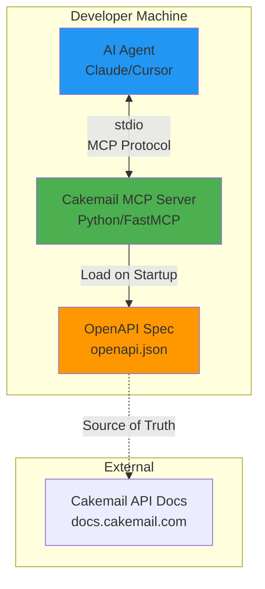
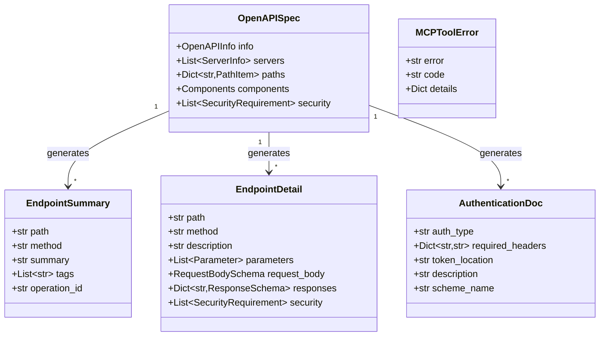
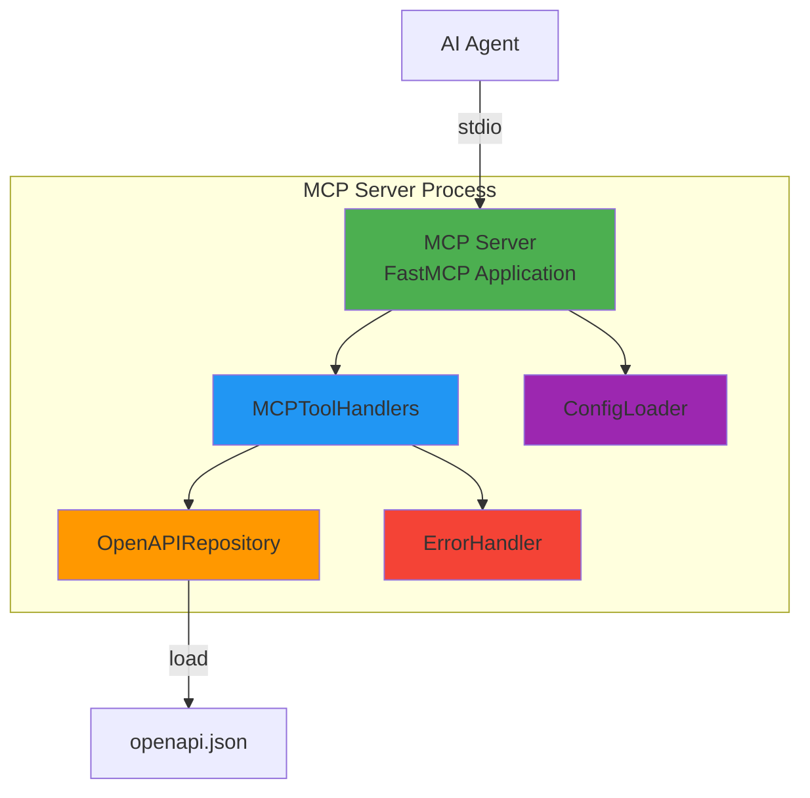
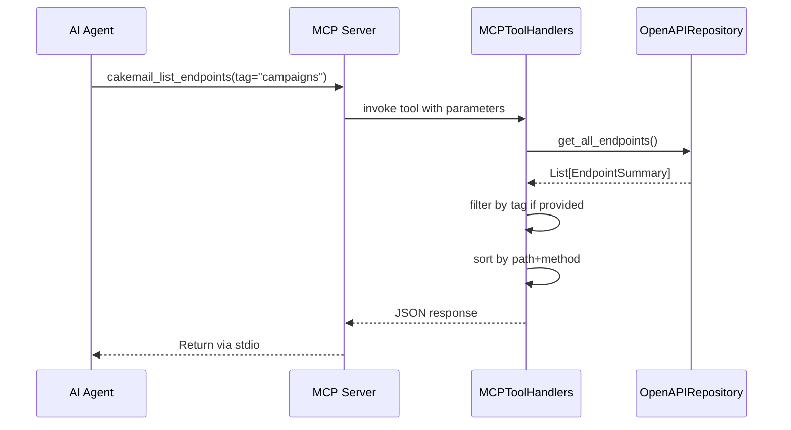
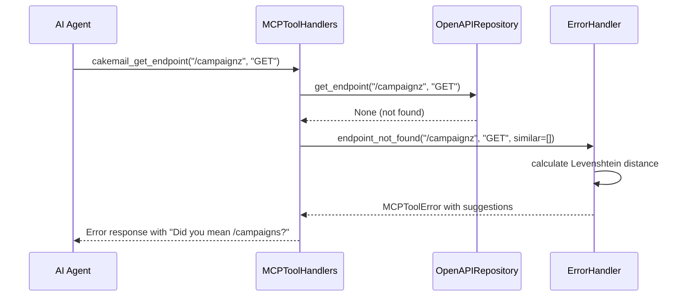

# Cakemail API MCP Server Architecture Document

## Introduction

This document outlines the overall project architecture for **Cakemail API MCP Server**, including backend systems, shared services, and non-UI specific concerns. Its primary goal is to serve as the guiding architectural blueprint for AI-driven development, ensuring consistency and adherence to chosen patterns and technologies.

**Relationship to Frontend Architecture:**
This project is a backend-only tool - a command-line MCP server with no user interface. There is no frontend component. Interaction occurs entirely through stdio communication with AI agents (Claude Desktop, Cursor, etc.).

### Starter Template or Existing Project

**Decision: Using FastMCP Framework as Foundation**

After technical validation, we are using **FastMCP** (https://github.com/jlowin/fastmcp) as the foundation framework. This represents a strategic pivot from the initial PRD assumption of TypeScript/Node.js to **Python**.

**Rationale for Python/FastMCP:**
- **Native OpenAPI Integration:** FastMCP provides `FastMCP.from_openapi()` which auto-generates MCP servers from OpenAPI specifications - this is exactly our core requirement
- **Production-Ready MCP Implementation:** Mature, well-tested MCP protocol compliance out of the box
- **Rapid Development:** Can achieve MVP functionality in days rather than weeks
- **Pythonic Developer Experience:** Clean, intuitive API for defining MCP tools and resources
- **Authentication Support:** Built-in enterprise authentication (useful for post-MVP)

**Trade-offs Accepted:**
- Language change from TypeScript to Python (PRD will be updated)
- Reliance on Python ecosystem instead of Node.js
- Team needs Python proficiency (widely known language, low barrier)

**Impact on Timeline:** Positive - FastMCP's OpenAPI auto-generation significantly reduces implementation complexity, supporting the 4-6 week MVP timeline.

### Change Log

| Date | Version | Description | Author |
|------|---------|-------------|---------|
| 2025-10-05 | 1.0 | Initial architecture document, Python/FastMCP decision | Winston (Architect) |

## High Level Architecture

### Technical Summary

The Cakemail API MCP Server is a **monolithic Python application** built on the FastMCP framework that exposes Cakemail's OpenAPI specification as queryable MCP tools for AI agents. The architecture follows a **simple, lightweight service pattern** with three primary layers: OpenAPI ingestion, MCP tool exposure, and stdio transport communication. The system leverages FastMCP's `from_openapi()` capability to auto-generate the majority of MCP server functionality, with custom enhancements for endpoint discovery, detailed queries, and authentication documentation. This architecture directly supports the PRD's goal of eliminating AI hallucination by providing authoritative, real-time API specifications to AI coding assistants, enabling 85%+ first-call accuracy and 50% faster integration times.

### High Level Overview

**Architectural Style:** Monolithic Python Application (Single Process)

**Repository Structure:** Monorepo (from PRD)
- Single Git repository containing MCP server code, tests, documentation, and deployment configuration
- Simple structure appropriate for focused, single-purpose tool

**Service Architecture:** Standalone Process
- Python process that runs locally on developer machines
- Communicates with AI agents via stdio (standard input/output) using MCP protocol
- No remote hosting or API endpoints (runs client-side)
- Loads OpenAPI specification on startup and serves queries in-memory

**Primary Data Flow:**
1. **Startup:** Load and parse Cakemail's `openapi.json` specification
2. **Runtime:** AI agent sends MCP tool request via stdio
3. **Processing:** MCP server queries in-memory OpenAPI data and formats response
4. **Response:** Return structured JSON response to AI agent via stdio

**Key Architectural Decisions:**

1. **FastMCP Framework Over Custom Implementation**
   - *Rationale:* Native OpenAPI support eliminates 70%+ of custom code; production-ready MCP protocol compliance; faster time-to-market

2. **Python Over TypeScript/Node.js**
   - *Rationale:* FastMCP ecosystem provides exact capabilities needed; Python excellent for data parsing and transformation; avoids building MCP protocol from scratch

3. **In-Memory OpenAPI Storage**
   - *Rationale:* <500ms response time requirement; eliminates I/O overhead; OpenAPI spec is relatively small (<10MB typically); supports spec reload without persistence complexity

4. **Stdio Transport Only (MVP)**
   - *Rationale:* Aligns with how Claude Desktop and Cursor integrate MCP servers; simplest deployment model; no network/security complexity

### High Level Project Diagram



### Architectural and Design Patterns

- **Repository Pattern:** Abstract OpenAPI data access behind `OpenAPIRepository` interface
  - *Rationale:* Enables testing with mock specs; isolates FastMCP internals from business logic; supports future enhancements (caching strategies, multiple spec sources)

- **Facade Pattern:** Provide simplified MCP tool interface over complex OpenAPI schema traversal
  - *Rationale:* FastMCP auto-generation handles 80% of needs; custom facade adds discovery, filtering, and enhanced error messages; clean separation of concerns

- **Decorator Pattern (via FastMCP):** Use `@mcp.tool()` decorators to expose Python functions as MCP tools
  - *Rationale:* Pythonic, declarative tool definition; FastMCP handles MCP protocol serialization; clear mapping between code and AI agent capabilities

- **Singleton Pattern:** Single OpenAPI spec instance loaded once and reused
  - *Rationale:* Performance optimization (avoid re-parsing); memory efficiency; supports spec reload by replacing singleton instance

- **Strategy Pattern:** Pluggable error handling strategies for different failure scenarios
  - *Rationale:* FR8 requires clear, context-aware error messages; different errors need different responses (suggestions for typos, retries for network failures)

## Tech Stack

This is the **DEFINITIVE** technology selection for the Cakemail API MCP Server. All implementation must use these exact versions and tools.

### Cloud Infrastructure

**Not Applicable for MVP**
- **Provider:** N/A - This is a client-side tool that runs locally on developer machines
- **Deployment Regions:** N/A - Distributed via PyPI (Python Package Index), runs wherever developers install it
- **Future Consideration:** Post-MVP could add hosted version for web-based AI tools

### Technology Stack Table

| Category | Technology | Version | Purpose | Rationale |
|----------|------------|---------|---------|-----------|
| **Language** | Python | 3.11+ | Primary development language | FastMCP requires Python; 3.11+ for performance improvements and modern type hints; widely adopted, excellent for data parsing |
| **Framework** | FastMCP | 0.2.0+ (latest) | MCP server framework | Native OpenAPI integration (`from_openapi()`); production-ready MCP protocol; eliminates 70%+ custom code |
| **Package Manager** | uv | 0.1.0+ | Fast Python package installer | FastMCP recommends `uv`; 10-100x faster than pip; modern dependency resolution |
| **OpenAPI Parser** | Built into FastMCP | N/A | Parse and validate OpenAPI specs | FastMCP handles OpenAPI parsing internally; no need for external library |
| **Logging** | Python `logging` | stdlib | Structured logging | Standard library; sufficient for MVP; familiar to Python developers; supports multiple handlers |
| **Testing Framework** | pytest | 8.0+ | Unit and integration testing | Industry standard for Python; excellent fixtures and parametrization; plugin ecosystem |
| **Test Coverage** | pytest-cov | 4.1+ | Code coverage measurement | Integrates with pytest; generates coverage reports; ensures >80% coverage requirement (NFR6) |
| **Mocking** | unittest.mock | stdlib | Test mocking and stubbing | Standard library; sufficient for mocking OpenAPI data and MCP interactions |
| **Type Checking** | mypy | 1.8+ | Static type analysis | Enforces type safety; catches errors before runtime; complements Python 3.11+ type hints |
| **Code Formatter** | black | 24.0+ | Code formatting | Opinionated formatter; ensures consistency; standard in Python community |
| **Linter** | ruff | 0.2.0+ | Fast Python linter | Extremely fast (10-100x faster than flake8); combines multiple linters; modern tooling |
| **Build Tool** | hatch | 1.9+ | Project packaging and publishing | Modern Python build system; PEP 517/518 compliant; integrates with PyPI publishing |
| **CI/CD** | GitHub Actions | N/A | Continuous integration | Free for public repos; matrix testing across Python versions; PyPI publishing workflow |
| **Distribution** | PyPI | N/A | Package distribution | Python Package Index; standard for Python packages; `pip install cakemail-api-docs-mcp` |
| **Environment Management** | python-dotenv | 1.0+ | .env file loading | Load OPENAPI_SPEC_PATH from .env; standard for configuration management |
| **Dependency Management** | pyproject.toml | PEP 621 | Dependency specification | Modern Python standard (PEP 621); replaces setup.py; all config in one file |

## Data Models

**Important Note:** This MCP server has **no persistent data storage** - all data is loaded from the OpenAPI specification and held in-memory. The "models" below are **runtime data structures** representing parsed OpenAPI content, not database entities.

### OpenAPISpec

**Purpose:** Root data structure representing the parsed Cakemail OpenAPI specification loaded via FastMCP

**Key Attributes:**
- `info: OpenAPIInfo` - API metadata (title, version, description)
- `servers: list[ServerInfo]` - Base URL(s) for the Cakemail API
- `paths: dict[str, PathItem]` - All endpoints indexed by path (e.g., `/campaigns/{id}`)
- `components: Components` - Reusable schemas, security schemes, parameters
- `security: list[SecurityRequirement]` - Global authentication requirements

**Relationships:**
- Contains multiple `PathItem` objects (one per endpoint path)
- Contains `Components` object with shared schemas and security definitions
- Loaded once on startup, cached in memory for all MCP tool queries

**Design Note:** This is provided by FastMCP's OpenAPI parsing - we don't define this structure ourselves, but we query it extensively.

### EndpointSummary

**Purpose:** Lightweight representation of an API endpoint for discovery/listing

**Key Attributes:**
- `path: str` - Endpoint path (e.g., `/campaigns/{id}/send`)
- `method: str` - HTTP method (GET, POST, PUT, DELETE, PATCH)
- `summary: str` - Brief description of what the endpoint does
- `tags: list[str]` - OpenAPI tags for categorization (e.g., ["campaigns", "email"])
- `operation_id: str` - Unique operation identifier from OpenAPI

**Relationships:**
- Derived from `OpenAPISpec.paths`
- Used by `cakemail_list_endpoints` MCP tool
- Multiple summaries can share the same `path` but different `method`

**Usage:** Returned to AI agents for endpoint discovery queries (FR2)

### EndpointDetail

**Purpose:** Complete specification for a single API endpoint

**Key Attributes:**
- `path: str` - Full URL path with parameter placeholders
- `method: str` - HTTP method
- `description: str` - Detailed description of endpoint functionality
- `parameters: list[Parameter]` - All parameters (path, query, header)
  - Each `Parameter` has: name, type, required, description, example
- `request_body: RequestBodySchema | None` - Request body schema if applicable
  - Includes content type (e.g., `application/json`) and full JSON schema
- `responses: dict[str, ResponseSchema]` - Response schemas by status code
  - Keys: "200", "201", "400", "401", "404", etc.
  - Values: Full JSON schema for each response type
- `security: list[SecurityRequirement]` - Authentication requirements for this endpoint

**Relationships:**
- Derived from specific `OpenAPISpec.paths[path][method]`
- References `Components.schemas` for dereferenced JSON schemas
- Used by `cakemail_get_endpoint` MCP tool

**Design Decision:** All `$ref` pointers are **dereferenced** (fully resolved) before returning to AI agents, so they receive complete, inline schemas without needing to follow references.

**Usage:** Returned to AI agents for detailed endpoint queries (FR3)

### AuthenticationDoc

**Purpose:** Documentation of Cakemail API authentication mechanisms

**Key Attributes:**
- `auth_type: str` - Authentication type (e.g., "HTTP Bearer", "API Key", "OAuth2")
- `required_headers: dict[str, str]` - Headers needed (e.g., `{"Authorization": "Bearer {token}"}`)
- `token_location: str` - Where token goes ("header", "query", "cookie")
- `description: str` - How to obtain and use credentials
- `scheme_name: str` - Name from OpenAPI `securitySchemes` (e.g., "bearerAuth")

**Relationships:**
- Extracted from `OpenAPISpec.components.securitySchemes`
- Can have multiple auth schemes if API supports different methods
- Used by `cakemail_get_auth` MCP tool

**Usage:** Returned to AI agents for authentication documentation (FR4)

### MCPToolError

**Purpose:** Structured error responses for MCP tool failures

**Key Attributes:**
- `error: str` - Human-readable error message
- `code: str` - Error code (MISSING_PARAMETER, INVALID_PARAMETER, ENDPOINT_NOT_FOUND, SPEC_LOAD_ERROR)
- `details: dict[str, Any] | None` - Optional additional context
  - For ENDPOINT_NOT_FOUND: includes `suggestions` (similar endpoints via Levenshtein distance)
  - For INVALID_PARAMETER: includes `expected_type` and `received_value`

**Relationships:**
- Returned by all MCP tools on failure
- Follows consistent format across all error scenarios
- Used for error handling (FR8)

**Design Decision:** Errors include actionable suggestions (e.g., "Did you mean `/campaigns/{id}`?") to help AI agents self-correct.

### Data Model Diagram



## Components

### MCP Server (FastMCP Application)

**Responsibility:** Main application entry point that initializes FastMCP framework, registers MCP tools, and handles stdio communication with AI agents

**Key Interfaces:**
- `run()` - Start MCP server and listen for stdio requests
- `register_tools()` - Register all custom MCP tools with FastMCP decorator
- `load_openapi_spec()` - Initialize OpenAPI spec loading on startup

**Dependencies:**
- `OpenAPIRepository` - For accessing parsed OpenAPI data
- `MCPToolHandlers` - Custom tool implementations
- FastMCP framework (external)

**Technology Stack:**
- Python 3.11+, FastMCP 0.2.0+
- Uses `@mcp.tool()` decorators to expose functions as MCP tools
- Configured via environment variables (`.env` file with `python-dotenv`)

### OpenAPIRepository

**Responsibility:** Abstracts OpenAPI specification loading, parsing, validation, and in-memory storage; provides query interface for MCP tools

**Key Interfaces:**
- `load_spec(source: str) -> OpenAPISpec` - Load spec from file path or URL
- `get_all_endpoints() -> list[EndpointSummary]` - Return all endpoints for discovery
- `get_endpoint(path: str, method: str) -> EndpointDetail | None` - Get detailed endpoint spec
- `get_security_schemes() -> list[AuthenticationDoc]` - Extract authentication documentation
- `reload_spec() -> None` - Reload OpenAPI spec without server restart (FR10)

**Dependencies:**
- FastMCP's built-in OpenAPI parser
- Python `logging` module for startup/reload logging

**Technology Stack:**
- Implements caching (in-memory dict) for fast lookups
- Uses FastMCP's `from_openapi()` internally
- Validates OpenAPI spec on load (FR5)

### MCPToolHandlers

**Responsibility:** Implements custom MCP tool functions that transform OpenAPI data into AI-friendly responses

**Key Interfaces:**
- `@mcp.tool cakemail_health()` - Health check tool (Story 1.4)
- `@mcp.tool cakemail_list_endpoints(tag: str | None)` - Endpoint discovery (Story 2.1)
- `@mcp.tool cakemail_get_endpoint(path: str, method: str)` - Endpoint details (Story 2.2)
- `@mcp.tool cakemail_get_auth()` - Authentication documentation (Story 2.3)
- `@mcp.tool cakemail_reload_spec()` - Reload OpenAPI spec (Story 3.3)

**Dependencies:**
- `OpenAPIRepository` - Data access layer
- `ErrorHandler` - Consistent error formatting

**Technology Stack:**
- Pure Python functions decorated with `@mcp.tool()`
- Type hints for parameter validation
- Returns JSON-serializable Python dicts/lists

### ErrorHandler

**Responsibility:** Provides consistent error formatting and helpful error messages across all MCP tools (supports FR8)

**Key Interfaces:**
- `missing_parameter(param_name: str) -> MCPToolError` - Format missing parameter error
- `invalid_parameter(param_name: str, expected_type: str, received: Any) -> MCPToolError` - Format type error
- `endpoint_not_found(path: str, method: str, similar: list[str]) -> MCPToolError` - Format 404 with suggestions
- `spec_load_error(exception: Exception) -> MCPToolError` - Format OpenAPI load failure

**Dependencies:**
- None (stateless utility)
- Uses Levenshtein distance algorithm for endpoint suggestions

**Technology Stack:**
- Python standard library
- `difflib` or `python-Levenshtein` for fuzzy string matching
- Returns `MCPToolError` data model instances

### ConfigLoader

**Responsibility:** Loads and validates configuration from environment variables and `.env` file

**Key Interfaces:**
- `get_openapi_spec_path() -> str` - Return OPENAPI_SPEC_PATH (file or URL)
- `get_log_level() -> str` - Return logging level (defaults to INFO)
- `validate_config() -> None` - Ensure required config exists

**Dependencies:**
- `python-dotenv` - Load `.env` file
- Python `os.getenv()` - Access environment variables

**Technology Stack:**
- Loads `.env` on startup before server initialization
- Provides sensible defaults (`./openapi.json` for spec path)
- Raises clear exceptions if critical config missing

### Component Diagrams



**Sequence Diagram: Endpoint Discovery Flow**



**Sequence Diagram: Error Handling Flow**



## Source Tree

```
cakemail-api-docs-mcp/
├── src/
│   └── cakemail_mcp/
│       ├── __init__.py
│       ├── __main__.py              # Entry point for `python -m cakemail_mcp`
│       ├── server.py                # MCP Server (FastMCP application)
│       ├── repository.py            # OpenAPIRepository
│       ├── tools.py                 # MCPToolHandlers (@mcp.tool functions)
│       ├── errors.py                # ErrorHandler
│       ├── config.py                # ConfigLoader
│       └── models.py                # Data models (EndpointSummary, etc.)
├── tests/
│   ├── __init__.py
│   ├── conftest.py                  # pytest fixtures
│   ├── test_repository.py           # OpenAPIRepository tests
│   ├── test_tools.py                # MCPToolHandlers tests
│   ├── test_errors.py               # ErrorHandler tests
│   ├── test_integration.py          # End-to-end MCP server tests
│   └── fixtures/
│       └── test_openapi.json        # Sample OpenAPI spec for testing
├── docs/
│   ├── architecture.md              # This document
│   ├── prd.md                       # Product Requirements Document
│   ├── brief.md                     # Project Brief
│   └── USAGE.md                     # Usage examples (Story 3.2)
├── .github/
│   └── workflows/
│       ├── ci.yml                   # CI pipeline (test, lint, build)
│       └── publish.yml              # PyPI publishing workflow
├── pyproject.toml                   # Python project configuration (PEP 621)
├── README.md                        # Installation and quick start
├── LICENSE                          # MIT License
├── .env.example                     # Example environment configuration
├── .gitignore                       # Git ignore patterns
├── ruff.toml                        # Ruff linter configuration
└── mypy.ini                         # mypy type checker configuration
```

**Key Design Decisions:**
- **src/ layout:** Modern Python best practice (PEP 420); prevents accidental imports from working directory
- **Package name:** `cakemail_mcp` (underscore for Python, installable as `cakemail-api-docs-mcp` on PyPI)
- **Entry point:** `__main__.py` enables `python -m cakemail_mcp` or `cakemail-api-docs-mcp` command
- **Flat structure:** All code in single package (no nested modules) - appropriate for small, focused project
- **Test mirroring:** Test files mirror source files for clarity
- **Configuration files in root:** Standard Python convention (pyproject.toml, ruff.toml, etc.)

## Infrastructure and Deployment

### Infrastructure as Code

**Not Applicable for MVP**
- **Tool:** N/A - No cloud infrastructure (client-side tool)
- **Future:** If hosted version is needed post-MVP, consider simple Docker container deployed to Cloud Run or similar

### Deployment Strategy

- **Strategy:** Python package distribution via PyPI
- **CI/CD Platform:** GitHub Actions
- **Pipeline Configuration:** `.github/workflows/ci.yml` and `.github/workflows/publish.yml`

**CI Pipeline (`.github/workflows/ci.yml`):**
1. Run on: Push to main, all PRs
2. Matrix: Python 3.11, 3.12 (ensure compatibility)
3. Steps:
   - Install dependencies with `uv`
   - Run `ruff` linter
   - Run `mypy` type checker
   - Run `pytest` with coverage report
   - Fail build if coverage <80%

**Publish Pipeline (`.github/workflows/publish.yml`):**
1. Trigger: Git tag matching `v*` (e.g., `v0.1.0`)
2. Steps:
   - Build package with `hatch`
   - Publish to PyPI using API token
   - Create GitHub release with changelog

### Environments

- **Development:** Local developer machines running `python -m cakemail_mcp` from source
- **CI:** GitHub Actions runners for automated testing
- **Production:** End-user machines after `pip install cakemail-api-docs-mcp`

**No staging environment needed** - Package testing happens via CI before PyPI publication

### Environment Promotion Flow

```
Local Dev → CI (GitHub Actions) → PyPI → End User Installation
```

### Rollback Strategy

- **Primary Method:** PyPI versioning - users can pin or downgrade versions
- **Trigger Conditions:** Critical bug discovered post-release
- **Recovery Time Objective:** Minutes (publish new patch version to PyPI; users upgrade when ready)

**Note:** Unlike deployed services, rollback is user-controlled - they choose when to upgrade

## Error Handling Strategy

### General Approach

- **Error Model:** Structured exceptions with consistent `MCPToolError` format for all MCP tool failures
- **Exception Hierarchy:**
  - `MCPServerError` (base for all custom exceptions)
    - `ConfigError` (configuration issues)
    - `SpecLoadError` (OpenAPI loading failures)
    - `ToolExecutionError` (MCP tool runtime errors)
- **Error Propagation:**
  - Catch exceptions at tool handler level
  - Transform to `MCPToolError` format
  - Return to AI agent (never crash server)
  - Log all errors with full context

### Logging Standards

- **Library:** Python `logging` (stdlib)
- **Format:** Structured logs with timestamp, level, component, message
- **Levels:**
  - `DEBUG`: Detailed OpenAPI parsing steps, cache hits/misses
  - `INFO`: Server startup, spec loading, tool invocations
  - `WARNING`: Slow queries (>500ms), deprecated OpenAPI features
  - `ERROR`: Spec load failures, unhandled exceptions
- **Required Context:**
  - Tool name (e.g., `cakemail_list_endpoints`)
  - Input parameters (sanitized - no sensitive data)
  - Execution time
  - Error codes for failures

**Example Log Entry:**
```
2025-10-05 14:23:15 INFO [MCPToolHandlers] cakemail_list_endpoints(tag=campaigns) executed in 12ms, returned 23 endpoints
2025-10-05 14:24:01 ERROR [OpenAPIRepository] Failed to load spec from /invalid/path: FileNotFoundError
```

### Error Handling Patterns

**External Resource Errors (OpenAPI Spec Loading):**
- **Retry Policy:** No automatic retry on startup failure (fail fast)
- **Timeout Configuration:** 30 seconds for URL-based spec loading
- **Error Translation:** Map file/network errors to `SPEC_LOAD_ERROR` with helpful message

**Business Logic Errors (Tool Execution):**
- **Custom Exceptions:** `EndpointNotFoundError`, `InvalidParameterError`
- **User-Facing Errors:** Always include suggestions (e.g., similar endpoints, expected types)
- **Error Codes:** `ENDPOINT_NOT_FOUND`, `MISSING_PARAMETER`, `INVALID_PARAMETER`

**Data Consistency:**
- **Transaction Strategy:** N/A (no database, read-only operations)
- **Idempotency:** All tool calls are idempotent (read-only queries)

## Coding Standards

**CRITICAL:** These standards are MANDATORY for AI agents implementing stories.

### Core Standards

- **Language & Runtime:** Python 3.11+ with strict type hints (`mypy --strict`)
- **Style & Linting:**
  - `black` for formatting (line length 100)
  - `ruff` for linting (all recommended rules enabled)
  - `mypy` for type checking
- **Test Organization:**
  - Test files mirror source files (`test_repository.py` tests `repository.py`)
  - Use `pytest` fixtures in `conftest.py`
  - AAA pattern (Arrange, Act, Assert) for all tests

### Critical Rules

- **NEVER use `print()` for logging:** Always use `logging.info()`, `.error()`, etc.
- **ALL functions must have type hints:** Including return types (`-> None`, `-> str`, etc.)
- **MCP tools return JSON-serializable types:** Python dicts, lists, str, int, bool only (no custom objects)
- **All exceptions must be caught in tool handlers:** Never let unhandled exceptions crash the server
- **Use Repository pattern for OpenAPI access:** Never query FastMCP's internal structures directly from tools
- **Errors include actionable suggestions:** When endpoint not found, suggest similar endpoints

### Python Specifics

- **Use `|` for union types:** `str | None` instead of `Optional[str]` (Python 3.11+ feature)
- **Use `dataclass` for data models:** `@dataclass` from `dataclasses` for `EndpointSummary`, etc.
- **Prefer `pathlib.Path` over string paths:** For file operations
- **Use `logging.getLogger(__name__)` for loggers:** Not root logger

## Test Strategy and Standards

### Testing Philosophy

- **Approach:** Write tests after implementation (test-after, not TDD) for MVP speed
- **Coverage Goals:** >80% line coverage for all modules (enforced in CI)
- **Test Pyramid:**
  - 70% unit tests (fast, isolated)
  - 25% integration tests (MCP tool invocation end-to-end)
  - 5% manual tests (real AI agent usage in Claude Desktop)

### Test Types and Organization

**Unit Tests:**
- **Framework:** pytest 8.0+
- **File Convention:** `test_<module>.py` (e.g., `test_repository.py`)
- **Location:** `tests/` directory
- **Mocking Library:** `unittest.mock` (stdlib)
- **Coverage Requirement:** >80% per module

**AI Agent Requirements:**
- Generate tests for all public methods
- Cover edge cases: empty results, missing parameters, malformed data
- Follow AAA pattern
- Mock `OpenAPISpec` loading (use fixture in `tests/fixtures/test_openapi.json`)

**Integration Tests:**
- **Scope:** Full MCP server startup → tool invocation → response validation
- **Location:** `tests/test_integration.py`
- **Test Infrastructure:**
  - Mock stdio communication with FastMCP
  - Use test OpenAPI spec fixture
  - No external dependencies

**End-to-End Tests:**
- **Framework:** Manual testing in Claude Desktop / Cursor
- **Scope:** Real AI agent invokes MCP tools after installation
- **Environment:** Developer machine with `pip install -e .`
- **Test Data:** Actual Cakemail `openapi.json` file

### Test Data Management

- **Strategy:** Fixture-based (committed JSON files in `tests/fixtures/`)
- **Fixtures:** `tests/fixtures/test_openapi.json` (minimal valid OpenAPI 3.0 spec with 3-5 endpoints)
- **Factories:** Simple dict construction in test code (no complex factory pattern needed)
- **Cleanup:** Not needed (all tests are stateless, in-memory only)

### Continuous Testing

- **CI Integration:**
  - All tests run on every push/PR
  - Coverage report published as PR comment
  - Build fails if coverage <80%
- **Performance Tests:** Measure tool execution time, warn if >500ms (not blocking for MVP)
- **Security Tests:** `ruff` includes security checks; run on every CI build

## Security

### Input Validation

- **Validation Library:** Python type hints + runtime validation in tool handlers
- **Validation Location:** MCP tool entry points (before calling repository)
- **Required Rules:**
  - Validate `tag`, `path`, `method` parameters match expected types
  - Sanitize path strings to prevent directory traversal
  - Reject excessively long inputs (e.g., path >2048 chars)

### Authentication & Authorization

**Not Applicable for MVP:**
- MCP server has no authentication (runs locally on user's machine)
- No multi-user scenarios
- Post-MVP: If hosted version is built, add API key auth

### Secrets Management

- **Development:** `.env` file (not committed to git, use `.env.example` template)
- **Production:** Users manage their own `.env` file
- **Code Requirements:**
  - NEVER hardcode file paths or URLs
  - Access via `ConfigLoader.get_openapi_spec_path()`
  - No secrets in logs or error messages

### API Security

**Not Applicable:**
- No HTTP API (stdio transport only)
- No CORS, rate limiting, or security headers needed

### Data Protection

- **Encryption at Rest:** Not applicable (no persistent storage)
- **Encryption in Transit:** Not applicable (local stdio communication)
- **PII Handling:** OpenAPI specs may contain API examples - don't log request/response bodies
- **Logging Restrictions:** Never log full OpenAPI spec content, only metadata (endpoint count, version)

### Dependency Security

- **Scanning Tool:** GitHub Dependabot (automatic PR for vulnerable dependencies)
- **Update Policy:** Review and merge Dependabot PRs within 1 week
- **Approval Process:** New dependencies require code review before merging

### Security Testing

- **SAST Tool:** `ruff` security checks (included in linter)
- **DAST Tool:** Not applicable (no running service to scan)
- **Penetration Testing:** Not applicable for MVP

## Next Steps

The architecture document is complete. The next step is to begin implementation with the Dev agent following Epic 1 stories.

**Recommended Workflow:**

1. **Update PRD Technical Assumptions:** Update `docs/prd.md` to reflect Python/FastMCP decision (instead of TypeScript/Node.js)
2. **Begin Epic 1 Story 1.1:** Use `*agent dev` to start project scaffolding
3. **Reference This Document:** Dev agent should read this architecture document before implementing each story
4. **Validation:** After Epic 1 completion, manually test MCP server in Claude Desktop to validate architecture decisions

**Dev Agent Prompt:**

The architecture for Cakemail API MCP Server is complete. Please review:
- Project Brief: `docs/brief.md`
- PRD: `docs/prd.md`
- Architecture: `docs/architecture.md`

Begin implementation with **Epic 1, Story 1.1: Project Scaffolding and Repository Setup**. Follow the architecture's tech stack (Python 3.11+, FastMCP, pytest, ruff, hatch) and source tree structure exactly.

Use the command `*agent dev` to enter development mode.

