<div align="center">

# Chess CV

<p align="center">
  <a href="https://github.com/S1M0N38/chess-cv/releases">
    
  </a>
  <a href="https://pypi.org/project/chess-cv/">
    
  </a>
  <a href="https://www.python.org/downloads/">
    
  </a>
  <a href="https://opensource.org/licenses/MIT">
    
  </a>
  <a href="https://s1m0n38.github.io/chess-cv/llms-full.txt">
    
  </a>
</p>



*CNN-based chess piece classifier*

</div>

---

A machine learning project that trains lightweight CNNs (156k parameters each) from scratch to classify chess pieces and arrow annotations from 32×32 pixel square images. The project includes two specialized models:

- **Pieces Model**: Classifies 13 classes (6 white pieces, 6 black pieces, empty squares) for board state recognition and FEN generation
- **Arrows Model**: Classifies 49 classes representing arrow overlay patterns for detecting and reconstructing chess analysis annotations

Both models are trained on synthetic data generated by combining 55 board styles from chess.com and lichess with piece sets and arrow overlays, achieving robust recognition across various visual styles.

## ⚡️ Quick Start

```bash
pip install chess-cv
```

Then use pre-trained models:

```python
from chess_cv.model import SimpleCNN
from huggingface_hub import hf_hub_download

# Load pre-trained model
model_path = hf_hub_download(repo_id="S1M0N38/chess-cv", filename="pieces.safetensors")
model = SimpleCNN(num_classes=13)
model.load_weights(model_path)

# Make predictions
predictions = model(image_tensor)
```

## ✨ Features

**Lightweight Architecture**

- 156k parameter CNN optimized for 32×32px images
- MLX framework for efficient training
- Aggressive data augmentation for robust generalization

**Complete Pipeline**

- Synthetic data generation from board/piece combinations
- Training with early stopping and checkpointing
- Comprehensive evaluation with confusion matrices
- Optional Weights & Biases integration for experiment tracking
- Hugging Face Hub deployment for model sharing

## 🎯 Models

This project includes two specialized models for chess board analysis:

### ♟️ Pieces Model (`pieces.safetensors`)

Classifies chess square images into **13 classes**: 6 white pieces (wP, wN, wB, wR, wQ, wK), 6 black pieces (bP, bN, bB, bR, bQ, bK), and empty squares (xx). Designed for board state recognition and FEN generation.

**Training:** ~93,000 synthetic images with aggressive augmentation (arrow overlays, flips, rotation, color jitter)

**Performance:**

| Dataset                                                                                         | Accuracy | F1-Score (Macro) |
| ----------------------------------------------------------------------------------------------- | :------: | :--------------: |
| Test Data                                                                                       |  99.94%  |      99.94%      |
| [S1M0N38/chess-cv-openboard](https://huggingface.co/datasets/S1M0N38/chess-cv-openboard) \*     |    -     |      98.26%      |
| [S1M0N38/chess-cv-chessvision](https://huggingface.co/datasets/S1M0N38/chess-cv-chessvision) \* |    -     |      83.47%      |

\* *Dataset with unbalanced class distribution (e.g. many more samples for empty square class), so accuracy is not representative.*

### ↗ Arrows Model (`arrows.safetensors`)

Classifies chess square images into **49 classes** representing arrow overlay patterns: 20 arrow heads, 12 tails, 8 middle segments, 4 corners, and empty squares. Enables detection and reconstruction of arrow annotations in chess interfaces. The NSEW naming (North/South/East/West) indicates arrow orientation, with corners handling knight-move arrow patterns.

**Training:** ~3.14M synthetic images (20 epochs, batch size 128) with conservative augmentation (no flips/rotation to preserve arrow directionality)

**Performance:**

| Dataset               | Accuracy | F1-Score (Macro) |
| --------------------- | :------: | :--------------: |
| Test Data (synthetic) |  99.97%  |      99.97%      |

**Limitation:** Single arrow component per square only

## 📚 Documentation

For detailed documentation, visit [s1m0n38.github.io/chess-cv](https://s1m0n38.github.io/chess-cv/) or explore:

- **[Setup Guide](https://s1m0n38.github.io/chess-cv/setup/)** – Installation and data preparation
- **[Train and Evaluate](https://s1m0n38.github.io/chess-cv/train-and-eval/)** – Training, evaluation, and deployment
- **[Inference](https://s1m0n38.github.io/chess-cv/inference/)** – Using pre-trained models and the library
- **[Architecture](https://s1m0n38.github.io/chess-cv/architecture/)** – Model design and performance characteristics

## License

This project is licensed under the MIT License – see the [LICENSE](LICENSE) file for details.

---

<div align="center">

[Get Started](#quick-start) • [Contribute](CONTRIBUTING.md) • [Report Issues](https://github.com/S1M0N38/chess-cv/issues)

</div>
