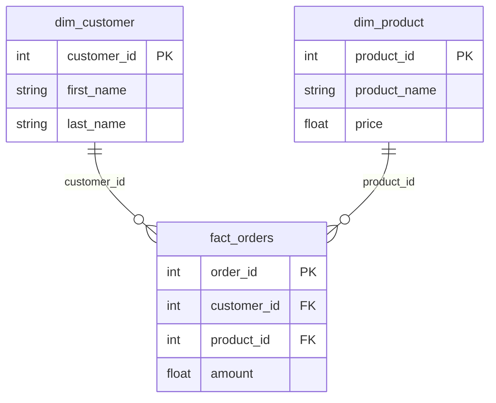

# 📊 dbt-model-erd

> **Automatically generate beautiful entity-relationship diagrams for your dbt models**

[](https://opensource.org/licenses/MIT)
[](https://www.python.org/downloads/)

## 🎯 What is dbt-model-erd?

`dbt-model-erd` analyzes your dbt SQL models and YAML schemas to automatically generate interactive ER diagrams showing relationships between fact and dimension tables. No manual diagramming required!

### ✨ Key Features

- 🖼️ **Visual Clarity**: Generate clean, professional ER diagrams for your data warehouse
- 🔄 **Auto-Detection**: Automatically detects relationships between fact and dimension tables
- 📝 **Documentation**: Embeds diagrams directly in your dbt model documentation
- 🧠 **Smart Inference**: Intelligently infers primary keys, foreign keys, and column types
- 🛠️ **Highly Configurable**: Customize every aspect of your diagrams
- 🔒 **No External Dependencies**: Renders diagrams client-side without requiring Node.js
- 🏎️ **CI/CD Friendly**: Works seamlessly in continuous integration environments

---

## 🚀 Quick Start

### Installation

```bash
pip install dbt-model-erd
```

### Basic Usage

```bash
# Navigate to your dbt project
cd your-dbt-project

# Generate diagrams for fact models
python -m dbt_erd --model-path models/fact

# View the generated diagrams
open assets/img/fact/fact_orders_model.html
```

### What It Does

1. **Scans** your dbt SQL files for `ref()` relationships
2. **Reads** YAML schemas for column definitions
3. **Generates** Mermaid ER diagrams showing table structures
4. **Creates** interactive HTML files
5. **Updates** your model YAML with diagram links

**👉 [Complete Quick Start Guide](QUICKSTART.md)**

---

## 📖 Documentation

| Document | Description |
|----------|-------------|
| [QUICKSTART.md](QUICKSTART.md) | Get started in 5 minutes with examples |
| [TESTING_GUIDE.md](TESTING_GUIDE.md) | How to test locally before publishing |
| [PUBLISHING_GUIDE.md](PUBLISHING_GUIDE.md) | Complete guide to publish to PyPI |
| [CONTRIBUTING.md](CONTRIBUTING.md) | Guidelines for contributors |

---

## 💡 Example

### Your dbt Project

**models/fact/fact_orders.sql:**
```sql
WITH orders AS (
    SELECT * FROM {{ source('raw', 'orders') }}
),
customers AS (
    SELECT * FROM {{ ref('dim_customer') }}
),
products AS (
    SELECT * FROM {{ ref('dim_product') }}
),
final AS (
    SELECT
        o.order_id,
        o.customer_id,
        o.product_id,
        o.amount
    FROM orders o
    LEFT JOIN customers c ON o.customer_id = c.customer_id
    LEFT JOIN products p ON o.product_id = p.product_id
)
SELECT * FROM final
```

### Generated Diagram



---

## 🎨 Configuration

### Generate Default Config

```bash
python -m dbt_erd --output-config my_config.yml
```

### Example Configuration

```yaml
# Visualization settings
visualization:
  max_dimensions: 10
  show_columns: true
  column_limit: 20

# Mermaid settings
mermaid:
  theme: "default"  # Options: default, neutral, forest, dark
  direction: "LR"   # Options: LR (left-right), TB (top-bottom)
  outputs:
    mmd: true   # Generate raw Mermaid source code
    html: true  # Generate HTML with client-side rendering

  # Table styling options
  style:
    fact_table_fill: "#f5f5f5"       # Light gray for fact tables
    dimension_table_fill: "#e8f4f8"  # Light blue for dimension tables
```

**📁 See [examples/](examples/) for more configuration options.**

---

## 🔧 Advanced Usage

### Parallel Processing

For large projects with many models:

```bash
python -m dbt_erd --model-path models/fact --parallel
```

### Custom Configuration

```bash
python -m dbt_erd --model-path models/fact --config advanced_config.yml
```

### Verbose Mode

For debugging:

```bash
python -m dbt_erd --model-path models/fact --verbose
```

### CI/CD Integration

Example GitHub Actions workflow:

```yaml
name: Update ERD Diagrams

on:
  push:
    branches: [ main ]
    paths:
      - 'models/**/*.sql'
      - 'models/**/*.yml'

jobs:
  update-diagrams:
    runs-on: ubuntu-latest
    steps:
      - uses: actions/checkout@v2
      - name: Set up Python
        uses: actions/setup-python@v2
        with:
          python-version: '3.9'
      - name: Install dbt-model-erd
        run: pip install dbt-model-erd
      - name: Generate ERD diagrams
        run: python -m dbt_erd --model-path models/fact
      - name: Commit changes
        run: |
          git config --local user.email "action@github.com"
          git config --local user.name "GitHub Action"
          git add assets/
          git commit -m "Update ERD diagrams" || echo "No changes"
          git push
```

**👉 [More CI/CD examples](.github/workflows/)**

---

## 🖼️ How It Works

### Pure Browser-Based Rendering

dbt-model-erd generates diagrams without requiring Node.js or making external API calls:

1. **Mermaid Source Code (.mmd)**: Raw diagram definition you can version control
2. **HTML with Client-Side Rendering (.html)**: Interactive diagram rendered in the browser

When embedded in dbt docs, you get clickable HTML links to interactive diagrams.

### Customizable Table Styling

You can customize the appearance of your diagrams:

- Set different colors for fact and dimension tables
- Choose from different themes (default, neutral, forest, dark)
- Set diagram direction (left-right or top-bottom)
- Control column display limits

### Diagram Generation Process

1. Analyzes SQL files to find fact and dimension tables based on naming patterns
2. Detects relationships between tables by identifying foreign keys
3. Generates Mermaid diagram code representing these relationships
4. Creates HTML files that render the diagrams client-side
5. Updates your model YAML files to include links to the diagrams in dbt docs

---

## 🤝 Contributing

We welcome contributions! Please see [CONTRIBUTING.md](CONTRIBUTING.md) for guidelines.

### Development Setup

```bash
git clone https://github.com/entechlog/dbt-model-erd.git
cd dbt-model-erd
pip install -e ".[dev]"

# Run tests
make test

# Run linting
make lint

# Format code
make format
```

---

## 📊 Project Status

- ✅ **Version**: 0.1.0 (Beta)
- ✅ **Python**: 3.8+
- ✅ **License**: MIT
- ✅ **Status**: Active Development

### Roadmap

- [ ] Support for bridge/junction tables
- [ ] Enhanced relationship type detection
- [ ] Export to PNG/SVG
- [ ] Integration with dbt Cloud
- [ ] Support for dbt metrics
- [ ] Custom Jinja templates

---

## 📝 License

This project is licensed under the MIT License - see the [LICENSE](LICENSE) file for details.

---

## 🙏 Acknowledgments

- Built with [Mermaid.js](https://mermaid.js.org/) for diagram rendering
- Inspired by the dbt community's need for better data model visualization
- Thanks to all [contributors](https://github.com/entechlog/dbt-model-erd/graphs/contributors)

---

## 📧 Support & Community

- **Issues**: [GitHub Issues](https://github.com/entechlog/dbt-model-erd/issues)
- **Discussions**: [GitHub Discussions](https://github.com/entechlog/dbt-model-erd/discussions)
- **dbt Slack**: [#tools-and-integrations](https://getdbt.slack.com)

---

## ⭐ Star History

If you find this tool helpful, please consider giving it a star on GitHub!

[](https://star-history.com/#entechlog/dbt-model-erd&Date)

---

**Made with ❤️ for the dbt community**
