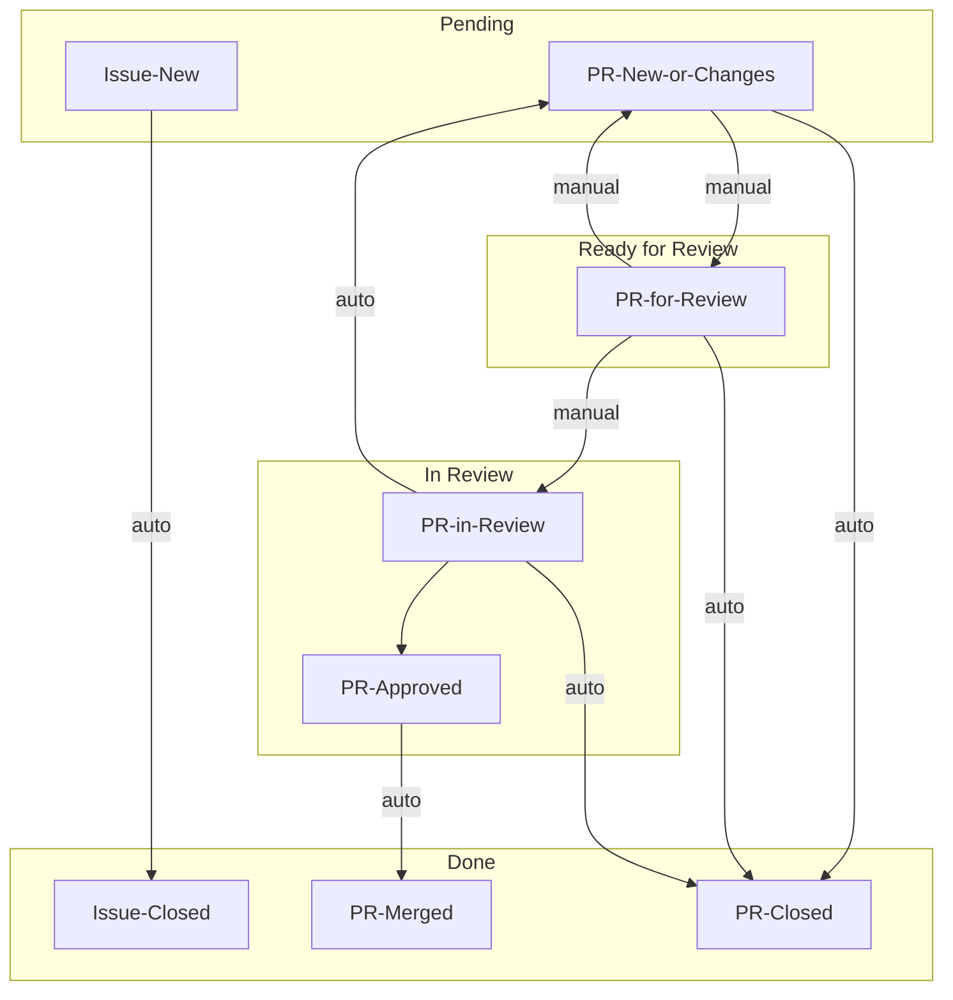

# DP Wizard

[](https://pypi.org/project/dp_wizard/)

DP Wizard makes it easier to get started with differential privacy.
It demonstrates how to calculate DP statistics or create a synthetic dataset from the data you provide.

You can run DP Wizard locally and upload your own CSV,
or use the [cloud deployment](https://mccalluc-dp-wizard.share.connect.posit.cloud/) and only provide column names to protect your private data.
In either case, you'll be prompted to describe your privacy budget and the analysis you need.
With that information, DP Wizard provides:

- A Jupyter notebook which demonstrates how to use the [OpenDP Library](https://docs.opendp.org/).
- A plain Python script.
- Text and CSV reports.

## Usage

DP Wizard requires Python 3.10 or later.
You can check your current version with `python --version`.
The exact upgrade process will depend on your environment and operating system.

Install with `pip install 'dp_wizard[app]'` and you can start DP Wizard from the command line.

```
usage: dp-wizard [-h] [--sample | --cloud]

DP Wizard makes it easier to get started with Differential Privacy.

options:
  -h, --help  show this help message and exit
  --sample    Generate a sample CSV: See how DP Wizard works without providing
              your own data
  --cloud     Prompt for column names instead of CSV upload

Unless you have set "--sample" or "--cloud", you will specify a CSV
inside the application.

Provide a "Private CSV" if you only have a private data set, and want to
make a release from it: The preview visualizations will only use
simulated data, and apart from the headers, the private CSV is not
read until the release.

Provide a "Public CSV" if you have a public data set, and are curious how
DP can be applied: The preview visualizations will use your public data.

Provide both if you have two CSVs with the same structure.
Perhaps the public CSV is older and no longer sensitive. Preview
visualizations will be made with the public data, but the release will
be made with private data.
```


## Contributions

There are several ways to contribute. First, if you find DP Wizard useful, please [let us know](mailto:info@opendp.org) and we'll spend more time on this project. If DP Wizard doesn't work for you, we also want to know that! Please [file an issue](https://github.com/opendp/dp-wizard/issues/new/choose) and we'll look into it.

We also welcome PRs, but if you have an idea for a new feature, it may be helpful to get in touch before you begin, to make sure your idea is in line with our vision:
- The DP Wizard codebase shouldn't actually contain any differential privacy algorithms. This project is a thin wrapper around the [OpenDP Library](https://github.com/opendp/opendp/), and that's where new algorithms should be added.
- DP Wizard isn't trying to do everything: The OpenDP Library is rich, and DP Wizard exposes only a fraction of that functionality so the user isn't overwhelmed by details.
- DP Wizard tries to model the correct application of differential privacy. For example, while comparing DP results and unnoised statistics can be useful for education, that's not something this application will offer.

With those caveats in mind,
feel free to [file a feature request](https://github.com/opendp/dp-wizard/issues/new/choose),
or [email us](mailto:info@opendp.org).


## Development

This is the first project we've developed with Python Shiny,
so let's remember [what we learned](WHAT-WE-LEARNED.md) along the way.

### Getting Started

DP-Wizard will run across multiple Python versions, but for the fewest surprises during development, it makes sense to use the oldest supported version in a virtual environment. On MacOS:
```shell
$ git clone https://github.com/opendp/dp-wizard.git
$ cd dp-wizard
$ brew install python@3.10
$ python3.10 -m venv .venv
$ source .venv/bin/activate
```

You can now install dependencies, and the application itself, and start a tutorial:
```shell
$ pip install -r requirements-dev.txt
$ pre-commit install
$ playwright install
$ pip install --editable .
$ dp-wizard --sample
```

Your browser should open and connect you to the application.

### Testing

Tests should pass, and code coverage should be complete (except blocks we explicitly ignore):
```shell
$ scripts/ci.sh
```

We're using [Playwright](https://playwright.dev/python/) for end-to-end tests. You can use it to [generate test code](https://playwright.dev/python/docs/codegen-intro) just by interacting with the app in a browser:
```shell
$ dp-wizard # The server will continue to run, so open a new terminal to continue.
$ playwright codegen http://127.0.0.1:8000/
```

You can also [step through these tests](https://playwright.dev/python/docs/running-tests#debugging-tests) and see what the browser sees:
```shell
$ PWDEBUG=1 pytest -k test_app
```

If Playwright fails in CI, we can still see what went wrong:
- Scroll to the end of the CI log, to `actions/upload-artifact`.
- Download the zipped artifact locally.
- Inside the zipped artifact will be _another_ zip: `trace.zip`.
- Don't unzip it! Instead, open it with [trace.playwright.dev](https://trace.playwright.dev/).

### Release

- Make sure you're up to date, and have the git-ignored credentials file `.pypirc`.
- Make one last feature branch with the new version number in the name:
  - Run `scripts/changelog.py` to update the `CHANGELOG.md`.
  - Review the updates and pull a couple highlights to the top.
  - Bump `dp_wizard/VERSION`, and add the new number at the top of the `CHANGELOG.md`.
  - Commit your changes, make a PR, and merge this branch to main.
- Update `main` with the latest changes: `git checkout main; git pull`
- Publish: `flit publish --pypirc .pypirc`

This project is configured so there are two different install possibilities from pypi:
- `pip install 'dp_wizard[app]'` pins all dependencies, and is the best route for most users.
- `pip install dp_wizard` does not pin dependencies, and is best if you're using `dp_wizard` as a library.


The cloud deployment is [configured](https://connect.posit.cloud/mccalluc/content/01966942-7eab-da99-0887-a7c483756aa8/edit) to update on pushes to the `cloud-deployment` branch.
If you are on `main`, with no local changes, run `scripts/deploy.sh`.

### Conventions

Branch names should be of the form `NNNN-short-description`, where `NNNN` is the issue number being addressed.

Add developer-only dependencies in `requirements-dev.in`; Add other dependencies in `requirements.in`. After an edit to either file run `scripts/requirements.py` to install the new dependency locally and update `pyproject.toml`.

A Github [project board](https://github.com/orgs/opendp/projects/10/views/2) provides an overview of the issues and PRs.
When PRs are [Ready for Review](https://github.com/orgs/opendp/projects/10/views/2?filterQuery=status%3A%22Ready+for+Review%22) they should be flagged as such so reviewers can find them.


- For `manual` transitions, the status of the issue or PR will need to be updated by hand, either on the issue, or by dragging between columns on the board.
- For `auto` transitions, some other action (for example, approving a PR) should trigger a [workflow](https://github.com/orgs/opendp/projects/10/workflows).
- These are the only states that matter. Whether PR is a draft or has assignees does not matter.
- If we need anything more than this, we should consider a paid plan, so that we have access to more workflows.


## News

(See also the [CHANGELOG](CHANGELOG.md).)

2025-09-23: [Blog post for v0.5](https://opendp.org/2025/09/23/announcing-dp-wizard-v0-5/)

2025-08-07: [DP Wizard Templates: Code templates and notebook generation](https://opendp.github.io/dp-wizard-templates/)

2025-05-07: [Slides for 50 minute presentation at 2025 Harvard IT Summit](https://opendp.github.io/harvard-it-summit-2025)

2025-04-14: [Blog post for v0.3](https://opendp.org/2025/04/14/announcing-opendp-library-0-13-and-dp-wizard/)

2025-04-11: [Slides for 5 minute mini-talk on v0.3.0 at ABSURD (Annual Boston Security Usability Research Day)](https://docs.google.com/presentation/d/1g1c5ksG9sN8A_qWW9nFmFFZ6dSCkUAmL6_cUahi3VPA/edit#slide=id.g34c5f4bdc6a_0_0)

2024-12-13: [Blog post for initial release](https://opendp.org/blog/dp-wizard-easy-way-get-started-differential-privacy-and-opendp)


## Related projects

There are a number of other projects which offer UIs for differential privacy.

From OpenDP:

- [DP Creator](https://github.com/opendp/dpcreator): An earlier project from OpenDP; Can be integrated with [Dataverse data repositories](https://dataverse.org/).
- [PSI](https://github.com/opendp/PSI): The first DP UI from OpenDP.

From other groups:

- [PrivSyn](https://github.com/vvv214/privsyn-tabular): Uses AIM for synthetic data generation.
