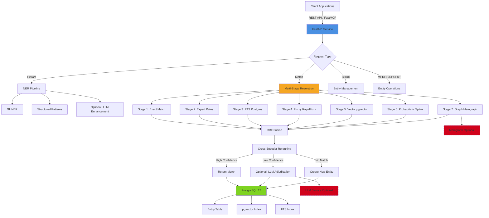

# Architecture Document: Entity Intelligence Service

## Overview

The Entity Intelligence Service is a self-hosted, unified platform for **Named Entity Recognition**, **Entity Resolution**, and **Master Data Management**. It provides canonical GUID assignment across arbitrary domains through a multi-stage matching pipeline combining traditional heuristics with modern ML techniques.

**Key Innovation**: Full pipeline from unstructured text → extracted entities → canonical IDs (matched OR newly created) → optional knowledge graph, accessible via REST API and FastMCP.

## System Components

### High-Level Architecture



### Component Architecture

```
┌──────────────────────────────────────────────────────────┐
│                  FastAPI Service Layer                    │
│  ┌─────────────────────────────────────────────────────┐ │
│  │  REST API Endpoints                                  │ │
│  │  • POST /entities/extract    (NER)                   │ │
│  │  • POST /entities/match      (Resolution)            │ │
│  │  • POST /entities/match/bulk (Batch)                 │ │
│  │  • POST /entities            (Create)                │ │
│  │  • GET  /entities/{id}       (Read)                  │ │
│  │  • PUT  /entities/{id}       (Update)                │ │
│  │  • POST /entities/{id}/merge (Merge)                 │ │
│  │  • DELETE /entities/{id}     (Delete)                │ │
│  └─────────────────────────────────────────────────────┘ │
│  ┌─────────────────────────────────────────────────────┐ │
│  │  FastMCP Wrapper                                     │ │
│  │  • Expose all endpoints via MCP protocol             │ │
│  │  • LLM-friendly error messages                       │ │
│  └─────────────────────────────────────────────────────┘ │
└──────────────────────────────────────────────────────────┘
                           ↓
┌──────────────────────────────────────────────────────────┐
│              Named Entity Recognition Layer               │
│  ┌─────────────────────────────────────────────────────┐ │
│  │  GLiNER (Primary)                                    │ │
│  │  • Model: knowledgator/modern-gliner-bi-large-v1.0  │ │
│  │  • Zero-shot entity extraction                       │ │
│  │  • 8K context window                                 │ │
│  └─────────────────────────────────────────────────────┘ │
│  ┌─────────────────────────────────────────────────────┐ │
│  │  Structured Patterns (Fallback)                      │ │
│  │  • Regex for emails, dates, money, SKUs              │ │
│  └─────────────────────────────────────────────────────┘ │
│  ┌─────────────────────────────────────────────────────┐ │
│  │  LLM Enhancement (Optional - Bullet #9)              │ │
│  │  • OpenAI-compatible API (LM Studio/vLLM/etc.)     │ │
│  │  • Missing entity detection                          │ │
│  │  • Type correction                                   │ │
│  └─────────────────────────────────────────────────────┘ │
└──────────────────────────────────────────────────────────┘
                           ↓
┌──────────────────────────────────────────────────────────┐
│           Multi-Stage Entity Resolution Pipeline          │
│                                                            │
│  Stage 1: Exact Match (<5ms, confidence=1.0)              │
│  ├── Normalized string comparison                         │
│  ├── Canonical form matching                              │
│  └── Early exit if match found                            │
│                                                            │
│  Stage 2: Expert Rules (<10ms, confidence=0.95)           │
│  ├── Domain-specific patterns                             │
│  ├── Business entity normalization (LLC, Inc, Corp)       │
│  └── Name variation handling (Doe, John → John Doe)       │
│                                                            │
│  Stage 3: Full Text Search (<20ms, confidence=0.85)       │
│  ├── Postgres FTS with ts_rank_cd                         │
│  ├── pg_trgm similarity                                   │
│  └── BM25-style scoring                                   │
│                                                            │
│  Stage 4: Fuzzy Matching (<50ms, confidence=0.8)          │
│  ├── RapidFuzz: ratio, partial_ratio                      │
│  ├── token_sort_ratio, token_set_ratio                    │
│  ├── WRatio (weighted combination)                        │
│  └── Ensemble scoring across algorithms                   │
│                                                            │
│  Stage 5: Vector Similarity (<30ms, confidence=0.75)      │
│  ├── EmbeddingGemma-308M (lightweight, 100+ languages)    │
│  ├── pgvector HNSW index                                  │
│  ├── Cosine similarity search                             │
│  └── Context-aware semantic matching                      │
│                                                            │
│  Stage 6: Probabilistic Linking (<200ms, confidence=0.7)  │
│  ├── Splink (Fellegi-Sunter model)                        │
│  ├── Unsupervised learning                                │
│  ├── Term frequency adjustments                           │
│  └── Multi-field evidence aggregation                     │
│                                                            │
│  Stage 7: Graph Boosting (<100ms, confidence=0.65)        │
│  ├── Memgraph relationship traversal                      │
│  ├── Connection count boosting                            │
│  ├── Distance penalty                                     │
│  └── Context-based confidence adjustment                  │
│                                                            │
│  Fusion & Reranking:                                      │
│  ├── RRF (Reciprocal Rank Fusion) across all stages      │
│  ├── Cross-encoder reranking (ms-marco-MiniLM-L-12-v2)   │
│  └── Final confidence calibration                         │
│                                                            │
│  Decision Logic:                                          │
│  ├── confidence ≥ 0.7 → Return match                      │
│  ├── 0.6 ≤ confidence < 0.7 → Optional LLM adjudication  │
│  └── confidence < 0.6 → Create new entity                │
└──────────────────────────────────────────────────────────┘
                           ↓
┌──────────────────────────────────────────────────────────┐
│                    Storage Layer                          │
│                                                            │
│  ┌─────────────────────────────────────────────────────┐ │
│  │  PostgreSQL 17 (Primary)                             │ │
│  │  ├── Entity table (relational data)                  │ │
│  │  ├── pgvector extension (HNSW index for embeddings)  │ │
│  │  ├── FTS + pg_trgm (lexical search)                  │ │
│  │  └── ACID transactions for entity operations         │ │
│  └─────────────────────────────────────────────────────┘ │
│                                                            │
│  ┌─────────────────────────────────────────────────────┐ │
│  │  Memgraph (Optional - Bullet #8)                     │ │
│  │  ├── Entity relationship graph                        │ │
│  │  ├── Cypher query support                             │ │
│  │  └── Graph-based boosting for resolution             │ │
│  └─────────────────────────────────────────────────────┘ │
└──────────────────────────────────────────────────────────┘
                           ↓
┌──────────────────────────────────────────────────────────┐
│                  Optional Enhancement Layer               │
│                                                            │
│  ┌─────────────────────────────────────────────────────┐ │
│  │  LLM Integration (Bullet #9)                         │ │
│  │  ├── OpenAI-compatible API endpoint (configurable)   │ │
│  │  ├── Development: LM Studio (http://localhost:1234)  │ │
│  │  ├── Production: vLLM, OpenAI, Anthropic, etc.       │ │
│  │  ├── Model: Configurable per environment             │ │
│  │  │   • Dev: Gemma 3n E2B-IT (lightweight)           │ │
│  │  │   • Prod: gpt-oss-20b, Claude, GPT-4o, etc.      │ │
│  │  ├── Use cases:                                       │ │
│  │  │   • Borderline match adjudication                 │ │
│  │  │   • Domain-specific rule suggestion               │ │
│  │  │   • Schema discovery                               │ │
│  │  │   • Synthetic data generation                     │ │
│  │  └── Temperature: 0.1 (deterministic)                │ │
│  └─────────────────────────────────────────────────────┘ │
└──────────────────────────────────────────────────────────┘
```

## Technology Stack

| Layer          | Technology | Rationale | ADR Reference |
| -------------- | ---------- | --------- | ------------- |
| API Framework  | FastAPI + asyncpg | Modern async Python, auto-docs, research consensus | ADR-004 |
| Database       | PostgreSQL 17 | Stable, production-ready, pgvector support | ADR-001 |
| Vector Index   | pgvector (HNSW) | In-database simplicity, sufficient for MVP | ADR-001 |
| Embeddings     | EmbeddingGemma-308M | Lightweight (<200MB), multilingual, efficient | ADR-002 |
| Reranker       | cross-encoder/ms-marco-MiniLM-L-12-v2 | Proven accuracy, smaller than alternatives | ADR-002 |
| NER            | GLiNER (knowledgator/modern-gliner-bi-large-v1.0) | Zero-shot, 8K context | ADR-006 |
| Fuzzy Matching | RapidFuzz | Fast, multiple algorithms, Python-native | ADR-003 |
| Probabilistic  | Splink + DuckDB | Unsupervised, multi-field matching | ADR-003 |
| Graph (Optional) | Memgraph | Vector + graph in one, Cypher support | ADR-007 |
| LLM (Optional) | OpenAI-compatible API | Configurable: LM Studio, vLLM, OpenAI, Anthropic, etc. | ADR-005 |
| MCP Wrapper    | FastMCP | LLM integration, HTTP-based | ADR-008 |

## Database Schema (PostgreSQL 17)

### Entity Table

```sql
CREATE EXTENSION IF NOT EXISTS vector;
CREATE EXTENSION IF NOT EXISTS pg_trgm;

CREATE TABLE entity (
  -- Identity
  entity_id         UUID PRIMARY KEY DEFAULT gen_random_uuid(),

  -- Core attributes
  kind              TEXT NOT NULL,              -- domain: 'company', 'person', 'product', etc.
  canonical_name    TEXT NOT NULL,              -- primary name
  aliases           TEXT[] DEFAULT '{}',        -- alternative names

  -- Structured attributes (domain-specific, JSON)
  attributes        JSONB NOT NULL DEFAULT '{}',

  -- Metadata
  created_at        TIMESTAMPTZ DEFAULT now(),
  updated_at        TIMESTAMPTZ DEFAULT now(),
  confidence        FLOAT DEFAULT 1.0,          -- entity quality score
  source            TEXT,                       -- origin of entity

  -- Embeddings (Matryoshka: can be 128, 256, 512, or 768 dims)
  embedding_text    VECTOR(768),                -- dense semantic embedding

  -- Search optimization
  fts_document      tsvector                    -- full-text search vector
    GENERATED ALWAYS AS (
      setweight(to_tsvector('english', coalesce(canonical_name, '')), 'A') ||
      setweight(to_tsvector('english', coalesce(array_to_string(aliases, ' '), '')), 'B')
    ) STORED
);

-- Indexes
CREATE INDEX idx_entity_kind ON entity(kind);
CREATE INDEX idx_entity_fts ON entity USING GIN (fts_document);
CREATE INDEX idx_entity_trgm_name ON entity USING GIN (canonical_name gin_trgm_ops);
CREATE INDEX idx_entity_embedding_hnsw ON entity
  USING hnsw (embedding_text vector_cosine_ops);
CREATE INDEX idx_entity_attributes ON entity USING GIN (attributes);

-- Updated timestamp trigger
CREATE OR REPLACE FUNCTION update_updated_at()
RETURNS TRIGGER AS $$
BEGIN
  NEW.updated_at = now();
  RETURN NEW;
END;
$$ LANGUAGE plpgsql;

CREATE TRIGGER entity_updated_at
  BEFORE UPDATE ON entity
  FOR EACH ROW
  EXECUTE FUNCTION update_updated_at();
```

### Entity Merge History (Audit Trail)

```sql
CREATE TABLE entity_merge_history (
  merge_id          UUID PRIMARY KEY DEFAULT gen_random_uuid(),
  source_entity_id  UUID NOT NULL,              -- entity being merged
  target_entity_id  UUID NOT NULL,              -- canonical entity
  merged_at         TIMESTAMPTZ DEFAULT now(),
  merged_by         TEXT,                       -- user/system
  confidence        FLOAT NOT NULL,             -- match confidence
  method            TEXT NOT NULL,              -- which stage found match
  metadata          JSONB DEFAULT '{}'
);

CREATE INDEX idx_merge_history_source ON entity_merge_history(source_entity_id);
CREATE INDEX idx_merge_history_target ON entity_merge_history(target_entity_id);
```

## Tracer Bullet Decomposition

### Foundation Phase (Bullets 1-3) - Proves Plumbing

**Bullet #1** (2-3h): Hardcoded exact string match API
- FastAPI service, POST /entities/match
- Input: `{"text": "IBM"}` → Output: `{"entity_id": "uuid-123", "confidence": 1.0}`
- In-memory dict for lookup
- **Demo**: Can call API, get response

**Bullet #2** (3-4h): Add fuzzy string matching (RapidFuzz)
- Add RapidFuzz with multiple algorithms (ratio, token_sort, WRatio)
- Still in-memory storage
- **Demo**: "I.B.M." matches "IBM" with confidence 0.85

**Bullet #3** (4h): Postgres persistence + CRUD
- Schema: entity table (id UUID, canonical_name TEXT, kind TEXT, created_at)
- Basic CRUD operations via REST API
- **Demo**: Survives server restart, can create/read/update/delete entities

### Core Phase (Bullets 4-6) - Adds Intelligence

**Bullet #4** (4-5h): Vector search with EmbeddingGemma
- Add pgvector extension + HNSW index
- Embed entity text with sentence-transformers
- Cosine similarity search
- **Demo**: Semantic matching works ("International Business Machines" → "IBM")

**Bullet #5** (3-4h): Hybrid fusion (dense + sparse)
- Add Postgres FTS for lexical matching
- Implement RRF fusion: `score = sum(1/(60 + rank_i))`
- **Demo**: Best of both worlds (semantic + keyword)

**Bullet #6** (3-4h): Cross-encoder reranking
- Add ms-marco-MiniLM cross-encoder
- Re-rank top K candidates
- **Demo**: Improved precision, confidence calibration

### Production Phase (Bullets 7-10) - Scales & Specializes

**Bullet #7** (5h): Probabilistic linking with Splink
- Add Splink for multi-field matching
- Particularly valuable for person entities (names, DOB, email)
- **Demo**: Complex person matching works ("John Smith" vs "Smith, John")

**Bullet #8** (5-6h): Graph relationship boosting with Memgraph
- Add Memgraph integration
- Graph traversal for context-based boosting
- **Demo**: Related entities improve matching confidence

**Bullet #9** (4-5h): Domain-specific rules + LLM adjudication
- Expert rules for legal/business entities
- Optional LLM via OpenAI-compatible API (configurable: LM Studio, vLLM, OpenAI, etc.)
- Use for borderline cases (0.6-0.7 confidence)
- **Demo**: Domain adaptation works, LLM resolves ambiguous matches

**Bullet #10** (4h): FastMCP wrapper + production hardening
- MCP server implementation
- Docker compose setup (FastAPI + Postgres + optional Memgraph/vLLM)
- Monitoring, logging, error handling
- **Demo**: LLM can query via MCP, create entities, merge duplicates

**Total estimated time: 40-48 hours (2 weeks at 4 hours/day)**

## API Interface Contracts

### Extract Entities (NER)

```json
POST /entities/extract
{
  "text": "Apple Inc. announced a $100 billion acquisition...",
  "entity_types": ["company", "person", "money"],  // optional, auto-discover if omitted
  "config": {
    "use_llm_enhancement": false,
    "confidence_threshold": 0.5
  }
}

Response:
{
  "entities": [
    {
      "text": "Apple Inc.",
      "type": "company",
      "confidence": 0.95,
      "span": [0, 10],
      "method": "gliner"
    },
    {
      "text": "$100 billion",
      "type": "money",
      "confidence": 1.0,
      "span": [25, 37],
      "method": "structured_pattern"
    }
  ],
  "processing_time_ms": 450
}
```

### Match Entity (Resolution)

```json
POST /entities/match
{
  "text": "IBM",
  "kind": "company",  // optional, helps with filtering
  "attributes": {     // optional, additional match signals
    "email": "contact@ibm.com",
    "location": "New York"
  },
  "config": {
    "stages": ["exact", "fuzzy", "vector", "splink"],  // configurable
    "confidence_threshold": 0.7,
    "create_if_missing": true,
    "max_results": 5,
    "include_audit_trail": true
  }
}

Response:
{
  "match_found": true,
  "entity_id": "uuid-abc-123",
  "canonical_name": "IBM Corporation",
  "confidence": 0.92,
  "match_method": "vector",
  "audit_trail": [
    {
      "stage": "exact",
      "candidates_evaluated": 0,
      "top_confidence": null,
      "execution_time_ms": 2
    },
    {
      "stage": "vector",
      "candidates_evaluated": 50,
      "top_confidence": 0.92,
      "execution_time_ms": 28
    }
  ],
  "total_time_ms": 35,
  "alternatives": [
    {
      "entity_id": "uuid-xyz-789",
      "canonical_name": "IBM Research",
      "confidence": 0.68
    }
  ]
}
```

### Bulk Match

```json
POST /entities/match/bulk
{
  "entities": [
    {"text": "IBM", "kind": "company"},
    {"text": "Microsoft", "kind": "company"},
    {"text": "John Doe", "kind": "person"}
  ],
  "config": {...}
}

Response:
{
  "results": [
    {"text": "IBM", "match_found": true, "entity_id": "...", ...},
    {"text": "Microsoft", "match_found": true, "entity_id": "...", ...},
    {"text": "John Doe", "match_found": false, "created": true, "entity_id": "...", ...}
  ],
  "summary": {
    "total_processed": 3,
    "matched": 2,
    "created": 1,
    "avg_confidence": 0.87,
    "total_time_ms": 215
  }
}
```

### CRUD Operations

```json
# Create entity
POST /entities
{
  "kind": "company",
  "canonical_name": "IBM Corporation",
  "aliases": ["IBM", "International Business Machines"],
  "attributes": {
    "founded": "1911",
    "hq": "Armonk, NY"
  }
}

# Read entity
GET /entities/{entity_id}

# Update entity
PUT /entities/{entity_id}
{
  "canonical_name": "International Business Machines Corporation",
  "aliases": ["IBM", "Big Blue"]
}

# Merge entities
POST /entities/{source_id}/merge
{
  "target_id": "uuid-target",
  "confidence": 0.95,
  "method": "manual"
}

# Delete entity
DELETE /entities/{entity_id}
```

## Configuration Management

The service is designed for flexibility across development and production environments through environment-based configuration.

### LLM Configuration (Environment-Specific)

```yaml
# Development (docker-compose.dev.yml)
llm:
  enabled: true
  api_base: "http://localhost:1234/v1"  # LM Studio
  api_key: "not-needed"
  model: "gemma-3n-e2b-it"
  temperature: 0.1
  timeout: 30
  use_for:
    - adjudication  # Borderline matches (0.6-0.7 confidence)
    - schema_discovery
    - rule_suggestion

# Production (docker-compose.prod.yml)
llm:
  enabled: true
  api_base: "https://api.openai.com/v1"  # or vLLM endpoint
  api_key: "${OPENAI_API_KEY}"
  model: "gpt-4o"  # or "claude-3-5-sonnet-20241022", "gpt-oss-20b", etc.
  temperature: 0.1
  timeout: 60
  use_for:
    - adjudication
    - schema_discovery
    - rule_suggestion

# No LLM (MVP - Bullets 1-8)
llm:
  enabled: false
```

### Database Configuration

```yaml
database:
  host: "${POSTGRES_HOST:-localhost}"
  port: "${POSTGRES_PORT:-5432}"
  database: "${POSTGRES_DB:-entities}"
  user: "${POSTGRES_USER:-postgres}"
  password: "${POSTGRES_PASSWORD}"
  pool_size: 20
  max_overflow: 10
```

### Embedding Configuration

```yaml
embeddings:
  model: "google/embedding-gemma-308m"
  device: "cpu"  # or "cuda" for GPU
  dimension: 768  # Matryoshka: 128, 256, 512, or 768
  cache_dir: "./models"
  batch_size: 32
```

### Resolution Pipeline Configuration

```yaml
resolution:
  stages:
    exact_match:
      enabled: true
      confidence_threshold: 1.0
    expert_rules:
      enabled: true
      confidence_threshold: 0.95
    full_text_search:
      enabled: true
      confidence_threshold: 0.85
    fuzzy_matching:
      enabled: true
      confidence_threshold: 0.8
    vector_similarity:
      enabled: true
      confidence_threshold: 0.75
    probabilistic_linking:
      enabled: true
      confidence_threshold: 0.7
    graph_boosting:
      enabled: false  # Enable in Bullet #8
      confidence_threshold: 0.65

  fusion:
    method: "rrf"  # Reciprocal Rank Fusion
    k: 60

  reranking:
    enabled: true
    model: "cross-encoder/ms-marco-MiniLM-L-12-v2"
    top_k: 10

  decision:
    match_threshold: 0.7
    create_if_below_threshold: true
    llm_adjudication_range: [0.6, 0.7]
```

## Key Architectural Decisions

1. **PostgreSQL 17 + pgvector for Storage** (ADR-001)
   - Single-store simplicity for MVP
   - Upgrade path to Postgres 18 or separate vector DB (Qdrant) if needed

2. **EmbeddingGemma-308M for Embeddings** (ADR-002)
   - Lightweight, efficient for MVP
   - Upgrade to Qwen3-Embedding-4B if accuracy < 85%

3. **Multi-Stage Resolution Pipeline** (ADR-003)
   - Gracefully degrading stages with early exit
   - Configurable per request
   - Balance latency vs accuracy

4. **FastAPI + Python Service Layer** (ADR-004)
   - Modern, async-first
   - Strong ML ecosystem
   - Can rewrite performance paths in Rust later

5. **Defer LLM Integration** (ADR-005)
   - No LLM in MVP (bullets 1-8)
   - Add in bullet #9 for adjudication only
   - Use OpenAI-compatible API (configurable: LM Studio dev, vLLM/OpenAI/Anthropic prod)
   - Environment-specific configuration for flexibility

6. **GLiNER for NER** (ADR-006)
   - Zero-shot entity extraction
   - Domain-agnostic
   - 8K context window

7. **Memgraph for Graph (Optional)** (ADR-007)
   - Add only in bullet #8 when proven necessary
   - Cypher query support
   - Graph-based boosting

8. **FastMCP Wrapper** (ADR-008)
   - LLM integration
   - HTTP-based, no complex protocols
   - Standard REST API also available

## Non-Functional Requirements

### Performance
- **Latency Target**: <500ms p95 for match requests
- **Throughput**: 100+ concurrent requests
- **Bulk Processing**: 10,000 entities/minute

### Scalability
- **Entity Capacity**: 1M+ entities in MVP
- **Horizontal Scaling**: Add read replicas for Postgres
- **Caching**: Redis for hot entities (future)

### Maintainability
- **Code Quality**: Type hints, docstrings, tests
- **Observability**: Structured logging, metrics, tracing
- **Documentation**: OpenAPI/Swagger auto-generated

### Security
- **Authentication**: API keys (MVP), JWT (later)
- **Authorization**: Role-based access control (future)
- **Data Privacy**: PII hashing/encryption (future)

---

_Created: 2025-10-07_
_Last Updated: 2025-10-07 (DESIGN phase - Added OpenAI-compatible API flexibility)_
_Status: Living Document - Update when architecture evolves_
