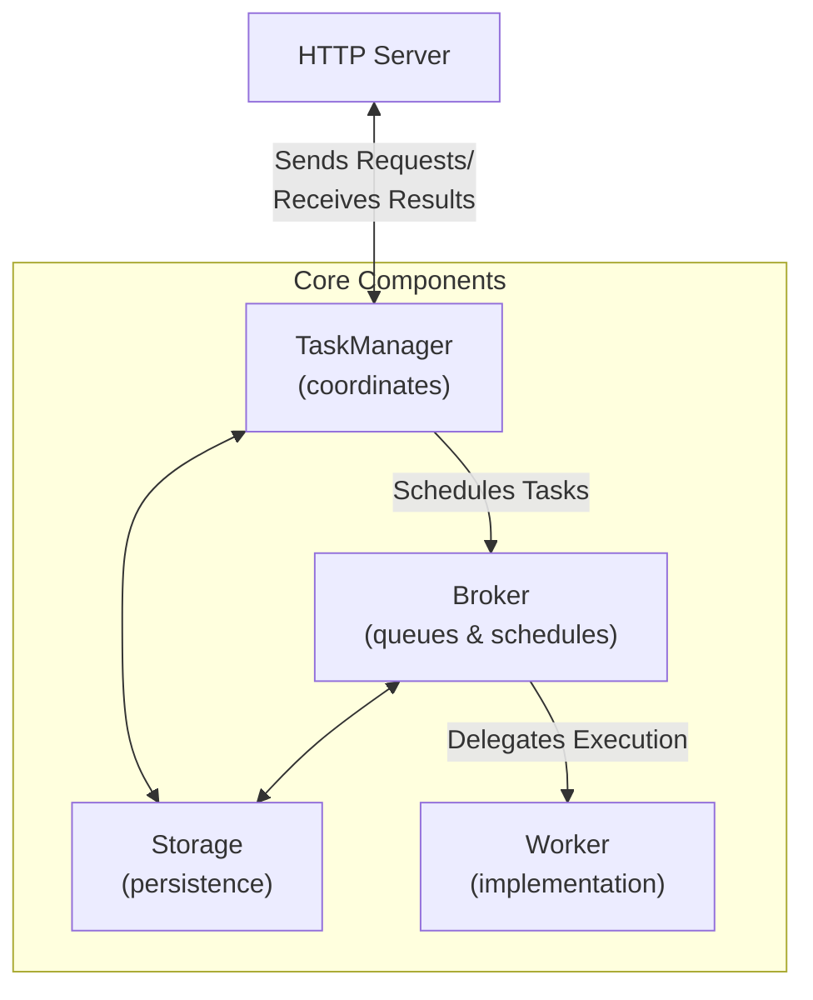

# FastA2A

[](https://github.com/pydantic/pydantic-ai/actions/workflows/ci.yml?query=branch%3Amain)
[](https://coverage-badge.samuelcolvin.workers.dev/redirect/pydantic/pydantic-ai)
[](https://pypi.python.org/pypi/fasta2a)
[](https://github.com/pydantic/pydantic-ai)
[](https://github.com/pydantic/pydantic-ai/blob/main/LICENSE)

**FastA2A** is an agentic framework agnostic implementation of the A2A protocol in Python.
The library is designed to be used with any agentic framework, and is not exclusive to PydanticAI.


## Installation

**FastA2A** is available on PyPI as [`fasta2a`](https://pypi.org/project/fasta2a/) so installation is as simple as:

```bash
pip install fasta2a  # or `uv add fasta2a`
```

The only dependencies are:

- [starlette](https://www.starlette.io): to expose the A2A server as an [ASGI application](https://asgi.readthedocs.io/en/latest/)
- [pydantic](https://pydantic.dev): to validate the request/response messages
- [opentelemetry-api](https://opentelemetry-python.readthedocs.io/en/latest): to provide tracing capabilities

## Usage

To use **FastA2A**, you need to bring the `Storage`, `Broker` and `Worker` components.

**FastA2A** was designed with the mindset that the worker could, and should live outside the web server.
i.e. you can have a worker that runs on a different machine, or even in a different process.

You can use the `InMemoryStorage` and `InMemoryBroker` to get started, but you'll need to implement the `Worker`
to be able to execute the tasks with your agentic framework. Let's see an example:

```python
import uuid
from collections.abc import AsyncIterator
from contextlib import asynccontextmanager
from typing import Any

from fasta2a import FastA2A, Worker
from fasta2a.broker import InMemoryBroker
from fasta2a.schema import Artifact, Message, TaskIdParams, TaskSendParams, TextPart
from fasta2a.storage import InMemoryStorage

Context = list[Message]
"""The shape of the context you store in the storage."""


class InMemoryWorker(Worker[Context]):
    async def run_task(self, params: TaskSendParams) -> None:
        task = await self.storage.load_task(params['id'])
        assert task is not None

        await self.storage.update_task(task['id'], state='working')

        context = await self.storage.load_context(task['context_id']) or []
        context.extend(task.get('history', []))

        # Call your agent here...
        message = Message(
            role='agent',
            parts=[TextPart(text=f'Your context is {len(context) + 1} messages long.', kind='text')],
            kind='message',
            message_id=str(uuid.uuid4()),
        )

        # Update the new message to the context.
        context.append(message)

        artifacts = self.build_artifacts(123)
        await self.storage.update_context(task['context_id'], context)
        await self.storage.update_task(task['id'], state='completed', new_messages=[message], new_artifacts=artifacts)

    async def cancel_task(self, params: TaskIdParams) -> None: ...

    def build_message_history(self, history: list[Message]) -> list[Any]: ...

    def build_artifacts(self, result: Any) -> list[Artifact]: ...


storage = InMemoryStorage()
broker = InMemoryBroker()
worker = InMemoryWorker(storage=storage, broker=broker)


@asynccontextmanager
async def lifespan(app: FastA2A) -> AsyncIterator[None]:
    async with app.task_manager:
        async with worker.run():
            yield


app = FastA2A(storage=storage, broker=broker, lifespan=lifespan)
```

_You can run this example as is with `uvicorn main:app --reload`._

### Using PydanticAI

Initially, this **FastA2A** lived under **PydanticAI** repository, but since we received community feedback,
we've decided to move it to a separate repository.

> [!NOTE]
> Other agentic frameworks are welcome to implement the `Worker` component, and we'll be happy add the reference here.

For reference, you can [check the PydanticAI implementation of the `Worker`](https://github.com/pydantic/pydantic-ai/blob/3ef42ed9a1a2c799bb94a5a69c80aa9e8968ca72/pydantic_ai_slim/pydantic_ai/_a2a.py#L115-L304).

Let's see how to use it in practice:

```python
from pydantic_ai import Agent

agent = Agent('openai:gpt-4.1')
app = agent.to_a2a()
```

_You can run this example as is with `uvicorn main:app --reload`._

As you see, it's pretty easy from the point of view of the developer using your agentic framework.

## Design

**FastA2A** is built on top of [Starlette](https://www.starlette.io/), which means it's fully compatible
with any ASGI server.

Given the nature of the A2A protocol, it's important to understand the design before using it,
as a developer you'll need to provide some components:

- **Storage**: to save and load tasks and the conversation context
- **Broker**: to schedule tasks
- **Worker**: to execute tasks

Let's have a look at how those components fit together:



**FastA2A** allows you to bring your own `Storage`, `Broker` and `Worker`.

You can also leverage the in-memory implementations of `Storage` and `Broker` by using
the `InMemoryStorage` and `InMemoryBroker`:

```python
from fasta2a import InMemoryStorage, InMemoryBroker

storage = InMemoryStorage()
broker = InMemoryBroker()
```

###  Tasks and Context

**FastA2A** is designed to be opinionated regarding the A2A protocol.
When the server receives a message, according to the specification, the server can decide between:

- Send a **stateless** message back to the client
- Create a **stateful** Task and run it on the background

**FastA2A** will **always** create a Task and run it on the background (on the `Worker`).

> [!NOTE]
> You can read more about it [here](https://a2aproject.github.io/A2A/latest/topics/life-of-a-task/).

- **Task**: Represents one complete execution of an agent. When a client sends a message to the agent,
  a new task is created. The agent runs until completion (or failure), and this entire execution is
  considered one task. The final output should be stored as a task artifact.

- **Context**: Represents a conversation thread that can span multiple tasks. The A2A protocol uses a
  `context_id` to maintain conversation continuity:
  - When a new message is sent without a `context_id`, the server generates a new one
  - Subsequent messages can include the same `context_id` to continue the conversation
  - All tasks sharing the same `context_id` have access to the complete message history

#### Storage

The `Storage` component serves two purposes:

1. **Task Storage**: Stores tasks in A2A protocol format, including their status, artifacts, and message history
2. **Context Storage**: Stores conversation context in a format optimized for the specific agent implementation

This design allows for agents to store rich internal state (e.g., tool calls, reasoning traces) as well as store task-specific A2A-formatted messages and artifacts.

## License

This project is licensed under the MIT License - see the [LICENSE](LICENSE) file for details.
