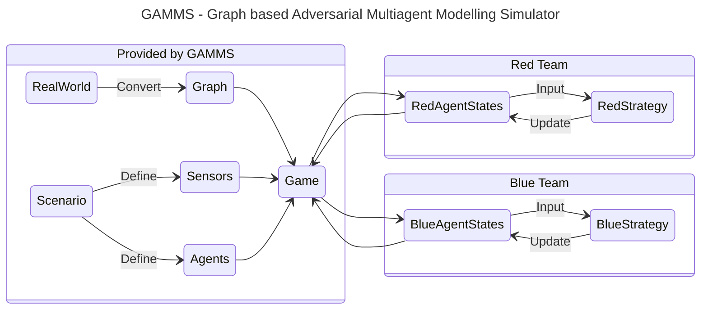

# GAMMS: Graph based Adversarial Multiagent Modelling Simulator

GAMMS (Graph based Adversarial Multiagent Modelling Simulator) is a Python library designed for simulating large scale multi-agent scenarios on environments represented as graphs. The library is a framework which focuses on providing a flexible and extensible architecture to facilitate implementing interactions between agents and the environment as well as controlling the information flow between them. The library is geared towards easing development of high level scenario dynamics and testing agent behaviours rather than low level details like the actual physics of real world interactions. GAMMS tries to solve the following problems:

1. Run large simulations involving multiple agents on an everyday laptop.
2. Provide a simple interface to the user to define the agents and the environment.
3. Allow the user to work with the agents and the environment without worrying about the underlying packages.
4. Create a simulater that is easy to use on any operating system (Windows, Mac, Linux) and is easy to install.

The uniqueness of GAMMS comes from *what it is not* trying to be. It is *not* a physics engine, game engine, deep learning library, or a reinforcement learning library. The goal of GAMMS is to provide a framework where the user can use any of these libraries to implement their own agents and environments. Other libraries like [Unity](https://unity.com), [PyBullet](https://pybullet.org/wordpress/), and [OpenAI Gym](https://gymnasium.farama.org/) are great for simulating environments but they are not designed to be used as a framework for multi-agent simulations on graphs. GAMMS is trying to address the niche use for researchers and developers who want to do a quick iterations on their ideas and test them in simulated environments that have limited interactions. GAMMS want to be a tool to create a standardized way for simulating multi-agent systems, making it easier to share and reproduce results.

The diagram above illustrates on a high level how GAMMS works. The user defines the environment and the agents, and GAMMS takes care of the rest. The user can focus on implementing the strategies for the agents and the interactions between them, while GAMMS handles the simulation and the information flow.
