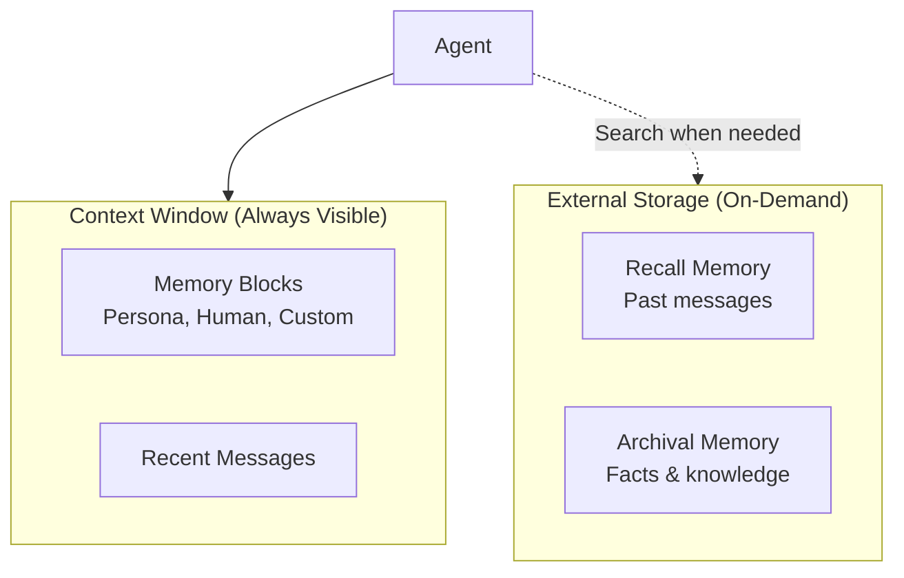

# Incremental Memory Documentation Improvements

## Current State Analysis

The current `memory.mdx` is **52 lines** and covers:
- High-level intro about persistent state
- MemGPT approach (3 principles)
- Types of memory (in-context vs out-of-context)
- Why memory matters (4 benefits)
- Memory management in practice (4 approaches)

**What's good:**
- Concise and scannable
- Links to MemGPT paper
- Mentions key concepts (self-editing, hierarchy, context management)

**What's missing:**
- The core insight: "memory is about managing the context window"
- Visual diagram
- Explanation of memory blocks as abstraction units
- RAG vs agent memory distinction
- Practical examples
- Deep explanation of how memory actually works

---

## Incremental Improvement Plan

### Phase 1: Add the Core Insight (5 min)
**What:** Add a precise opening definition before the current intro
**Why:** Sets up the right mental model immediately
**Where:** Top of the file, before "Agent memory is what enables..."

```markdown
## What is agent memory?

**Agent memory in Letta is about managing what information is in the agent's context window.**

The context window is a scarce resource - you can't fit everything into it. Effective memory management is about deciding what stays in context (immediately visible) and what moves to external storage (retrieved when needed).
```

**Benefit:** Readers immediately understand the fundamental constraint and purpose.

---

### Phase 2: Add a Simple Visual (10 min)
**What:** Add a clean diagram showing the memory hierarchy
**Why:** Current page has zero visuals for a complex topic
**Where:** After "Types of Memory in Letta"

**Simple version:**


**Benefit:** Visual reinforces the two-tier structure and makes it concrete.

---

### Phase 3: Expand "Memory blocks" Section (15 min)
**What:** Add a dedicated subsection explaining what memory blocks ARE
**Why:** Current docs mention them but don't explain the concept
**Where:** Under "Types of Memory in Letta" → "Core Memory (In-Context)"

Add:
- What memory blocks are (units of abstraction for context)
- Why they exist (consistency, editability, structure, control)
- Simple code example showing block structure
- Link to memory-blocks.mdx for details

Example structure:
```markdown
### Core Memory (In-Context)

Memory blocks are discrete, structured sections of the context window that agents can edit.

**Why memory blocks?**
- **Consistency**: Same information visible across all interactions
- **Editability**: Agents can update their understanding over time
- **Structure**: Organized sections instead of unstructured history
- **Control**: Agents decide what's important enough to persist

Common memory blocks:
- **Persona**: The agent's personality and role
- **Human**: Information about the user
- **Custom blocks**: Task-specific context (project status, preferences, etc.)

[Read more about memory blocks →](/guides/agents/memory-blocks)
```

**Benefit:** Explains the abstraction, not just lists types.

---

### Phase 4: Add "Self-Editing Memory" Section (15 min)
**What:** Dedicated section showing how agents manage their memory
**Why:** This is the key innovation (agentic context engineering) but it's buried
**Where:** New section after "Types of Memory"

```markdown
## How Agents Manage Memory

**The key innovation in Letta: agents actively manage their own memory using tools.**

Instead of passive retrieval, agents decide:
- What to remember (write to memory blocks)
- What to update (replace outdated information)
- What to search for (query external storage)

**Example:** Agent updating memory after learning something new

```
User: "I switched from Python to TypeScript for my main project"

Agent thinks: "User has changed their tech stack. I should update my notes."
Agent calls: memory_replace(
    block_label="human",
    old_text="Prefers Python for development",
    new_text="Currently using TypeScript for main project"
)
Agent responds: "Got it! I've updated my notes about your tech stack."
```

Built-in memory tools:
- `memory_insert` - Add new information
- `memory_replace` - Update existing information
- `conversation_search` - Search past messages
- `archival_memory_insert` / `archival_memory_search` - Long-term fact storage

[Learn more about context engineering →](/guides/agents/context-engineering)
```

**Benefit:** Shows the dynamic nature of memory and what makes Letta unique.

---

### Phase 5: Add "Memory vs RAG" Callout (10 min)
**What:** Brief comparison explaining the difference
**Why:** Many developers assume memory = RAG and miss the point
**Where:** After "How Agents Manage Memory" section

```markdown
<Info>
**Memory blocks vs RAG**

Traditional RAG retrieves semantically similar chunks on-demand. Letta's memory blocks are **persistent, structured context** that agents actively maintain.

**Use memory blocks for:**
- Information that should always be visible (user preferences, agent persona)
- Knowledge that evolves over time (project status, learned preferences)

**Use external memory (RAG-style) for:**
- Large document collections
- Historical conversation logs
- Static reference material

**Best practice:** Use both. Memory blocks hold the "executive summary" while external storage holds the full details.

[Read more: RAG vs Agent Memory →](https://www.letta.com/blog/rag-vs-agent-memory)
</Info>
```

**Benefit:** Clarifies a common confusion point.

---

### Phase 6: Add "Next Steps" Links (5 min)
**What:** Clear navigation to related topics
**Why:** Current page just ends abruptly
**Where:** End of the file

```markdown
## Next steps

- [Memory Blocks Guide](/guides/agents/memory-blocks) - Creating and managing memory blocks
- [Context Engineering](/guides/agents/context-engineering) - Advanced memory management
- [Multi-Agent Shared Memory](/guides/agents/multiagent-memory) - Shared memory patterns
- [Sleep-Time Agents](/guides/agents/sleep-time-agents) - Background memory processing

## Further reading

- [Blog: Agent Memory](https://www.letta.com/blog/agent-memory)
- [Blog: Memory Blocks](https://www.letta.com/blog/memory-blocks)
- [Blog: RAG vs Agent Memory](https://www.letta.com/blog/rag-vs-agent-memory)
- [MemGPT Paper](https://arxiv.org/abs/2310.08560)
```

**Benefit:** Helps readers find related information.

---

## Summary of Changes

| Phase | Time | Lines Added | Key Improvement |
|-------|------|-------------|-----------------|
| 1 | 5 min | ~5 lines | Core insight: context window management |
| 2 | 10 min | Diagram | Visual understanding |
| 3 | 15 min | ~15 lines | Memory blocks explained as abstraction |
| 4 | 15 min | ~25 lines | Self-editing memory with example |
| 5 | 10 min | ~10 lines | Memory vs RAG distinction |
| 6 | 5 min | ~10 lines | Navigation and resources |
| **Total** | **60 min** | **~65 lines** | **52 → ~117 lines** |

---

## Progressive Enhancement

Each phase is **independent** and can be done separately:
- Phase 1 works without the others
- Phase 2 (diagram) can stand alone
- Each phase adds value incrementally

You can stop after any phase and still have improvement.

---

## Order of Priority

If you only do some phases, I recommend this order:

1. **Phase 1** (Core insight) - Most important conceptual improvement
2. **Phase 2** (Diagram) - Biggest visual impact
3. **Phase 4** (Self-editing example) - Shows what makes Letta unique
4. **Phase 3** (Memory blocks explained) - Deepens understanding
5. **Phase 5** (RAG comparison) - Clarifies common confusion
6. **Phase 6** (Links) - Navigation improvement

---

## Alternative: Minimal Viable Improvement

If you want the **absolute minimum** change for maximum impact:

**Just do Phases 1 + 2 (15 minutes):**
- Add the "What is agent memory?" definition at the top
- Add the simple diagram

This gives you:
- ✅ Precise definition upfront
- ✅ Visual explanation
- ✅ No major structural changes
- ✅ Quick win

Then evaluate if you want to continue with other phases.

---

## Questions to Consider

1. **Tone**: Should we keep the current conversational tone or make it more technical?
2. **Depth**: How deep should we go? (Current is very high-level)
3. **Examples**: How many code examples? (Current has zero)
4. **Links**: Should we link to blog posts or keep everything in docs?
5. **Structure**: Keep current structure or reorganize around concepts?

---

## What Do You Want to Tackle First?

Let me know which phase(s) you want to start with, or if you'd like to adjust the plan.