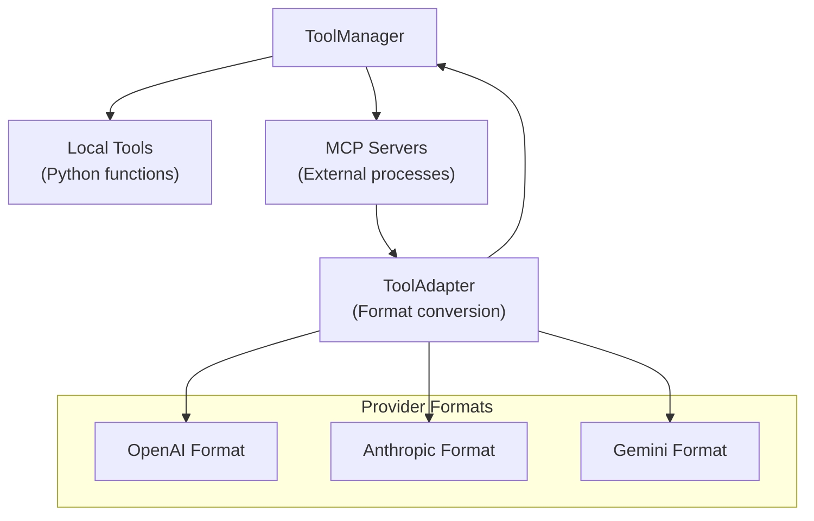

# Tools System Documentation

The LLMgine tools system provides a unified interface for both **local Python functions** and **external MCP (Model Context Protocol) servers**, enabling seamless tool integration across different providers and execution environments.

## Architecture Overview



## Core Components

### 1. ToolManager (`tool_manager.py`)

The central orchestrator that handles both local and MCP tools:

```python
from llmgine.llm.tools.tool_manager import ToolManager

# Initialize with optional chat history integration
tool_manager = ToolManager(chat_history=None)

# Register local Python function
def get_weather(city: str) -> str:
    """Get weather for a city.
    
    Args:
        city: Name of the city
    """
    return f"Weather in {city}: 72°F"

tool_manager.register_tool(get_weather)

# Register MCP server
await tool_manager.register_mcp_server(
    server_name="notion",
    command="python", 
    args=["/path/to/notion_server.py"]
)
```

**Key Features:**
- **Unified Interface**: Single API for local and external tools
- **Provider Agnostic**: Works with OpenAI, Anthropic, and Gemini
- **Graceful Degradation**: MCP features optional, no hard dependencies
- **Async Support**: Full async/await support for tool execution

### 2. MCP Integration (`mcp/`)

#### MCPToolManager (`mcp_tool_manager.py`)
Dedicated manager for MCP server connections:

```python
from llmgine.llm.tools.mcp.mcp_tool_manager import MCPToolManager
from llmgine.llm.tools.mcp.mcp_servers import MCP_SERVERS

client = MCPToolManager(
    engine_id="demo",
    session_id=SessionID("demo"), 
    llm_model_name="gpt-4o-mini"
)

# Connect to configured servers
await client.connect_to_mcp_server([MCP_SERVERS.NOTION])

# Get tools in provider-specific format
tools = await client.get_tools()
```

#### ToolAdapter (`mcp_tool_adapter.py`)
Converts MCP tool schemas to provider-specific formats:

```python
from llmgine.llm.tools.mcp.mcp_tool_adapter import ToolAdapter

adapter = ToolAdapter("gpt-4o-mini")  # Auto-detects OpenAI format
# adapter = ToolAdapter("claude-3-5-sonnet")  # Auto-detects Anthropic format  
# adapter = ToolAdapter("gemini-1.5-pro")     # Auto-detects Gemini format

openai_tools = adapter.convert_tools(mcp_tools)
```

**Provider Detection Logic:**
- `gpt-*`, `o1-*` → OpenAI format
- `claude-*` → Anthropic format
- `gemini-*` → Gemini format
- Unknown models → Defaults to OpenAI format

#### Server Configuration (`mcp_servers.py`)
Central registry for MCP server configurations:

```python
from enum import Enum

class MCP_SERVERS(Enum):
    NOTION = "/path/to/notion/mcp_server.py"
    # Add more servers as needed
```

## Usage Patterns

### 1. Local Tools Only

```python
from llmgine.llm.tools.tool_manager import ToolManager

def calculate(expression: str) -> str:
    """Calculate a mathematical expression.
    
    Args:
        expression: Math expression to evaluate
    """
    return str(eval(expression))

async def search_web(query: str) -> str:
    """Search the web for information.
    
    Args:
        query: Search query
    """
    # Simulate async operation
    await asyncio.sleep(0.1)
    return f"Search results for: {query}"

# Register tools
tool_manager = ToolManager()
tool_manager.register_tool(calculate)
tool_manager.register_tool(search_web)

# Execute tools
from llmgine.llm.tools.toolCall import ToolCall
result = await tool_manager.execute_tool_call(
    ToolCall(id="1", name="calculate", arguments='{"expression": "2+2"}')
)
# Result: "4"
```

### 2. MCP Integration

```python
# With MCP support
tool_manager = ToolManager()

# Register local tools
tool_manager.register_tool(get_weather)

# Register MCP servers  
success = await tool_manager.register_mcp_server(
    server_name="notion",
    command="python",
    args=["/path/to/notion_mcp_server.py"],
    env={"NOTION_API_KEY": "secret"}
)

if success:
    print("MCP server registered successfully")
else:
    print("MCP not available, using local tools only")

# Initialize MCP connections
await tool_manager.initialize_mcp()

# Tools from both local and MCP sources are now available
tools_schema = tool_manager.parse_tools_to_list()
```

### 3. Engine Integration

```python
from llmgine.engines.tool_chat_engine import ToolChatEngine

# Engine automatically creates ToolManager
engine = ToolChatEngine(model="gpt-4o-mini")

# Register local tools
engine.tool_manager.register_tool(get_weather)

# Register MCP server
await engine.tool_manager.register_mcp_server(
    server_name="notion", 
    command="python",
    args=["/path/to/notion_server.py"]
)

# Engine handles tool execution automatically
```

## Installation & Dependencies

### Basic Installation
```bash
pip install -e ".[dev]"  # Core functionality
```

### With MCP Support
```bash
pip install mcp  # Optional MCP dependencies
pip install -e ".[mcp]"  # If MCP extras are defined
```

### MCP Dependency Handling

The system gracefully handles missing MCP dependencies:

```python
# This will work even without MCP installed
tool_manager = ToolManager()

# This will log a warning and return False if MCP not available
success = await tool_manager.register_mcp_server(...)
if not success:
    print("MCP not available, continuing with local tools only")
```

## Error Handling

### Tool Execution Errors
```python
# Tool manager catches and returns error strings
result = await tool_manager.execute_tool_call(
    ToolCall(id="1", name="nonexistent", arguments="{}")
)
# Result: "Error: Tool 'nonexistent' not found"

# Function execution errors are also caught
def failing_tool() -> str:
    raise ValueError("Something went wrong")
    
tool_manager.register_tool(failing_tool)
result = await tool_manager.execute_tool_call(
    ToolCall(id="1", name="failing_tool", arguments="{}")
)
# Result: "Error executing failing_tool: Something went wrong"
```

### MCP Connection Errors
```python
# MCP server registration failures are logged but don't crash
try:
    await tool_manager.register_mcp_server(
        server_name="broken_server",
        command="nonexistent_command",
        args=[]
    )
except Exception as e:
    logger.error(f"MCP server failed: {e}")
    # Application continues with local tools
```

## Advanced Features

### Custom Tool Schema Generation

The system automatically generates tool schemas from function docstrings:

```python
def complex_tool(
    required_param: str,
    optional_param: int = 42,
    flag: bool = False
) -> dict:
    """A complex tool with multiple parameter types.
    
    Args:
        required_param: This parameter is required
        optional_param: This parameter has a default value  
        flag: Boolean flag parameter
        
    Returns:
        Dictionary with results
    """
    return {
        "required": required_param,
        "optional": optional_param, 
        "flag": flag
    }

# Generates appropriate JSON schema for the target provider
```

### Chat History Integration

```python
from llmgine.llm.context.memory import SimpleChatHistory

chat_history = SimpleChatHistory()
tool_manager = ToolManager(chat_history=chat_history)

# ToolManager can convert chat history to litellm message format
messages = tool_manager.chat_history_to_messages()
```

## Migration Guide

### From Old ToolManager

The new ToolManager maintains backward compatibility:

```python
# Old way (still works)
await tool_manager.register_tool_async(func)

# New way (recommended)
tool_manager.register_tool(func)
```

### MCP vs Local Tools

- **Local Tools**: Best for simple, stateless functions
- **MCP Tools**: Best for external integrations (databases, APIs, services)
- **Hybrid**: Use both for maximum flexibility

## Future Enhancements

- [ ] **Tool Caching**: Cache MCP tool schemas for faster startup
- [ ] **Connection Pooling**: Reuse MCP connections across requests  
- [ ] **Health Monitoring**: Monitor MCP server health and auto-reconnect
- [ ] **Tool Discovery**: Dynamic discovery of available MCP servers
- [ ] **Authentication**: Built-in auth handling for MCP servers

---

For implementation examples, see:
- `programs/engines/tool_chat_engine.py` - Full engine with tool integration
- `src/llmgine/llm/tools/mcp/` - MCP implementation details
- `tests/llm/tools/` - Comprehensive test suite