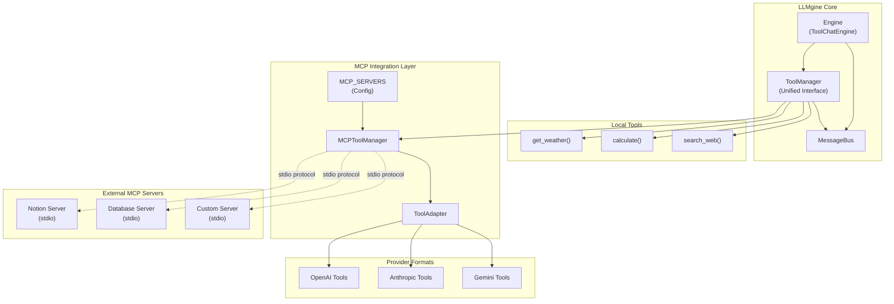
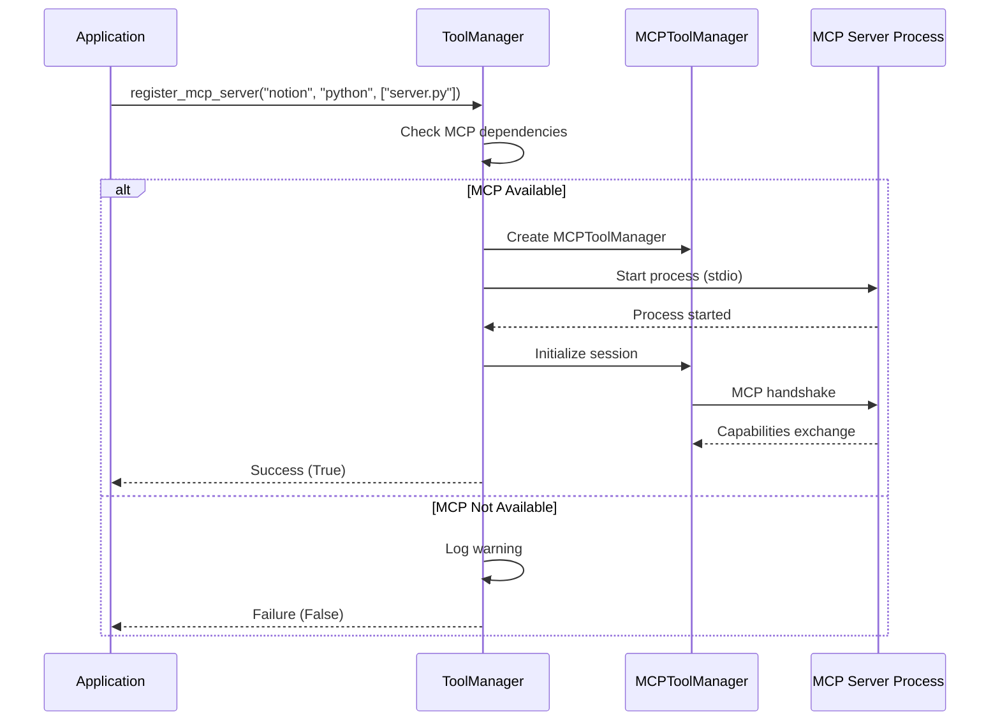
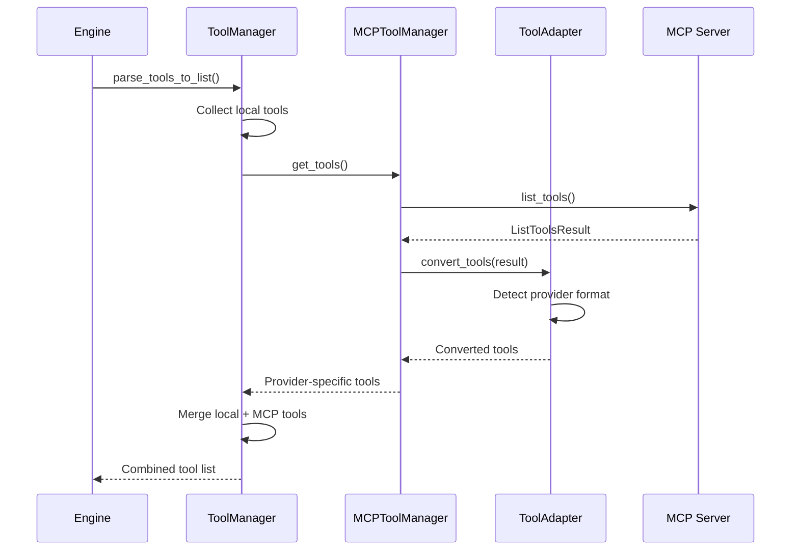
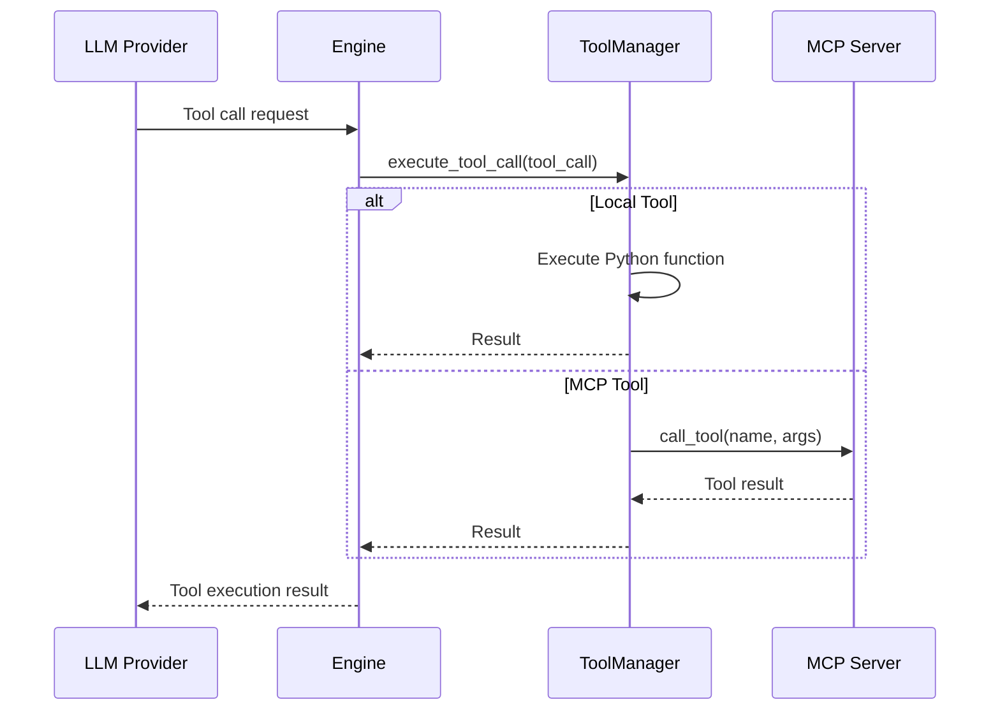

# MCP Integration Architecture

This document describes the Model Context Protocol (MCP) integration architecture in LLMgine, detailing how external tool servers seamlessly integrate with the existing tool system.

## Overview

MCP integration extends LLMgine's tool system to support external tool servers while maintaining backward compatibility and graceful degradation. The architecture follows a **unified interface pattern** where both local Python functions and external MCP servers are accessed through the same `ToolManager` API.

## High-Level Architecture



## Component Architecture

### 1. ToolManager (Unified Interface)

**File**: `src/llmgine/llm/tools/tool_manager.py`

The `ToolManager` serves as the **single source of truth** for all tools, providing a unified interface for:

```python
class ToolManager:
    def __init__(self, chat_history: Optional["SimpleChatHistory"] = None):
        self.tools: Dict[str, Callable] = {}           # Local tools
        self.tool_schemas: List[Dict[str, Any]] = []   # Combined schemas
        self.mcp_clients: Dict[str, Any] = {}          # MCP connections
    
    # Unified interface methods
    def register_tool(self, func: AsyncOrSyncToolFunction) -> None
    async def register_mcp_server(self, server_name: str, command: str, args: List[str]) -> bool
    async def execute_tool_call(self, tool_call: ToolCall) -> Any
    def parse_tools_to_list(self) -> List[Dict[str, Any]]
```

**Key Design Principles:**
- **Single Interface**: Same API for local and MCP tools
- **Graceful Degradation**: MCP features are optional
- **Provider Agnostic**: Works with any LLM provider
- **Backward Compatible**: Existing code continues to work

### 2. MCP Integration Layer

#### MCPToolManager

**File**: `src/llmgine/llm/tools/mcp/mcp_tool_manager.py`

Handles the lifecycle of MCP server connections:

```python
class MCPToolManager:
    def __init__(self, engine_id: str, session_id: SessionID, llm_model_name: str):
        self.tool_adapter = ToolAdapter(llm_model_name)
        self.session: Optional[ClientSession] = None
        self.exit_stack: AsyncExitStack = AsyncExitStack()
    
    async def connect_to_mcp_server(self, servers: list[MCP_SERVERS]) -> None
    async def get_tools(self) -> List[ModelFormattedDictTool]
    async def cleanup(self) -> None
```

**Responsibilities:**
- **Connection Management**: Start/stop MCP server processes
- **Session Handling**: Manage MCP client sessions with proper cleanup
- **Tool Discovery**: Query available tools from connected servers
- **Protocol Handling**: Implement stdio-based MCP communication

#### ToolAdapter

**File**: `src/llmgine/llm/tools/mcp/mcp_tool_adapter.py`

Converts MCP tool schemas to provider-specific formats:

```python
class ToolAdapter:
    def __init__(self, llm_model_name: str):
        self.llm_model_name = llm_model_name
    
    def convert_tools(self, tools: ListToolsResult) -> List[ModelFormattedDictTool]
    def _is_openai_model(self, model: str) -> bool
    def _is_anthropic_model(self, model: str) -> bool  
    def _is_gemini_model(self, model: str) -> bool
```

**Model Detection Logic:**
```python
def _is_openai_model(self, model: str) -> bool:
    openai_prefixes = ["gpt-", "o1-", "text-davinci", "text-curie", "text-babbage", "text-ada"]
    return any(model.startswith(prefix) for prefix in openai_prefixes)

def _is_anthropic_model(self, model: str) -> bool:
    return model.startswith("claude-")

def _is_gemini_model(self, model: str) -> bool:
    return model.startswith("gemini-")
```

**Format Examples:**

*OpenAI Format:*
```json
{
  "type": "function",
  "function": {
    "name": "get_notion_pages",
    "description": "Retrieve pages from Notion database",
    "parameters": {
      "type": "object",
      "properties": {
        "database_id": {"type": "string", "description": "Database ID"}
      },
      "required": ["database_id"]
    }
  }
}
```

*Anthropic Format:*
```json
{
  "type": "function", 
  "function": {
    "name": "get_notion_pages",
    "description": "Retrieve pages from Notion database",
    "input_schema": {
      "type": "object",
      "properties": {
        "database_id": {"type": "string", "description": "Database ID"}
      },
      "required": ["database_id"]
    }
  }
}
```

### 3. Configuration Layer

#### MCP_SERVERS Registry

**File**: `src/llmgine/llm/tools/mcp/mcp_servers.py`

Central configuration for available MCP servers:

```python
class MCP_SERVERS(Enum):
    NOTION = "/path/to/notion/mcp_server.py"
    DATABASE = "/path/to/database/mcp_server.py" 
    CUSTOM = "/path/to/custom/mcp_server.py"
```

**Configuration Pattern:**
- **Centralized**: All server paths in one location
- **Discoverable**: Easy to see what servers are available
- **Extensible**: Add new servers by extending the enum

## Protocol Flow

### 1. Server Registration Flow



### 2. Tool Discovery Flow



### 3. Tool Execution Flow



## Error Handling & Resilience

### 1. Graceful Degradation

The system continues to function even when MCP is unavailable:

```python
# MCP import handling
try:
    from mcp import Client
    from mcp.client.stdio import stdio_client
    mcp_available = True
except ImportError:
    logger.warning("MCP dependencies not available")
    mcp_available = False

# Server registration with fallback
async def register_mcp_server(self, server_name: str, command: str, args: List[str]) -> bool:
    if not mcp_available:
        logger.warning(f"MCP not available. Server '{server_name}' not registered.")
        return False
    
    try:
        # Attempt MCP server registration
        return await self._register_mcp_server_impl(server_name, command, args)
    except Exception as e:
        logger.error(f"Failed to register MCP server '{server_name}': {e}")
        return False
```

### 2. Connection Management

**Resource Cleanup:**
```python
class MCPToolManager:
    def __init__(self):
        self.exit_stack = AsyncExitStack()  # Ensures proper cleanup
    
    async def cleanup(self):
        await self.exit_stack.aclose()  # Closes all MCP connections
```

**Connection Monitoring:**
- Automatic cleanup on session end
- Proper exception handling for connection failures
- Graceful handling of server process crashes

### 3. Tool Execution Errors

```python
async def execute_tool_call(self, tool_call: ToolCall) -> Any:
    try:
        # Tool execution logic
        result = await self._execute_tool(tool_call)
        return result
    except Exception as e:
        # Return error string instead of raising
        return f"Error executing {tool_call.name}: {str(e)}"
```

## Performance Considerations

### 1. Connection Pooling

Currently, each `MCPToolManager` maintains its own connections. Future enhancements may include:
- **Shared Connection Pool**: Reuse connections across tool managers
- **Connection Caching**: Cache idle connections for reuse
- **Health Monitoring**: Monitor connection health and reconnect as needed

### 2. Tool Schema Caching

Tool schemas are currently fetched on each request. Optimization opportunities:
- **Schema Caching**: Cache tool schemas after first fetch
- **Lazy Loading**: Load tool schemas only when needed
- **Incremental Updates**: Update schemas only when server changes

### 3. Async Performance

The system is fully async-compatible:
- **Non-blocking**: MCP operations don't block the event loop
- **Concurrent Execution**: Multiple tools can execute concurrently
- **Resource Management**: Proper async resource cleanup

## Security Considerations

### 1. Process Isolation

MCP servers run as separate processes:
- **Sandboxing**: MCP servers are isolated from main application
- **Process Limits**: Resource limits can be applied to MCP processes
- **Clean Shutdown**: Processes are properly terminated on cleanup

### 2. Input Validation

Tool arguments are validated before execution:
- **JSON Schema**: Arguments validated against tool schemas
- **Type Checking**: Python type hints provide additional validation
- **Error Handling**: Invalid inputs result in error messages, not crashes

### 3. Environment Security

Environment variables are carefully managed:
```python
await tool_manager.register_mcp_server(
    server_name="secure_server",
    command="python",
    args=["/path/to/server.py"],
    env={
        "API_KEY": os.environ.get("SECURE_API_KEY"),  # Pass specific vars only
        "DEBUG": "false"  # Explicit configuration
    }
)
```

## Future Enhancements

### 1. Enhanced MCP Features

- **WebSocket Support**: Beyond stdio protocol
- **Authentication**: Built-in auth for MCP servers
- **Discovery Service**: Automatic server discovery
- **Health Monitoring**: Server health checks and auto-recovery

### 2. Developer Experience

- **MCP CLI**: Command-line tools for MCP server management
- **Schema Validation**: Enhanced schema validation and error reporting
- **Debugging Tools**: Better debugging support for MCP interactions
- **Hot Reload**: Dynamic server registration/deregistration

### 3. Production Features

- **Load Balancing**: Distribute tool calls across multiple server instances
- **Metrics**: Detailed metrics for MCP server performance
- **Tracing**: Distributed tracing across MCP boundaries
- **Configuration Management**: Advanced configuration management

---

## Integration Examples

### Basic MCP Integration

```python
from llmgine.llm.tools.tool_manager import ToolManager
from llmgine.engines.tool_chat_engine import ToolChatEngine

# Create engine with MCP support
engine = ToolChatEngine(model="gpt-4o-mini")

# Register MCP server
await engine.tool_manager.register_mcp_server(
    server_name="notion", 
    command="python",
    args=["/path/to/notion_mcp_server.py"],
    env={"NOTION_API_KEY": "your_api_key"}
)

# Tools from MCP server are now available
# Engine will automatically use them during conversation
```

### Hybrid Local + MCP Tools

```python
def local_calculator(expression: str) -> str:
    """Calculate mathematical expressions locally."""
    return str(eval(expression))

tool_manager = ToolManager()

# Register local tool
tool_manager.register_tool(local_calculator)

# Register MCP server for database operations
await tool_manager.register_mcp_server(
    server_name="database",
    command="python", 
    args=["/path/to/db_server.py"]
)

# Both local and MCP tools available in single interface
tools = tool_manager.parse_tools_to_list()
```

This architecture provides a robust, extensible foundation for integrating external tool servers while maintaining the simplicity and reliability of the existing LLMgine tool system.