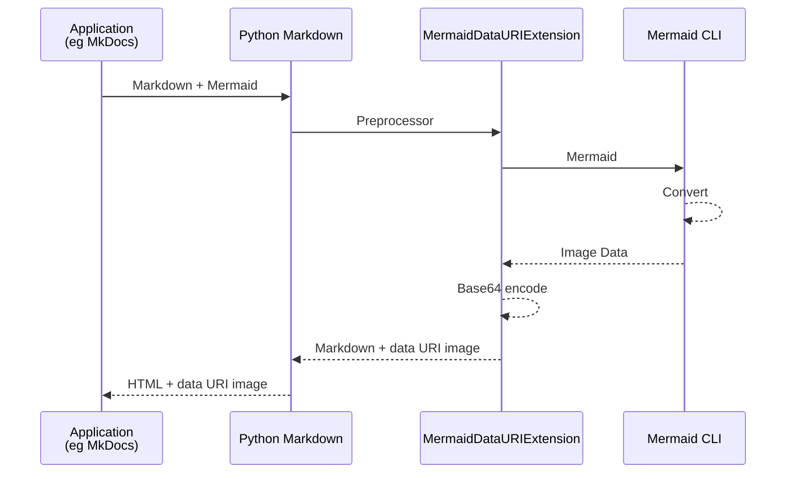

# [markdown-mermaid-cli](https://hkato.github.io/markdown-mermaid-cli/)

[](https://pypi.org/project/markdown-mermaid-cli/)


[Mermaid][mermaid] extension for [Python-Markdown][python-markdown] using [Mermaid-CLI][mermaid-cli].

This extension converts Mermaid diagram code blocks into Base64 encoded [data: URI][data-uri].
This enables PDF generation with tools like [MkDocs to PDF][mkdocs-to-pdf]/[WeasyPrint][wasyprint]
without requiring client-side JavaScript.

## Install

```sh
pip install markdown-mermaid-cli
```

## Requirements

### Mermaid CLI

> Chrome or Chromium is required to run Mermaid-CLI.

```sh
npm install @mermaid-js/mermaid-cli
```

or

```sh
npm install --global @mermaid-js/mermaid-cli
```

## Usage

- code block start with <code>```mermaid</code>
- code block end with <code>```</code>

options:

```markdown
formant=[svg|png] {img attribute}="value" {cli option}="value"`
```

- format (optional): Output image format (defaults to svg)
- img attribute (optional): alt, width, height, class, id, style, title
- cli option (optional): theme, width, height, backgroundColor, svgId, scale (refer to `mmdc -h`)

### [MkDocs][mkdocs] Integration

```yaml
# mkdocs.yml
markdown_extensions:
  - markdown_mermaid_cli
```

### [Pelican][pelican] Integration

```py
# pelicanconf.py
MARKDOWN = {
    'extension_configs': {
        'markdown.extensions.codehilite': {'css_class': 'highlight'},
        'markdown.extensions.extra': {},
        'markdown_mermaid_cli': {},             # Add this
    },
    'output_format': 'html5',
}
```

### Python code

````python
import markdown
from markdown_mermaid_cli import MermaidExtension

markdown_text = """```mermaid
sequenceDiagram
    participant Alice
    participant Bob
    Bob->>Alice: Hi Alice
    Alice->>Bob: Hi Bob
```"""

html_output = markdown.markdown(
    markdown_text, extensions=[MermaidExtension()]
)

print(html_output)
````

```html
<p></p>
```

## Process flow



[mermaid]: https://mermaid.js.org/
[python-markdown]: https://python-markdown.github.io/
[mermaid-cli]: https://github.com/mermaid-js/mermaid-cli
[data-uri]: https://developer.mozilla.org/en-US/docs/Web/URI/Reference/Schemes/data
[mkdocs-to-pdf]: https://mkdocs-to-pdf.readthedocs.io/
[wasyprint]: https://weasyprint.org/
[mkdocs]: https://www.mkdocs.org/
[pelican]: https://getpelican.com/
