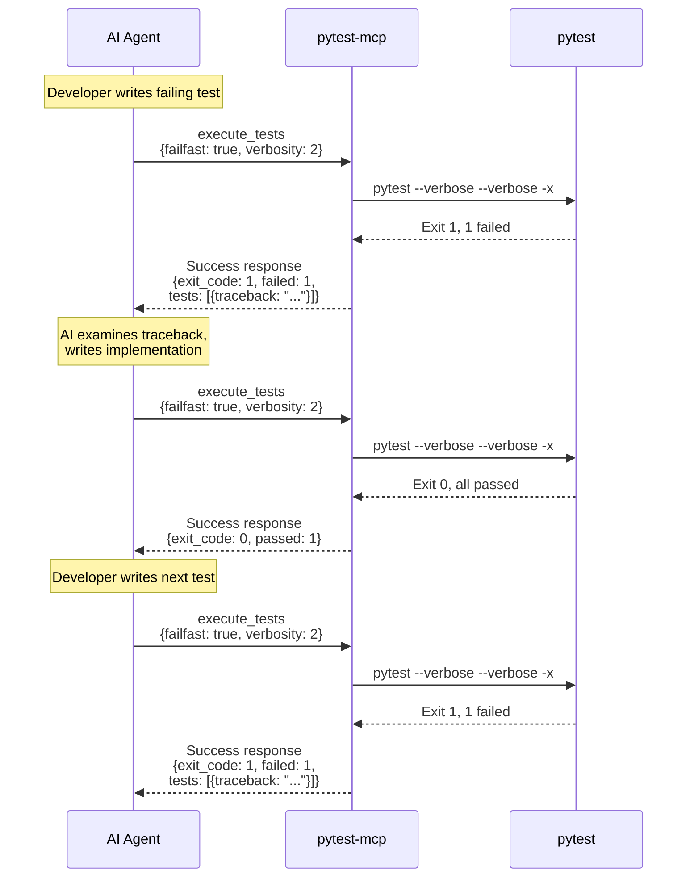
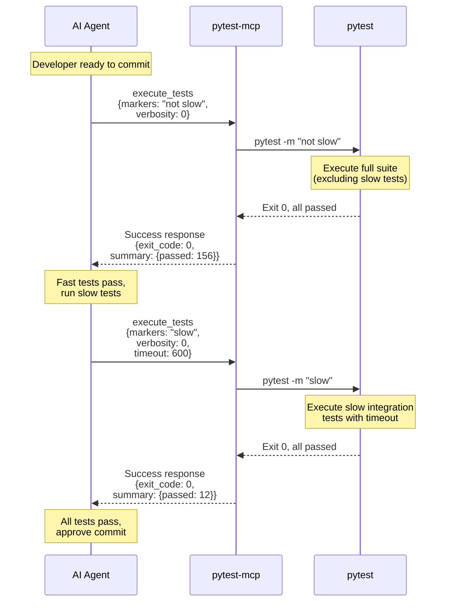
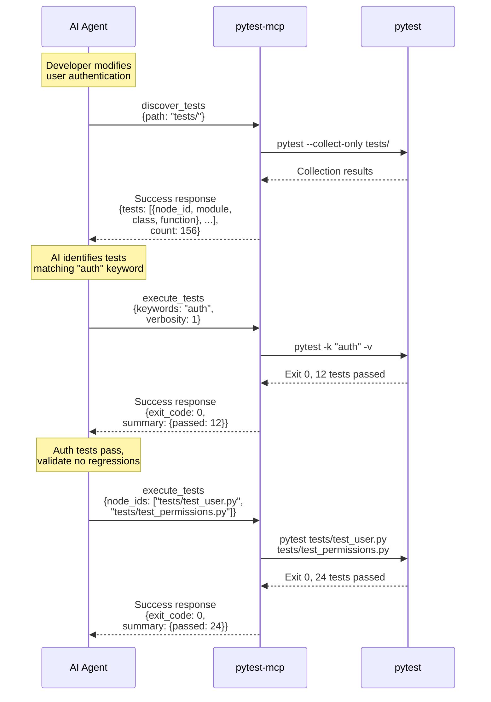
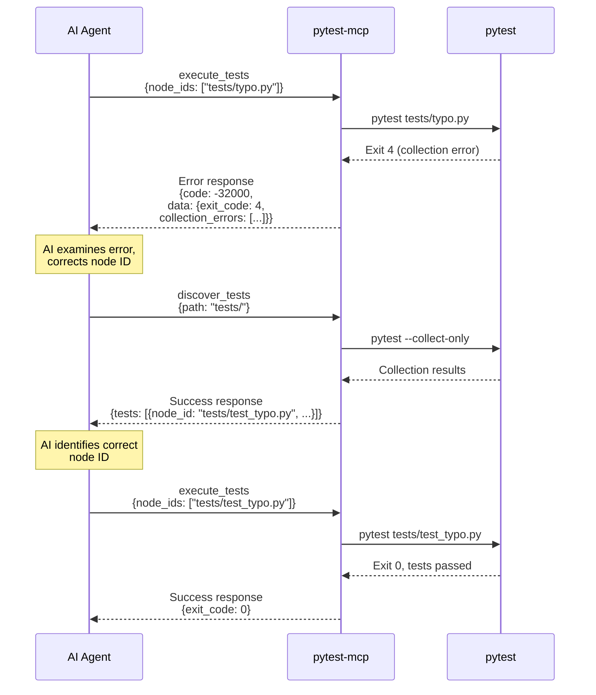

# Style Guide: pytest-mcp

**Document Version:** 1.0
**Date:** October 3, 2025 (Friday)
**Project:** pytest-mcp
**Phase:** 5 - Design System

## Executive Summary

This style guide defines the **protocol design system** for pytest-mcp, an MCP (Model Context Protocol) server. Unlike traditional UI design systems focusing on visual components, this guide establishes patterns for **JSON-RPC protocol interactions**, **data schema structures**, and **response formatting conventions** that enable AI agents to interact with pytest predictably and safely.

**Design Philosophy**: Constraint-based interface design where protocol patterns prevent entire classes of errors by design. AI agents receive consistent, structured responses that optimize parsing efficiency while providing rich debugging context when needed.

**Atomic Design Adaptation**: This guide adapts Brad Frost's Atomic Design methodology to protocol design:
- **Atoms** = Primitive data types and validation rules
- **Molecules** = Reusable schema patterns and parameter groups
- **Organisms** = Complete tool interfaces with full parameter schemas
- **Templates** = Response structure patterns for different execution outcomes
- **Pages** = Complete request-response interaction flows

## Design Principles

### 1. Predictability Through Structure

**WHY**: AI agents must predict response formats without parsing variability.

**WHAT**:
- Every MCP tool returns consistent JSON structure regardless of outcome
- Error responses follow JSON-RPC specification exactly
- Field names never change based on execution context
- Optional fields always present (use `null` for absent values)

**RATIONALE**: Predictable structure eliminates parsing ambiguity. AI agents write parsing logic once and trust it across all interactions. This reduces token waste on defensive parsing code and error handling.

### 2. Security Through Constraint

**WHY**: Prevent attack vectors by design, not detection.

**WHAT**:
- Parameter schemas define exact allowed values
- No string concatenation for command construction
- No arbitrary command execution paths in protocol
- Path validation enforced at schema boundary

**RATIONALE**: Command injection becomes impossible to attempt. No code path exists for arbitrary execution. Security achieved through interface design rather than defensive programming.

**ALTERNATIVES CONSIDERED**:
- Sanitization approach: Detect and block malicious inputs
- **REJECTED**: Detection always incomplete; new attack vectors emerge

### 3. Failure Transparency

**WHY**: Test failures are data, not errors. AI agents need failure details to fix code.

**WHAT**:
- Test failures (exit code 1) return success responses with failure details
- Execution failures (exit codes 2, 3, 4) return JSON-RPC errors
- Maximum diagnostic context in error responses (stdout, stderr, traceback)

**RATIONALE**: Treating test failures as errors hides crucial debugging information in error responses that AI agents may not parse. Success responses with detailed failure data enable AI agents to understand what broke and why.

**ALTERNATIVES CONSIDERED**:
- All failures as errors: Simpler model
- **REJECTED**: Hides test failure details; requires separate failure query

### 4. Token Efficiency with Context Preservation

**WHY**: AI agents operate under token budgets; wasteful responses reduce capability.

**WHAT**:
- Minimal detail for passing tests (~20 tokens each)
- Maximum context for failing tests (~200-500 tokens each)
- Structured data (JSON) for parsing, text output for debugging
- Summary statistics before detailed test array

**RATIONALE**: High pass rate optimizes common case. AI agents scan summary, identify failures, examine detailed failure context. Text output preserves pytest's native formatting for stack traces and assertions.

**TRADE-OFFS**:
- Hybrid format increases response size for failures
- **ACCEPTABLE**: Failures rare; debugging context worth tokens

### 5. Type-First Validation

**WHY**: Catch errors at protocol boundary before subprocess invocation.

**WHAT**:
- Pydantic models encode all parameter constraints
- Runtime validation aligns with static type annotations
- Security rules embedded in Pydantic validators
- Invalid requests rejected before pytest invocation

**RATIONALE**: Parse Don't Validate philosophy. Once parameters pass Pydantic validation, they are proven valid. No defensive checks needed in execution logic.

## Protocol Design Language (Atomic Level)

### Atoms: Primitive Types and Validation Rules

#### String Types

**NodeID** (Primitive: `str`)
- **Purpose**: Identify specific test for execution
- **Format**: `"path/to/test.py::TestClass::test_method"`
- **Validation**: Non-empty, filesystem-safe characters
- **Usage**: Test execution targeting, result identification

**MarkerExpression** (Primitive: `str`)
- **Purpose**: Filter tests by pytest markers
- **Format**: `"not slow and integration"` (boolean expression)
- **Validation**: Valid pytest marker syntax
- **Usage**: Test filtering without collection

**KeywordExpression** (Primitive: `str`)
- **Purpose**: Filter tests by name matching
- **Format**: `"test_user"` (substring match)
- **Validation**: Non-empty string
- **Usage**: Test discovery filtering

**FilePath** (Primitive: `str`)
- **Purpose**: Specify project paths safely
- **Format**: Relative or absolute filesystem path
- **Validation**: No path traversal (`..`), must exist
- **Security**: Prevents directory traversal attacks

**WHY THESE TYPES**: Each primitive enforces specific pytest semantics. Types prevent invalid states at protocol boundary rather than detecting errors during execution.

#### Integer Types

**VerbosityLevel** (Primitive: `int`)
- **Purpose**: Control pytest output detail
- **Range**: `-2` (quietest) to `2` (most verbose)
- **Default**: `0` (normal output)
- **Validation**: Must be in range
- **Usage**: Affects text_output detail in responses

**MaxFailures** (Primitive: `int`)
- **Purpose**: Stop execution after N failures
- **Range**: Positive integer
- **Validation**: `> 0` when present
- **Usage**: Fail-fast execution strategies

**TimeoutSeconds** (Primitive: `int`)
- **Purpose**: Limit execution time
- **Range**: Positive integer (suggested: 300-3600)
- **Validation**: `> 0` when present
- **Usage**: Prevent runaway test executions

**WHY CONSTRAINED RANGES**: Prevent nonsensical values (negative timeout). Explicit ranges serve as executable documentation.

#### Boolean Types

**FailFast** (Primitive: `bool`)
- **Purpose**: Stop on first failure
- **Default**: `false`
- **Usage**: Quick feedback during development
- **Rationale**: Common TDD pattern; AI agents discover first failure, fix, re-run

**ShowCapture** (Primitive: `bool`)
- **Purpose**: Include captured stdout/stderr in output
- **Default**: Determined by verbosity
- **Usage**: Debugging test failures
- **Rationale**: AI agents need print debugging output to understand failures

#### Enum Types

**TestOutcome** (Enum)
- **Values**: `"passed"`, `"failed"`, `"skipped"`, `"error"`
- **Purpose**: Categorize individual test results
- **Usage**: Response serialization
- **Rationale**: Matches pytest's outcome classification exactly

**ExitCode** (Enum)
- **Values**: `0` (all passed), `1` (failures), `2` (interrupted), `3` (internal error), `4` (usage error), `5` (no tests)
- **Purpose**: Semantic test execution outcome
- **Usage**: Response status, error classification
- **Rationale**: Preserves pytest exit code semantics for CI/CD compatibility

**WHY ENUMS**: Finite, well-defined value sets. Enables exhaustive matching in AI agent code.

### Design Rationale: Atoms

**USER NEED**: AI agents require precise parameter types to construct valid requests without trial-and-error.

**ALTERNATIVES**:
- Stringly-typed parameters: Simpler schema
- **REJECTED**: Pushes validation burden to AI agents; error-prone

**CONSISTENCY**: All types follow Python/Pydantic naming conventions. Schema definitions serve as executable documentation.

**ACCESSIBILITY IMPACT**: Clear type constraints reduce cognitive load for developers implementing MCP clients. Explicit validation rules function as specification.

## Schema Patterns (Molecular Level)

### Molecules: Reusable Parameter Groups

#### Test Selection Group

**Purpose**: Encapsulate common test filtering patterns

**Schema Pattern**:
```json
{
  "node_ids": ["path/to/test.py::test_func"],
  "markers": "not slow",
  "keywords": "test_user"
}
```

**Fields**:
- `node_ids` (optional): List of specific tests to execute
- `markers` (optional): Marker expression for filtering
- `keywords` (optional): Keyword expression for name matching

**Validation Rules**:
- At least one field specified (cannot select zero tests intentionally)
- All fields are optional but at least one should have effect
- `node_ids` array must contain valid NodeID strings

**Usage Pattern**: AI agents specify test subset through most appropriate mechanism (specific tests, marker groups, or name patterns).

**WHY THIS PATTERN**: Mirrors pytest's CLI filtering options exactly. AI agents familiar with pytest CLI translate naturally to MCP parameters.

#### Output Control Group

**Purpose**: Manage pytest output verbosity and format

**Schema Pattern**:
```json
{
  "verbosity": 1,
  "show_capture": true,
  "color": false
}
```

**Fields**:
- `verbosity` (optional): Detail level (-2 to 2)
- `show_capture` (optional): Include stdout/stderr captures
- `color` (optional): ANSI color codes in text output

**Validation Rules**:
- `verbosity` must be in range [-2, 2]
- Boolean fields default to sensible values based on verbosity

**Usage Pattern**: AI agents adjust output detail based on workflow phase (discovery vs debugging).

**WHY THIS PATTERN**: Separates output preferences from execution logic. Enables AI agents to request detailed output only when needed, optimizing token usage.

#### Execution Control Group

**Purpose**: Control pytest execution behavior

**Schema Pattern**:
```json
{
  "failfast": true,
  "maxfail": 3,
  "timeout": 300
}
```

**Fields**:
- `failfast` (optional): Stop on first failure
- `maxfail` (optional): Stop after N failures
- `timeout` (optional): Execution time limit in seconds

**Validation Rules**:
- `maxfail` and `failfast` mutually exclusive (failfast = maxfail of 1)
- `timeout` must be positive integer

**Usage Pattern**: AI agents use `failfast` during iterative TDD, remove during full suite validation.

**WHY THIS PATTERN**: Common execution strategies grouped logically. Validation prevents contradictory parameter combinations.

#### Summary Statistics Group

**Purpose**: High-level test execution outcome

**Schema Pattern**:
```json
{
  "total": 42,
  "passed": 38,
  "failed": 2,
  "skipped": 1,
  "errors": 1,
  "duration": 1.234
}
```

**Fields**:
- `total`: Total tests considered
- `passed`: Successfully passed tests
- `failed`: Failed assertion tests
- `skipped`: Skipped tests (decorators, markers)
- `errors`: Tests with execution errors (exceptions before test)
- `duration`: Execution time in seconds

**Validation Rules**:
- `total = passed + failed + skipped + errors`
- All counts non-negative
- Duration non-negative

**Usage Pattern**: AI agents check summary first. If `failed > 0` or `errors > 0`, examine detailed test array.

**WHY THIS PATTERN**: Token-efficient overview before details. AI agents make triage decisions without parsing full results.

#### Test Result Detail Group

**Purpose**: Individual test outcome with failure context

**Schema Pattern (Passing Test)**:
```json
{
  "node_id": "tests/test_user.py::test_login",
  "outcome": "passed",
  "duration": 0.123
}
```

**Schema Pattern (Failing Test)**:
```json
{
  "node_id": "tests/test_user.py::test_login",
  "outcome": "failed",
  "duration": 0.234,
  "message": "AssertionError: assert False",
  "traceback": "Traceback (most recent call last):\n  ..."
}
```

**Fields**:
- `node_id`: Test identifier (always present)
- `outcome`: Test result (always present)
- `duration`: Execution time in seconds (always present)
- `message`: Error message (present for failed/error, null otherwise)
- `traceback`: Full stack trace (present for failed/error, null otherwise)

**Validation Rules**:
- `node_id` must be valid pytest node identifier
- `outcome` must be valid TestOutcome enum value
- `message` and `traceback` null for passed/skipped tests
- `message` and `traceback` non-null for failed/error tests

**Usage Pattern**: AI agents iterate failing tests, examine traceback for debugging clues.

**WHY THIS PATTERN**: Optimizes common case (most tests pass). Passing tests contribute ~20 tokens each. Failing tests provide full debugging context (~200-500 tokens each) for AI analysis.

### Design Rationale: Molecules

**USER NEED**: AI agents construct requests by combining logical parameter groups without understanding every pytest CLI nuance.

**DESIGN ALTERNATIVES**:
- Flat parameter list: Simpler schema
- **REJECTED**: Harder to understand relationships; no logical grouping

**TRADE-OFFS**: Grouped parameters require schema nesting but improve comprehension.

**CONSISTENCY**: All parameter groups align with pytest's conceptual model. Developers familiar with pytest CLI understand MCP parameter mapping immediately.

## Tool Interfaces (Organism Level)

### Organisms: Complete MCP Tools

#### Tool: `execute_tests`

**Purpose**: Execute pytest with validated parameters; return structured results

**Tool Definition**:
```json
{
  "name": "execute_tests",
  "description": "Execute pytest tests with specified parameters. Returns structured results including pass/fail status, error messages, and stack traces. Test failures (exit code 1) return success responses with failure details; execution failures (exit codes 2-4) return error responses.",
  "inputSchema": {
    "type": "object",
    "properties": {
      "node_ids": {
        "type": "array",
        "items": {"type": "string"},
        "description": "Specific test node IDs to execute (e.g., 'tests/test_user.py::test_login')"
      },
      "markers": {
        "type": "string",
        "description": "Pytest marker expression for filtering (e.g., 'not slow and integration')"
      },
      "keywords": {
        "type": "string",
        "description": "Keyword expression for test name matching (e.g., 'test_user')"
      },
      "verbosity": {
        "type": "integer",
        "minimum": -2,
        "maximum": 2,
        "description": "Output verbosity level: -2 (quietest) to 2 (most verbose)"
      },
      "failfast": {
        "type": "boolean",
        "description": "Stop execution on first failure"
      },
      "maxfail": {
        "type": "integer",
        "minimum": 1,
        "description": "Stop execution after N failures"
      },
      "show_capture": {
        "type": "boolean",
        "description": "Include captured stdout/stderr in test output"
      },
      "timeout": {
        "type": "integer",
        "minimum": 1,
        "description": "Execution timeout in seconds"
      }
    },
    "additionalProperties": false
  }
}
```

**Parameter Validation**:
- All parameters optional (defaults to full suite execution)
- `node_ids` array elements must be valid pytest node identifiers
- `markers` must be valid pytest marker expression syntax
- `verbosity` constrained to [-2, 2]
- `failfast` and `maxfail` mutually exclusive
- `timeout` must be positive
- No unrecognized parameters accepted (`additionalProperties: false`)

**Security Constraints**:
- No shell command construction (parameters become list arguments)
- No arbitrary pytest flags (only explicitly permitted parameters)
- No environment variable injection (not exposed as parameter)
- No plugin loading (plugins must be in project environment)

**WHY THIS INTERFACE**: Balances full pytest capability with safety. AI agents access common pytest workflows while constraint-based design prevents exploitation.

**DESIGN ALTERNATIVES**:
- Expose all pytest CLI flags: Maximum flexibility
- **REJECTED**: Increases attack surface; many flags irrelevant to AI workflows

**ACCESSIBILITY**: Parameter names match pytest CLI terminology. Developers familiar with pytest understand parameters immediately without documentation lookup.

#### Tool: `discover_tests`

**Purpose**: Discover test structure without execution

**Tool Definition**:
```json
{
  "name": "discover_tests",
  "description": "Discover pytest test structure without executing tests. Returns hierarchical test organization (modules, classes, functions) with node IDs for subsequent execution.",
  "inputSchema": {
    "type": "object",
    "properties": {
      "path": {
        "type": "string",
        "description": "Directory or file path to discover tests within (default: project root)"
      },
      "pattern": {
        "type": "string",
        "description": "Test file pattern (default: 'test_*.py' or '*_test.py')"
      }
    },
    "additionalProperties": false
  }
}
```

**Parameter Validation**:
- `path` must exist and be within project boundaries
- `pattern` must be valid glob pattern
- No path traversal (`..`) allowed in `path`

**Security Constraints**:
- Path validation prevents directory traversal
- Only test discovery (read-only operation)
- No code execution during collection

**WHY THIS INTERFACE**: Enables AI agents to understand test organization before execution. Supports test-driven workflows where agents discover existing tests before running subset.

**DESIGN ALTERNATIVES**:
- Combined execute/discover tool: Simpler interface
- **REJECTED**: Discovery without execution common pattern; separate tools clearer

**USER NEED**: AI agents explore test suite structure before deciding which tests to execute. Separate discovery phase enables more intelligent test selection.

### Design Rationale: Organisms

**CONSISTENCY**: Both tools follow MCP tool definition standards. Parameter schemas use JSON Schema vocabulary for maximum compatibility.

**ACCESSIBILITY**: Tool names (`execute_tests`, `discover_tests`) immediately communicate purpose. Descriptions provide essential context without requiring external documentation.

**TRADE-OFFS**:
- Two tools vs one combined tool: Slight complexity increase
- **ACCEPTABLE**: Separation of concerns clearer; discovery common standalone operation

## Response Structures (Template Level)

### Templates: Response Format Patterns

#### Template: Successful Test Execution

**Scenario**: pytest executes successfully; tests may pass or fail

**Exit Codes**: 0 (all passed), 1 (some failed), 5 (no tests collected)

**Response Structure**:
```json
{
  "exit_code": 1,
  "summary": {
    "total": 42,
    "passed": 38,
    "failed": 2,
    "skipped": 1,
    "errors": 1,
    "duration": 1.234
  },
  "tests": [
    {
      "node_id": "tests/test_user.py::test_login_success",
      "outcome": "passed",
      "duration": 0.123
    },
    {
      "node_id": "tests/test_user.py::test_login_failure",
      "outcome": "failed",
      "duration": 0.234,
      "message": "AssertionError: assert response.status_code == 401",
      "traceback": "Traceback (most recent call last):\n  File \"tests/test_user.py\", line 42, in test_login_failure\n    assert response.status_code == 401\nAssertionError: assert 500 == 401"
    }
  ],
  "json_report": {
    "...": "Full pytest-json-report output"
  },
  "text_output": "============================= test session starts ==============================\n...",
  "collection_errors": []
}
```

**Field Specifications**:
- `exit_code`: pytest exit code (0, 1, or 5)
- `summary`: Aggregated test statistics (Summary Statistics Group)
- `tests`: Array of individual test results (Test Result Detail Group)
- `json_report`: Complete pytest-json-report plugin output (when available)
- `text_output`: pytest's native text output (preserves formatting)
- `collection_errors`: Array of test collection errors (empty when collection succeeds)

**Token Efficiency**:
- Summary: ~50 tokens
- Passing test: ~20 tokens each
- Failing test: ~200-500 tokens each
- Text output: Variable (captures pytest native output)

**AI Agent Usage Pattern**:
1. Check `summary.failed` and `summary.errors`
2. If non-zero, examine `tests` array for failed/error tests
3. Parse `message` and `traceback` for failure analysis
4. Optionally examine `text_output` for additional context

**WHY THIS STRUCTURE**:
- Summary-first enables quick triage
- Hybrid JSON+text preserves structured data AND native pytest formatting
- Failure-focused detail optimizes token usage for common case (high pass rate)

**DESIGN ALTERNATIVES**:
- JSON-only: More structured, harder to read tracebacks
- Text-only: AI-friendly formatting but harder to parse programmatically
- **HYBRID CHOSEN**: Best of both worlds; structured data for parsing, native text for debugging

**ACCESSIBILITY**: Structure mirrors pytest's conceptual model. Developers understand response by recognizing familiar pytest output patterns.

#### Template: Execution Failure

**Scenario**: pytest execution fails (crashes, timeout, invalid usage)

**Exit Codes**: 2 (interrupted), 3 (internal error), 4 (usage error), timeout

**Response Structure**:
```json
{
  "error": {
    "code": -32000,
    "message": "Test execution failed: pytest internal error",
    "data": {
      "exit_code": 3,
      "stdout": "...",
      "stderr": "INTERNALERROR> ...",
      "timeout_exceeded": false,
      "command": ["pytest", "tests/", "-v"],
      "duration": 0.234
    }
  }
}
```

**Field Specifications**:
- `error.code`: JSON-RPC error code (-32000 for execution failures)
- `error.message`: Human-readable error summary
- `error.data.exit_code`: pytest exit code (2, 3, or 4)
- `error.data.stdout`: Captured standard output
- `error.data.stderr`: Captured standard error (contains diagnostic info)
- `error.data.timeout_exceeded`: Whether timeout caused failure
- `error.data.command`: Exact command executed (for reproduction)
- `error.data.duration`: Time spent before failure

**AI Agent Usage Pattern**:
1. Detect error response (no `result` field)
2. Examine `error.code` to classify failure
3. Parse `error.data.stderr` for pytest error diagnostics
4. Examine `error.data.command` to understand what was attempted
5. Consider retry with different parameters or report to user

**WHY THIS STRUCTURE**:
- JSON-RPC standard compliance for MCP protocol
- Maximum diagnostic context enables debugging without re-execution
- `command` field enables AI agents to reproduce issue

**DESIGN ALTERNATIVES**:
- Minimal error messages: Reduced token usage
- **REJECTED**: Insufficient context for AI agents to diagnose; requires follow-up queries

**TRADE-OFFS**:
- Verbose error responses: Higher token cost for failures
- **ACCEPTABLE**: Failures rare; diagnostic context worth token cost

**RATIONALE**: When execution fails, AI agents need complete context to determine root cause (invalid parameters, pytest bug, project configuration issue). Minimal error messages force AI agents to guess or re-execute with modified parameters.

#### Template: Validation Failure

**Scenario**: MCP request parameters fail Pydantic validation

**Response Structure**:
```json
{
  "error": {
    "code": -32602,
    "message": "Invalid params",
    "data": {
      "field": "verbosity",
      "detail": "value must be between -2 and 2",
      "received_value": 10
    }
  }
}
```

**Field Specifications**:
- `error.code`: -32602 (JSON-RPC invalid params code)
- `error.message`: Standard JSON-RPC invalid params message
- `error.data.field`: Parameter name that failed validation
- `error.data.detail`: Validation failure reason
- `error.data.received_value`: Value that failed validation

**AI Agent Usage Pattern**:
1. Detect -32602 error code
2. Examine `error.data.field` to identify problematic parameter
3. Read `error.data.detail` for constraint information
4. Correct parameter value and retry

**WHY THIS STRUCTURE**:
- Field-level validation errors enable precise correction
- Received value included for AI agent's reference
- JSON-RPC standard compliance

**DESIGN ALTERNATIVES**:
- Generic "invalid parameters" error: Simpler
- **REJECTED**: Forces AI agents to guess which parameter incorrect

**ACCESSIBILITY**: Field-level errors function as interactive documentation. AI agents learn parameter constraints through error responses.

#### Template: Successful Test Discovery

**Scenario**: Test discovery completes successfully

**Response Structure**:
```json
{
  "tests": [
    {
      "node_id": "tests/test_user.py::TestUserAuth::test_login",
      "module": "tests.test_user",
      "class": "TestUserAuth",
      "function": "test_login",
      "file": "tests/test_user.py",
      "line": 42
    }
  ],
  "count": 1,
  "collection_errors": []
}
```

**Field Specifications**:
- `tests`: Array of discovered test items
  - `node_id`: pytest node identifier (for execution targeting)
  - `module`: Python module path
  - `class`: Test class name (null for function-based tests)
  - `function`: Test function name
  - `file`: Source file path
  - `line`: Line number in source file
- `count`: Total tests discovered
- `collection_errors`: Collection warnings/errors (empty when clean)

**AI Agent Usage Pattern**:
1. Iterate `tests` array to understand test organization
2. Identify relevant tests by module/class/function name
3. Use `node_id` values for targeted execution
4. Check `collection_errors` for configuration issues

**WHY THIS STRUCTURE**:
- Hierarchical organization mirrors pytest's model
- Node IDs directly usable in `execute_tests` calls
- Source location (file, line) enables code navigation

**DESIGN ALTERNATIVES**:
- Flat list of node IDs: Simpler
- **REJECTED**: No context about test organization; harder to filter

**USER NEED**: AI agents explore test suite structure to select relevant tests. Hierarchical structure enables filtering by module, class, or function patterns.

#### Template: Test Discovery with Collection Errors

**Scenario**: Test discovery encounters collection errors (syntax errors, import failures) but successfully discovers some tests

**Response Structure**:
```json
{
  "tests": [
    {
      "node_id": "tests/test_valid.py::test_one",
      "module": "tests.test_valid",
      "class": null,
      "function": "test_one",
      "file": "tests/test_valid.py",
      "line": 5
    },
    {
      "node_id": "tests/test_valid.py::test_two",
      "module": "tests.test_valid",
      "class": null,
      "function": "test_two",
      "file": "tests/test_valid.py",
      "line": 9
    }
  ],
  "count": 2,
  "collection_errors": [
    {
      "file": "tests/test_broken.py",
      "error_type": "SyntaxError",
      "message": "invalid syntax (test_broken.py, line 10)",
      "line": 10,
      "traceback": "  File \"tests/test_broken.py\", line 10\n    def test_foo(\n               ^\nSyntaxError: invalid syntax"
    },
    {
      "file": "tests/test_import_fail.py",
      "error_type": "ImportError",
      "message": "cannot import name 'NonExistent' from 'mymodule'",
      "line": null,
      "traceback": "ImportError: cannot import name 'NonExistent' from 'mymodule' (/path/to/mymodule.py)"
    }
  ]
}
```

**Collection Error Object Structure**:
- `file`: Source file path where collection error occurred
- `error_type`: Error classification ("SyntaxError", "ImportError", "CollectionError", etc.)
- `message`: Human-readable error description
- `line`: Line number where error occurred (null if not available)
- `traceback`: Full traceback text for diagnostic purposes (null if not available)

**Field Specifications**:
- `count`: Reflects **only successfully discovered tests** (excludes files with collection errors)
- `collection_errors`: Array of structured error objects (empty when discovery succeeds cleanly)
- Each error object provides actionable diagnostic information

**AI Agent Usage Pattern**:
1. Check `collection_errors` array first to identify broken test files
2. Use `file` and `line` fields to locate exact source of error
3. Examine `traceback` for detailed diagnostic context
4. Take autonomous corrective action based on `error_type`:
   - SyntaxError → fix syntax at specified line
   - ImportError → resolve import or add missing dependency
   - CollectionError → fix pytest configuration or test structure
5. Proceed with discovered tests in `tests` array after addressing errors

**WHY THIS STRUCTURE**:
- **Parse Don't Validate**: Collection errors are data, not failures. Response succeeds even with errors, enabling AI agents to process partial results
- **Autonomous Correction**: Structured error objects (file, line, type) enable AI agents to fix issues without human intervention
- **Diagnostic Completeness**: Full traceback preserves all pytest diagnostic information for complex error scenarios
- **Count Accuracy**: `count` field reflects usable tests, preventing AI agents from expecting tests that don't exist

**DESIGN ALTERNATIVES**:
- Fail entire request on collection error: Simpler
- **REJECTED**: Prevents AI agents from working with partial test suite; blocks autonomous error correction
- Plain text error messages without structure: Simpler
- **REJECTED**: Forces AI agents to parse text, reducing reliability of autonomous fixes

**USER NEED**: AI agents must autonomously diagnose and fix test collection errors during development. Structured error objects with file/line/type enable precise corrective actions without human intervention.

**CONSISTENCY**: Error structure mirrors validation error pattern (field-level details, actionable information) established in "Validation Errors as Structured Data" section.

### Design Rationale: Templates

**CONSISTENCY**: All response structures follow JSON-RPC 2.0 specification. Success responses have `result` field; errors have `error` field.

**ACCESSIBILITY**: Response structures mirror pytest's conceptual model. Fields use pytest terminology (`node_id`, `markers`, `outcome`) for immediate recognition.

**TRADE-OFFS**:
- Hybrid JSON+text format: Larger responses
- **ACCEPTABLE**: Structured data enables programmatic parsing; text output preserves pytest native formatting for debugging

## Complete Interactions (Page Level)

### Pages: Full Request-Response Flows

#### Page: Iterative TDD Workflow

**User Journey**: AI agent runs tests repeatedly during test-driven development

**Interaction Flow**:



**Context Preservation**: No context maintained between requests (stateless). Each request independent.

**Decision Points**:
- AI checks `exit_code`: 0 → proceed to next test; 1 → examine failure
- AI checks `summary.failed`: 0 → all passing; >0 → analyze failures

**Token Budget**:
- Request: ~50 tokens (tool call + parameters)
- Response (passing): ~100 tokens (summary + minimal test details)
- Response (failing): ~300-600 tokens (summary + failure traceback)

**WHY THIS FLOW**:
- `failfast: true` stops on first failure (common TDD pattern)
- High verbosity provides debugging context
- Stateless design enables rapid iteration

**USER NEED**: AI agents execute tests frequently during development. Fast feedback loop essential. Fail-fast mode provides immediate failure context without waiting for full suite.

#### Page: Full Suite Validation

**User Journey**: AI agent validates complete test suite before commit/push

**Interaction Flow**:



**Context Preservation**: No state between fast and slow test execution. Each request independent.

**Decision Points**:
- AI checks fast tests first (rapid feedback)
- If fast tests pass, AI proceeds to slow tests
- If any tests fail, AI blocks commit

**Token Budget**:
- Two requests required (fast + slow markers)
- Each response ~100-200 tokens (minimal verbosity, all passing)
- Total ~400 tokens for full validation

**WHY THIS FLOW**:
- Marker-based filtering separates fast/slow tests
- Timeout prevents runaway slow tests
- Minimal verbosity optimizes tokens (failures rare)

**USER NEED**: AI agents validate complete test suite before allowing commit. Two-phase approach (fast tests first) provides rapid feedback. If fast tests fail, skip slow tests to avoid waste.

**ALTERNATIVES**:
- Single execution with all tests: Simpler
- **REJECTED**: Slow tests delay feedback; fast tests sufficient for most validation

#### Page: Test Discovery and Targeted Execution

**User Journey**: AI agent discovers tests, selects subset, executes specific tests

**Interaction Flow**:



**Context Preservation**: Discovery results NOT cached. Each request independent. AI agent maintains test list in its context if needed.

**Decision Points**:
- AI discovers all tests to understand organization
- AI filters by keyword or node ID based on code changes
- AI executes related tests to validate no regressions

**Token Budget**:
- Discovery: ~2000 tokens (156 tests × ~12 tokens each)
- Keyword execution: ~100 tokens (summary, passing tests)
- Targeted execution: ~150 tokens (summary, passing tests)
- Total: ~2250 tokens for discovery + validation

**WHY THIS FLOW**:
- Discovery enables intelligent test selection
- Keyword filtering based on semantic relevance
- Targeted node ID execution for specific modules

**USER NEED**: AI agents understand test organization before execution. Discovery phase enables context-aware test selection rather than executing entire suite blindly.

**ALTERNATIVES**:
- Execute all tests every time: Simpler
- **REJECTED**: Wasteful for large suites; developer modifies small subset

#### Page: Error Handling and Recovery

**User Journey**: AI agent encounters execution failure, diagnoses issue, retries

**Interaction Flow**:



**Error Recovery Strategy**:
1. AI receives error response with diagnostic context
2. AI examines `error.data.stderr` for pytest error details
3. AI uses `discover_tests` to identify correct node IDs
4. AI retries with corrected parameters

**Token Budget**:
- Error response: ~300 tokens (full diagnostic context)
- Discovery: ~2000 tokens (full test list)
- Successful retry: ~100 tokens
- Total: ~2400 tokens for error + recovery

**WHY THIS FLOW**:
- Error responses include full diagnostic context (no need to re-execute for diagnostics)
- Discovery enables AI to correct mistakes (typo in node ID)
- Stateless design permits immediate retry after correction

**USER NEED**: AI agents make mistakes (typos, wrong node IDs). Rich error diagnostics enable self-correction without human intervention.

**ACCESSIBILITY**: Error messages use pytest's native terminology. AI agents familiar with pytest understand diagnostics immediately.

### Design Rationale: Pages

**CONSISTENCY**: All workflows follow request-response pattern. No hidden state between requests. AI agents predict behavior from protocol structure.

**ACCESSIBILITY**: Workflows mirror human pytest usage patterns. AI agents trained on pytest documentation understand flows naturally.

**TRADE-OFFS**:
- Stateless design requires test discovery per session: Slight overhead
- **ACCEPTABLE**: Discovery fast (~100ms); caching complexity not worth benefit

**USER NEED**: AI agents execute pytest in diverse workflows (TDD iteration, full validation, targeted execution, error recovery). Protocol supports all patterns through composable tool calls.

## Accessibility Requirements

### Protocol Accessibility (Analogous to WCAG)

#### Clear Semantics

**Requirement**: Every parameter and response field has unambiguous meaning

**Implementation**:
- Parameter names match pytest CLI terminology exactly
- Field descriptions specify format, constraints, and usage
- Enum values explicitly defined (no implicit semantics)

**Rationale**: AI agents lack human intuition. Explicit semantics prevent misinterpretation.

**WCAG Analog**: Screen reader semantic markup (ARIA labels)

#### Predictable Structure

**Requirement**: Response structures never change based on context

**Implementation**:
- Optional fields always present (use `null` for absent)
- Field names constant regardless of execution outcome
- Array structures consistent (empty array vs null)

**Rationale**: AI agents generate parsing code once and trust structure permanence.

**WCAG Analog**: Consistent navigation patterns

#### Error Recovery Support

**Requirement**: Error responses provide sufficient context for correction

**Implementation**:
- Field-level validation errors identify problematic parameter
- Execution errors include full diagnostic output
- Error data includes attempted command for reproduction

**Rationale**: AI agents self-correct without human intervention when errors descriptive.

**WCAG Analog**: Error identification and description (WCAG 3.3.1, 3.3.3)

#### Complete Documentation in Schema

**Requirement**: Tool schemas self-documenting without external references

**Implementation**:
- Parameter descriptions specify format and constraints
- Tool descriptions explain purpose and usage
- Examples embedded in schema (future enhancement)

**Rationale**: AI agents discover tools through MCP protocol. Schema must be comprehensible without README.

**WCAG Analog**: Labels and instructions (WCAG 3.3.2)

#### Token Efficiency

**Requirement**: Response size proportional to information value

**Implementation**:
- Summary statistics before detailed arrays
- Minimal detail for passing tests (~20 tokens)
- Maximum context for failing tests (~200-500 tokens)

**Rationale**: AI agents operate under token budgets. Wasteful responses reduce capability.

**WCAG Analog**: Resize/zoom content usability (WCAG 1.4.4)

## Implementation Guidelines

### For MCP Server Implementers

**DO**:
- Use Pydantic for all parameter validation
- Return consistent JSON structure regardless of outcome
- Include full diagnostic context in error responses
- Preserve pytest exit code semantics exactly
- Validate paths to prevent directory traversal
- Use subprocess list arguments (never `shell=True`)

**DON'T**:
- Cache test discovery results (stateless design)
- Modify response structure based on execution outcome
- Truncate error messages or tracebacks
- Add arbitrary pytest flags without security review
- Assume parameters valid without Pydantic validation
- Use string concatenation for command construction

### For AI Agent Implementers

**DO**:
- Check `summary.failed` and `summary.errors` before parsing test array
- Use `failfast: true` during iterative TDD for rapid feedback
- Examine `traceback` field for failure analysis
- Parse `text_output` when structured data insufficient
- Use `discover_tests` to understand test organization before targeted execution

**DON'T**:
- Assume all tests pass if `exit_code == 0` (check summary)
- Treat test failures (exit code 1) as errors
- Parse only JSON report (text output provides additional context)
- Execute full suite blindly (use markers/keywords/node_ids for filtering)
- Skip error diagnostic parsing (enables self-correction)

## Design Evolution and Future Enhancements

### Potential Extensions

**Streaming Results** (Future):
- Long-running test suites could stream results incrementally
- Requires MCP protocol streaming support
- Enables real-time progress updates

**Test History** (Future):
- Optional test execution history storage
- Requires opt-in persistent state
- Enables flaky test detection

**Coverage Integration** (Future):
- Include coverage data in responses
- Requires pytest-cov plugin integration
- Enables coverage-guided test selection

**Performance Benchmarking** (Future):
- Track test duration trends
- Requires persistent storage
- Enables regression detection

### Design Constraints for Extensions

**Stateless Design Preservation**: All extensions must maintain stateless request-response model. Persistent storage must be opt-in and external to core protocol.

**Security Posture**: No extensions may introduce arbitrary command execution. All parameters must validate through Pydantic schemas.

**Token Efficiency**: Extensions must not inflate response sizes for users not using feature. Optional fields should be request-controlled.

---

## Summary

This style guide establishes pytest-mcp's protocol design system using Atomic Design methodology adapted for JSON-RPC interfaces:

- **Atoms**: Primitive types and validation rules ensuring parameter correctness
- **Molecules**: Reusable parameter groups and response patterns
- **Organisms**: Complete MCP tool interfaces with security constraints
- **Templates**: Response structure patterns for different execution outcomes
- **Pages**: Complete request-response workflows for common AI agent tasks

**Design Philosophy**: Security through constraint, predictability through structure, efficiency through failure-focused detail. AI agents interact with pytest safely and consistently through an opinionated interface that prevents entire classes of errors by design.

**Alignment with Project Goals**:
- **Consistency** (NFR): Structured MCP responses enable predictable AI agent behavior
- **Security** (NFR): Constraint-based interface prevents command injection by design
- **Cognitive Load** (NFR-6): Clear protocol semantics reduce AI agent implementation complexity
- **TRACE Framework**: Type-first validation, atomic request-response, essential-only parameters

All design decisions documented with rationale, alternatives considered, and trade-offs evaluated. Protocol patterns support AI-assisted TDD workflows while maintaining security, consistency, and token efficiency.
