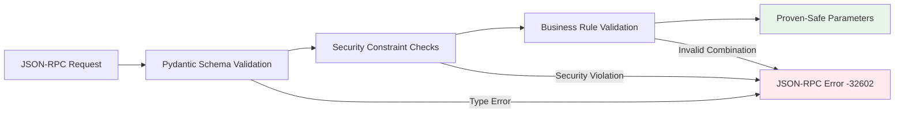
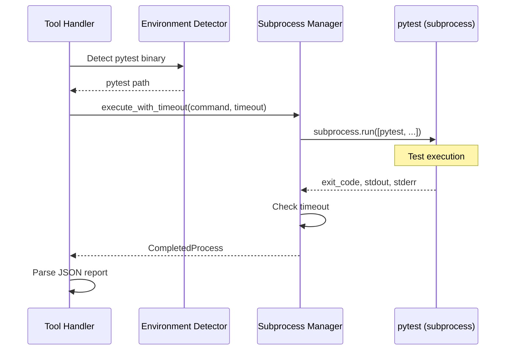
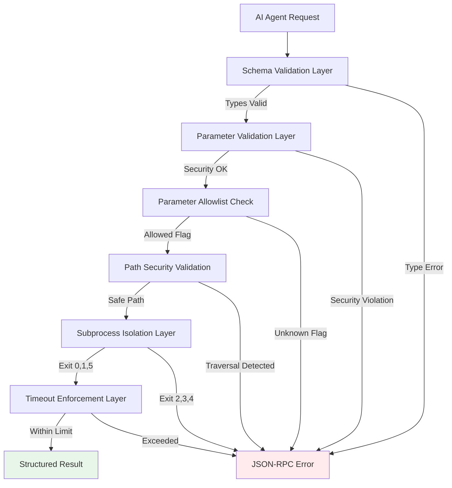
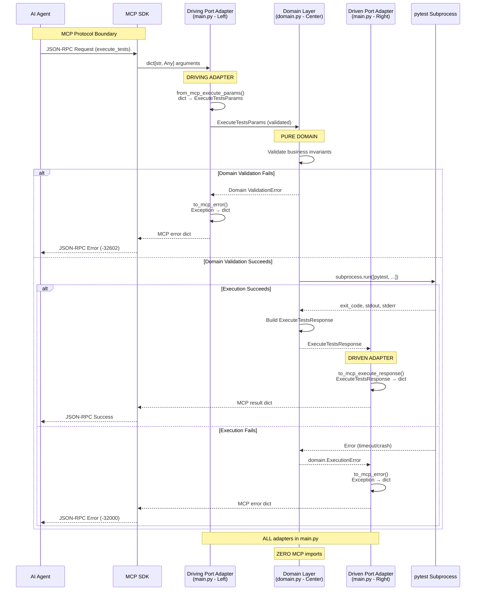

# Architecture: pytest-mcp

**Document Version:** 1.2
**Date:** October 5, 2025 (Sunday) - Re-synthesized with comprehensive ADR-013
**Project:** pytest-mcp
**Phase:** 4 - Architecture Synthesis

## Executive Summary

pytest-mcp is a **stateless MCP (Model Context Protocol) server** that provides AI agents with a secure, structured interface for pytest test execution. The architecture eliminates the need for AI agents to have arbitrary shell access by offering an opinionated, constraint-based interface that prevents entire classes of security vulnerabilities by design.

**Core Architectural Pattern**: Comprehensive Hexagonal Architecture with bidirectional adapters at ALL MCP protocol boundaries. The system maintains strict separation between driving ports (inbound MCP requests), the pure domain core, and driven ports (outbound MCP responses).

**Key Principles**:
1. **Stateless Request-Response**: Zero persistent state; each operation independent and self-contained
2. **Security Through Constraint**: Structured parameters and validation prevent command injection attacks
3. **Process Isolation**: pytest executes in subprocess for crash resilience and version independence
4. **Bidirectional Adapter Pattern**: ALL MCP interactions require explicit adapter pairs for type translation
5. **Failure Transparency**: Test failures are data (success responses); execution failures are errors
6. **Domain Purity**: Test execution domain has zero knowledge of MCP SDK; ALL protocol concerns isolated in adapters

## System Overview

```mermaid
graph TB
    AI[AI Agent<br/>Claude, etc.]
    SDK[MCP SDK<br/>stdio Transport]
    DrivingAdapters[Driving Port Adapters<br/>from_mcp_* functions<br/>main.py - Left Side]
    DrivenAdapters[Driven Port Adapters<br/>to_mcp_* functions<br/>main.py - Right Side]
    Domain[Domain Workflow Functions<br/>domain.py - Pure Domain Core]
    Validation[Domain Type Validation<br/>Frozen Pydantic Models]
    Subprocess[pytest Subprocess<br/>Isolated Execution]
    Results[Domain Response Types<br/>Structured Results]

    AI -->|JSON-RPC over stdio| SDK
    SDK -->|dict[str, Any]<br/>Raw MCP Arguments| DrivingAdapters
    DrivingAdapters -->|ExecuteTestsParams<br/>DiscoverTestsParams<br/>Domain Types| Domain
    Domain -->|Type Validation| Validation
    Validation -->|Valid Domain Types| Domain
    Domain -->|Invoke pytest| Subprocess
    Subprocess -->|Exit Code + Output| Domain
    Domain -->|ExecuteTestsResponse<br/>DiscoverTestsResponse<br/>Domain Types| Results
    Results -->|Domain Response Types| DrivenAdapters
    DrivenAdapters -->|dict[str, Any]<br/>mcp.types.Tool<br/>Protocol Types| SDK
    SDK -->|JSON-RPC Response| AI

    style SDK fill:#e1f5ff
    style DrivingAdapters fill:#fff9c4
    style DrivenAdapters fill:#fff9c4
    style Domain fill:#e8f5e9
    style Validation fill:#fff4e1
    style Subprocess fill:#f0f0f0
    style Results fill:#e8f5e9
```

**Business Value**: Enables reliable AI-assisted TDD workflows by ensuring test execution behaves consistently across all AI interactions while eliminating security concerns from arbitrary shell command access.

## Core Architectural Principles

The architecture synthesizes thirteen architectural decisions (ADRs 001, 002, 004-013) into a unified system design guided by these foundational principles:

### 1. Stateless Protocol Adapter Pattern

**Source**: ADR-002 (Stateless Architecture)

The system operates as a stateless protocol adapter with **zero persistent state**. Each MCP tool invocation is completely independent:

- **No Session State**: Each request contains all necessary context
- **No Caching**: Test discovery and execution results never persisted
- **No History**: Server maintains no execution history or analytics
- **Operational Resilience**: Server restarts have no impact on correctness

**Rationale**: pytest itself is stateless. Introducing state in the MCP layer would create impedance mismatch without benefit. Stateless design eliminates entire classes of bugs (race conditions, stale cache, memory leaks) and enables trivial horizontal scaling.

### 2. Security Through Constraint

**Source**: ADR-008 (Security Model), ADR-005 (Parameter Validation)

Security is achieved through **constraint-based interface design** rather than defensive programming:

- **No Shell Access**: AI agents cannot execute arbitrary commands
- **Structured Parameters Only**: Type-safe, validated parameters defined in schemas
- **Parameter Allowlisting**: Only explicitly permitted pytest flags accepted
- **Path Validation**: Traversal attacks prevented at validation boundary
- **Process Isolation**: pytest crashes cannot affect server stability

**Attack Prevention by Design**: Command injection is impossible to attempt, not just detected and blocked. No code path exists for arbitrary command execution.

### 3. Process Boundary for Isolation

**Source**: ADR-004 (pytest Subprocess Integration)

pytest executes in isolated subprocess, never in-process:

- **Crash Isolation**: pytest failures cannot crash MCP server
- **Version Independence**: Each project uses its own pytest version
- **Environment Isolation**: Project dependencies never conflict with server
- **Security Boundary**: Untrusted test code cannot access server internals
- **Resource Control**: Timeouts and future resource limits enforceable

**Trade-off Accepted**: 10-50ms subprocess spawn overhead worth isolation benefits. Test execution time dominates; spawn overhead negligible.

### 4. Type-First Validation

**Source**: ADR-005 (Parameter Validation Strategy)

Pydantic models enforce correctness at MCP request boundaries:

- **Declarative Validation**: Parameter contracts serve as executable documentation
- **Type Safety**: Static checking (mypy) + runtime validation (Pydantic)
- **Security Boundaries**: Path traversal and injection attacks prevented before subprocess invocation
- **Structured Errors**: Validation failures map to JSON-RPC error responses with field-level detail
- **Two-Layer Strategy**: MCP server validates types and security; pytest validates semantics

**Philosophy**: Parse Don't Validate - once parameters pass domain type validation, they are proven valid. No defensive checks needed in business logic.

### 5. Comprehensive Hexagonal Architecture with Bidirectional Adapters

**Source**: ADR-013 (Hexagonal Adapter Layer for MCP Protocol Translation - Expanded)

The system implements a **complete hexagonal architecture** with explicit adapter functions for ALL MCP protocol boundary crossings:

**Driving Ports (Primary/Inbound - Left Side)**:
- **Purpose**: Convert MCP client requests into domain commands
- **Adapters**: `from_mcp_*()` functions translate untyped dicts → validated domain types
- **Examples**:
  - `from_mcp_execute_params(dict[str, Any]) → ExecuteTestsParams`
  - `from_mcp_discover_params(dict[str, Any]) → DiscoverTestsParams`
- **Location**: All driving adapters in main.py infrastructure layer

**Driven Ports (Secondary/Outbound - Right Side)**:
- **Purpose**: Convert domain results into MCP protocol responses
- **Adapters**: `to_mcp_*()` functions translate domain types → protocol formats
- **Examples**:
  - `to_mcp_execute_response(ExecuteTestsResponse) → dict[str, Any]`
  - `to_mcp_discover_response(DiscoverTestsResponse) → dict[str, Any]`
  - `to_mcp_tool(domain.Tool) → mcp.types.Tool`
- **Location**: All driven adapters in main.py infrastructure layer

**Architectural Boundaries**:
```
┌─────────────────────┐     ┌──────────────────┐     ┌──────────────────┐     ┌─────────────────────┐
│   MCP Client        │────▶│  Driving Ports   │────▶│  Domain Core     │────▶│   Driven Ports      │
│   (AI Agent)        │     │  from_mcp_*()    │     │  Pure Business   │     │   to_mcp_*()        │
│   dict[str, Any]    │     │  Infrastructure  │     │  Logic Only      │     │   Infrastructure    │
└─────────────────────┘     └──────────────────┘     └──────────────────┘     └─────────────────────┘
         LEFT                    ADAPTERS                    CENTER                   ADAPTERS
      (External)               (main.py)                  (domain.py)               (main.py)
```

**Critical Rules**:
- **main.py is the ONLY module** importing both domain and MCP SDK types
- **domain.py has ZERO MCP imports** - complete protocol isolation
- **EVERY MCP interaction** requires explicit adapter pairs (driving + driven)
- **No protocol leakage** - domain types never reference MCP SDK types

**Type System Guarantees**:
- **Domain Types**: Frozen (immutable), required fields, strong validation, business invariants
- **SDK Types**: Mutable, optional fields, protocol flexibility, wire format compliance
- **Adapter Layer**: Bridges the impedance mismatch between these two type systems

**Rationale**: Test execution is our domain; MCP is merely the protocol we use to expose it. This comprehensive adapter pattern ensures infrastructure concerns never contaminate domain logic while maintaining type safety at every boundary crossing.

### 6. Failure Transparency

**Source**: ADR-007 (Error Handling), ADR-006 (Result Structuring)

Test failures are NOT tool failures - they are expected outcomes:

- **Test Failures = Data**: Exit code 1 (tests failed) returns success response with failure details
- **Execution Failures = Errors**: Exit codes 2, 3, 4 return JSON-RPC error responses
- **Clear Semantics**: Tool succeeded when pytest executed; test outcomes are data
- **Rich Context**: Hybrid JSON+text results provide structured data AND debugging context
- **Token-Efficient**: Minimal detail for passing tests, maximum context for failures

**Rationale**: AI agents need test failure details to fix code. Treating failures as errors hides crucial debugging information.

## Component Architecture

### MCP SDK Transport Layer

**Responsibility**: Handle JSON-RPC 2.0 protocol over stdio following MCP specification

**Components**:
- **MCP SDK Server**: `mcp.server.Server` provides protocol implementation
- **stdio Transport**: `mcp.server.stdio.stdio_server()` handles stdin/stdout communication
- **Message Framing**: Newline-delimited JSON-RPC 2.0 message parsing and serialization
- **Protocol Negotiation**: MCP initialization handshake and capability advertisement
- **Tool Registration**: Decorator-based tool registration with automatic schema generation

**Why MCP SDK**: Using the official Anthropic SDK guarantees protocol compliance with all MCP clients, handles protocol evolution automatically via dependency updates, and eliminates need to reimplement JSON-RPC 2.0 framing and MCP-specific conventions.

**ADR References**: ADR-009 (MCP SDK Integration), ADR-001 (MCP Protocol Selection)

### Hexagonal Adapter Layer (Infrastructure)

**Responsibility**: Implement comprehensive bidirectional adapters for ALL MCP protocol boundary crossings, maintaining strict hexagonal architecture with driving and driven ports

**Architecture Pattern**: Complete hexagonal/ports-and-adapters pattern with explicit adapter functions for EVERY MCP interaction

**Driving Port Adapters (Left Side - Inbound)**:
- **Purpose**: Transform MCP protocol requests into validated domain commands
- **Pattern**: `from_mcp_*(arguments: dict[str, Any]) → DomainParams`
- **Implementations**:
  - `from_mcp_execute_params()`: MCP arguments → `ExecuteTestsParams`
  - `from_mcp_discover_params()`: MCP arguments → `DiscoverTestsParams`
  - Future: `from_mcp_*_params()` for each new MCP tool
- **Validation**: Parse-don't-validate at boundary; domain types enforce invariants

**Driven Port Adapters (Right Side - Outbound)**:
- **Purpose**: Transform domain results into MCP protocol responses
- **Pattern**: `to_mcp_*(domain_result: DomainType) → dict[str, Any] | mcp.types.*`
- **Implementations**:
  - `to_mcp_execute_response()`: `ExecuteTestsResponse` → MCP response dict
  - `to_mcp_discover_response()`: `DiscoverTestsResponse` → MCP response dict
  - `to_mcp_tool()`: `domain.Tool` → `mcp.types.Tool`
  - Future: `to_mcp_*_response()` for each new domain response type

**MCP Tool Handler Pattern**:
Every MCP tool handler follows this exact pattern:
```python
@server.call_tool()
async def execute_tests(arguments: dict[str, Any]) -> dict[str, Any]:
    # DRIVING ADAPTER: Convert MCP → Domain
    params = from_mcp_execute_params(arguments)

    # PURE DOMAIN: Process with domain types only
    result = await domain.execute_tests(params)

    # DRIVEN ADAPTER: Convert Domain → MCP
    return to_mcp_execute_response(result)
```

**Infrastructure Components**:
- **Server Instance**: Module-level `Server("pytest-mcp")` created at import time
- **Tool Registration**: Decorator-based registration with `@server.call_tool()`
- **Lifecycle Management**: `stdio_server()` async context manager for stdio transport
- **Error Adapters**: Transform domain exceptions → JSON-RPC error responses

**Implementation Location**: `src/pytest_mcp/main.py` is the ONLY module importing both domain and MCP SDK

**Architectural Boundaries**:
- **main.py**: Infrastructure layer - contains ALL adapters, imports both `domain` and `mcp`
- **domain.py**: Pure domain layer - ZERO MCP SDK imports, ZERO protocol knowledge
- **Adapter Functions**: EVERY MCP interaction goes through explicit adapter pairs

**Server Lifecycle Orchestration**: The architecture separates three lifecycle concerns (ADR-011):
1. **Declaration (Module Scope)**: Server instance and decorated tool adapters defined at import time
2. **Initialization (Context Manager Entry)**: `stdio_server()` sets up stdin/stdout streams with proper buffering
3. **Execution (Event Loop)**: `server.run(read_stream, write_stream)` processes requests until stdin closes
4. **Cleanup (Context Manager Exit)**: Automatic stream cleanup even on errors

**Tool Registration Pattern**: The SDK's decorator pattern provides declarative tool registration with zero routing code:
- Each tool adapter decorated with `@server.call_tool()`
- Function names match MCP tool names exactly (`execute_tests`, `discover_tests`)
- SDK automatically routes requests by name lookup—no manual routing tables
- Adding new tools requires only creating new decorated functions

**Hexagonal Adapter Transformation Flow**:
```
mcp.types.* → [Adapter Function] → domain.* → [Domain Logic] → domain.* → [Adapter Function] → mcp.types.*
```

Each tool handler follows the hexagonal pattern:
1. **Protocol → Domain**: Adapter function translates MCP SDK types to domain types
2. **Domain Processing**: Pure domain functions process with domain types only
3. **Domain → Protocol**: Adapter function translates domain response back to MCP SDK types

**Type Translation Examples**:
```python
# In main.py (infrastructure layer)
def to_mcp_tool(tool: domain.Tool) -> mcp.types.Tool:
    """Translate domain Tool to MCP SDK Tool."""
    return mcp.types.Tool(
        name=tool.name,
        description=tool.description,  # Required in domain, optional in SDK
        inputSchema=tool.input_schema
    )

# Domain tools have stronger guarantees (frozen, required fields)
# MCP SDK tools have protocol flexibility (mutable, optional fields)
```

**Entry Point Structure**: Async `main()` function uses `stdio_server()` context manager pattern:
- Context manager handles all stdio stream configuration automatically
- `server.run()` executes within context to process MCP requests
- Clean shutdown guaranteed by context manager even on errors
- Console script entry point (`pytest-mcp` command) bridges sync → async with `asyncio.run(main())`

**Console Script Configuration** (ADR-012): Package installation provides `pytest-mcp` command:
- pyproject.toml [project.scripts]: `pytest-mcp = pytest_mcp.main:cli_main`
- Synchronous `cli_main()` wrapper function calls `asyncio.run(main())`
- Simple command invocation for users and MCP client configuration
- Standard Python packaging convention for console scripts

**Why Context Manager Lifecycle**: SDK's `stdio_server()` pattern guarantees proper resource management (stream setup, buffering configuration, cleanup) without manual stdio handling. Alternative manual stream management would reimplement SDK functionality without benefit (ADR-011).

**Why Hexagonal Architecture**: Domain types enforce stronger guarantees than protocol requires (frozen vs mutable, required vs optional). SDK version changes isolated to adapter functions. Domain remains pure and testable without SDK dependencies. Explicit translation makes type boundaries clear (ADR-013).

**Why Decorator-Based Routing**: SDK's decorator pattern eliminates routing logic entirely—tool name matches function name, SDK handles dispatch. Alternative approaches (routing tables, switch statements, class-based handlers) add indirection without architectural benefit (ADR-010).

**Why Async/Sync Bridge**: Domain workflow functions remain synchronous for testability and simplicity. MCP SDK requires async entry points. Adapter layer provides clean separation with minimal overhead (ADR-009).

**Domain Purity Preservation**: Workflow functions in `domain.py` have ZERO MCP SDK imports—no protocol coupling, no async/await complexity. ALL protocol concerns isolated to adapter layer in `main.py` which is the ONLY module importing both domain and SDK (ADR-013).

**ADR References**: ADR-013 (Hexagonal Adapter Layer), ADR-012 (Console Script Entry Point), ADR-011 (Server Lifecycle Management), ADR-010 (Tool Routing Architecture), ADR-009 (MCP SDK Integration), ADR-002 (Stateless Architecture)

### Parameter Validation Layer

**Responsibility**: Enforce type safety and security constraints before pytest invocation

**Components**:
- **Pydantic Models**: `ExecuteTestsParams`, `DiscoverTestsParams` with typed fields
- **Security Validators**: Path traversal prevention, command injection prevention, parameter allowlisting
- **Constraint Validators**: Marker syntax validation, verbosity range checks, parameter compatibility rules
- **Error Mapping**: Transform `ValidationError` to structured JSON-RPC error responses

**Validation Boundaries**:



**ADR References**: ADR-005 (Parameter Validation Strategy), ADR-008 (Security Model)

### pytest Execution Layer

**Responsibility**: Execute pytest in isolated subprocess and capture results

**Components**:
- **Environment Detection**: Identify project's Python environment and pytest binary
- **Subprocess Invocation**: Use `subprocess.run()` with list arguments (never `shell=True`)
- **Timeout Enforcement**: Kill subprocess after configurable time limit
- **Output Capture**: Capture stdout, stderr, and exit code
- **JSON Report Integration**: Use `pytest-json-report` plugin for structured output

**Execution Flow**:



**ADR References**: ADR-004 (pytest Subprocess Integration), ADR-007 (Error Handling)

### Result Serialization Layer

**Responsibility**: Transform pytest output into AI-optimized structured responses

**Components**:
- **Exit Code Mapper**: Translate pytest exit codes to MCP response types
- **JSON Report Parser**: Extract structured test outcomes from pytest-json-report
- **Result Aggregator**: Build hybrid response with summary, detailed tests, JSON report, and text output
- **Failure Focus**: Include minimal detail for passes, maximum context for failures

**Result Structure**:

```json
{
  "exit_code": 0 | 1 | 5,
  "summary": {"total": N, "passed": N, "failed": N, "skipped": N, "errors": N, "duration": T},
  "tests": [{"node_id": "...", "outcome": "passed|failed|skipped", "duration": T, "message": null|"...", "traceback": null|"..."}],
  "json_report": {...},
  "text_output": "...",
  "collection_errors": [...]
}
```

**Token Efficiency Strategy**:
- Passing tests: node_id + duration only (~20 tokens/test)
- Failed tests: full traceback + error context (~200-500 tokens/test)
- Trade-off: Optimized for high pass rate (common case)

**ADR References**: ADR-006 (Result Structuring), ADR-007 (Error Handling)

## Cross-Cutting Concerns

### Security Architecture

**Layered Defense**:



**Attack Vector Prevention**:
- Command Injection: Prevented by structured parameters + subprocess list arguments
- Path Traversal: Prevented by path validation at Pydantic layer
- Arbitrary Code Execution: Prevented by parameter allowlisting (no plugin loading)
- Environment Injection: Prevented by schema design (no environment parameter)
- Resource Exhaustion: Mitigated by timeout enforcement

**Trust Boundary**: MCP server is the security boundary. AI agent requests are untrusted until validated. pytest binary and project code are trusted (user-controlled).

**ADR References**: ADR-008 (Security Model), ADR-005 (Parameter Validation)

### Error Handling Strategy

**Error Classification**:

| Condition | Response Type | MCP Error Code | Rationale |
|-----------|--------------|----------------|-----------|
| All tests passed | Success | N/A | Tool executed successfully |
| Some tests failed | Success | N/A | Tool executed; failures are data |
| No tests collected | Success | N/A | Valid outcome (empty suite or filters) |
| Execution interrupted | Error | -32000 | Incomplete execution; results unreliable |
| pytest internal error | Error | -32000 | pytest malfunction; results unavailable |
| Invalid parameters | Error | -32602 | Validation failure (should be prevented) |
| Timeout exceeded | Error | -32000 | Incomplete execution; resource limit |
| Subprocess crash | Error | -32000 | Signal termination; results unavailable |
| MCP server bug | Error | -32603 | Internal server error |

**Error Context Philosophy**: Maximum diagnostic information in error responses (stdout, stderr, command, timing). When execution fails, agents need complete context to diagnose issues without re-execution. Token cost acceptable for exceptional cases.

**ADR References**: ADR-007 (Error Handling and Exit Code Semantics)

### Data Flow Architecture

**Comprehensive Bidirectional Adapter Flow**:



**Stateless Guarantee**: No state survives between requests. Each arrow represents complete data transfer; no shared mutable state.

**ADR References**: ADR-002 (Stateless Architecture)

## Integration Points

### MCP Protocol Integration

**What**: JSON-RPC 2.0 protocol for AI-to-tool communication following Model Context Protocol specification

**How**: MCP Python SDK (`mcp>=1.16.0`) provides reference implementation with comprehensive adapter layer

**SDK Components Used**:
- `mcp.server.Server`: Main server class with tool registration
- `mcp.server.stdio.stdio_server()`: stdio transport initialization
- `@server.call_tool()`: Decorator for tool handler registration
- `mcp.types.*`: Protocol type definitions (Tool, etc.)
- Automatic JSON schema generation from Python type hints

**Comprehensive Hexagonal Integration Architecture**:
```
┌───────────────────────────────────────────────────────────────────────────┐
│                         MCP PROTOCOL BOUNDARY                              │
├───────────────────────────────────────────────────────────────────────────┤
│  AI Agent (MCP Client)                                                     │
│      ↕ JSON-RPC 2.0 over stdio                                            │
│  MCP SDK (mcp.server) - Protocol Layer                                    │
│      ↕ dict[str, Any] / mcp.types.*                                       │
├───────────────────────────────────────────────────────────────────────────┤
│                     HEXAGONAL ADAPTER LAYER (main.py)                      │
├─────────────────────────────┬─────────────────────────────────────────────┤
│   DRIVING PORT ADAPTERS     │         DRIVEN PORT ADAPTERS                │
│   (Left Side - Inbound)      │         (Right Side - Outbound)             │
│                              │                                             │
│   from_mcp_execute_params()  │         to_mcp_execute_response()           │
│   from_mcp_discover_params() │         to_mcp_discover_response()          │
│   from_mcp_*()              │         to_mcp_tool()                        │
│                              │         to_mcp_*()                          │
│      ↓ Domain Types          │         ↑ Domain Types                      │
├─────────────────────────────┴─────────────────────────────────────────────┤
│                        DOMAIN LAYER (domain.py)                            │
│                  Pure Business Logic - ZERO MCP Imports                    │
└───────────────────────────────────────────────────────────────────────────┘
```

**Adapter Requirements**:
- **EVERY MCP tool** requires both driving and driven adapters
- **ALL type conversions** happen explicitly in adapter functions
- **NO direct SDK usage** in domain layer - all through adapters
- **Bidirectional translation** for complete type safety

**Constraints**:
- Must follow MCP specification for tool definitions and parameter schemas
- Response formats must serialize to JSON
- Cannot support non-MCP AI assistants without alternative adapter layer
- Async/await required for server entry point (SDK requirement)
- Every new MCP tool requires implementing adapter pairs

**Coupling**:
- **Infrastructure layer (main.py)**: Tightly coupled to MCP SDK - imports both domain and SDK
- **Domain layer (domain.py)**: ZERO coupling to MCP SDK - complete isolation achieved
- **Future protocols**: Would require only new adapter functions; domain logic untouched

**ADR References**: ADR-013 (Hexagonal Adapter Layer), ADR-009 (MCP SDK Integration), ADR-001 (MCP Protocol Selection)

### pytest Integration

**What**: pytest test framework executed as subprocess

**How**: `subprocess.run([pytest_binary, args...])` with JSON report plugin

**Constraints**:
- pytest must be installed in project's Python environment
- `pytest-json-report` plugin recommended (fallback: text parsing)
- Cannot use pytest's programmatic API (would violate isolation requirements)

**Coupling**: Loose coupling to pytest version (subprocess invocation). Each project controls its own pytest version and plugins.

**ADR References**: ADR-004 (pytest Subprocess Integration)

### External Systems

**None**: pytest-mcp is self-contained with no external integrations beyond MCP client and project's pytest installation.

**Future Possibilities**:
- CI/CD integration (push results to external systems)
- Metrics/observability (push telemetry to monitoring)
- Test result persistence (optional external storage)

All external integrations would be push-based (server sends data) to maintain stateless architecture.

## Quality Attributes

### Consistency

**Requirement**: AI agents receive predictable, structured responses across all test executions

**Architectural Support**:
- Structured MCP tool definitions with explicit parameter schemas
- Pydantic validation ensures parameter consistency
- Result serialization produces uniform response structure
- Subprocess isolation prevents state contamination between executions

**Evidence**: ADR-001 (MCP standardization), ADR-006 (structured results)

### Security

**Requirement**: No arbitrary shell access required; constraint-based interface prevents exploitation

**Architectural Support**:
- Opinionated pytest-only interface with parameter allowlisting
- Multi-layer security validation (schema, constraints, subprocess isolation)
- Attack prevention by design (no shell execution, no command string construction)
- Process boundary isolates untrusted test code from server

**Evidence**: ADR-008 (security model), ADR-005 (validation), ADR-004 (isolation)

### Performance

**Requirement**: Responsive test execution for typical projects; streaming results for large suites

**Architectural Support**:
- Stateless design eliminates state management overhead
- Subprocess spawn overhead (~10-50ms) negligible compared to test execution time
- Result serialization adds minimal latency
- No persistent connections or session management overhead

**Constraints**: Very large test suites (1000+ tests) may approach timeout limits (configurable).

**Evidence**: ADR-002 (stateless = minimal overhead), ADR-004 (subprocess acceptable)

### Reliability

**Requirement**: Stable operation across diverse pytest projects; graceful degradation on errors

**Architectural Support**:
- Process isolation: pytest crashes cannot crash server
- Comprehensive error handling with clear exit code semantics
- Timeout enforcement prevents indefinite hangs
- Fallback text parsing when JSON report unavailable
- Version independence: server compatible with any project pytest version

**Evidence**: ADR-004 (isolation), ADR-007 (error handling)

### Compatibility

**Requirement**: Cross-platform (Linux, macOS, Windows) with Python 3.12+

**Architectural Support**:
- Platform-agnostic subprocess invocation (list arguments, no shell)
- Python standard library for cross-platform compatibility
- MCP protocol platform-independent (JSON-RPC)
- No OS-specific APIs or system calls

**Constraints**: Requires Python 3.12+ for modern language features and Pydantic v2 support.

**Evidence**: ADR-004 (subprocess portability), ADR-005 (Pydantic validation)

### TRACE Framework Alignment

**Type-First Thinking**:
- Pydantic models encode parameter invariants at boundaries
- Type system prevents invalid states (path traversal impossible after validation)
- Static type checking (mypy) validates internal logic

**Readability**:
- Clear architectural layers with distinct responsibilities
- Stateless design = minimal state to track = high readability
- Declarative validation rules serve as documentation

**Atomic Scope**:
- Each operation self-contained (stateless)
- Clear component boundaries with explicit integration points
- No hidden dependencies or global state

**Cognitive Budget**:
- Zero state management = low cognitive load
- Four clear layers (protocol, validation, execution, serialization)
- Minimal file juggling (related concerns co-located)

**Essential Only**:
- No speculative features (caching, history, sessions)
- No persistence layer (unnecessary for stateless design)
- Subprocess isolation justified by security and resilience benefits

**Overall TRACE Score**: Architecture designed for ≥70% score across all dimensions.

## Decision Traceability

All architectural decisions documented in ADRs with explicit rationale:

| ADR | Decision | Status | Impact |
|-----|----------|--------|--------|
| ADR-001 | MCP Protocol Selection | Accepted | Establishes JSON-RPC interface and tool-based interaction model |
| ADR-002 | Stateless Architecture | Accepted | Zero persistent state; eliminates state management complexity |
| ADR-003 | Programmatic API Integration | Rejected | Superseded by ADR-004 due to isolation requirements |
| ADR-004 | pytest Subprocess Integration | Accepted | Process boundary for isolation, crash resilience, version independence |
| ADR-005 | Parameter Validation Strategy | Accepted | Pydantic at boundaries for type safety and security |
| ADR-006 | Result Structuring | Accepted | Hybrid JSON+text format optimized for AI agents |
| ADR-007 | Error Handling | Accepted | Test failures as data; execution failures as errors |
| ADR-008 | Security Model | Accepted | Constraint-based interface prevents attack classes by design |
| ADR-009 | MCP SDK Integration | Accepted | Use official SDK for transport; async adapter layer bridges to domain |
| ADR-010 | Tool Routing Architecture | Accepted | Decorator-based tool registration with name-based routing; zero routing code |
| ADR-011 | Server Lifecycle Management | Accepted | stdio_server() context manager for automatic resource management and clean shutdown |
| ADR-012 | Console Script Entry Point | Accepted | [project.scripts] entry point with sync wrapper calling asyncio.run(main()) |
| ADR-013 | Hexagonal Adapter Layer | Accepted | Explicit adapters translate between domain types and MCP SDK types; domain remains pure |

**Architecture Evolution**: ADR-003 rejection demonstrates architecture evolution - programmatic API initially proposed but rejected when isolation requirements clarified. Subprocess integration (ADR-004) provides superior isolation despite minor performance overhead. ADR-010 refines ADR-009's adapter pattern by specifying decorator-based tool routing as the mechanism for connecting MCP tool names to domain functions. ADR-011 completes the MCP server architecture by establishing the lifecycle orchestration pattern using SDK's context manager for automatic stdio stream management. ADR-012 finalizes the user-facing interface by establishing the console script entry point configuration. ADR-013 strengthens the architecture by establishing explicit hexagonal boundaries—domain types with stronger guarantees remain isolated from protocol concerns through adapter functions in the infrastructure layer.

## Deployment Considerations

### Development Environment

**Setup**: Nix flake provides reproducible development environment
**Dependencies**: Python 3.12+, pytest, Pydantic v2, MCP SDK
**Configuration**: MCP client discovers server via standard MCP server configuration

### Production Deployment

**Distribution**: PyPI package installable via `pip` or executable via `uvx pytest-mcp`
**Console Script**: `pytest-mcp` command available after installation (ADR-012)
**Execution**: MCP client spawns `pytest-mcp` command; server spawns pytest subprocesses
**User Invocation**: Direct command-line execution or MCP client configuration
**Scaling**: Stateless design enables horizontal scaling (multiple server instances)
**Monitoring**: Future: Push-based telemetry to external monitoring (preserves stateless design)

### Operational Considerations

**Resource Limits**:
- Timeout enforcement prevents runaway processes (ADR-007)
- Future: Memory and CPU limits via cgroups or process resource limits

**Error Recovery**:
- Server crashes: MCP client automatically restarts server (stateless = no recovery needed)
- pytest crashes: Isolated to subprocess; server remains available
- Timeout exceeded: Clear error response; agent can retry with reduced scope

**Security Hardening**:
- Production mode: Sanitized error messages to prevent information disclosure
- Audit logging: Log all tool calls for security review (future enhancement)
- Rate limiting: Detect anomalous parameter patterns (future enhancement, requires state)

---

**Architecture Summary**: pytest-mcp synthesizes thirteen architectural decisions into a cohesive stateless MCP server design following **comprehensive hexagonal architecture** principles. The architecture establishes explicit bidirectional adapters for ALL MCP protocol interactions—**driving port adapters** (left side) convert incoming MCP requests to domain types, while **driven port adapters** (right side) convert domain responses to MCP protocol formats. This complete adapter pattern ensures the domain layer remains absolutely pure with ZERO MCP SDK dependencies.

Every MCP tool handler requires adapter pairs: `from_mcp_*()` functions for inbound translation and `to_mcp_*()` functions for outbound translation. The infrastructure layer (main.py) is the ONLY module importing both domain and SDK types, serving as the complete adapter boundary. The domain layer (domain.py) contains pure business logic with no protocol knowledge whatsoever.

The architecture achieves protocol compliance through official MCP SDK integration, security through constraint-based interface design, reliability through process isolation, and AI agent effectiveness through structured result formatting. Domain types enforce stronger guarantees (immutability, required fields, business invariants) than protocol types require, with adapters bridging this impedance mismatch at every boundary crossing.

Decorator-based tool routing with automatic name-based dispatch eliminates manual routing code. Server lifecycle orchestration uses SDK's stdio_server() context manager pattern for automatic resource management and graceful shutdown. Console script entry point configuration provides simple `pytest-mcp` command invocation using standard Python packaging conventions with a synchronous wrapper bridging to the async server lifecycle.

All quality attributes (consistency, security, performance, reliability, compatibility) are directly supported by architectural decisions with clear traceability to source ADRs. The comprehensive hexagonal adapter pattern (ADR-013) ensures complete isolation between domain and infrastructure concerns, enabling future protocol support through new adapter implementations without touching domain logic.
