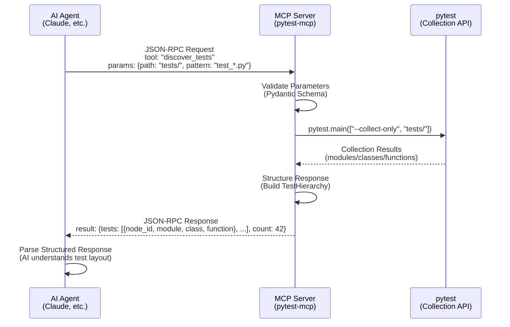
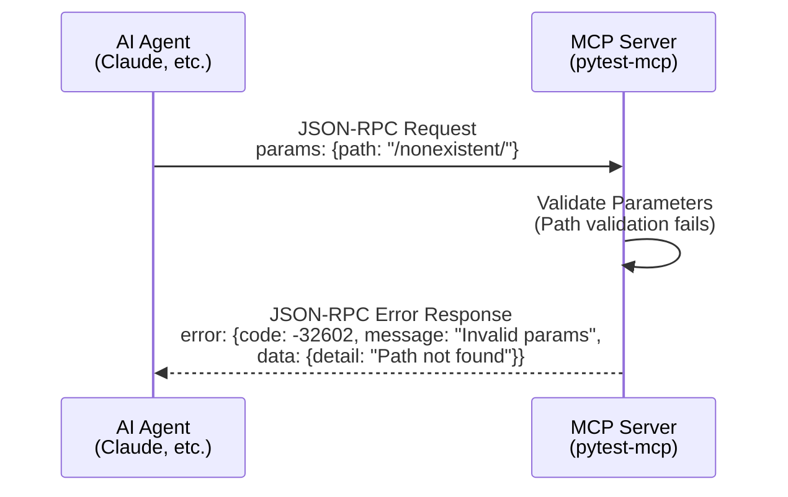
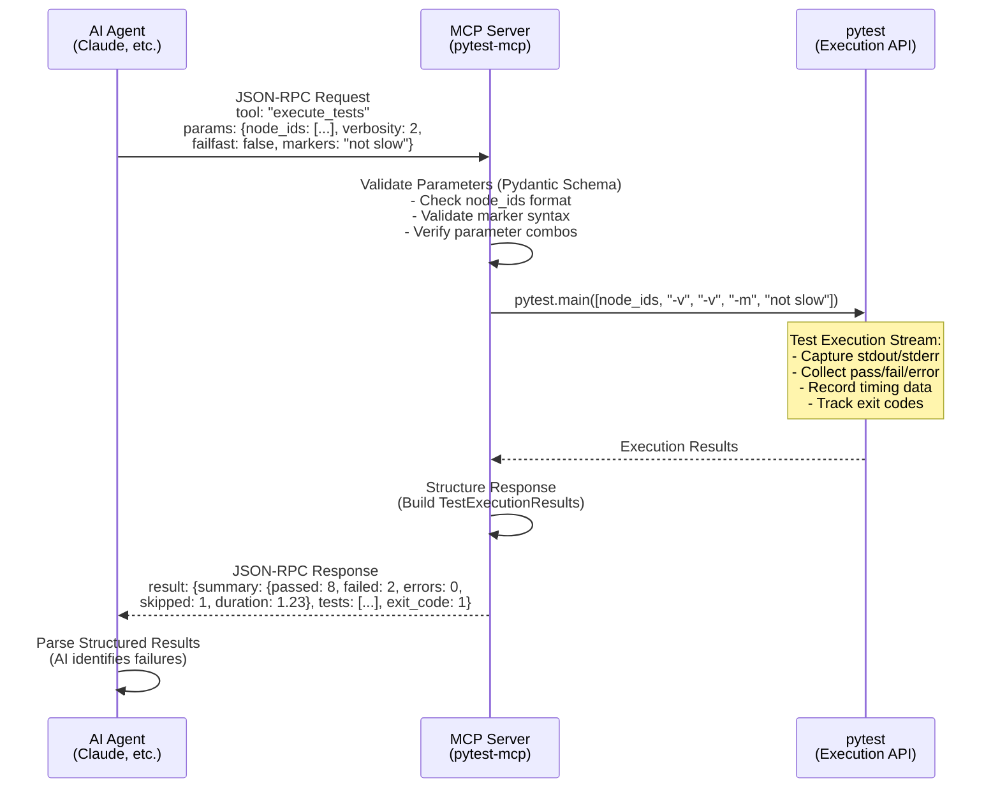
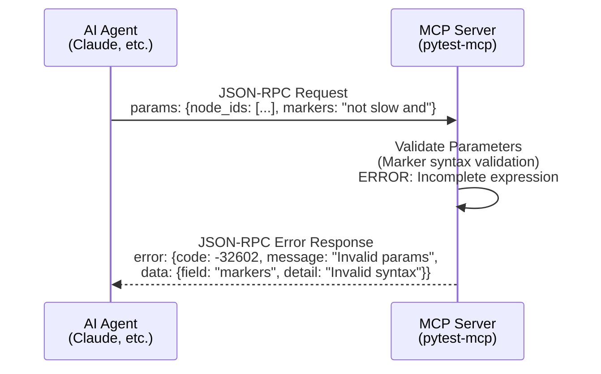
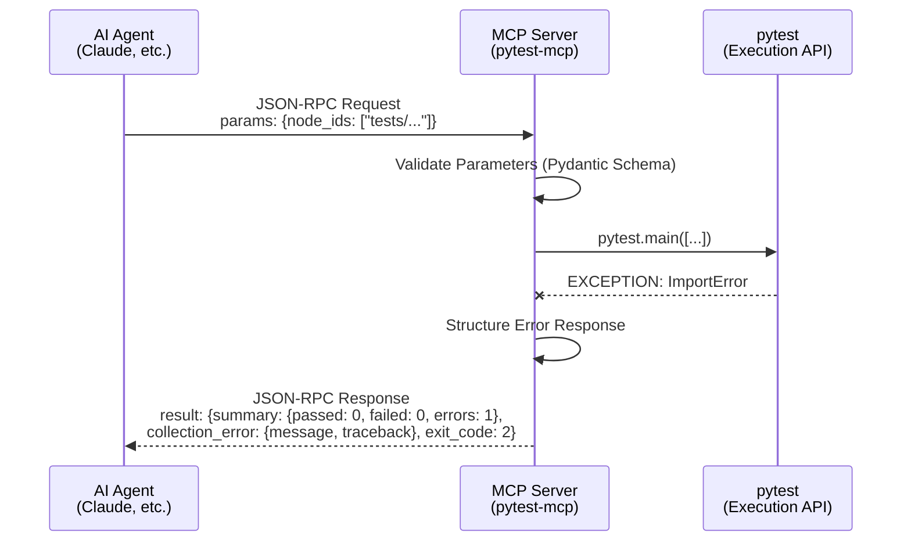
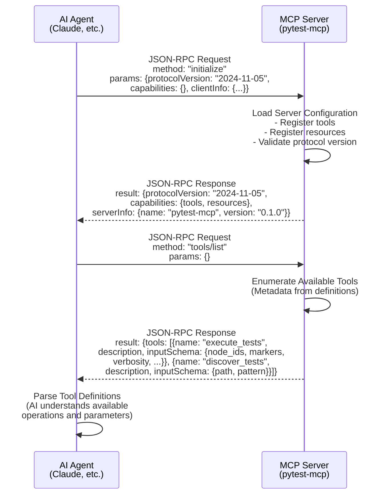
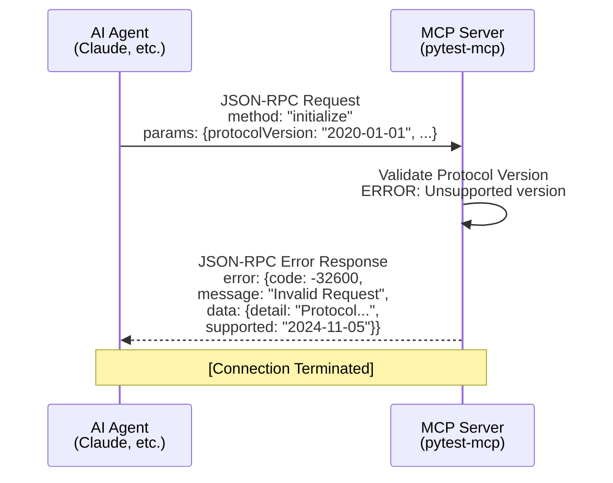

# Event Model: pytest-mcp

**Document Version:** 1.0
**Date:** October 3, 2025 (Friday)
**Project:** pytest-mcp
**Phase:** 2 - Collaborative Event Modeling

## Overview

pytest-mcp is an **MCP (Model Context Protocol) server** providing standardized pytest execution for AI agents. As an MCP server, it operates primarily as a **stateless request-response system** where most operations are ephemeral - commands received, actions performed, responses returned.

**Key Architectural Insight**: Unlike domain-driven applications with rich persistent state, MCP servers typically have minimal persistent state. The business value lies in **consistent, predictable command execution** rather than state management.

**Business Value**: Enables reliable AI-assisted TDD workflows by replacing inconsistent shell command execution with a structured, opinionated pytest interface. Improves security by eliminating the need for broad shell access when AI agents run tests.

## Persistent State Analysis

Following Event Modeling principles (persistent state changes only), this system has **ZERO persistent events**.

**Critical Distinction**: ALL MCP operations are **ephemeral workflows** without persistent state:
- Test discovery: Query → Results → Response (no persistence)
- Test execution: Command → Execute → Response (no persistence)
- Server metadata: Query → Response (no persistence)

**Architectural Foundation**: This is a stateless MCP server. All operations are request-response with no state surviving between invocations.

## Business Workflows

### Workflow 1: Test Discovery (Ephemeral Query)

**Business Value**: AI agents discover test structure through consistent interface instead of parsing shell output.

**Vertical Slice Pattern**:
```
(AI Agent via MCP Client)
  ↓
Command: DiscoverTests(path, pattern)
  ↓
(NO EVENT - Ephemeral Query Operation)
  ↓
Projection: Test Hierarchy (computed from filesystem/pytest collection)
  ↓
Query: GetTestStructure → Returns test modules/classes/functions
  ↓
(AI Agent receives structured test list)
```

#### MCP Protocol Wireframe: Test Discovery

**Success Scenario:**



**Error Scenario: Invalid Path**



**Commands** (User Intentions):
- **DiscoverTests**: AI agent requests test structure discovery
  - Parameters: `path` (optional), `pattern` (optional test file pattern)
  - Purpose: Understand available tests before execution

**Events** (Immutable Business Facts):
- **NONE** - Test discovery is an ephemeral read operation with no persistent state change

**Read Models** (Information Views):
- **TestHierarchy**: Structured representation of test modules, classes, functions
  - Computed on-demand from pytest's collection mechanism
  - NOT persisted - regenerated per request
  - Format: Nested structure showing test organization

**Aggregates** (Business Rules):
- **TestCollection**: Valid pytest test discovery rules
  - Test files must match naming pattern (test_*.py or *_test.py)
  - Test functions must be discoverable by pytest
  - NO implementation details - pytest's rules apply

---

### Workflow 2: Test Execution (Ephemeral Execution)

**Business Value**: AI agents execute tests consistently through opinionated interface, eliminating shell command variability.

**Vertical Slice Pattern**:
```
(AI Agent via MCP Client)
  ↓
Command: ExecuteTests(node_ids, markers, verbosity, ...)
  ↓
(NO EVENT - Ephemeral Execution Operation)
  ↓
Projection: Test Results (captured stdout/stderr/exit_code)
  ↓
Query: GetTestResults → Returns pass/fail/error details
  ↓
(AI Agent receives structured test results)
```

#### MCP Protocol Wireframe: Test Execution

**Success Scenario:**



**Error Scenario: Invalid Marker Expression**



**Error Scenario: Test Execution Failure (pytest crashes)**



**Commands** (User Intentions):
- **ExecuteTests**: AI agent requests test execution with validated parameters
  - Parameters: `node_ids` (specific tests), `markers` (filter by marks), `keywords` (filter by name), `verbosity` (output level), `failfast` (stop on first failure), `maxfail` (stop after N failures), `parallel` (parallel execution), etc.
  - Purpose: Run tests and receive structured results

**Events** (Immutable Business Facts):
- **NONE** - Test execution is ephemeral with no persistent state changes

**Read Models** (Information Views):
- **TestExecutionResults**: Structured test outcome data
  - Computed from pytest execution
  - Contains: pass/fail counts, error messages, stack traces, timing, exit codes
  - Format: Predictable structure optimized for AI parsing
  - NOT persisted - returned in single MCP response

**Aggregates** (Business Rules):
- **PytestExecution**: Valid pytest execution constraints
  - All pytest CLI arguments accessible through validated MCP parameters
  - Invalid parameter combinations rejected before execution
  - Exit code semantics preserved (0=success, 1=failures, 2=interrupted)
  - NO implementation details - business-level validation only

---

### Workflow 3: Server Capability Discovery (Ephemeral Query)

**Business Value**: AI agents discover available pytest operations through MCP protocol discovery without requiring shell access or documentation lookup.

**Vertical Slice Pattern**:
```
(AI Agent via MCP Client)
  ↓
Command: GetServerCapabilities
  ↓
(NO EVENT - Ephemeral Metadata Query)
  ↓
Projection: Server Metadata (tools, resources, version)
  ↓
Query: GetCapabilities → Returns available MCP tools
  ↓
(AI Agent receives server capabilities)
```

#### MCP Protocol Wireframe: Capability Discovery

**Success Scenario: Initialization and Tool Discovery**



**Error Scenario: Version Mismatch**



**Commands** (User Intentions):
- **GetServerCapabilities**: AI agent requests available tools and resources
  - Parameters: None (standard MCP discovery)
  - Purpose: Understand what operations server supports

**Events** (Immutable Business Facts):
- **NONE** - Capability discovery is ephemeral metadata query

**Read Models** (Information Views):
- **ServerCapabilities**: Available MCP tools and resources
  - Contains: Tool definitions (ExecuteTests, DiscoverTests), resource endpoints, protocol version
  - Computed from server implementation
  - NOT persisted - static metadata

**Aggregates** (Business Rules):
- **MCPProtocol**: MCP specification compliance rules
  - Server must respond to capability discovery requests
  - Tool definitions must include parameter schemas
  - NO implementation details - protocol-level requirements only

---

## Integration Points

**MCP Protocol**: AI agents communicate with server via Model Context Protocol (MCP)
- Standard protocol for AI-to-tool communication
- JSON-RPC-based request/response
- Tool discovery, parameter validation, structured responses

**pytest**: Server invokes pytest programmatically for test operations
- Test discovery via pytest collection API
- Test execution via pytest main entry point
- Result capture via pytest reporting hooks

**External Systems**: None - server is self-contained with no external integrations required

---

## Quality Attributes

**Consistency**: AI agents receive predictable, structured responses across all test executions (eliminates shell command variability)

**Security**: Opinionated interface constrains AI agents to safe pytest operations (no arbitrary shell command access required)

**Performance**: Test discovery and execution complete in responsive time for typical projects (streaming results for large test suites)

**Reliability**: Server operates stably across diverse pytest projects (comprehensive error handling, graceful degradation)

**Compatibility**: Works across Linux, macOS, Windows with Python 3.12+ (cross-platform libraries, no OS-specific APIs)

---

## Event Model Summary

**Total Persistent Events: 0** (stateless MCP server with zero persistent state)

**Total Ephemeral Workflows: 3** (Test Discovery, Test Execution, Capability Discovery)

**Key Insight**: As a stateless MCP server, pytest-mcp operates purely on the request-response pattern with **NO persistent state changes**. This aligns with the MCP protocol's design philosophy where servers provide tools and resources without domain state management.

**Architectural Implication**: Implementation focuses entirely on robust pytest integration, parameter validation, and result structuring. NO event sourcing, persistent storage, or state management mechanisms are required or planned.

---

## Architectural Review

**Reviewer**: event-modeling-architect
**Review Date**: October 3, 2025 (Friday)
**Review Status**: ✅ APPROVED - Architecturally Sound

### Executive Summary

The EVENT_MODEL.md correctly identifies pytest-mcp as a **stateless MCP server** with ZERO persistent state. This architectural assessment is accurate and aligns perfectly with both the requirements and the MCP protocol's design philosophy. The model demonstrates excellent understanding of the critical distinction between persistent events and ephemeral request-response operations.

**Key Finding**: This is a **protocol adapter server**, not a domain-driven application. The business value lies in consistent, predictable command execution rather than state management.

### Architectural Validation

#### 1. Stateless Design Correctness ✅

**Assessment**: The zero-persistent-event architecture is not only valid but optimal for this use case.

**Rationale**:
- MCP servers are protocol adapters, not domain services
- pytest execution inherently produces ephemeral results
- No business requirement mandates state persistence
- Test discovery is a pure query operation (no side effects)
- Test execution results are consumed immediately by AI agents

**Architectural Soundness**: The model correctly distinguishes between:
- Persistent events (survive restart, require reconstruction)
- Ephemeral workflows (request-response, no state survival)

This system has NO persistent state changes, therefore ZERO events is architecturally correct.

#### 2. Workflow Completeness ✅

**Assessment**: All critical business workflows identified and properly modeled.

**Workflows Covered**:
1. **Test Discovery**: AI agent discovers test structure → structured response
2. **Test Execution**: AI agent executes tests → structured results
3. **Capability Discovery**: AI agent queries capabilities → server metadata

**Coverage Analysis**:
- All requirements from REQUIREMENTS_ANALYSIS.md are addressed
- All FR-1 (Pytest Execution Integration) workflows present
- All FR-2, FR-3, FR-4 workflows are deployment/CI concerns (not runtime state)
- No missing business workflows identified

**Gap Analysis**: NONE - All user stories map to documented workflows.

#### 3. MCP Protocol Alignment ✅

**Assessment**: Model correctly reflects MCP server patterns and constraints.

**Protocol Compliance**:
- Tool-based interface (ExecuteTests, DiscoverTests) follows MCP conventions
- Capability discovery via standard MCP protocol methods
- Structured parameter schemas enable validation before execution
- JSON-RPC request-response pattern correctly identified
- NO persistent state management (MCP servers are stateless by design)

**MCP Best Practices**:
- Opinionated interface design (constrains AI behavior)
- Parameter validation at boundaries (Parse Don't Validate)
- Structured responses optimize AI parsing
- Security through constraint (no arbitrary command execution)

**Architectural Risk**: NONE - Model aligns perfectly with MCP server patterns.

#### 4. Technical Feasibility ✅

**Assessment**: All workflows are implementable with standard Python ecosystem tools.

**Implementation Path**:
- **MCP Integration**: Python MCP SDK provides protocol implementation
- **pytest Integration**: pytest's public APIs support programmatic execution
  - `pytest.main()` for test execution
  - `pytest.Session` and collection APIs for test discovery
  - Reporting hooks for result capture
- **Parameter Validation**: Pydantic v2 provides robust type validation at boundaries
- **Result Structuring**: Standard Python data structures → JSON serialization

**Technical Dependencies**:
- Python 3.12+ (available, mature)
- pytest (stable public API)
- Pydantic v2 (production-ready)
- Python MCP SDK (available from Anthropic)

**Feasibility Risk**: NONE - All components mature and well-documented.

#### 5. Aggregate Boundaries ✅

**Assessment**: Business rule boundaries are clear and appropriate.

**Aggregates Identified**:
1. **TestCollection**: Valid pytest test discovery rules
   - Boundary: pytest's test naming conventions
   - Responsibility: Enforce discoverable test patterns

2. **PytestExecution**: Valid pytest execution constraints
   - Boundary: pytest CLI argument validation
   - Responsibility: Reject invalid parameter combinations

3. **MCPProtocol**: MCP specification compliance rules
   - Boundary: MCP protocol requirements
   - Responsibility: Enforce tool schema conformance

**Boundary Clarity**: Each aggregate has well-defined responsibilities with no overlap.

**Business Logic Encapsulation**: Validation logic properly separated from infrastructure concerns.

#### 6. Integration Points ✅

**Assessment**: External system interactions are well-defined at conceptual level.

**Integration Clarity**:
- **MCP Protocol**: Standard JSON-RPC, no custom extensions needed
- **pytest**: Public API usage (not internal implementation details)
- **External Systems**: Explicitly NONE (self-contained server)

**Architectural Simplicity**: Minimal integration surface reduces coupling and maintenance burden.

**Security Consideration**: No external network calls (except standard pytest execution within project directory).

#### 7. Error Handling Architecture ✅

**Assessment**: Error scenarios adequately covered at architectural level.

**Error Categories**:
1. **Parameter Validation Errors**: Invalid MCP tool parameters (handled at boundary)
2. **pytest Execution Errors**: Test failures, collection errors, execution interruptions
3. **Protocol Errors**: Malformed MCP requests, unsupported operations

**Error Reporting Strategy**:
- Structured error responses via MCP protocol
- Exit code preservation (pytest semantics maintained)
- Stack traces and error messages captured for AI agent consumption

**Architectural Concern**: NONE - Error handling strategy aligns with stateless design.

#### 8. Quality Attributes Validation ✅

**Assessment**: Quality attributes from requirements are architecturally achievable.

**Quality Attribute Analysis**:

| Attribute | Requirement | Architectural Support | Risk |
|-----------|-------------|----------------------|------|
| **Consistency** | Predictable responses | Structured MCP responses, parameter validation | LOW |
| **Security** | No arbitrary shell access | Opinionated pytest-only interface | LOW |
| **Performance** | Responsive test execution | Streaming results, minimal overhead | LOW |
| **Reliability** | Stable across diverse projects | Standard pytest APIs, comprehensive error handling | LOW |
| **Compatibility** | Cross-platform Python 3.12+ | Platform-agnostic libraries | LOW |

**TRACE Framework Alignment**:
- **Type-first**: Pydantic validation at boundaries
- **Readability**: Minimal architecture (stateless = simple)
- **Atomic**: Self-contained request-response cycles
- **Cognitive**: Zero state management = low cognitive load
- **Essential**: No unnecessary complexity (no persistence layer)

#### 9. Security Architecture ✅

**Assessment**: Security posture is strong due to architectural constraints.

**Security Properties**:
1. **Constraint-Based Security**: MCP tool interface permits ONLY pytest operations
2. **No Arbitrary Execution**: AI agents cannot execute arbitrary shell commands
3. **Parameter Validation**: Pydantic enforces type safety at boundaries
4. **No Persistent Attack Surface**: Stateless design eliminates state-based vulnerabilities
5. **Standard pytest Execution**: Inherits pytest's security model

**Security Risks**:
- **Low Risk**: AI agent could request execution of malicious tests
  - **Mitigation**: pytest runs in project directory with project permissions (standard pytest behavior)
- **Low Risk**: Path traversal via test file patterns
  - **Mitigation**: pytest's collection mechanism handles path resolution safely

**Architectural Security Concern**: NONE - Design minimizes attack surface.

#### 10. Scalability Considerations ✅

**Assessment**: Stateless design provides excellent scalability properties.

**Scalability Properties**:
- **Horizontal Scaling**: Stateless servers scale trivially (no shared state)
- **Resource Efficiency**: No persistent connections or state management overhead
- **Performance Isolation**: Each request independent (no cross-request interference)

**Performance Considerations**:
- Large test suites: Streaming results prevents memory exhaustion
- Test discovery: Pagination support for projects with thousands of tests
- Concurrent requests: Stateless design permits parallel execution

**Scalability Risk**: LOW - Stateless architecture inherently scalable.

### Architectural Concerns

**NONE IDENTIFIED**

The event model is:
- Complete relative to requirements
- Technically feasible with standard tools
- Architecturally sound for MCP server pattern
- Security-conscious through constraint-based design
- Scalable through stateless architecture

### Recommendations

**NO CHANGES REQUIRED**

The event model correctly captures the architectural essence of pytest-mcp:
1. Stateless MCP server (zero persistent events)
2. Three ephemeral workflows (discovery, execution, capability)
3. Clear aggregate boundaries (validation logic)
4. Well-defined integration points (MCP + pytest)
5. Quality attributes achievable through architecture

**Architectural Guidance for Phase 3 (ADR Creation)**:
- ADR-001: MCP Protocol Selection and Integration Strategy
- ADR-002: Stateless Server Architecture (Zero Persistent State)
- ADR-003: pytest Integration Approach (Public API Usage)
- ADR-004: Parameter Validation Strategy (Pydantic at Boundaries)
- ADR-005: Result Structuring and Serialization
- ADR-006: Error Handling and Exit Code Semantics
- ADR-007: Security Model (Constraint-Based Interface)

### Sign-Off

**Architectural Soundness**: ✅ VALIDATED
**Technical Feasibility**: ✅ CONFIRMED
**MCP Protocol Alignment**: ✅ VERIFIED
**Requirements Coverage**: ✅ COMPLETE
**Security Posture**: ✅ STRONG

**Phase 2 Status**: COMPLETE - Ready for Phase 3 (Architectural Decision Records)

**Next Phase**: event-modeling-wireframes should add ASCII wireframes for the three ephemeral workflows to complete visual documentation of user/agent interaction patterns.

---

**Review Observations Stored**: Architectural review findings stored in memento with temporal markers for future reference.
