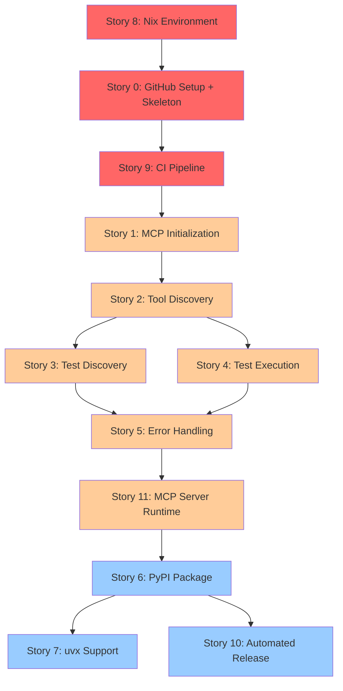

# Story Planning: pytest-mcp

**Document Version:** 1.0
**Date:** October 3, 2025 (Friday)
**Project:** pytest-mcp
**Phase:** 6 - Story Planning

## Executive Summary

This document presents prioritized user stories for pytest-mcp, an MCP server providing standardized pytest execution for AI agents. Stories are derived from the three vertical slices in EVENT_MODEL.md and prioritized by business value and technical dependencies.

**Total Stories**: 12 stories across 5 epics (Stories 0-11, with Story 11 consolidating Epic 5 sub-stories)
**Estimated Delivery**: Infrastructure-first approach, then sequential feature implementation

## Story Priority Overview

| Priority | Story | Epic | Rationale |
|----------|-------|------|-----------|
| P0 | Story 8 | Infrastructure | Nix development environment FIRST - provides local environment before any commits |
| P0 | Story 0 | Infrastructure | GitHub repository + skeleton app enables CI validation |
| P0 | Story 9 | Infrastructure | CI quality gates enforce standards with skeleton app validation |
| P1 | Story 1 | Foundation | MCP server initialization REPLACES skeleton with full implementation |
| P1 | Story 2 | Foundation | Capability discovery enables AI agent tool usage |
| P1 | Story 3 | Core Testing | Test discovery enables intelligent test selection |
| P1 | Story 4 | Core Testing | Test execution delivers primary business value |
| P1 | Story 5 | Core Testing | Error handling ensures reliability |
| P1 | Story 11 | Foundation | MCP server runtime integration bridges workflow functions to usable MCP server |
| P2 | Story 6 | Distribution | PyPI packaging enables user installation |
| P2 | Story 7 | Distribution | uvx support provides zero-config execution |
| P2 | Story 10 | Infrastructure | Automated releases eliminate manual publishing |

**Priority Definitions**:
- **P0**: Infrastructure First - establish stable development environment and workflow before feature development
- **P1**: Core Features - fundamental MCP server capabilities and pytest integration
- **P2**: Distribution & Automation - packaging, release automation, and advanced tooling

**Infrastructure-First Rationale (Nix-First Approach)**:
Development infrastructure MUST be established in specific order:
1. **Nix environment FIRST (Story 8)** - Local development environment before any commits
2. **GitHub + Skeleton App (Story 0)** - Repository with minimal working app for CI validation
3. **CI Pipeline (Story 9)** - Quality gates with skeleton app to validate
4. **Feature Development (Stories 1+)** - Full MCP implementation replaces skeleton

**Why Nix Before GitHub**:
- Need actual local environment before creating commits
- Nix ensures reproducibility from first commit
- Skeleton app provides CI validation target
- Story 1 then replaces/enhances skeleton with full implementation

---

## Epic 0: Development Infrastructure Setup

### Story 0: GitHub Repository, Branch Protection, and Skeleton App Bootstrap

**Epic**: Infrastructure
**Priority**: P0 (SECOND - after Story 8 Nix environment)
**Status**: Complete

#### Description

Development team establishes GitHub repository with branch protection rules, PR workflow requirements, and collaboration settings, PLUS bootstraps minimal "Hello, world" MCP server skeleton. The repository enforces code review requirements, status checks, and linear history. The skeleton app provides basic project structure with one passing test, enabling CI validation. This skeleton will be REPLACED/enhanced by Story 1.

**WHY**: GitHub repository establishes development workflow discipline. Skeleton app provides CI validation target - CI needs actual code to validate. Story 1 will then replace/enhance this skeleton with full MCP implementation. This two-step approach ensures CI is working before complex feature development.

#### Acceptance Criteria

```gherkin
Scenario: GitHub repository created with proper configuration
  Given pytest-mcp project requirements
  When maintainer creates GitHub repository
  Then repository is named "pytest-mcp"
  And repository visibility is set appropriately
  And repository includes proper description and topics
  And repository includes MIT license file
  And default branch is named "main"

Scenario: Branch protection rules enforce PR workflow
  Given GitHub repository for pytest-mcp
  When maintainer configures branch protection for main branch
  Then direct pushes to main are blocked
  And pull requests are required for all changes
  And at least 1 approving review is required
  And stale reviews are dismissed when new commits pushed
  And conversations must be resolved before merge
  And administrators are included in restrictions

Scenario: Status checks enforce quality gates
  Given branch protection configuration
  When configuring required status checks
  Then CI workflow checks are required before merge
  And status checks must be up-to-date with base branch
  And branches must be up-to-date before merging
  And passing status checks are required

Scenario: Linear history is enforced
  Given branch protection settings
  When configuring merge options
  Then squash merging is allowed
  And rebase merging is allowed
  And merge commits are disabled
  And linear history is enforced

Scenario: PR template guides contributors
  Given GitHub repository
  When contributor creates new pull request
  Then PR template appears with required sections
  And template includes checklist for story completion
  And template prompts for related story number
  And template prompts for TRACE score validation
  And template prompts for mutation testing results

Scenario: Minimal MCP server skeleton bootstrapped
  Given Nix development environment from Story 8
  When maintainer bootstraps skeleton app
  Then src/ directory exists with basic project structure
  And tests/ directory exists with basic test structure
  And pyproject.toml exists with minimal configuration
  And skeleton includes minimal MCP server responding to initialize
  And skeleton includes one passing test validating initialization
  And skeleton serves as "Hello, world" equivalent MCP server

Scenario: Skeleton app provides CI validation target
  Given skeleton app with one passing test
  When CI pipeline (Story 9) executes
  Then CI can run tests against skeleton
  And CI validates code quality on actual code
  And skeleton proves CI infrastructure works
```

#### References

- **Requirements**: FR-4.1 (CI Quality Gates), NFR-2 (Code Quality Standards) from REQUIREMENTS_ANALYSIS.md
- **Event Model**: N/A (infrastructure setup, not runtime workflow)
- **Architecture**: Development practices from ARCHITECTURE.md
- **Design**: N/A (repository configuration)

#### Notes

**Story Ordering**: Story 8 (Nix environment) MUST complete before Story 0, so local environment exists for skeleton app development.

**Skeleton App Purpose**: Provides minimal working code for CI validation. Story 1 will REPLACE/enhance this with full MCP server implementation. The skeleton is not wasted work - it validates CI infrastructure before complex feature development.

**Implementation Checklist**:
- [ ] Create GitHub repository with appropriate visibility
- [ ] Configure branch protection rules for main branch
- [ ] Set up required status checks (will be populated by Story 9)
- [ ] Create PR template with quality checklist
- [ ] Create issue templates for stories and bugs
- [ ] Configure repository settings (squash merge, linear history)
- [ ] Add repository topics and description
- [ ] Configure GitHub Actions permissions
- [ ] Bootstrap minimal MCP server skeleton (src/, tests/, pyproject.toml)
- [ ] Implement minimal MCP initialize response ("Hello, world" equivalent)
- [ ] Write one passing test validating initialization
- [ ] Commit skeleton to main branch as starting point

---

## Epic 1: MCP Server Foundation

### Story 1: MCP Server Initialization and Protocol Implementation

**Epic**: Foundation
**Priority**: P1 (FIRST feature story - after infrastructure P0 stories complete)
**Status**: Not Started

#### Description

AI agents connect to pytest-mcp server and establish communication through the Model Context Protocol (MCP). The server responds to initialization requests with protocol version and basic server metadata, enabling AI agents to verify compatibility before using the server. **This story REPLACES/enhances the skeleton app from Story 0 with full MCP implementation.**

**WHY**: Without successful initialization, AI agents cannot discover available tools or make any pytest-related requests. This is the foundational capability for all other functionality. Story 0 provided minimal skeleton; this story delivers production-quality implementation.

#### Acceptance Criteria

```gherkin
Scenario: AI agent successfully initializes connection
  Given an AI agent with MCP client capability
  When the agent sends MCP initialize request with protocol version "2025-03-26"
  Then the server responds with protocol version "2025-03-26"
  And the server includes serverInfo with name "pytest-mcp" and version number
  And the server indicates capabilities for tools and resources

Scenario: AI agent requests unsupported protocol version
  Given an AI agent sending initialize request
  When the agent specifies protocol version "2020-01-01"
  Then the server responds with JSON-RPC error code -32600
  And the error.data includes field "protocolVersion"
  And the error.data includes received_value "2020-01-01"
  And the error.data includes supported_version "2025-03-26"
  And the error.data.detail explains "Protocol version not supported. Please retry initialization with supported version."
```

#### References

- **Requirements**: FR-1 (Pytest Execution Integration), Epic 1 Story 1.1 from REQUIREMENTS_ANALYSIS.md
- **Event Model**: Workflow 3 (Server Capability Discovery) from EVENT_MODEL.md, lines 192-262
- **Architecture**: MCP Protocol Layer from ARCHITECTURE.md, lines 122-135
- **Design**: Protocol Design Language, MCP initialization from STYLE_GUIDE.md, lines 213-241

#### Notes

This story establishes the MCP protocol foundation. The server must handle the standard MCP initialization handshake before any tool calls can be processed. Implementation should use the Python MCP SDK for protocol compliance.

---

### Story 2: MCP Tool Discovery

**Epic**: Foundation
**Priority**: P0
**Status**: Not Started

#### Description

AI agents query the MCP server for available tools and their parameter schemas. The server responds with tool definitions for `execute_tests` and `discover_tests`, including complete parameter specifications and descriptions.

**WHY**: Tool discovery enables AI agents to understand what pytest operations are available and how to construct valid requests. Without this, agents cannot use the server effectively.

#### Acceptance Criteria

```gherkin
Scenario: AI agent discovers available tools
  Given an initialized MCP connection
  When the agent sends tools/list request
  Then the server responds with array of tool definitions
  And the array includes "execute_tests" tool with complete inputSchema
  And the array includes "discover_tests" tool with complete inputSchema
  And each tool definition includes name, description, and inputSchema

Scenario: AI agent examines execute_tests tool schema
  Given the tools/list response
  When the agent inspects "execute_tests" tool definition
  Then the inputSchema shows parameters: node_ids, markers, keywords, verbosity, failfast, maxfail, show_capture, timeout
  And each parameter includes type, description, and validation constraints
  And the schema specifies additionalProperties: false

Scenario: AI agent examines discover_tests tool schema
  Given the tools/list response
  When the agent inspects "discover_tests" tool definition
  Then the inputSchema shows parameters: path, pattern
  And each parameter includes type and description
  And path parameter includes security validation constraints
```

#### References

- **Requirements**: FR-1 (Pytest Execution Integration), Epic 1 Story 1.1 from REQUIREMENTS_ANALYSIS.md
- **Event Model**: Workflow 3 (Server Capability Discovery) from EVENT_MODEL.md, lines 244-257
- **Architecture**: MCP Protocol Layer, Tool Definitions from ARCHITECTURE.md, lines 126-127
- **Design**: Tool Interfaces (Organism Level) from STYLE_GUIDE.md, lines 361-485

#### Notes

Tool schemas serve as executable documentation. AI agents learn parameter constraints through schema inspection. Implementation must ensure schemas align exactly with Pydantic validation models.

---

## Epic 2: Core Testing Integration

### Story 3: Test Discovery Without Execution

**Epic**: Core Testing
**Priority**: P0
**Status**: Not Started

#### Description

AI agents discover the structure of a pytest test suite without executing any tests. The server returns hierarchical test organization including modules, classes, functions, and pytest node IDs that can be used for targeted test execution.

**WHY**: Discovery enables intelligent test selection. AI agents understand test organization before deciding which tests to execute, supporting targeted testing workflows rather than blind full-suite execution.

#### Acceptance Criteria

```gherkin
Scenario: AI agent discovers all tests in project
  Given a Python project with pytest tests in tests/ directory
  When the agent calls discover_tests with default parameters
  Then the server responds with array of discovered tests
  And each test includes node_id, module, class, function, file, and line
  And the response includes total count of discovered tests
  And collection_errors array is empty when discovery succeeds

Scenario: AI agent discovers tests in specific directory
  Given a project with tests in tests/unit/ and tests/integration/
  When the agent calls discover_tests with path "tests/unit/"
  Then the server responds with tests only from tests/unit/ directory
  And tests from tests/integration/ are not included
  And the count reflects only unit tests

Scenario: AI agent discovers tests with custom pattern
  Given a project with test files matching pattern *_spec.py
  When the agent calls discover_tests with pattern "*_spec.py"
  Then the server discovers tests from *_spec.py files
  And test_*.py files are not included
  And the response includes all matching test functions

Scenario: AI agent handles discovery with collection errors
  Given a project with syntax error in test file
  When the agent calls discover_tests
  Then the server responds with partial test list
  And collection_errors array includes error details
  And the response does not fail with error code
```

#### References

- **Requirements**: FR-1.2 (Test Discovery), Epic 4 Story 4.1 from REQUIREMENTS_ANALYSIS.md
- **Event Model**: Workflow 1 (Test Discovery) from EVENT_MODEL.md, lines 29-98
- **Architecture**: pytest Execution Layer, Environment Detection from ARCHITECTURE.md, lines 166-195
- **Design**: Tool: discover_tests from STYLE_GUIDE.md, lines 442-485; Response: Successful Test Discovery from STYLE_GUIDE.md, lines 671-720

#### Notes

Discovery is a read-only operation with no side effects. Implementation should use pytest's --collect-only mechanism. The server must handle collection errors gracefully without failing the entire request.

---

### Story 4: Test Execution with Parameter Support

**Epic**: Core Testing
**Priority**: P0
**Status**: Not Started

#### Description

AI agents execute pytest tests through structured MCP tool calls with validated parameters. The server translates MCP parameters into pytest subprocess invocation, captures execution results, and returns structured responses including pass/fail status, error messages, stack traces, and execution timing.

**WHY**: Test execution is the primary business value of pytest-mcp. This capability enables AI-assisted TDD workflows by providing consistent, predictable test execution without requiring arbitrary shell command access.

#### Acceptance Criteria

```gherkin
Scenario: AI agent executes all tests successfully
  Given a project with passing pytest tests
  When the agent calls execute_tests with no parameters
  Then the server executes pytest for entire suite
  And the response includes exit_code 0
  And summary shows all tests passed with total count and duration
  And tests array includes minimal details for each passing test

Scenario: AI agent executes tests with failures
  Given a project with some failing tests
  When the agent calls execute_tests with no parameters
  Then the server executes pytest for entire suite
  And the response includes exit_code 1
  And summary shows passed, failed, and error counts
  And tests array includes traceback and message for failed tests
  And tests array includes minimal details for passing tests

Scenario: AI agent filters tests by marker
  Given a project with tests marked "slow" and "fast"
  When the agent calls execute_tests with markers "not slow"
  Then the server executes only tests not marked "slow"
  And the response includes only fast test results
  And slow tests are not executed

Scenario: AI agent filters tests by keyword
  Given a project with tests containing "user" and "admin" in names
  When the agent calls execute_tests with keywords "user"
  Then the server executes only tests matching "user" keyword
  And admin tests are not executed
  And the response includes only user test results

Scenario: AI agent executes specific tests by node ID
  Given a project with multiple test files
  When the agent calls execute_tests with node_ids ["tests/test_user.py::test_login"]
  Then the server executes only the specified test
  And the response includes result for test_login
  And other tests are not executed

Scenario: AI agent uses failfast for rapid feedback
  Given a project with multiple test failures
  When the agent calls execute_tests with failfast true
  Then the server stops execution after first failure
  And the response includes only one failed test result
  And remaining tests show as not executed

Scenario: AI agent controls output verbosity
  Given a project with pytest tests
  When the agent calls execute_tests with verbosity 2
  Then the text_output includes detailed pytest output
  And the response includes verbose test execution information

Scenario: AI agent sets execution timeout
  Given a project with long-running tests
  When the agent calls execute_tests with timeout 5 seconds
  And test execution exceeds 5 seconds
  Then the server terminates pytest subprocess
  And the response returns JSON-RPC error with timeout_exceeded true
```

#### References

- **Requirements**: FR-1.1 (Complete CLI Argument Support), FR-1.3 (Result Reporting), FR-1.4 (Exit Code Semantics), Epic 1 Story 1.2 from REQUIREMENTS_ANALYSIS.md
- **Event Model**: Workflow 2 (Test Execution) from EVENT_MODEL.md, lines 101-189
- **Architecture**: pytest Execution Layer, Result Serialization Layer from ARCHITECTURE.md, lines 166-227; Error Handling Strategy from ARCHITECTURE.md, lines 275-293
- **Design**: Tool: execute_tests from STYLE_GUIDE.md, lines 364-441; Response Templates from STYLE_GUIDE.md, lines 500-627

#### Notes

This story delivers the core business value. Implementation must handle all pytest exit codes correctly: 0 (success), 1 (failures - returns success response with failure details), 2-4 (execution errors - returns error response). Test failures are data, not errors.

---

### Story 5: Comprehensive Error Handling and Validation

**Epic**: Core Testing
**Priority**: P1
**Status**: Not Started

#### Description

AI agents receive clear, actionable error responses when requests fail validation or pytest execution encounters problems. The server provides field-level validation errors for parameter issues and comprehensive diagnostic context for execution failures.

**WHY**: Error handling enables AI agents to self-correct without human intervention. Clear validation errors teach agents parameter constraints. Rich execution error context enables diagnosis without re-execution.

#### Acceptance Criteria

```gherkin
Scenario: AI agent sends invalid parameter type
  Given an initialized MCP connection
  When the agent calls execute_tests with verbosity "high" (string instead of int)
  Then the server responds with JSON-RPC error code -32602
  And error data identifies field "verbosity" as problematic
  And error detail explains expected type and constraints
  And error data includes received_value for agent reference

Scenario: AI agent sends out-of-range parameter
  Given an initialized MCP connection
  When the agent calls execute_tests with verbosity 10
  Then the server responds with JSON-RPC error code -32602
  And error data identifies field "verbosity"
  And error detail specifies valid range -2 to 2
  And error includes received value 10

Scenario: AI agent sends path traversal attack
  Given an initialized MCP connection
  When the agent calls discover_tests with path "../../../etc/passwd"
  Then the server responds with JSON-RPC error code -32602
  And error data identifies path security violation
  And error detail explains path traversal prevention
  And pytest is never invoked

Scenario: AI agent sends conflicting parameters
  Given an initialized MCP connection
  When the agent calls execute_tests with failfast true and maxfail 3
  Then the server responds with JSON-RPC error code -32602
  And error detail explains parameters are mutually exclusive
  And error suggests using one or the other

Scenario: pytest collection fails due to syntax error
  Given a project with Python syntax error in test file
  When the agent calls execute_tests
  Then the server responds with JSON-RPC error code -32000
  And error data includes exit_code 4 (pytest usage error)
  And error data includes stderr with pytest collection error details
  And error data includes command that was attempted
  And error data includes collection_errors with specific file and error

Scenario: pytest execution is interrupted
  Given a project with pytest tests
  When the agent calls execute_tests
  And pytest execution is interrupted (Ctrl+C, signal)
  Then the server responds with JSON-RPC error code -32000
  And error data includes exit_code 2 (interrupted)
  And error data includes partial test results if available
  And error message indicates execution was interrupted

Scenario: pytest experiences internal error
  Given a project triggering pytest internal error
  When the agent calls execute_tests
  Then the server responds with JSON-RPC error code -32000
  And error data includes exit_code 3 (internal error)
  And error data includes stderr with INTERNALERROR details
  And error data preserves pytest diagnostic output
```

#### References

- **Requirements**: NFR-1 (Code Quality Standards), NFR-3 (Security) from REQUIREMENTS_ANALYSIS.md
- **Event Model**: Error scenarios in Workflow 2 (Test Execution) from EVENT_MODEL.md, lines 140-166
- **Architecture**: Error Handling Strategy from ARCHITECTURE.md, lines 275-293; Security Architecture from ARCHITECTURE.md, lines 230-273
- **Design**: Parameter Validation Layer from ARCHITECTURE.md, lines 137-165; Response Templates: Validation Failure, Execution Failure from STYLE_GUIDE.md, lines 572-627

#### Notes

Security constraints must be enforced at the Pydantic validation layer before pytest subprocess invocation. All error responses must include maximum diagnostic context to enable AI agent self-correction. This story completes the core request-response workflow with robust error handling.

---

## Epic 3: Package Distribution

### Story 6: PyPI Package Configuration and Publishing

**Epic**: Distribution
**Priority**: P1
**Status**: Not Started

#### Description

pytest-mcp is packaged for distribution on PyPI following Python packaging standards. The package includes proper metadata, dependencies, and entry points, enabling users to install via pip and discover the MCP server through standard Python packaging mechanisms.

**WHY**: PyPI distribution enables users to install pytest-mcp using familiar Python tooling. Standard packaging ensures compatibility with existing Python workflows and package managers.

#### Acceptance Criteria

```gherkin
Scenario: Developer installs mcp-pytest-runner from PyPI
  Given mcp-pytest-runner is published to PyPI
  When developer runs "pip install mcp-pytest-runner"
  Then package installs successfully
  And package metadata shows correct name, version, author, license
  And dependencies are installed automatically

Scenario: Package metadata follows standards
  Given mcp-pytest-runner package configuration
  When examining package metadata
  Then package name is "mcp-pytest-runner"
  And package follows semantic versioning
  And license is MIT
  And Python version requirement is 3.12+
  And dependencies list includes pytest, Pydantic v2, MCP SDK

Scenario: Package includes MCP server entry point
  Given pytest-mcp installed via pip
  When examining package entry points
  Then MCP server is discoverable
  And server can be launched via standard mechanisms
  And package includes necessary configuration

Scenario: Package supports wheel and source distributions
  Given pytest-mcp package build
  When building distributions
  Then both wheel and source distributions are created
  And distributions include all necessary files
  And distributions exclude development files
```

#### References

- **Requirements**: FR-2.2 (PyPI Publishing), FR-2.3 (Semantic Versioning), Epic 2 Story 2.1 from REQUIREMENTS_ANALYSIS.md
- **Event Model**: N/A (distribution concern, not runtime workflow)
- **Architecture**: Deployment Considerations, Production Deployment from ARCHITECTURE.md, lines 490-500
- **Design**: N/A (infrastructure concern)

#### Notes

Package configuration should use modern Python packaging standards (pyproject.toml). Semantic versioning must be enforced from the beginning to support future upgrades. This story enables user installation but does not include automated publishing (covered in Story 10).

---

### Story 7: uvx Ephemeral Execution Support

**Epic**: Distribution
**Priority**: P1
**Status**: Not Started

#### Description

Users execute pytest-mcp via uvx without persistent installation. The MCP server launches ephemerally, operates correctly, and terminates cleanly when the session ends.

**WHY**: uvx provides zero-configuration execution for users already using the uv toolchain. Ephemeral execution reduces installation friction and ensures users always run the latest version.

#### Acceptance Criteria

```gherkin
Scenario: Developer runs pytest-mcp via uvx
  Given mcp-pytest-runner published to PyPI
  When developer runs "uvx --from mcp-pytest-runner pytest-mcp"
  Then pytest-mcp launches successfully
  And MCP server initializes and responds to requests
  And server operates identically to pip-installed version
  And server terminates cleanly when session ends

Scenario: uvx resolves dependencies automatically
  Given mcp-pytest-runner package with dependencies
  When developer runs "uvx --from mcp-pytest-runner pytest-mcp"
  Then uvx creates isolated environment
  And all dependencies are installed automatically
  And server has access to all required libraries

Scenario: uvx execution uses latest PyPI version
  Given mcp-pytest-runner version 0.2.0 published to PyPI
  When developer runs "uvx --from mcp-pytest-runner pytest-mcp" with no version pin
  Then uvx downloads and executes version 0.2.0
  And server metadata reports version 0.2.0
```

#### References

- **Requirements**: FR-2.1 (uvx Compatibility), Epic 2 Story 2.1 from REQUIREMENTS_ANALYSIS.md
- **Event Model**: N/A (distribution concern, not runtime workflow)
- **Architecture**: Deployment Considerations, Production Deployment from ARCHITECTURE.md, lines 490-500
- **Design**: N/A (infrastructure concern)

#### Notes

uvx support requires proper package entry points and standard Python packaging. No special uvx-specific configuration should be necessary. This story enables zero-friction usage for uv ecosystem users.

---

## Epic 4: Development Infrastructure

### Story 8: Nix Development Environment

**Epic**: Infrastructure
**Priority**: P0
**Status**: Complete

#### Description

Developers enter reproducible development environment via Nix flake containing Python 3.12+, pytest, Pydantic v2, MCP SDK, and all development tools (formatters, linters, type checkers, test runners).

**WHY**: Reproducible development environments eliminate "works on my machine" issues. Nix flake ensures all contributors use identical toolchain versions, reducing environment-related bugs and onboarding friction.

#### Acceptance Criteria

```gherkin
Scenario: Developer enters Nix development shell
  Given project with flake.nix
  When developer runs "nix develop"
  Then development environment activates successfully
  And Python 3.12+ is available
  And all project dependencies are available
  And development tools are configured and available

Scenario: Development tools include quality automation
  Given active Nix development shell
  When developer checks available commands
  Then mypy is available for type checking
  And ruff is available for linting and formatting
  And pytest is available for test execution
  And bandit is available for security scanning
  And mutmut is available for mutation testing

Scenario: Environment is reproducible across machines
  Given two different machines with Nix installed
  When each developer runs "nix develop"
  Then both environments are identical
  And tool versions match exactly
  And dependency versions match exactly
```

#### References

- **Requirements**: FR-3.1 (Nix Flake Integration), FR-3.2 (Development Tooling), Epic 3 Story 3.1 from REQUIREMENTS_ANALYSIS.md
- **Event Model**: N/A (development environment, not runtime workflow)
- **Architecture**: Deployment Considerations, Development Environment from ARCHITECTURE.md, lines 487-493
- **Design**: N/A (infrastructure concern)

#### Notes

Nix flake should pin all dependencies for reproducibility. Development tools should be pre-configured with project-specific settings (ruff rules, mypy strict mode). This story establishes developer workflow foundation.

---

### Story 9: CI Quality Pipeline

**Epic**: Infrastructure
**Priority**: P0
**Status**: Complete

#### Description

GitHub Actions workflow executes on every commit, validating code quality through tests, type checking, linting, security scanning, and mutation testing. Quality gate failures block merges, preventing quality regressions.

**WHY**: Automated quality validation prevents regressions from reaching main branch. CI enforcement ensures all contributions meet quality standards without manual review burden.

#### Acceptance Criteria

```gherkin
Scenario: CI validates pull request successfully
  Given a pull request with quality code
  When GitHub Actions workflow executes
  Then all tests pass
  And mypy type checking passes with strict mode
  And ruff linting passes with all rules enabled
  And bandit security scanning finds no high-severity issues
  And mutation testing achieves ≥80% score
  And all quality gates pass
  And pull request is approved for merge

Scenario: CI blocks pull request with test failures
  Given a pull request with failing tests
  When GitHub Actions workflow executes
  Then test execution reports failures
  And workflow fails with clear error
  And pull request cannot be merged
  And failure details are visible in PR

Scenario: CI blocks pull request with type errors
  Given a pull request with type annotation errors
  When GitHub Actions workflow executes
  Then mypy reports type errors
  And workflow fails
  And pull request cannot be merged

Scenario: CI blocks pull request with security issues
  Given a pull request introducing security vulnerability
  When GitHub Actions workflow executes
  Then bandit detects security issue
  And workflow fails
  And security finding details are reported

Scenario: CI blocks pull request with low mutation score
  Given a pull request with mutation score below 80%
  When GitHub Actions workflow executes
  Then mutation testing reports insufficient score
  And workflow fails
  And missing mutation coverage is identified
```

#### References

- **Requirements**: FR-4.1 (CI Quality Gates), NFR-2.2 (Mutation Testing), NFR-6.1 (TRACE Quality Gate), Epic 3 Story 3.2 from REQUIREMENTS_ANALYSIS.md
- **Event Model**: N/A (CI/CD infrastructure, not runtime workflow)
- **Architecture**: N/A (deployment concern)
- **Design**: N/A (infrastructure concern)

#### Notes

CI workflow should run on every push and pull request. Quality gates must be strict - no compromises on standards. Mutation testing ensures test suite actually validates behavior, not just achieves coverage. TRACE analysis validates cognitive load management.

---

### Story 10: Automated PyPI Release Pipeline

**Epic**: Infrastructure
**Priority**: P2
**Status**: Not Started

#### Description

GitHub Actions workflow automatically publishes new mcp-pytest-runner versions to PyPI when maintainer creates Git tag. The workflow builds distributions, validates package, authenticates with PyPI, and uploads release, eliminating manual publishing steps.

**WHY**: Automated releases eliminate manual publishing errors and accelerate release cycles. Developers create Git tag, automation handles everything else, ensuring consistent and reliable publishing process.

#### Acceptance Criteria

```gherkin
Scenario: Maintainer triggers release via Git tag
  Given pytest-mcp repository with passing tests
  When maintainer creates and pushes Git tag "v0.1.0"
  Then GitHub Actions release workflow triggers automatically
  And workflow builds wheel and source distributions
  And workflow validates package metadata
  And workflow publishes to PyPI successfully
  And mcp-pytest-runner version 0.1.0 appears on PyPI

Scenario: Release workflow validates semantic versioning
  Given Git tag "v0.1.0"
  When release workflow executes
  Then workflow verifies tag follows semver format
  And package version matches tag version
  And release proceeds only with valid semver

Scenario: Release workflow authenticates securely
  Given release workflow publishing to PyPI
  When workflow authenticates
  Then workflow uses GitHub Secrets for credentials
  And credentials are never exposed in logs
  And authentication follows PyPI trusted publishing if available

Scenario: Release workflow handles failures gracefully
  Given Git tag creation
  When release workflow encounters PyPI upload failure
  Then workflow reports clear error
  And maintainer receives notification
  And failed release can be retried manually
  And Git tag remains for retry
```

#### References

- **Requirements**: FR-4.2 (Automated PyPI Publishing), FR-4.3 (Release Workflow), Epic 2 Story 2.2 from REQUIREMENTS_ANALYSIS.md
- **Event Model**: N/A (release automation, not runtime workflow)
- **Architecture**: Deployment Considerations, Operational Considerations from ARCHITECTURE.md, lines 487-516
- **Design**: N/A (infrastructure concern)

#### Notes

Release workflow should use PyPI trusted publishing (OIDC) when available for enhanced security. Semantic versioning validation prevents accidentally publishing malformed versions. Release automation reduces time-to-user for bug fixes and features.

---

### Story 11: MCP Server Runtime Integration

**Epic**: Foundation
**Priority**: P1
**Status**: In Progress

#### Description

Users launch pytest-mcp as a functional MCP server that AI agents can connect to and use for pytest test execution. The server implements the complete MCP JSON-RPC protocol over stdio, bridges workflow functions (execute_tests, discover_tests) to the MCP transport layer, provides a pytest-mcp console command for invocation, and enables configuration in MCP clients like Claude Code.

**WHY**: Stories 1-4 delivered complete workflow functions and domain types, but the server cannot be used because there is no MCP protocol transport layer. This story bridges the gap between tested workflow functions and a usable MCP server, enabling users to actually use pytest-mcp by adding it to their AI development workflows.

#### Acceptance Criteria

```gherkin
Scenario: User launches pytest-mcp server from command line
  Given pytest-mcp installed via pip or uv
  When user runs "pytest-mcp" command
  Then MCP server process starts successfully
  And server listens on stdio for MCP JSON-RPC messages
  And server remains running until stdin closes

Scenario: MCP client initializes connection to pytest-mcp
  Given pytest-mcp server running
  When MCP client sends initialize request via JSON-RPC
  Then server responds with protocol handshake
  And server identifies as "pytest-mcp" with version number
  And server advertises available tools and capabilities

Scenario: MCP client discovers available tools
  Given initialized MCP connection
  When client sends tools/list request
  Then server responds with execute_tests tool definition
  And server responds with discover_tests tool definition
  And each tool includes complete parameter schema
  And schemas match domain type validation rules

Scenario: AI agent executes tests via MCP protocol
  Given pytest-mcp configured in Claude Code
  When Claude calls execute_tests tool via MCP protocol
  Then server routes request to domain.execute_tests() workflow function
  And server validates parameters using ExecuteTestsParams Pydantic model
  And server returns structured response via MCP protocol
  And Claude receives test results in expected format

Scenario: AI agent discovers tests via MCP protocol
  Given pytest-mcp configured in Claude Code
  When Claude calls discover_tests tool via MCP protocol
  Then server routes request to domain.discover_tests() workflow function
  And server validates parameters using DiscoverTestsParams Pydantic model
  And server returns structured response via MCP protocol
  And Claude receives test hierarchy in expected format

Scenario: Server handles validation errors gracefully
  Given initialized MCP connection
  When client calls execute_tests with invalid parameters
  Then server returns JSON-RPC error response
  And error includes field-level validation details
  And error provides actionable message for correction
  And domain workflow function is never invoked with invalid data

Scenario: User configures pytest-mcp in Claude Code
  Given pytest-mcp installed and available in PATH
  When user adds pytest-mcp to Claude Code MCP server configuration
  Then Claude Code successfully connects to pytest-mcp server
  And pytest-mcp tools appear in Claude Code's available tools
  And Claude can execute tests through pytest-mcp
  And Claude receives structured test results

Scenario: Server shuts down cleanly when client disconnects
  Given pytest-mcp server running with active client
  When client closes stdin connection
  Then server detects EOF on stdin
  And server completes cleanup via stdio_server context manager
  And server process terminates with exit code 0

Scenario: User configuration documentation guides MCP client setup
  Given pytest-mcp installed via pip or uvx
  When user reads configuration documentation in README.md
  Then documentation provides exact JSON configuration snippet for Claude Code
  And documentation specifies configuration file location (~/.config/claude/mcp_settings.json)
  And documentation explains PATH requirements for command discovery
  And documentation covers both installation methods (pip vs uvx)
  And user can copy-paste configuration without modification
```

#### References

- **Requirements**: Epic 5 (Stories 5.1, 5.2, 5.3) from REQUIREMENTS_ANALYSIS.md
  - Story 5.1: MCP Server Runtime Integration
  - Story 5.2: Server Entry Point Configuration
  - Story 5.3: MCP Client Configuration Compatibility
- **Event Model**: Workflow 3 (Server Capability Discovery) from EVENT_MODEL.md, lines 192-262
- **Architecture**: MCP Protocol Layer from ARCHITECTURE.md, lines 122-135; Deployment Considerations from ARCHITECTURE.md, lines 487-516
- **Design**: Protocol Design Language from STYLE_GUIDE.md, lines 213-241; MCP initialization patterns from STYLE_GUIDE.md

#### Notes

**Architectural Decisions (ADR-009 through ADR-012)**:

- **ADR-009 (accepted)**: Use MCP Python SDK directly for all protocol transport, accepting async server model with thin async adapters wrapping workflow functions
- **ADR-010 (accepted)**: Decorator-based tool routing using `@server.call_tool()` pattern with one async adapter per MCP tool
- **ADR-011 (proposed)**: Server lifecycle via `stdio_server()` async context manager with module-scope decorator registration
- **ADR-012 (proposed)**: Console script entry point `pytest-mcp = pytest_mcp.main:cli_main` with synchronous wrapper bridging to async main()

**Implementation Approach**:

1. **MCP SDK Integration**: Use `mcp.server.Server` and `mcp.server.stdio.stdio_server` for protocol transport
2. **Adapter Layer**: Thin async functions transforming between MCP dicts and domain Pydantic types
3. **Tool Registration**: Decorator pattern (`@server.call_tool()`) for automatic tool routing by name
4. **Server Lifecycle**: Async context manager pattern with clean resource management
5. **Entry Point**: Console script `pytest-mcp` invoking `asyncio.run(main())` for sync → async bridge

**Domain Purity Constraint**: domain.py workflow functions remain completely unchanged (established in Story 5). All MCP protocol concerns isolated in main.py adapter layer.

**Key Pattern**: Three-step adapter (parse MCP args → invoke domain function → return MCP response) maintains clear separation between transport and domain logic.

---

## Story Dependencies



**Dependency Explanation**:

**Infrastructure First (P0) - Nix-First Order**:
- **Story 8 (FIRST)**: Nix development environment provides local tooling before any commits
- **Story 8 → Story 0**: Nix environment enables skeleton app development
- **Story 0 → Story 9**: Skeleton app provides CI validation target
- **Story 9 → Story 1**: CI quality gates operational before feature development begins

**Core Features (P1)**:
- **Story 1 → Story 2**: MCP initialization must succeed before tool discovery
- **Story 2 → Stories 3, 4**: Tools must be discoverable before they can be implemented
- **Stories 3, 4 → Story 5**: Core functionality must exist before comprehensive error handling
- **Story 5 → Story 11**: MCP server runtime integration requires complete workflow functions with error handling

**Distribution & Automation (P2)**:
- **Story 11 → Story 6**: MCP server must be functional before packaging for distribution
- **Story 6 → Story 7**: PyPI package must exist for uvx to reference
- **Story 6 → Story 10**: Package configuration required before automated publishing

**Critical Path**: Story 8 → Story 0 → Story 9 → Story 1 → Story 2 → Story 3 → Story 4 → Story 5 → Story 11 → Story 6 → Story 7 and Story 10

---

## Prioritization Rationale

### Infrastructure-First Philosophy (Nix-First Order)

**Traditional approach (WRONG)**: Build features first, add infrastructure later
**This project's approach (CORRECT)**: Establish infrastructure foundation in optimal order, then build features on solid ground

**Why infrastructure must come first in Nix-first order:**

1. **Nix Environment FIRST (Story 8)**: Need actual local environment before creating any commits. No point setting up GitHub or CI without working local toolchain. Nix ensures reproducibility from day one.

2. **GitHub + Skeleton App SECOND (Story 0)**: Repository workflow established with minimal working code. Skeleton app provides CI validation target. Story 1 will replace/enhance skeleton with full implementation.

3. **CI Pipeline THIRD (Story 9)**: CI validates quality on actual code (the skeleton). Quality gates operational before complex feature development begins.

4. **Feature Development (Stories 1+)**: Full MCP implementation replaces skeleton. Every feature benefits from validated CI, reproducible environment, and disciplined workflow.

### P0 Stories (Infrastructure Foundation - Nix-First Order)

**Story 8 (Nix Development Environment)**: **ABSOLUTE FIRST PRIORITY**. Reproducible development environment eliminating "works on my machine" issues. All contributors use identical toolchain versions. Local environment must exist before any commits happen.

**Story 0 (GitHub Repository + Skeleton App)**: **SECOND PRIORITY**. Establishes repository, branch protection, PR workflow, PLUS minimal MCP skeleton providing CI validation target. Skeleton proves CI infrastructure works before complex features.

**Story 9 (CI Quality Pipeline)**: **THIRD PRIORITY**. Automated quality validation on every commit. Type checking, linting, security scanning, mutation testing all enforced before merge. Validates against skeleton app from Story 0.

**Infrastructure Completion Gate**: Stories 8, 0, 9 MUST be complete before any feature development (Story 1) begins. No exceptions. Nix → GitHub + Skeleton → CI → Features.

### P1 Stories (Core Features)

**Story 1 (MCP Initialization)**: Foundation for all MCP functionality. Without successful initialization, no other capabilities are accessible. First feature story after infrastructure complete.

**Story 2 (Tool Discovery)**: Enables AI agents to understand available operations. Blocks Stories 3-4 since tools must be discoverable before implementation.

**Story 3 (Test Discovery)**: Delivers first user-observable pytest integration. Enables intelligent test selection workflows. High business value for AI-assisted development.

**Story 4 (Test Execution)**: Primary business value of pytest-mcp. Enables AI-assisted TDD workflows. Completes minimal viable product (MVP) when combined with Stories 1-3.

**Story 5 (Error Handling)**: Completes core request-response workflow with production-quality reliability. Essential for user trust and AI agent self-correction.

**Story 11 (MCP Server Runtime Integration)**: Bridges tested workflow functions (Stories 1-5) to usable MCP server. Implements MCP JSON-RPC protocol transport, tool routing, server lifecycle, and console command entry point. Enables users to actually use pytest-mcp in AI development workflows. Without this story, workflow functions remain isolated code with no user-facing capability.

### P2 Stories (Distribution & Automation)

**Story 6 (PyPI Package)**: Enables user installation through standard Python tooling. Required for user adoption but can be completed after core features proven.

**Story 7 (uvx Support)**: Zero-configuration execution for uv ecosystem users. Reduces installation friction significantly for target user base.

**Story 10 (Automated Release)**: Release automation reduces manual effort. Important for sustainable project maintenance but not blocking for first release (can publish manually initially).

---

## Story Completeness Verification

### Coverage Check

**Requirements Coverage**:
- ✅ FR-1.1 (CLI Arguments): Story 4
- ✅ FR-1.2 (Test Discovery): Story 3
- ✅ FR-1.3 (Result Reporting): Story 4
- ✅ FR-1.4 (Exit Code Semantics): Story 4, Story 5
- ✅ FR-2.1 (uvx Compatibility): Story 7
- ✅ FR-2.2 (PyPI Publishing): Story 6
- ✅ FR-2.3 (Semantic Versioning): Story 6, Story 10
- ✅ FR-3.1 (Nix Flake): Story 8
- ✅ FR-3.2 (Development Tooling): Story 8
- ✅ FR-4.1 (CI Quality Gates): Story 9
- ✅ FR-4.2 (Automated PyPI Publishing): Story 10
- ✅ FR-4.3 (Release Workflow): Story 10

**Event Model Coverage**:
- ✅ Workflow 1 (Test Discovery): Story 3
- ✅ Workflow 2 (Test Execution): Story 4, Story 5
- ✅ Workflow 3 (Capability Discovery): Story 1, Story 2, Story 11

**Architecture Coverage**:
- ✅ MCP Protocol Layer: Story 1, Story 2, Story 11
- ✅ Parameter Validation Layer: Story 5, Story 11
- ✅ pytest Execution Layer: Story 3, Story 4
- ✅ Result Serialization Layer: Story 4
- ✅ Security Architecture: Story 5
- ✅ Error Handling Strategy: Story 5
- ✅ MCP Server Runtime (Transport Layer): Story 11
- ✅ Tool Routing Architecture: Story 11
- ✅ Server Lifecycle Management: Story 11
- ✅ Console Script Entry Point: Story 11

**All functional requirements and architectural components covered.**

---

## Next Steps

**Phase 6 Consensus Process**:
1. **story-architect**: Review technical feasibility and dependency order
2. **ux-consultant**: Review user experience coherence and story completeness
3. **Iterate**: Adjust stories and priority based on feedback until consensus

**Upon Consensus**:
- Proceed to Phase 7: Story-by-Story Implementation (Core Loop)
- **BEGIN WITH STORY 8 (Nix Environment)** - NIX FIRST, no exceptions
- Follow strict sequential order: Story 8 → Story 0 → Story 9 → Story 1 → ...
- **DO NOT BEGIN Story 1** until Stories 8, 0, 9 are complete

---

**Document Status**: UPDATED - Added Story 11 (MCP Server Runtime Integration)

**Created By**: story-planner agent
**Date**: October 3, 2025 (Friday)
**Last Updated**: October 3, 2025 (Friday) - Added Story 11 consolidating Epic 5 (MCP Server Integration) sub-stories
**Next Review**: story-architect and ux-consultant review for consensus
