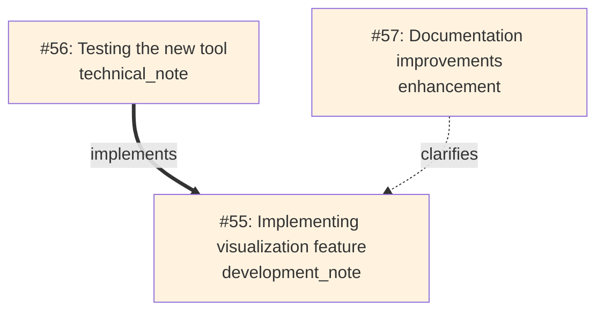

# 🛠️ Memory Journal MCP Server
Last Updated October 8, 2025 3:50 PM EST

[](https://github.com/neverinfamous/memory-journal-mcp)


[](https://hub.docker.com/r/writenotenow/memory-journal-mcp)
[](https://pypi.org/project/memory-journal-mcp/)

*A production-ready developer journal with knowledge graphs, visual relationship mapping, and intelligent search*

**🎉 Now Production/Stable!** Memory Journal has graduated from beta with powerful relationship mapping, 10x faster startup, and comprehensive documentation.

**🚀 Quick Deploy:**
- **[PyPI Package](https://pypi.org/project/memory-journal-mcp/)** - `pip install memory-journal-mcp`
  - **[Docker Hub](https://hub.docker.com/r/writenotenow/memory-journal-mcp)** - Alpine-based (225MB) with full semantic search
- **[MCP Registry](https://registry.modelcontextprotocol.io/)** - Discoverable by MCP clients

**📚 Full Documentation:** [GitHub Wiki](https://github.com/neverinfamous/memory-journal-mcp/wiki)

---

## ✨ What's New in v1.1.3

### 🎉 **Production/Stable Release**
Memory Journal has officially graduated from beta! This release includes:
- 15 MCP tools (up from 13)
- 8 workflow prompts (up from 6)
- 3 MCP resources (up from 2)
- 17 comprehensive wiki pages
- Automatic schema migrations
- Production-grade stability

### 🔗 **Entry Relationships & Knowledge Graphs**
Build connections between your entries with typed relationships:
- `references` - General connections between work
- `implements` - Link implementations to specs/designs
- `clarifies` - Add explanations and elaborations
- `evolves_from` - Track how ideas develop over time
- `response_to` - Thread conversations and replies

### 📊 **Visual Relationship Mapping**
Generate beautiful Mermaid diagrams showing how your work connects:



### ⚡ **Performance Revolution**
- **10x faster startup** - Lazy loading reduces init time from 14s → 2-3s
- **Thread-safe operations** - Zero race conditions in concurrent tag creation
- **Database lock prevention** - Single-connection transactions eliminate conflicts
- **Optimized queries** - Strategic indexes for relationship traversal

### 🛠️ **New Tools** (15 Total, +2 from v1.0)
- `visualize_relationships` - Generate Mermaid diagrams with depth control
- `link_entries` - Create typed relationships between entries
- Plus comprehensive CRUD, triple search, analytics, and export

### 🎯 **Enhanced Workflow Prompts** (8 Total, +2 from v1.0)
- `find-related` - Discover connected entries via semantic similarity
- `prepare-standup` - Daily standup summaries
- `prepare-retro` - Sprint retrospectives
- `weekly-digest` - Day-by-day weekly summaries
- `analyze-period` - Deep period analysis with insights
- `goal-tracker` - Milestone and achievement tracking
- `get-context-bundle` - Project context with Git/GitHub
- `get-recent-entries` - Formatted recent entries

### 📡 **New Resources** (3 Total, +1 from v1.0)
- `memory://graph/recent` - **NEW** Live Mermaid diagram of recent relationships
- `memory://recent` - 10 most recent entries
- `memory://significant` - Significant milestones and breakthroughs

### 🗄️ **Database Improvements**
- Automatic schema migrations (seamless v1.0 → v1.1 upgrades)
- Soft delete support with `deleted_at` column
- New `relationships` table with cascading deletes
- Enhanced indexes for optimal query performance

---

## 🚀 Quick Start

### Option 1: PyPI (Fastest - 30 seconds)

```bash
# Install
pip install memory-journal-mcp

# Add to ~/.cursor/mcp.json
{
  "mcpServers": {
    "memory-journal": {
      "command": "memory-journal-mcp"
    }
  }
}

# Restart Cursor → Start journaling!
```

### Option 2: Docker (Full Features - 2 minutes)

```bash
# Pull image
docker pull writenotenow/memory-journal-mcp:latest

# Create data directory
mkdir data

# Add to ~/.cursor/mcp.json
{
  "mcpServers": {
    "memory-journal": {
      "command": "docker",
      "args": [
        "run", "--rm", "-i", 
        "-v", "./data:/app/data",
        "writenotenow/memory-journal-mcp:latest",
        "python", "src/server.py"
      ]
    }
  }
}

# Restart Cursor → Start journaling!
```

---

## 📋 Core Capabilities

### 🛠️ **15 MCP Tools** - Complete Development Workflow
**Entry Management:**
- `create_entry` / `create_entry_minimal` - Create entries with auto-context
- `update_entry` - Edit existing entries (thread-safe)
- `delete_entry` - Soft or permanent deletion
- `get_entry_by_id` - Retrieve with full relationship details

**Search & Discovery:**
- `search_entries` - FTS5 full-text search with highlighting
- `search_by_date_range` - Time-based filtering with tags
- `semantic_search` - ML-powered similarity (optional)
- `get_recent_entries` - Quick access to recent work

**Relationships & Visualization:**
- `link_entries` - Create typed relationships
- `visualize_relationships` - Generate Mermaid diagrams

**Organization & Analytics:**
- `list_tags` - Tag usage statistics
- `get_statistics` - Comprehensive analytics by time period
- `export_entries` - JSON/Markdown export
- `test_simple` - Connectivity testing

### 🎯 **8 Workflow Prompts** - Automated Productivity
- **`prepare-standup`** - Daily standup summaries from recent entries
- **`prepare-retro`** - Sprint retrospectives with achievements and learnings
- **`weekly-digest`** - Day-by-day weekly summaries
- **`analyze-period`** - Deep analysis with pattern insights
- **`goal-tracker`** - Milestone and achievement tracking
- **`find-related`** - Discover connected entries via semantic similarity
- **`get-context-bundle`** - Complete project context (Git + GitHub)
- **`get-recent-entries`** - Formatted display of recent work

### 🔍 **Triple Search System** - Find Anything, Any Way
1. **Full-text search** - SQLite FTS5 with result highlighting and rank ordering
2. **Date range search** - Time-based filtering with tag and type filters
3. **Semantic search** - FAISS vector similarity for concept-based discovery (optional)

### 🔗 **Entry Relationships** - Build Your Knowledge Graph
- **5 relationship types** - references, implements, clarifies, evolves_from, response_to
- **Bidirectional linking** - See both incoming and outgoing relationships
- **Graph visualization** - Generate Mermaid diagrams with depth control
- **Smart discovery** - Find related entries via semantic similarity and shared tags

### 📊 **Comprehensive Analytics** - Track Your Progress
- Entry counts by type (achievements, notes, milestones, etc.)
- Top tags with usage statistics
- Activity patterns by day/week/month
- Significant milestone tracking
- Export-ready statistics for reports

### 🎨 **Visual Relationship Graphs** - See How Work Connects
- **3 visualization modes** - Entry-centric, tag-based, recent activity
- **Customizable depth** - Control relationship traversal (1-3 hops)
- **Tag filtering** - Focus on specific projects or topics
- **Color-coded nodes** - Personal (blue) vs Project (orange) entries
- **Typed arrows** - Different styles for different relationship types

### 🔄 **Git & GitHub Integration** - Automatic Context Capture
- Repository name and path
- Current branch
- Latest commit (hash + message)
- Recent GitHub issues (via `gh` CLI)
- Working directory
- Timestamp for all context

### 📦 **Data Export** - Own Your Data
- **JSON format** - Machine-readable with full metadata
- **Markdown format** - Human-readable with beautiful formatting
- **Flexible filtering** - By date range, tags, entry types
- **Portable** - Take your journal anywhere

---

## 📖 Usage Examples

### Create an Entry with Relationships

```javascript
// Create a technical achievement
create_entry({
  content: "Implemented lazy loading for ML dependencies - 10x faster startup!",
  entry_type: "technical_achievement",
  tags: ["performance", "optimization", "ml"],
  significance_type: "technical_breakthrough"
})
// Returns: Entry #55

// Link related work
link_entries({
  from_entry_id: 56,  // Testing entry
  to_entry_id: 55,    // Implementation
  relationship_type: "implements"
})

// Visualize the connections
visualize_relationships({
  entry_id: 55,
  depth: 2
})
```

### Search and Analyze

```javascript
// Full-text search with highlighting
search_entries({ query: "performance optimization", limit: 5 })

// Semantic search for concepts
semantic_search({ query: "startup time improvements", limit: 3 })

// Date range with tags
search_by_date_range({
  start_date: "2025-10-01",
  end_date: "2025-10-31",
  tags: ["performance"]
})

// Get analytics
get_statistics({ group_by: "week" })
```

### Generate Visual Maps

```javascript
// Visualize entry relationships
visualize_relationships({
  entry_id: 55,  // Root entry
  depth: 2       // 2 hops out
})

// Filter by tags
visualize_relationships({
  tags: ["visualization", "relationships"],
  limit: 20
})

// Access live graph resource
memory://graph/recent  // Most recent 20 entries with relationships
```

---

## 🏗️ Architecture

```
┌─────────────────────────────────────────────────────────────┐
│ MCP Server Layer (Async/Await)                              │
│  ┌─────────────────┐  ┌─────────────────┐  ┌─────────────┐  │
│  │ Entry Creation  │  │ Triple Search   │  │ Relationship│  │
│  │ with Context    │  │ FTS5/Date/ML    │  │ Mapping     │  │
│  └─────────────────┘  └─────────────────┘  └─────────────┘  │
├─────────────────────────────────────────────────────────────┤
│ Thread Pool Execution Layer                                 │
│  ┌─────────────────┐  ┌─────────────────┐  ┌─────────────┐  │
│  │ Git Operations  │  │ Database Ops    │  │ Lazy ML     │  │
│  │ (2s timeout)    │  │ Single Conn     │  │ Loading     │  │
│  └─────────────────┘  └─────────────────┘  └─────────────┘  │
├─────────────────────────────────────────────────────────────┤
│ SQLite Database with FTS5 + Relationships                   │
│  ┌─────────────────────────────────────────────────────────┐│
│  │ entries + tags + relationships + embeddings + FTS       ││
│  └─────────────────────────────────────────────────────────┘│
└─────────────────────────────────────────────────────────────┘
```

---

## 🔧 Technical Highlights

### Performance & Security
- **10x faster startup** - Lazy loading of ML dependencies (2-3s vs 14s)
- **Thread-safe operations** - Zero race conditions in tag creation
- **WAL mode** - Better concurrency and crash recovery
- **Database lock prevention** - Single-connection transactions
- **Aggressive timeouts** - Git operations fail-fast (2s per command)
- **Input validation** - Length limits, parameterized queries, SQL injection prevention

### Semantic Search (Optional)
- **Model**: `all-MiniLM-L6-v2` (384-dimensional embeddings)
- **Storage**: FAISS index for fast similarity search
- **Graceful degradation**: Works perfectly without ML dependencies

### Data & Privacy
- **Local-first**: Single SQLite file, you own your data
- **Portable**: Move your `.db` file anywhere
- **Secure**: No external API calls, non-root Docker containers

---

## 📚 Documentation

**Full documentation available on the [GitHub Wiki](https://github.com/neverinfamous/memory-journal-mcp/wiki):**

- [Installation Guide](https://github.com/neverinfamous/memory-journal-mcp/wiki/Installation)
- [Tools Reference](https://github.com/neverinfamous/memory-journal-mcp/wiki/Tools)
- [Prompts Guide](https://github.com/neverinfamous/memory-journal-mcp/wiki/Prompts)
- [Relationship Visualization](https://github.com/neverinfamous/memory-journal-mcp/wiki/Visualization)
- [Examples & Tutorials](https://github.com/neverinfamous/memory-journal-mcp/wiki/Examples)
- [Architecture Deep Dive](https://github.com/neverinfamous/memory-journal-mcp/wiki/Architecture)

### GitHub Gists: Practical Examples & Use Cases

**[→ View All Memory Journal Gists](https://gist.github.com/neverinfamous/ffedec3bdb5da08376a381733b80c1a7)**

Explore 5 curated gists with real-world examples and implementation patterns:

1. **[Complete Feature Showcase](https://gist.github.com/neverinfamous/ffedec3bdb5da08376a381733b80c1a7)** - All 15 tools, 8 prompts, and 3 resources
2. **[Relationship Mapping & Knowledge Graphs](https://gist.github.com/neverinfamous/e5f3638dc76b2536df04a02af9647abd)** - Build knowledge graphs with typed relationships
3. **[Triple Search System Guide](https://gist.github.com/neverinfamous/a484535fea7014e8822887abbd8abb38)** - Master FTS5, date range, and semantic search
4. **[Workflow Automation & Prompts](https://gist.github.com/neverinfamous/5d77fb0bf37179effcdc64ecce4f4de2)** - Standup, retrospectives, and weekly digests
5. **[Git Integration & Context Capture](https://gist.github.com/neverinfamous/bf31ca9f0949993275d9d947a2284598)** - Automatic project context from Git and GitHub

---

## 🔗 Resources

- **[GitHub Wiki](https://github.com/neverinfamous/memory-journal-mcp/wiki)** - Complete documentation
- **[GitHub Gists](https://gist.github.com/neverinfamous/ffedec3bdb5da08376a381733b80c1a7)** - 5 practical examples and use cases
- **[Docker Hub](https://hub.docker.com/r/writenotenow/memory-journal-mcp)** - Container images
- **[PyPI Package](https://pypi.org/project/memory-journal-mcp/)** - Python package
- **[MCP Registry](https://registry.modelcontextprotocol.io/)** - Official MCP listing
- **[GitHub Issues](https://github.com/neverinfamous/memory-journal-mcp/issues)** - Bug reports & feature requests
- **[Adamic Support](https://adamic.tech/)** - Project announcements

---

## 📄 License

MIT License - See [LICENSE](LICENSE) file for details.

## 🤝 Contributing

Built by developers, for developers. PRs welcome! See [CONTRIBUTING.md](CONTRIBUTING.md) for guidelines.
