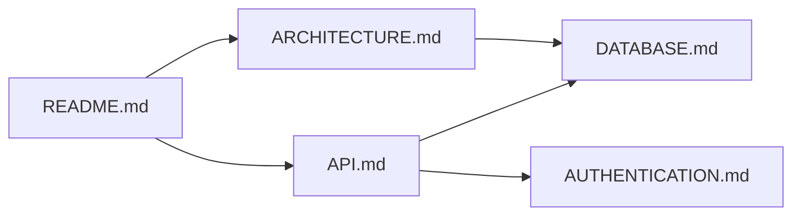

# Future Enhancements - Documentation Management System

**Session**: pr-9-20250930-134756
**PR**: #9
**Generated**: 2025-09-30T13:47:56Z
**Spec**: specs/005-documentation-management-system/

## Context

The documentation management system (PR #9) successfully implements all 25 functional requirements (FR-001 through FR-025) as specified. This document captures enhancement opportunities identified during review that are valuable but not required for the initial implementation.

These enhancements are organized by priority and aligned with the future enhancements section in the original plan.md (lines 262-267).

## High-Value Enhancements (Next 6 Months)

### 1. Documentation Search System
**Value**: HIGH | **Effort**: 4-6 hours | **Risk**: LOW

**Current State**: Documentation organized in folders, manually browsable
**Desired State**: Full-text search across all project documentation

**Implementation Approach**:
```bash
# Add to .multiagent/documentation/scripts/
search-docs.sh [query] [--category] [--file-type]

# Example usage:
./scripts/search-docs.sh "authentication" --category architecture
./scripts/search-docs.sh "API endpoint" --file-type "*.md"
```

**Technical Details**:
- Use ripgrep for fast full-text search
- Index documentation in memory/doc-index.json
- Support category filtering (architecture, API, guides, etc.)
- Implement fuzzy matching for better UX

**Spec Reference**: plan.md line 263 (Future Enhancements)

**Dependencies**:
- Requires doc-registry.json to be populated (already implemented)
- Build on existing category structure

### 2. Performance Benchmarking & Optimization
**Value**: HIGH | **Effort**: 3-4 hours | **Risk**: LOW

**Current State**: Performance targets specified but not validated
**Desired State**: Automated benchmarks verify spec requirements

**Spec Requirements** (plan.md line 41):
- Scan 500 files in <5 seconds
- Generate complete index in <10 seconds
- Update references in <10 seconds

**Implementation Approach**:
```bash
# Add performance test suite
tests/performance/
├── benchmark_scan.py          # Test 500-file scan performance
├── benchmark_index.py         # Test index generation speed
└── benchmark_updates.py       # Test reference update speed
```

**Acceptance Criteria**:
- All benchmarks pass on standard development hardware
- Performance degradation alerts if times exceed 2x targets
- Automated benchmarking in CI/CD pipeline

**Spec Reference**: plan.md technical context (line 41)

### 3. Auto-Generation from Code
**Value**: MEDIUM | **Effort**: 8-12 hours | **Risk**: MEDIUM

**Current State**: Templates filled from specs manually
**Desired State**: Code-to-documentation generation for API endpoints, schemas

**Use Cases**:
1. **API Documentation**: Extract endpoints from FastAPI/Express routes
2. **Database Schema**: Generate schema docs from SQLAlchemy/Prisma models
3. **Configuration**: Document environment variables and config options

**Implementation Approach**:
```python
# Add to docs-update subagent capabilities
def extract_api_endpoints(codebase_path):
    """Parse code files for API route definitions"""
    # Use AST parsing for Python, regex for JavaScript
    # Generate OpenAPI-style documentation

def extract_database_schema(models_path):
    """Extract schema from ORM model definitions"""
    # Parse model classes, extract fields and relationships
    # Generate entity-relationship documentation
```

**Spec Reference**: plan.md line 264 (Future Enhancements)

**Dependencies**:
- Language-specific parsers (ast for Python, esprima for JS)
- Template extensions for auto-generated sections

## Medium-Value Enhancements (6-12 Months)

### 4. Documentation Version Tracking
**Value**: MEDIUM | **Effort**: 6-8 hours | **Risk**: LOW

**Current State**: Git provides version history, but no documentation-specific tracking
**Desired State**: Track which documentation versions correspond to code versions

**Implementation Approach**:
```json
// memory/doc-versions.json
{
  "project_version": "1.0.0",
  "documentation_version": "1.0.0",
  "last_updated": "2025-09-30T13:00:00Z",
  "changelog": [
    {
      "version": "1.0.0",
      "date": "2025-09-30",
      "changes": [
        "Initial documentation set created",
        "API endpoints documented from specs"
      ]
    }
  ],
  "version_mapping": {
    "1.0.0": {
      "code_commit": "abc123",
      "docs_complete": true,
      "coverage": 95
    }
  }
}
```

**Benefits**:
- Track documentation completeness per release
- Identify outdated documentation quickly
- Support semantic versioning for docs

**Spec Reference**: plan.md line 265 (Future Enhancements)

### 5. Quality Scoring System
**Value**: MEDIUM | **Effort**: 4-6 hours | **Risk**: LOW

**Current State**: Documentation exists or doesn't exist (binary)
**Desired State**: Quality metrics for documentation health

**Quality Metrics**:
1. **Completeness**: % of placeholders filled, required sections present
2. **Freshness**: Days since last update, alignment with code changes
3. **Accuracy**: Broken links count, outdated examples
4. **Depth**: Word count, example count, diagram count

**Implementation Approach**:
```python
# Add to docs-validate subagent
def calculate_quality_score(doc_path):
    return {
        "completeness": 95,  # % placeholders filled
        "freshness": 85,     # Days since update
        "accuracy": 90,      # No broken links
        "depth": 80,         # Sufficient detail
        "overall": 87.5      # Weighted average
    }
```

**Output**:
```markdown
# Documentation Health Report

## Overall Quality: 87.5/100 ✅

### By Category:
- Architecture: 92/100 ✅
- API Documentation: 85/100 ⚠️
- User Guides: 78/100 ⚠️
- Testing: 95/100 ✅

### Top Issues:
1. API.md: Missing authentication examples (75/100)
2. SETUP.md: Outdated installation instructions (70/100)
```

**Spec Reference**: plan.md line 266 (Future Enhancements)

### 6. Dependency Graph Visualization
**Value**: MEDIUM | **Effort**: 6-8 hours | **Risk**: MEDIUM

**Current State**: References tracked in consistency-check.json
**Desired State**: Visual graph of document relationships

**Implementation Approach**:
- Generate Mermaid diagrams from doc-registry.json
- Show document dependencies and cross-references
- Identify orphaned documents (no incoming references)

**Example Output**:


**Spec Reference**: plan.md line 267 (Future Enhancements)

## Low-Priority Enhancements (Future Consideration)

### 7. Multi-Language Documentation Support
**Value**: LOW | **Effort**: 12+ hours | **Risk**: HIGH

**Current State**: English-only documentation
**Potential Need**: International teams or multi-language projects

**Complexity Factors**:
- Translation management
- Keeping translations in sync
- Language-specific templates
- Character encoding considerations

**Recommendation**: Defer unless specific international requirement emerges

### 8. Real-Time Collaborative Editing
**Value**: LOW | **Effort**: 16+ hours | **Risk**: HIGH

**Current State**: File-based, git-versioned documentation
**Potential Need**: Multiple writers simultaneously editing

**Spec Note**: Explicitly out of scope (spec.md line 174)

**Recommendation**: Keep out of scope; git workflow sufficient for most use cases

### 9. AI-Powered Documentation Suggestions
**Value**: MEDIUM | **Effort**: 8-12 hours | **Risk**: MEDIUM

**Current State**: Agents fill templates based on specs
**Potential Enhancement**: AI suggests improvements based on code analysis

**Use Cases**:
- Suggest missing sections based on code patterns
- Identify inconsistencies between code and docs
- Recommend examples from similar projects

**Implementation Considerations**:
- Requires LLM integration (Claude API or similar)
- Cost implications for API usage
- Quality control for AI-generated suggestions

**Recommendation**: Evaluate after core system proven in production

## Archive System Improvements

### 10. Archive Repository Migration
**Value**: LOW | **Effort**: 3-4 hours | **Risk**: LOW

**Current State**: .archive/ in main repository (37k lines removed)
**Alternative Approach**: Separate archive repository

**Benefits**:
- Reduce main repository size
- Cleaner git history for active code
- Separate access controls if needed

**Implementation**:
```bash
# Create separate archive repository
git init multiagent-core-archive
git mv .archive/* multiagent-core-archive/
git commit -m "Move archive to dedicated repository"

# Add as submodule if historical access needed
git submodule add <archive-repo-url> .archive
```

**Recommendation**: Low priority; current approach acceptable

### 11. Archive Compression & Cleanup
**Value**: LOW | **Effort**: 2-3 hours | **Risk**: LOW

**Current State**: Uncompressed archived files
**Optimization**: Compress archived content

**Benefits**:
- Reduce disk space usage
- Faster git operations on main repo
- Maintain history without bloat

**Implementation**:
```bash
# Add compression to archive process
tar -czf .archive/legacy-feedback-pipeline.tar.gz .archive/legacy-feedback-pipeline/
rm -rf .archive/legacy-feedback-pipeline/

# Update .gitignore to exclude uncompressed archives
echo ".archive/*.tar.gz" >> .gitignore
```

**Recommendation**: Consider if archive grows significantly larger

## Integration Opportunities

### 12. IDE Plugin Integration
**Value**: MEDIUM | **Effort**: 16+ hours | **Risk**: MEDIUM

**Vision**: VSCode extension for documentation management

**Features**:
- Quick access to project documentation
- In-editor search across docs
- Template suggestions based on file context
- Live documentation preview

**Scope**: Significant undertaking, separate project

### 13. CI/CD Integration Enhancements
**Value**: MEDIUM | **Effort**: 4-6 hours | **Risk**: LOW

**Current State**: Manual documentation updates
**Enhancement**: Automated documentation checks in CI/CD

**Checks to Add**:
1. Documentation completeness (all placeholders filled)
2. Broken link detection
3. Quality score thresholds
4. Coverage requirements (95% target)

**GitHub Actions Workflow**:
```yaml
name: Documentation Validation
on: [pull_request]
jobs:
  validate-docs:
    runs-on: ubuntu-latest
    steps:
      - uses: actions/checkout@v2
      - name: Run docs validation
        run: |
          /docs validate --strict
          # Fail if quality score < 85
```

**Spec Reference**: Aligns with FR-010 validation requirement

## Implementation Priority Matrix

| Enhancement | Value | Effort | Risk | Priority | Timeline |
|------------|-------|--------|------|----------|----------|
| Documentation Search | HIGH | 4-6h | LOW | 1 | Next sprint |
| Performance Benchmarking | HIGH | 3-4h | LOW | 2 | Next sprint |
| Quality Scoring | MEDIUM | 4-6h | LOW | 3 | Q2 2025 |
| CI/CD Integration | MEDIUM | 4-6h | LOW | 4 | Q2 2025 |
| Auto-Generation | MEDIUM | 8-12h | MEDIUM | 5 | Q3 2025 |
| Version Tracking | MEDIUM | 6-8h | LOW | 6 | Q3 2025 |
| Dependency Graphs | MEDIUM | 6-8h | MEDIUM | 7 | Q4 2025 |
| AI Suggestions | MEDIUM | 8-12h | MEDIUM | 8 | Future |
| Archive Migration | LOW | 3-4h | LOW | 9 | As needed |
| Multi-Language | LOW | 12+ h | HIGH | 10 | Not planned |

## Recommendations

### Immediate Next Steps (Sprint 1)
1. **Implement documentation search** (addresses "findability" success metric)
2. **Add performance benchmarks** (validates spec requirements)
3. **Set up CI/CD validation** (ensures ongoing quality)

### Medium-Term Goals (Sprints 2-4)
1. **Quality scoring system** (makes "freshness" metric measurable)
2. **Auto-generation for APIs** (reduces manual maintenance burden)
3. **Version tracking** (supports release documentation workflow)

### Long-Term Vision (6+ months)
1. **Dependency visualization** (helps navigate complex docs)
2. **AI-powered suggestions** (proactive documentation improvement)
3. **IDE integration** (seamless developer experience)

## Success Metrics Alignment

These enhancements map to the original spec success metrics (spec.md lines 143-154):

| Spec Metric | Enhanced By |
|------------|-------------|
| Time Saved (80% reduction) | Auto-generation, Search |
| Coverage (95% target) | Quality scoring, CI/CD checks |
| Accuracy (zero broken refs) | Automated validation, Dependency graphs |
| Organization (100% standard) | Template enforcement, Version tracking |
| Findability (<30 seconds) | **Documentation search** ⭐ |
| Consistency (same patterns) | Quality scoring, CI/CD validation |
| Freshness (<24 hours) | **Performance benchmarks**, Auto-updates |
| Completeness (no undocumented) | Coverage tracking, Quality scoring |

## Conclusion

The current implementation (PR #9) successfully delivers the core documentation management system. These future enhancements build on that foundation to provide:

1. **Better Discoverability**: Search and visualization features
2. **Automated Quality**: Performance benchmarks and CI/CD integration
3. **Reduced Maintenance**: Auto-generation and AI suggestions
4. **Measurable Health**: Quality scoring and version tracking

**Recommended Approach**: Implement high-value, low-risk items first (search, benchmarks, CI/CD), then evaluate medium-term enhancements based on real-world usage patterns.

---
*Generated by MultiAgent Core Judge-Architect*
*Aligned with: specs/005-documentation-management-system/plan.md Future Enhancements*
*Session: pr-9-20250930-134756*
