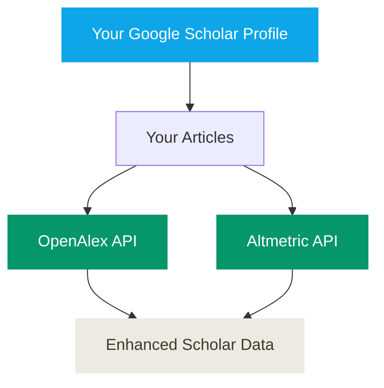
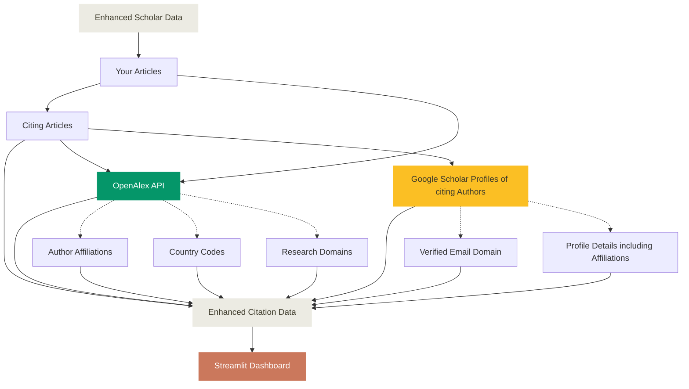

# _ScholarImpact_
A bibliometric tool to analyse, visualise, and share your research impact, output and scholarly influence using Google Scholar and OpenAlex data.

For each article under your Google Scholar Profile, **_ScholarImpact_**: (1) total number of citations, (2) number of unique authors who have cited the article, (3) number of countries from which citations originate, (4) number of institutions from which citations originate, (5) geographic distribution of citations, (6) citation trends over time, (7) research domain analysis, (8) interdisciplinary impact Metrics including Patents and Wikipedia mentions (9) Alternative metrics.


## Workflow Overview
This workflow first extracts author data from your Google Scholar profile and optionally enriches it with OpenAlex and Altmetric data. Then it sources citations for each article under your Google Scholar profile. Next workflow enriches them with information using Google Scholar profiles of citing authors and/or OpenAlex APIs. Finally, output data is used to present your impact of your research with geographic and institutional insights.






## Quick Start

### Prerequisites

Install 
```bash
pip install scholarimpact
```

## Caution
This system is designed for academic research purposes and personal usage. Please use responsibly and in accordance with Google Scholar, OpenAlex, Altmetric terms of services with appropriate attribution.

## Step-by-Step Guide

### Option 1: For Deployment (Recommended)

This approach creates a standalone project suitable for deployment to Streamlit Cloud or local development.

#### Step 1: Generate Dashboard Project

```bash
# Generate a dashboard project
scholarimpact generate-dashboard --output-dir my-research-dashboard --name app.py

# Navigate to the generated folder
cd my-research-dashboard
```

This creates a complete project structure with `app.py`, `requirements.txt`, `.streamlit/config.toml`, and a `static` folder containing fonts used by default theme.

#### Step 2: Extract Author Publications

```bash
# Extract your publications from Google Scholar (OpenAlex and Altmetric enabled by default)
scholarimpact extract-author "YOUR_SCHOLAR_USER_ID"

# With email for higher OpenAlex rate limits (recommended)
scholarimpact extract-author "YOUR_SCHOLAR_USER_ID" --openalex-email your.email@example.com

# Or use full URL
scholarimpact extract-author "https://scholar.google.com/citations?user=YOUR_SCHOLAR_USER_ID"
```

This creates `data/author.json` with your publication list, enriched with OpenAlex and Altmetric metrics by default.

#### Step 3: Crawl Citation Data

```bash
# Crawl citations with OpenAlex enrichment
scholarimpact crawl-citations data/author.json --openalex-email your.email@example.com
```

This creates `data/cites-{ID}.json` files for each publication.

#### Step 4: Test Locally

```bash
# Run the dashboard locally
streamlit run app.py

# Or alternatively
python app.py
```

Open `http://localhost:8501`to view your dashboard.

#### Step 5: Push your changes to a Github Repository

```bash
# Initialize git repository
git init
git add .
git commit -m "Initial research dashboard"

# Create GitHub repository and push
git remote add origin https://github.com/YOUR_USERNAME/YOUR_REPO.git
git branch -M main
git push -u origin main
```

#### Step 6: Deploy on Streamlit Cloud

1. Go to [share.streamlit.io](https://share.streamlit.io)
2. Click "New app"
3. Connect your GitHub account
4. Select your repository and branch
5. Set main file path: `app.py` (or your custom name)
6. Click "Deploy"

#### Step 7: Project Structure for Deployment

Your repository should contain:
```
my-research-dashboard/
├── app.py                    # Main dashboard file
├── requirements.txt          # Python dependencies
├── .streamlit/
│   └── config.toml          # Streamlit configuration
├── static/                  # Static assets (fonts from scholarimpact/assets/fonts)
│   ├── SpaceGrotesk-SemiBold.ttf
│   ├── SpaceGrotesk-VariableFont_wght.ttf
│   ├── SpaceMono-Regular.ttf
│   ├── SpaceMono-Bold.ttf
│   ├── SpaceMono-Italic.ttf
│   ├── SpaceMono-BoldItalic.ttf
│   └── OFL-*.txt           # Font licenses
└── data/
    ├── author.json          # Author profile data
    └── cites-*.json         # Citation data files
```

#### Step 8: Update Data

To update citation data:

1. Re-run step-2 and step-3 to update data files
2. Commit changes and push them to your GitHub repository
3. Streamlit Cloud will automatically detect changes and restart the app

#### Tips for Streamlit Cloud Deployment

- Keep data files under 100MB each for optimal performance
- Use `.gitignore` to exclude unnecessary files
- Set secrets in Streamlit Cloud settings if needed
- Monitor app logs in Streamlit Cloud dashboard for debugging

### Option 2: For Quick Local Testing

This approach is fastest for local analysis without deployment needs.

#### Step 1: Extract Author Publications

```bash
# Extract publications directly
scholarimpact extract-author "YOUR_SCHOLAR_USER_ID"
```

#### Step 2: Crawl Citation Data

```bash
# Crawl citations
scholarimpact crawl-citations data/author.json --openalex-email your.email@example.com
```

#### Step 3: Launch Dashboard

```bash
# Run dashboard directly
ScholarImpact
```

The dashboard opens at `http://localhost:8501`.

## CLI Options Reference

### `scholarimpact extract-author` Command

Extract author publications from Google Scholar with OpenAlex and Altmetric enrichment:

```bash
scholarimpact extract-author [OPTIONS] SCHOLAR_ID
```

Arguments:
- `SCHOLAR_ID`: Google Scholar author ID or full profile URL

Options:
| Option | Type | Default | Description |
|--------|------|---------|-------------|
| `--max-papers N` | int | None | Maximum number of papers to analyze (default: all) |
| `--delay X` | float | 2.0 | Delay between requests in seconds |
| `--output-dir DIR` | str | ./data | Output directory for author.json |
| `--output-file FILE` | str | None | Custom output file path (overrides output-dir) |
| `--use-openalex/--no-openalex` | flag | True | Enable OpenAlex enrichment (default: enabled) |
| `--openalex-email EMAIL` | str | None | Email for OpenAlex API (optional, for higher rate limits) |
| `--use-altmetric/--no-altmetric` | flag | True | Enable Altmetric enrichment (requires OpenAlex, default: enabled) |

OpenAlex enrichment adds (all fields prefixed with `openalex_`):
- `openalex_ids`: Object containing all identifiers:
  - `openalex`: OpenAlex work URL
  - `doi`: Digital Object Identifier URL
  - `mag`: Microsoft Academic Graph ID
  - `pmid`: PubMed ID URL
- `openalex_type`: Publication type (article, book, etc.)
- `openalex_citation_normalized_percentile`: Percentile ranking of citations
- `openalex_cited_by_percentile_year`: Citation percentile by year
- `openalex_fwci`: Field-Weighted Citation Impact
- `openalex_cited_by_count`: OpenAlex citation count
- `openalex_primary_topic`: Main research topic
- `openalex_domain`, `openalex_field`, `openalex_subfield`: Hierarchical classification

Altmetric enrichment adds (all fields prefixed with `altmetric_`):
- `altmetric_score`: Overall Altmetric attention score
- `altmetric_cited_by_wikipedia_count`: Citations in Wikipedia
- `altmetric_cited_by_patents_count`: Citations in patents
- `altmetric_cited_by_accounts_count`: Social media accounts mentioning
- `altmetric_cited_by_posts_count`: Social media posts mentioning
- `altmetric_scopus_subjects`: Scopus subject classifications
- `altmetric_readers`: Reader counts by platform (Mendeley, CiteULike, etc.)
- `altmetric_readers_count`: Total reader count
- `altmetric_images`: Altmetric badge images (small, medium, large)
- `altmetric_details_url`: Link to detailed Altmetric page

Examples:
```bash
# Basic usage (OpenAlex and Altmetric enabled by default)
scholarimpact extract-author "ABC123DEF"

# With email for higher OpenAlex rate limits
scholarimpact extract-author "ABC123DEF" --openalex-email your.email@example.com

# Disable Altmetric enrichment (keep OpenAlex)
scholarimpact extract-author "ABC123DEF" --no-altmetric

# Disable all enrichment (Google Scholar only)
scholarimpact extract-author "ABC123DEF" --no-openalex --no-altmetric

# Limit to first 20 papers with 3-second delays
scholarimpact extract-author "ABC123DEF" --max-papers 20 --delay 3

# Custom output file with email for higher limits
scholarimpact extract-author "ABC123DEF" --output-file data/my_author.json --openalex-email your.email@example.com

# Full URL format
scholarimpact extract-author "https://scholar.google.com/citations?user=ABC123DEF"
```

### `scholarimpact crawl-citations` Command

Crawl citations with OpenAlex integration:

```bash
scholarimpact crawl-citations [OPTIONS] AUTHOR_JSON
```

Arguments:
- `AUTHOR_JSON`: Path to author.json file containing publications

Options:
| Option | Type | Default | Description |
|--------|------|---------|-------------|
| `--openalex-email EMAIL` | str | None | Email for OpenAlex API (higher rate limits) |
| `--max-citations N` | int | None | Maximum citations per paper |
| `--delay-min X` | float | 5.0 | Minimum delay between requests (seconds) |
| `--delay-max Y` | float | 10.0 | Maximum delay between requests (seconds) |
| `--output-dir DIR` | str | None | Output directory (defaults to author.json directory) |

Examples:
```bash
# Basic usage with OpenAlex
scholarimpact crawl-citations data/author.json --openalex-email me@university.edu

# Custom delays
scholarimpact crawl-citations data/author.json --delay-min 3 --delay-max 8

# Custom output directory
scholarimpact crawl-citations data/author.json --output-dir custom_data

# Limit citations per paper
scholarimpact crawl-citations data/author.json --max-citations 100
```

### `ScholarImpact` Command

Launch the interactive dashboard:

```bash
ScholarImpact [OPTIONS]
```

Options:
| Option | Type | Default | Description |
|--------|------|---------|-------------|
| `--port N` | int | 8501 | Port to run the dashboard on |
| `--address ADDR` | str | localhost | Address to bind the server to |
| `--data-dir DIR` | str | ./data | Directory containing citation data files |

Examples:
```bash
# Basic usage
ScholarImpact

# Custom port
ScholarImpact --port 8502

# External access
ScholarImpact --address 0.0.0.0

# Different data directory
ScholarImpact --data-dir custom_data
```

### `scholarimpact quick-start` Command

Complete analysis pipeline from Scholar ID to dashboard:

```bash
scholarimpact quick-start [OPTIONS] SCHOLAR_ID
```

Arguments:
- `SCHOLAR_ID`: Google Scholar author ID or full profile URL

Options:
| Option | Type | Default | Description |
|--------|------|---------|-------------|
| `--openalex-email EMAIL` | str | None | OpenAlex email for enhanced data |
| `--output-dir DIR` | str | ./data | Output directory for all data |
| `--launch-dashboard/--no-dashboard` | flag | True | Launch dashboard after analysis |

Examples:
```bash
# Complete pipeline with dashboard
scholarimpact quick-start "ABC123DEF" --openalex-email me@university.edu

# Skip dashboard launch
scholarimpact quick-start "ABC123DEF" --no-dashboard

# Custom output directory
scholarimpact quick-start "ABC123DEF" --output-dir results
```

### `scholarimpact generate-dashboard` Command

Generate a standalone dashboard project for deployment to Streamlit Cloud:

```bash
scholarimpact generate-dashboard [OPTIONS]
```

Options:
| Option | Type | Default | Description |
|--------|------|---------|-------------|
| `--output-dir DIR` | str | . | Output directory for generated files |
| `--name FILE` | str | my_dashboard.py | Name of the dashboard file |
| `--data-dir DIR` | str | ./data | Data directory path for dashboard |
| `--title TEXT` | str | My Citation Dashboard | Dashboard title |

Examples:
```bash
# Generate dashboard in current directory
scholarimpact generate-dashboard

# Custom output directory and title
scholarimpact generate-dashboard --output-dir my-project --title "Research Impact Analysis"

# Custom data directory location
scholarimpact generate-dashboard --data-dir ../citation_data --name app.py
```

This command generates:

- A dashboard Python file (default: `my_dashboard.py`)
- `.streamlit/config.toml` with theme configuration
- `requirements.txt` for deployment
- `static` folder containing fonts used by default theme

## Citation

[](https://doi.org/10.5281/zenodo.17282762)

If you use ScholarImpact in your research, please cite it as:

```bibtex
@software{tiwari_2025_17282762,
  author       = {Tiwari, Abhishek},
  title        = {ScholarImpact: A bibliometric tool to analyse, visualise, and share your research impact, output and scholarly influence using Google Scholar and OpenAlex data},
  month        = oct,
  year         = 2025,
  publisher    = {Zenodo},
  doi          = {10.5281/zenodo.17282762},
  url          = {https://doi.org/10.5281/zenodo.17282762},
}
```

**APA Format:**
```
Tiwari, A. (2025). ScholarImpact: A bibliometric tool to analyse, visualise, and share your research impact, output and scholarly influence using Google Scholar and OpenAlex data. (v0.0.6). Zenodo. https://doi.org/10.5281/zenodo.17282762
```

**MLA Format:**
```
Tiwari, A. Scholarimpact: A Bibliometric Tool to Analyse, Visualise, and Share Your Research Impact, Output and Scholarly Influence Using Google Scholar and Openalex Data. v0.0.6, Zenodo, 7 Oct. 2025, https://doi.org/10.5281/zenodo.17282762.
```
