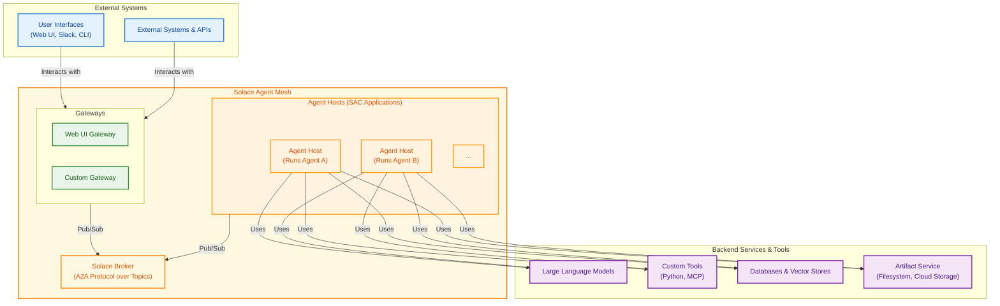

# Solace Agent Mesh Architecture

## Overview

Solace Agent Mesh is an event-driven framework for creating a distributed ecosystem of collaborative AI agents. The architecture is designed to decouple agent logic from communication and orchestration, enabling scalability, resilience, and modularity.

It integrates three primary technologies:
- **Solace Event Broker**: Provides the messaging fabric for all asynchronous communication, utilizing topic-based routing for the Agent-to-Agent (A2A) protocol.
- **Solace AI Connector (SAC)**: Serves as the runtime environment for hosting and managing the lifecycle of all system components (Agents and Gateways).
- **Google Agent Development Kit (ADK)**: Provides the core logic for individual agents, including LLM interaction, tool execution, and state management.

## Architectural Principles

The design of Solace Agent Mesh is founded on several key architectural principles:

- **Event-Driven Architecture (EDA)**: All interactions between major components are asynchronous and mediated by the event broker. This eliminates direct dependencies, allowing components to be developed, deployed, and scaled independently.
- **Component Decoupling**: Gateways, Agent Hosts, and other services communicate through standardized A2A protocol messages over the event mesh. They do not require knowledge of each other's network location, implementation language, or internal logic.
- **Scalability and Resilience**: The architecture supports horizontal scaling of Agent Hosts and Gateways. The event broker provides fault tolerance and guaranteed message delivery, ensuring system resilience even if individual components fail or are restarted.

## System Components

The architecture comprises several distinct types of components that interact through the Solace broker.

### Solace Event Broker

The broker is the central messaging fabric. It is responsible for routing all A2A protocol messages between components using a hierarchical topic structure. This enables patterns like request/reply, streaming updates, and publish/subscribe for discovery.

### Gateways

Gateways are SAC applications that act as bridges between external systems and the agent mesh. Their primary responsibilities are:
- **Protocol Translation**: Convert external protocols (for example, HTTP, WebSockets, Slack RTM) into the standardized A2A protocol, and vice-versa.
- **Authentication and Authorization**: Authenticate incoming requests and, using a pluggable `AuthorizationService`, retrieve the user's permission scopes.
- **Session Management**: Manage external user sessions and map them to A2A task lifecycles.
- **Response Handling**: Receive asynchronous A2A responses and status updates from agents and deliver them to the external client.

The **Gateway Development Kit (GDK)** provides `BaseGatewayApp` and `BaseGatewayComponent` classes to abstract common gateway logic, such as A2A protocol handling, agent discovery, and late-stage embed resolution, simplifying the creation of new gateways.

### Agent Hosts

An Agent Host is a SAC application (`SamAgentApp`) that hosts a single ADK-based agent. Its key architectural functions include:
- **Hosting the ADK Runtime**: It manages the lifecycle of the ADK `Runner` and `LlmAgent`.
- **A2A Protocol Handling**: The internal `SamAgentComponent` translates incoming A2A requests into ADK `Task` objects and converts ADK `Event` objects into outgoing A2A `TaskStatusUpdateEvent`, `TaskArtifactUpdateEvent`, or final response messages.
- **Scope Enforcement**: It extracts permission scopes from incoming message properties and filters the agent's available tools accordingly.
- **Service Initialization**: It initializes ADK services like the `ArtifactService` and `MemoryService` based on its configuration.

### Agents

An agent is the logical entity within an Agent Host that performs tasks. It is defined by its configuration, which includes:
- **Instructions**: The base prompt that defines its persona, capabilities, and constraints.
- **LLM Configuration**: The specific large language model to use.
- **Toolset**: A collection of available tools, which can be built-in, custom Python functions, or MCP Toolsets.

## Key Architectural Flows

### User Task Processing Flow

1.  An external client sends a request to a **Gateway**.
2.  The Gateway authenticates the request, retrieves the user's permission scopes via its `AuthorizationService`, and translates the request into an A2A task message. It includes the scopes in the Solace message's user properties.
3.  The Gateway publishes the message to the target agent's request topic on the **Solace Broker**.
4.  The corresponding **Agent Host** receives the message. The `SamAgentComponent` extracts the scopes and initiates an ADK task.
5.  The ADK `LlmAgent` processes the task. Before invoking the LLM, a `before_model_callback` filters the available tools based on the user's scopes.
6.  As the agent executes, the `SamAgentComponent` translates ADK events into A2A status and artifact update messages, publishing them to the originating Gateway's status topic.
7.  The Gateway receives these streaming updates, performs any necessary late-stage processing (like resolving `artifact_content` embeds), and forwards them to the client.
8.  Upon completion, the Agent Host sends a final A2A response message to the Gateway, which delivers it to the client.

### Agent-to-Agent Delegation Flow

1.  **Agent A**, while processing a task, determines a sub-task should be delegated to **Agent B**.
2.  Agent A uses its `PeerAgentTool` to construct a new A2A task request for Agent B. It propagates the original user's permission scopes to maintain the security context.
3.  The request is published to Agent B's request topic.
4.  **Agent B's Host** receives and processes the sub-task, enforcing the propagated scopes on its own toolset.
5.  Agent B sends status updates and a final response to topics designated by Agent A.
6.  Agent A receives the results and incorporates them into its ongoing task.

### Agent Discovery Flow

1.  On startup and periodically, each **Agent Host** publishes an `AgentCard` (a JSON document describing its agent's capabilities) to a well-known discovery topic (for example, `{namespace}/a2a/v1/discovery/agentcards`).
2.  **Gateways** and other **Agent Hosts** subscribe to this topic.
3.  Upon receiving an `AgentCard`, components update their local `AgentRegistry`, making them aware of available agents for user selection (at the Gateway) or peer delegation (at the Agent).

## A2A Protocol and Topic Structure

The A2A protocol is based on JSON-RPC 2.0 and defines the message formats for all interactions. Communication is routed via a hierarchical topic structure on the Solace broker.

| Purpose                  | Topic Pattern                                                    |
| ------------------------ | ---------------------------------------------------------------- |
| **Agent Discovery**      | `{namespace}/a2a/v1/discovery/agentcards`                        |
| **Task Requests**        | `{namespace}/a2a/v1/agent/request/{target_agent_name}`           |
| **Status Updates**       | `{namespace}/a2a/v1/gateway/status/{gateway_id}/{task_id}`       |
| **Final Responses**      | `{namespace}/a2a/v1/gateway/response/{gateway_id}/{task_id}`     |
| **Peer Delegation Status** | `{namespace}/a2a/v1/agent/status/{delegating_agent_name}/{sub_task_id}` |
| **Peer Delegation Response** | `{namespace}/a2a/v1/agent/response/{delegating_agent_name}/{sub_task_id}`|

This topic structure allows for precise, point-to-point routing in a decoupled, asynchronous environment.
