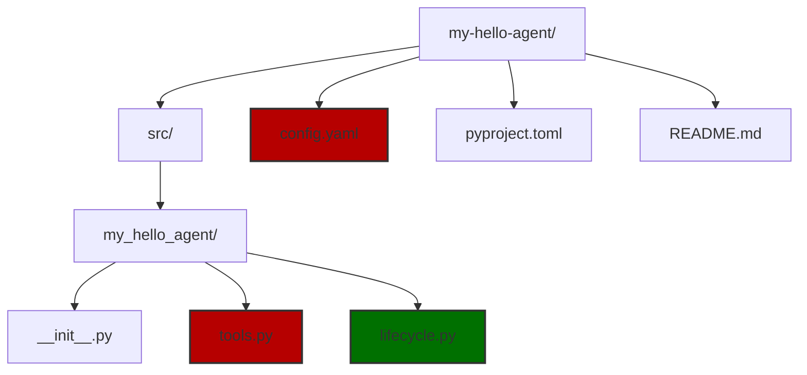
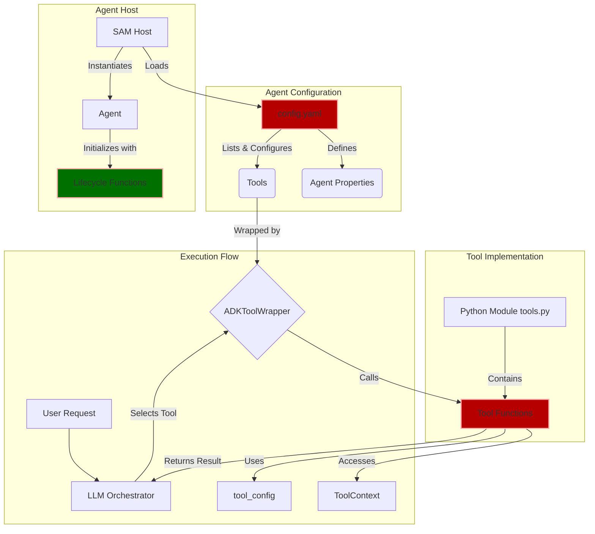

# Creating Agents

## Introduction

:::tip
For a more comprehensive tutorial example, see the [Build Your Own Agent](../tutorials/custom-agent.md) guide.
This page provides an in-depth theoretical overview of creating agents in Solace Agent Mesh.
:::

Solace Agent Mesh is a powerful platform that enables you to create intelligent agents that can communicate with each other and perform complex tasks. At its core, Solace Agent Mesh uses a **tool-based architecture** where LLM-powered agents are equipped with specific capabilities (tools) that they can use to accomplish user requests.

**Before continuing with this tutorial, make sure you are familiar with the basic [agent concept](../concepts/agents.md).**

This tutorial guides you through creating your first Solace Agent Mesh agent from scratch. You will learn how to:

- Define tools as Python functions
- Configure an agent using YAML
- Set up agent lifecycle functions

By the end of this tutorial, you should have a working "Hello World" agent that demonstrates the fundamental concepts of Solace Agent Mesh agent development.

## Quick Start: Creating Your First Agent

You can create an agent directly using the Solace Agent Mesh CLI `sam add agent`:

```bash
sam add agent my-first-agent
```

This command:
- Launches an interactive setup (or use `--gui` for browser-based configuration)
- Generates the necessary files and configuration
- Sets up the basic agent structure

Note that create agent as plugin is preferred over create agent directly.

### CLI Options

You can customize the agent creation with provided CLI options.

For a complete list of options, run:
```bash
sam add agent --help
```

## Core Concepts

Before diving into the implementation, it is important to understand the key concepts that make Solace Agent Mesh agents work:

### Tools

**Tools are the fundamental building blocks of Solace Agent Mesh agents.** Each tool is implemented as a Python function that performs a specific task. Tools can:

- Process text and data
- Interact with external APIs
- Create and manipulate files
- Communicate with other agents
- Access databases and services

The LLM (Large Language Model) orchestrating your agent decides which tools to use based on the user's request and the tool descriptions you provide.

:::tip
Solace Agent Mesh provides a set of [built-in tools](./builtin-tools/builtin-tools.md) plus support for [model context protocol (MCP)](../tutorials/mcp-integration.md) servers, which can be configured in the tools list of your agent configuration.
:::

### Configuration File 

The `config.yaml` (for plugin template) or `agent-name.yaml` (for agent instances) file is the blueprint of your agent. It defines:

- **Agent identity**: Name, description, and capabilities
- **Model configuration**: Which LLM to use
- **Tools list**: Defines which tools the agent can access and how they're configured
- **Lifecycle functions**: Setup and cleanup procedures
- **Framework services**: Session management, artifact storage, and so on.
- **[Agent card](../concepts/agents.md#agent-card)**: Metadata describing the agent capabilities, skills and its visibility in the system

### Tool Configuration

Within the `tools` list in your YAML config, each tool can have its own `tool_config` section. This allows you to:

- Configure the same tool function for different purposes
- Pass specific parameters to tool instances
- Customize tool behavior per agent

:::info
For tools of type "python", you can also use the `tool_name` and `tool_description` to overwrite the function name and description in the tool docstring.

This is useful when using a generic tool function for multiple purposes, allowing you to provide a more descriptive name and description for each instance.
:::

### ToolContext

The `ToolContext` object (passed as one of the arguments to your tool function) provides your tools with access to Solace Agent Mesh core services:

- **Logging**: Structured logging for debugging and monitoring
- **Artifact Service**: File storage and retrieval
- **Session Information**: Current user and session context
- **Agent State**: Shared data between tool calls

### Lifecycle Functions

Lifecycle functions allow you to manage resources that should persist for the agent's lifetime:

- **`agent_init_function`**: Runs when the agent starts (for example, database connections)
- **`agent_cleanup_function`**: Runs when the agent shuts down (for example, closing connections)

:::note
Lifecycle functions are optional but recommended for managing resources effectively.
:::

## Creating an Agent Plugin: Step-by-Step

Create a simple agent that can greet users and demonstrate the core concepts.

You can create an agent either by using the `sam add agent` command or by creating a new plugin of type agent, `sam plugin create my-hello-agent --type agent`. 

:::tip
For information and recommendations about these options, see [`Agent or Plugin: Which To use?`](../concepts/plugins.md#agent-or-plugin-which-to-use).
:::


### Step 1: Initialize your Agent

In this tutorial, you create a new agent by creating a new plugin of type agent.
For an example of custom agents, see [Build Your Own Agent](../tutorials/custom-agent.md) guide.

Although the directory structure for plugins is slightly different than the one for agents, both require a YAML configuration file, and a python module with the tools and lifecycle functions you want.

To create a new agent plugin, run the following command:

```bash
sam plugin create my-hello-agent --type agent
```
And follow the prompts to set up your agent. The prompts create a new directory structure for your agent.

```
my-hello-agent/
├── src/
│   └── my_hello_agent/
│       ├── __init__.py
│       ├── tools.py
│       └── lifecycle.py # This file won't be automatically created
├── config.yaml
├── pyproject.toml
└── README.md
```



### Step 2: The Tool Function

Create your first tool function:
The following arguments are provided by the framework:
- tool_context: Solace Agent Mesh framework context
- tool_config: Tool-specific configuration (from config.yaml)

For a complete guide on creating python tools, see our **[Creating Python Tools](./creating-python-tools.md)** documentation.

```python
# src/my_hello_agent/tools.py
"""
Tools for the Hello World agent.
"""

from typing import Any, Dict, Optional
from google.adk.tools import ToolContext
from solace_ai_connector.common.log import log


async def hello_tool(
    name: str,
    tool_context: Optional[ToolContext] = None,
    tool_config: Optional[Dict[str, Any]] = None
) -> Dict[str, Any]:
    """
    Greets a user with a personalized message.
    
    Args:
        name: The name of the person to greet
    
    Returns:
        A dictionary with the greeting message
    """
    log_identifier = "[HelloTool]"
    log.info(f"{log_identifier} Greeting user: {name}")
    
    # Get configuration from tool_config
    greeting_prefix = "Hello"
    if tool_config:
        greeting_prefix = tool_config.get("greeting_prefix", "Hello")
    
    # Create the greeting message
    greeting_message = f"{greeting_prefix}, {name}! Welcome to Solace Agent Mesh!"
    
    log.info(f"{log_identifier} Generated greeting: {greeting_message}")
    
    return {
        "status": "success",
        "message": greeting_message,
        "greeted_name": name
    }


async def farewell_tool(
    name: str,
    tool_context: Optional[ToolContext] = None,
    tool_config: Optional[Dict[str, Any]] = None
) -> Dict[str, Any]:
    """
    Says goodbye to a user.
    
    Args:
        name: The name of the person to say goodbye to
    
    Returns:
        A dictionary with the farewell message
    """
    log_identifier = "[FarewellTool]"
    log.info(f"{log_identifier} Saying goodbye to user: {name}")
    
    # Get configuration from tool_config
    farewell_prefix = "Goodbye"
    if tool_config:
        farewell_prefix = tool_config.get("farewell_prefix", "Goodbye")
    
    # Create the farewell message
    farewell_message = f"{farewell_prefix}, {name}! Thanks for using Solace Agent Mesh!"
    
    log.info(f"{log_identifier} Generated farewell: {farewell_message}")
    
    return {
        "status": "success",
        "message": farewell_message,
        "farewell_name": name
    }
```

**Key Points:**

- **Function Signature**: All tool functions should be `async` and accept `tool_context` and `tool_config` parameters
- **Return Format**: Return a dictionary with at least a `status` field
- **Logging**: Use the Solace Agent Mesh logger for consistent logging
- **Configuration**: Access tool-specific config via the `tool_config` parameter

### Step 3: The Agent Configuration

Create the main configuration file for your agent:

```yaml
# File: config.yaml (at root of project directory)
# ... (additional services and configurations)

apps:
  - name: my-hello-agent
    app_module: solace_agent_mesh.agent.sac.app 
    broker:
      # Can be found in configs/shared_config.yaml after running sam init
      <<: *broker_connection
    
    # Agent-specific configuration
    app_config:
      # Basic agent identity
      namespace: ${NAMESPACE} 
      supports_streaming: true 
      agent_name: "HelloAgent"
      display_name: "Hello World Agent"
      
      # LLM model configuration
      model: *general_model 
      
      # Agent instructions (system prompt)
      instruction: |
        You are a friendly Hello World agent. Your purpose is to greet users and 
        demonstrate the capabilities of Solace Agent Mesh. You can:
        
        1. Greet users with personalized messages using the hello_tool
        2. Say goodbye to users using the farewell_tool
        
        Always be polite and helpful. When greeting someone, ask for their name 
        if they haven't provided it.
      
      # Lifecycle functions
      agent_init_function:
        module: "my_hello_agent.lifecycle" # This should point to your lifecycle python module
        name: "initialize_hello_agent"
        base_path: .
        config:
          startup_message: "Hello Agent is starting up!"
          log_level: "INFO"
      
      agent_cleanup_function:
        module: "my_hello_agent.lifecycle"
        base_path: .
        name: "cleanup_hello_agent"
      
      # Tools configuration
      tools:
        # Hello tool with custom greeting
        - tool_type: python
          component_module: "my_hello_agent.tools"
          component_base_path: .
          function_name: "hello_tool"
          tool_name: "greet_user" # Renaming the tool, must use this name in the agent card
          tool_config:
            greeting_prefix: "Hello there"
        
        # Farewell tool with custom farewell
        - tool_type: python
          component_module: "my_hello_agent.tools"
          component_base_path: .
          function_name: "farewell_tool"
          tool_name: "say_goodbye"
          tool_config:
            farewell_prefix: "See you later"
        
        # Built-in artifact tools for file operations
        - tool_type: builtin-group
          group_name: "artifact_management"
      
      # Agent card (describes the agent's capabilities)
      agent_card:
        description: "A friendly Hello World agent that demonstrates Solace Agent Mesh capabilities"
        defaultInputModes: ["text"]
        defaultOutputModes: ["text"]
        skills:
          - id: "greet_user"
            name: "Greet User"
            description: "Greets users with personalized messages"
          - id: "say_goodbye"
            name: "Say Goodbye"
            description: "Says goodbye to users"
          - id: "file_operations"
            name: "File Operations"
            description: "Create, read, and manage files and artifacts"
      
      # Session and artifact services
      session_service: *default_session_service
      artifact_service: *default_artifact_service
# ... (additional services and configurations)
```

**Key Sections Explained:**

- **`namespace`**: Unique identifier for your agent in the mesh
- **`model`**: LLM configuration (can be a string or detailed config)
- **`instruction`**: The system prompt that defines your agent's behavior
- **`tools`**: List of tools your agent can use, with their configurations
- **`agent_card`**: Metadata describing your agent's capabilities

### Step 4: The Lifecycle Function

Lifecycle functions are completely optional but useful for managing resources. They run when the agent starts and stops.

The lifecycle file is not automatically created, so you need to create it manually:

```bash
touch src/my_hello_agent/lifecycle.py
```

```python
# src/my_hello_agent/lifecycle.py
"""
Lifecycle functions for the Hello World agent.
"""

from typing import Any, Dict
from pydantic import BaseModel, Field
from solace_ai_connector.common.log import log


class HelloAgentInitConfig(BaseModel):
    """
    Configuration model for the Hello Agent initialization.
    """
    startup_message: str = Field(description="Message to log on startup")
    log_level: str = Field(default="INFO", description="Logging level for the agent")


def initialize_hello_agent(host_component: Any, init_config: HelloAgentInitConfig):
    """
    Initializes the Hello World agent.
    
    Args:
        host_component: The agent host component
        init_config: Validated initialization configuration
    """
    log_identifier = f"[{host_component.agent_name}:init]"
    log.info(f"{log_identifier} Starting Hello Agent initialization...")
    
    # Log the startup message from config
    log.info(f"{log_identifier} {init_config.startup_message}")
    
    # You could initialize shared resources here, such as:
    # - Database connections
    # - API clients
    # - Caches or shared data structures
    
    # Store any shared state in the agent
    host_component.set_agent_specific_state("initialized_at", "2024-01-01T00:00:00Z")
    host_component.set_agent_specific_state("greeting_count", 0)
    
    log.info(f"{log_identifier} Hello Agent initialization completed successfully")


def cleanup_hello_agent(host_component: Any):
    """
    Cleans up resources when the Hello World agent shuts down.
    
    Args:
        host_component: The agent host component
    """
    log_identifier = f"[{host_component.agent_name}:cleanup]"
    log.info(f"{log_identifier} Starting Hello Agent cleanup...")
    
    # Retrieve any shared state
    greeting_count = host_component.get_agent_specific_state("greeting_count", 0)
    log.info(f"{log_identifier} Agent processed {greeting_count} greetings during its lifetime")
    
    # Clean up resources here, such as:
    # - Closing database connections
    # - Shutting down background tasks
    # - Saving final state
    
    log.info(f"{log_identifier} Hello Agent cleanup completed")
```

**Key Points:**

- **Pydantic Models**: Use Pydantic for configuration validation
- **Shared State**: Store data that persists across tool calls
- **Resource Management**: Initialize connections in `init`, clean up in `cleanup`

## Advanced Concepts

### Working with Artifacts

You can enhance our hello tool to save greetings to a file using Solace Agent Mesh's artifact service:

```python

from datetime import datetime
from solace_agent_mesh.agent.utils.artifact_helpers import save_artifact_with_metadata

async def hello_tool_with_artifact(
    name: str,
    save_to_file: bool = False,
    tool_context: Optional[ToolContext] = None,
    tool_config: Optional[Dict[str, Any]] = None
) -> Dict[str, Any]:
    """
    Greets a user and optionally saves the greeting to a file.
    """
    log_identifier = "[HelloToolWithArtifact]"
    
    # Generate greeting (same as before)
    greeting_prefix = tool_config.get("greeting_prefix", "Hello") if tool_config else "Hello"
    greeting_message = f"{greeting_prefix}, {name}! Welcome to Solace Agent Mesh!"
    
    result = {
        "status": "success",
        "message": greeting_message,
        "greeted_name": name
    }
    
    # Save to artifact if requested
    if save_to_file and tool_context:
        try:
            # Prepare content
            timestamp = datetime.now(timezone.utc)
            filename = f"greeting_{name}_{timestamp}.txt"
            content = f"Greeting: {greeting_message}\nTimestamp: {timestamp}\n"
            
            # Save artifact
            artifact_service = tool_context._invocation_context.artifact_service
            await save_artifact_with_metadata(
                artifact_service=artifact_service,
                app_name=tool_context._invocation_context.app_name,
                user_id=tool_context._invocation_context.user_id,
                session_id=tool_context._invocation_context.session.id,
                filename=filename,
                content_bytes=content.encode('utf-8'),
                mime_type="application/json",
                metadata_dict={
                    "description": "Greeting message",
                    "source": "Greeting Agent",
                },
                timestamp=timestamp
            )
            
            result["artifact_saved"] = filename
            log.info(f"{log_identifier} Saved greeting to artifact: {filename}")
        
        except Exception as e:
            log.error(f"{log_identifier} Failed to save artifact: {e}")
            result["artifact_error"] = str(e)
    
    return result
```

### Using Multiple Tool Configurations

You can configure the same tool function multiple times with different settings:

```yaml
tools:
  # Formal greeting
  - tool_type: python
    component_module: "my_hello_agent.tools"
    function_name: "hello_tool"
    tool_name: "formal_greeting"
    tool_config:
      greeting_prefix: "Good day"
  
  # Casual greeting
  - tool_type: python
    component_module: "my_hello_agent.tools"
    function_name: "hello_tool"
    tool_name: "casual_greeting"
    tool_config:
      greeting_prefix: "Hey there"
  
  # Enthusiastic greeting
  - tool_type: python
    component_module: "my_hello_agent.tools"
    function_name: "hello_tool"
    tool_name: "enthusiastic_greeting"
    tool_config:
      greeting_prefix: "Hello and welcome"
```

This gives your agent multiple greeting styles to choose from based on the context.

## Running Your Agent

To run a plugin agent, you first need to package and install it as a plugin. 

:::tip[Quick Debug]

For debugging or isolated development testing, you can run your agent from the `src` directory directly using the Solace Agent Mesh CLI.

```bash
cd src
sam run ../config.yaml
```

Changing to the src directory allows the module path to be set correctly so that Solace Agent Mesh can find your functions without your having to install them in your python environment as a plugin package.
:::

To properly instantiate your plugin agent, first build the plugin.
The following command will produce a python wheel file under `dist` directory:
```bash
sam plugin build
```

Check into [your Solace Agent Mesh project directory](../getting-started/quick-start.md#create-a-project), and add the plugin wheel with a given name:

```
sam plugin add my-first-weather-agent --plugin PATH/TO/weather-agent/dist/weather-agent.whl
```

:::note
Using the `sam plugin add` command installs your plugin as a python dependency into your python environment.
This also means changing the source code without reinstalling the plugin will not reflect the changes.
:::

Now, you can run the complete Solace Agent Mesh application along with your newly added agent:
```
sam run
```

Alternatively, only run the newly added agent using `sam run configs/agents/my-first-weather-agent.yaml`


## Architecture Overview

Here is how all the pieces fit together:



## Best Practices

### Tool Design
- **Single Responsibility**: Each tool should do one thing well
- **Clear Documentation**: Write detailed docstrings for your tools
- **Error Handling**: Always return structured error responses
- **Logging**: Use consistent logging for debugging and monitoring

### Configuration
- **Environment Variables**: Use environment variables for sensitive data
- **Validation**: Use Pydantic models for configuration validation
- **Documentation**: Comment your configuration files thoroughly

### Testing
- **Unit Tests**: Test your tool functions independently
- **Integration Tests**: Test your agent with real Solace Agent Mesh infrastructure
- **Mock Dependencies**: Mock external services for reliable testing
