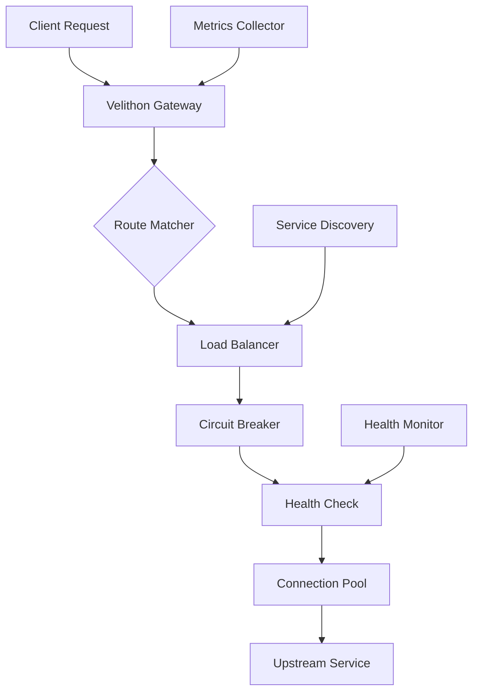
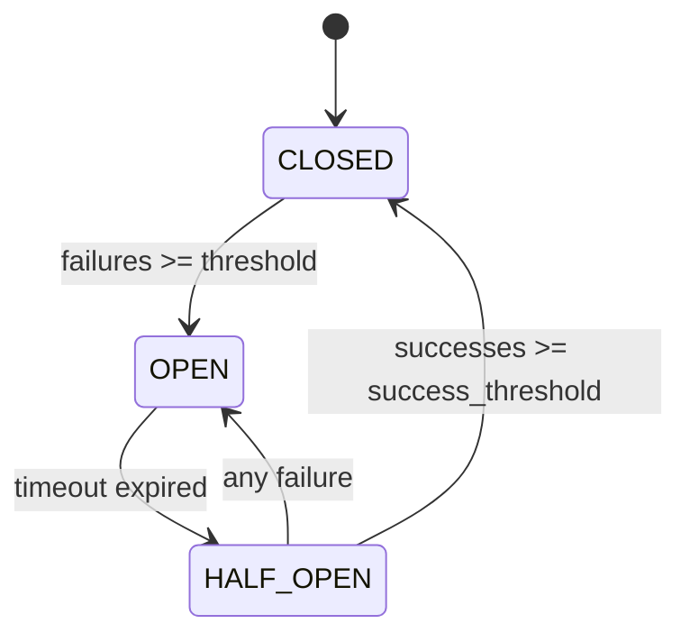

# Gateway & Proxy

Velithon provides powerful gateway and proxy capabilities implemented in Rust for maximum performance. The system includes load balancing, circuit breakers, health checking, and intelligent request routing.

## 🌟 Features

- **High Performance**: Rust-based implementation using hyper
- **Load Balancing**: Multiple strategies (round-robin, random, weighted)
- **Circuit Breaker**: Prevents cascading failures
- **Health Checking**: Automatic monitoring of upstream services
- **Connection Pooling**: Efficient connection reuse
- **Request Transformation**: Header and path manipulation
- **Retry Logic**: Exponential backoff for failed requests
- **No OpenSSL Dependencies**: Uses native system TLS

## 🏗️ Gateway Architecture



## 🚀 Quick Start

### Basic Gateway Setup

```python
from velithon import Velithon
from velithon.gateway import Gateway, forward_to

app = Velithon()

# Create gateway instance
gateway = Gateway()

# Simple forwarding
@app.get("/api/{path:path}")
async def api_proxy(request: Request):
    return await forward_to("http://api-service:8080", request)
```

### Advanced Gateway Configuration

```python
from velithon.gateway import Gateway, GatewayRoute, LoadBalancer
from velithon.gateway.strategies import RoundRobinStrategy, WeightedStrategy

# Configure load balancer
load_balancer = LoadBalancer(
    upstream_servers=[
        "http://api-1:8080",
        "http://api-2:8080", 
        "http://api-3:8080"
    ],
    strategy=RoundRobinStrategy(),
    health_check_interval=30,
    circuit_breaker_threshold=5
)

# Create gateway with configuration
gateway = Gateway(
    load_balancer=load_balancer,
    timeout=30.0,
    retry_attempts=3,
    retry_backoff_factor=2.0
)

# Register gateway routes
@app.include_router(gateway.get_router(), prefix="/gateway")
```

## 🔀 Load Balancing

### Round Robin Strategy

```python
from velithon.gateway.strategies import RoundRobinStrategy

load_balancer = LoadBalancer(
    upstream_servers=[
        "http://service-1:8080",
        "http://service-2:8080",
        "http://service-3:8080"
    ],
    strategy=RoundRobinStrategy()
)

@app.get("/balanced/{path:path}")
async def balanced_endpoint(request: Request):
    return await gateway.forward_request(request, load_balancer)
```

### Weighted Strategy

```python
from velithon.gateway.strategies import WeightedStrategy

# Different weights for different servers
weighted_strategy = WeightedStrategy({
    "http://high-capacity-server:8080": 3,  # 60% of traffic
    "http://medium-server:8080": 2,         # 40% of traffic
    "http://backup-server:8080": 1          # 20% of traffic (if others fail)
})

load_balancer = LoadBalancer(
    upstream_servers=list(weighted_strategy.servers.keys()),
    strategy=weighted_strategy
)
```

### Random Strategy

```python
from velithon.gateway.strategies import RandomStrategy

load_balancer = LoadBalancer(
    upstream_servers=[
        "http://service-a:8080",
        "http://service-b:8080"
    ],
    strategy=RandomStrategy()
)
```

### Custom Load Balancing Strategy

```python
from velithon.gateway.strategies import LoadBalancingStrategy

class CustomStrategy(LoadBalancingStrategy):
    def __init__(self):
        self.current_index = 0
    
    def select_server(self, servers: list[str], request_context: dict = None) -> str:
        # Custom logic based on request context
        if request_context and "user_type" in request_context:
            if request_context["user_type"] == "premium":
                return "http://premium-service:8080"
        
        # Fallback to round-robin
        server = servers[self.current_index % len(servers)]
        self.current_index += 1
        return server

# Use custom strategy
custom_strategy = CustomStrategy()
load_balancer = LoadBalancer(
    upstream_servers=["http://default-service:8080", "http://premium-service:8080"],
    strategy=custom_strategy
)
```

## ⚡ Circuit Breaker

The circuit breaker prevents cascading failures by monitoring upstream service health:

### Circuit Breaker Configuration

```python
from velithon.gateway import CircuitBreaker

circuit_breaker = CircuitBreaker(
    failure_threshold=5,        # Open after 5 failures
    timeout_duration=60,        # Stay open for 60 seconds
    half_open_requests=3,       # Allow 3 requests in half-open state
    success_threshold=2         # Close after 2 successes in half-open state
)

gateway = Gateway(circuit_breaker=circuit_breaker)
```

### Circuit Breaker States



### Custom Circuit Breaker Logic

```python
@app.get("/monitored-service/{path:path}")
async def monitored_proxy(request: Request):
    try:
        response = await gateway.forward_request(request, load_balancer)
        # Circuit breaker automatically tracks success
        return response
    except CircuitBreakerOpenError:
        # Circuit breaker is open, return fallback response
        return JSONResponse(
            {"error": "Service temporarily unavailable", "retry_after": 60},
            status_code=503
        )
```

## 🏥 Health Checking

### Automatic Health Checks

```python
from velithon.gateway import HealthChecker

health_checker = HealthChecker(
    check_interval=30,          # Check every 30 seconds
    timeout=5.0,               # 5 second timeout per check
    check_path="/health",      # Health check endpoint
    expected_status=200,       # Expected status code
    consecutive_failures=3     # Mark unhealthy after 3 failures
)

load_balancer = LoadBalancer(
    upstream_servers=[
        "http://service-1:8080",
        "http://service-2:8080"
    ],
    health_checker=health_checker
)
```

### Custom Health Check Logic

```python
from velithon.gateway.health import HealthCheckResult

async def custom_health_check(server_url: str) -> HealthCheckResult:
    """Custom health check implementation."""
    try:
        # Perform custom health validation
        async with httpx.AsyncClient() as client:
            response = await client.get(f"{server_url}/custom-health")
            
            if response.status_code == 200:
                data = response.json()
                if data.get("status") == "healthy" and data.get("cpu_usage", 100) < 80:
                    return HealthCheckResult(healthy=True, latency=response.elapsed.total_seconds())
        
        return HealthCheckResult(healthy=False, error="Service not healthy")
    
    except Exception as e:
        return HealthCheckResult(healthy=False, error=str(e))

# Use custom health checker
health_checker = HealthChecker(
    check_interval=30,
    custom_check_function=custom_health_check
)
```

## 🔧 Request Transformation

### Header Manipulation

```python
from velithon.gateway.transformers import HeaderTransformer

# Add headers to upstream requests
header_transformer = HeaderTransformer(
    add_headers={
        "X-Forwarded-By": "Velithon-Gateway",
        "X-Request-ID": lambda: str(uuid.uuid4())
    },
    remove_headers=["X-Internal-Header"],
    modify_headers={
        "User-Agent": lambda ua: f"{ua} via Velithon"
    }
)

@app.get("/transformed/{path:path}")
async def transformed_proxy(request: Request):
    # Apply transformations
    transformed_request = header_transformer.transform_request(request)
    return await gateway.forward_request(transformed_request, load_balancer)
```

### Path Rewriting

```python
from velithon.gateway.transformers import PathTransformer

# Rewrite paths before forwarding
path_transformer = PathTransformer(
    strip_prefix="/api/v1",     # Remove prefix
    add_prefix="/internal",     # Add new prefix
    path_mappings={
        "/users": "/accounts",   # Map specific paths
        "/orders": "/purchases"
    }
)

@app.get("/api/v1/{path:path}")
async def rewritten_proxy(request: Request):
    transformed_request = path_transformer.transform_request(request)
    return await gateway.forward_request(transformed_request, load_balancer)
```

### Request Body Transformation

```python
from velithon.gateway.transformers import BodyTransformer

async def transform_request_body(body: bytes, content_type: str) -> bytes:
    """Transform request body before forwarding."""
    if content_type == "application/json":
        data = json.loads(body)
        # Add metadata
        data["_forwarded_by"] = "velithon-gateway"
        data["_timestamp"] = datetime.utcnow().isoformat()
        return json.dumps(data).encode()
    return body

body_transformer = BodyTransformer(transform_function=transform_request_body)
```

## 🔄 Retry Logic

### Automatic Retries

```python
from velithon.gateway import RetryConfig

retry_config = RetryConfig(
    max_attempts=3,
    backoff_factor=2.0,         # Exponential backoff: 1s, 2s, 4s
    retryable_status_codes=[502, 503, 504],
    retryable_exceptions=[ConnectionError, TimeoutError]
)

gateway = Gateway(retry_config=retry_config)

@app.get("/retry-enabled/{path:path}")
async def retry_proxy(request: Request):
    # Automatic retries will be applied
    return await gateway.forward_request(request, load_balancer)
```

### Custom Retry Logic

```python
async def should_retry(response: Response, attempt: int) -> bool:
    """Custom retry decision logic."""
    if attempt >= 3:
        return False
    
    # Retry on 5xx errors or specific conditions
    if response.status_code >= 500:
        return True
    
    # Custom business logic
    if response.status_code == 429:  # Rate limited
        return True
    
    return False

retry_config = RetryConfig(
    max_attempts=5,
    custom_retry_function=should_retry
)
```

## 📊 Monitoring and Metrics

### Built-in Metrics

```python
from velithon.gateway.metrics import GatewayMetrics

metrics = GatewayMetrics()

@app.get("/metrics")
async def get_metrics():
    return {
        "requests_total": metrics.get_total_requests(),
        "requests_by_status": metrics.get_requests_by_status(),
        "average_response_time": metrics.get_average_response_time(),
        "upstream_health": metrics.get_upstream_health_status(),
        "circuit_breaker_status": metrics.get_circuit_breaker_status()
    }
```

### Custom Metrics Collection

```python
from velithon.gateway.middleware import MetricsMiddleware

async def custom_metrics_collector(request: Request, response: Response, duration: float):
    """Custom metrics collection logic."""
    # Log to external monitoring system
    logger.info(f"Request to {request.url} took {duration:.3f}s, status: {response.status_code}")
    
    # Send to metrics service
    await send_metrics({
        "path": request.url.path,
        "method": request.method,
        "status_code": response.status_code,
        "duration": duration,
        "timestamp": datetime.utcnow().isoformat()
    })

metrics_middleware = MetricsMiddleware(collector_function=custom_metrics_collector)
gateway = Gateway(middleware=[metrics_middleware])
```

## 🌐 Service Discovery

### Static Service Configuration

```python
from velithon.gateway.discovery import StaticServiceDiscovery

service_discovery = StaticServiceDiscovery({
    "user-service": ["http://user-1:8080", "http://user-2:8080"],
    "order-service": ["http://order-1:8080", "http://order-2:8080"],
    "payment-service": ["http://payment:8080"]
})

@app.get("/services/{service_name}/{path:path}")
async def dynamic_proxy(request: Request):
    service_name = request.path_params["service_name"]
    servers = service_discovery.get_servers(service_name)
    
    if not servers:
        return JSONResponse({"error": "Service not found"}, status_code=404)
    
    load_balancer = LoadBalancer(upstream_servers=servers)
    return await gateway.forward_request(request, load_balancer)
```

### Dynamic Service Discovery

```python
from velithon.gateway.discovery import ConsulServiceDiscovery

# Consul-based service discovery
consul_discovery = ConsulServiceDiscovery(
    consul_host="consul.service.consul",
    consul_port=8500,
    refresh_interval=30
)

@app.get("/dynamic/{service}/{path:path}")
async def consul_proxy(request: Request):
    service_name = request.path_params["service"]
    servers = await consul_discovery.get_healthy_servers(service_name)
    
    load_balancer = LoadBalancer(upstream_servers=servers)
    return await gateway.forward_request(request, load_balancer)
```

## 🛡️ Security Features

### Authentication Forwarding

```python
from typing import Annotated

@app.get("/secure/{path:path}")
async def secure_proxy(request: Request, current_user: Annotated[User, get_current_user]):
    # Add user context to forwarded request
    headers = dict(request.headers)
    headers["X-User-ID"] = current_user.id
    headers["X-User-Roles"] = ",".join(current_user.roles)
    
    # Forward with additional headers
    return await gateway.forward_request(
        request,
        load_balancer,
        additional_headers=headers
    )
```

### Rate Limiting

```python
from velithon.gateway.middleware import RateLimitMiddleware

rate_limiter = RateLimitMiddleware(
    requests_per_minute=100,
    requests_per_hour=1000,
    key_function=lambda request: request.client.host  # Rate limit by IP
)

gateway = Gateway(middleware=[rate_limiter])
```

## 📋 Complete Example

```python
from velithon import Velithon
from velithon.gateway import Gateway, LoadBalancer, CircuitBreaker, HealthChecker
from velithon.gateway.strategies import WeightedStrategy
from velithon.gateway.transformers import HeaderTransformer
from velithon.middleware import Middleware

app = Velithon()

# Configure load balancer with weights
load_balancer = LoadBalancer(
    upstream_servers=[
        "http://api-primary:8080",
        "http://api-secondary:8080",
        "http://api-backup:8080"
    ],
    strategy=WeightedStrategy({
        "http://api-primary:8080": 3,
        "http://api-secondary:8080": 2,
        "http://api-backup:8080": 1
    })
)

# Configure health checking
health_checker = HealthChecker(
    check_interval=30,
    timeout=5.0,
    check_path="/health",
    consecutive_failures=3
)

# Configure circuit breaker
circuit_breaker = CircuitBreaker(
    failure_threshold=5,
    timeout_duration=60,
    half_open_requests=3
)

# Configure request transformation
header_transformer = HeaderTransformer(
    add_headers={
        "X-Gateway": "Velithon",
        "X-Request-ID": lambda: str(uuid.uuid4())
    }
)

# Create gateway
gateway = Gateway(
    load_balancer=load_balancer,
    health_checker=health_checker,
    circuit_breaker=circuit_breaker,
    transformers=[header_transformer],
    timeout=30.0,
    retry_attempts=3
)

# Gateway routes
@app.get("/api/{path:path}")
async def api_gateway(request: Request):
    return await gateway.forward_request(request, load_balancer)

@app.get("/health/gateway")
async def gateway_health():
    return {
        "status": "healthy",
        "upstream_services": gateway.get_upstream_status(),
        "circuit_breaker": gateway.get_circuit_breaker_status()
    }

if __name__ == "__main__":
    app.run()
```

## 🚀 Performance Considerations

### Connection Pooling

```python
# Configure connection pool settings
gateway = Gateway(
    connection_pool_size=100,
    connection_pool_timeout=30.0,
    keep_alive_timeout=60.0,
    max_connections_per_host=20
)
```

### Async Processing

```python
# Use async context managers for efficient resource handling
@app.get("/efficient/{path:path}")
async def efficient_proxy(request: Request):
    async with gateway.get_client() as client:
        return await client.forward_request(request, load_balancer)
```

## 📚 Next Steps

- **[Load Balancing](load-balancing.md)** - Advanced load balancing strategies
- **[Circuit Breaker](circuit-breaker.md)** - Detailed circuit breaker patterns
- **[Health Checks](health-checks.md)** - Health monitoring strategies
- **[Performance Optimization](performance.md)** - Gateway performance tuning
