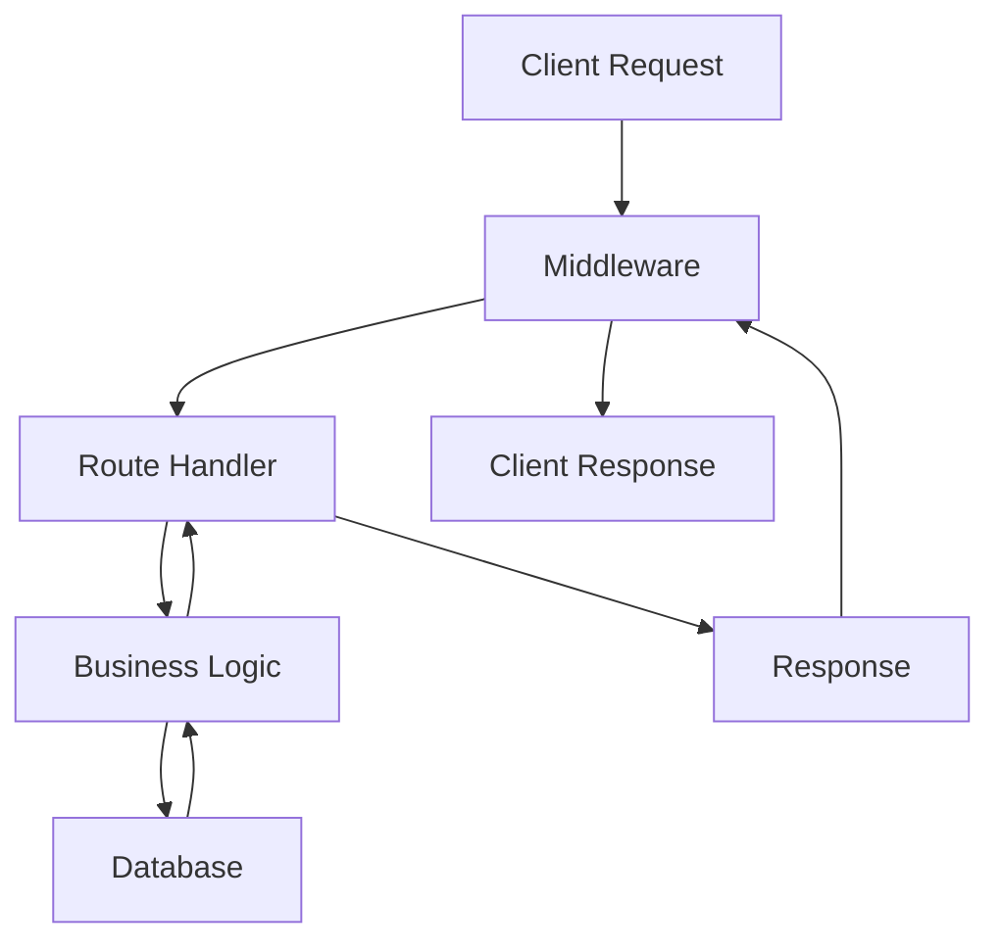

# Documentation Guidelines

This guide covers how to contribute to Velithon's documentation.

## Overview

Velithon's documentation is built with MkDocs using the Material theme. Documentation is written in Markdown and includes code examples, API references, and tutorials.

## Documentation Structure

```
docs/
├── index.md                    # Homepage
├── getting-started/           # Getting started guides
├── user-guide/               # User guides and tutorials
├── advanced/                 # Advanced features
├── security/                 # Security documentation
├── api/                      # API reference
├── examples/                 # Code examples
├── contributing/             # Contributing guides
├── deployment/               # Deployment guides
├── cli/                      # CLI documentation
└── openapi/                  # OpenAPI documentation
```

## Writing Documentation

### Markdown Guidelines

#### 1. Headers
Use hierarchical headers with proper spacing:

```markdown
# Main Title (H1)

Short introduction paragraph.

## Section Title (H2)

Content for this section.

### Subsection Title (H3)

More detailed content.

#### Sub-subsection (H4)

Very specific details.
```

#### 2. Code Blocks
Always specify the language for syntax highlighting:

```markdown
```python
from velithon import Velithon

app = Velithon()

@app.get("/")
async def hello():
    return {"message": "Hello, World!"}
```
````

#### 3. Links
Use descriptive link text:

```markdown
# Good
Learn more about [dependency injection](../user-guide/dependency-injection.md).

# Bad
Click [here](../user-guide/dependency-injection.md) for more info.
```

#### 4. Lists
Use consistent formatting:

```markdown
- First item
- Second item
  - Nested item
  - Another nested item
- Third item
```

### Content Guidelines

#### 1. Code Examples
Always provide complete, runnable examples:

```python
# Complete example that works out of the box
from velithon import Velithon
from velithon.responses import JSONResponse
from pydantic import BaseModel

app = Velithon()

class User(BaseModel):
    name: str
    email: str

@app.post("/users")
async def create_user(user: User):
    # Process the user
    return JSONResponse(
        {"message": "User created", "user": user.dict()},
        status_code=201
    )

if __name__ == "__main__":
    app.run()
```

#### 2. Explanations
Provide context and explanations:

```markdown
## User Registration

The user registration endpoint accepts user data and creates a new account:

```python
@app.post("/register")
async def register_user(user: UserCreate):
    # Validate the email format
    if not is_valid_email(user.email):
        raise HTTPException(status_code=400, detail="Invalid email")
    
    # Check if user already exists
    existing_user = await get_user_by_email(user.email)
    if existing_user:
        raise HTTPException(status_code=409, detail="User already exists")
    
    # Create the user
    new_user = await create_user_in_db(user)
    return {"user_id": new_user.id, "message": "User created successfully"}
```

Key points about this endpoint:

- **Input validation**: Checks email format before processing
- **Duplicate prevention**: Ensures unique email addresses
- **Error handling**: Returns appropriate HTTP status codes
- **Security**: Passwords should be hashed (not shown for brevity)
```

#### 3. Prerequisites
Always list prerequisites and assumptions:

```markdown
## Prerequisites

Before following this guide, make sure you have:

- Python 3.10 or higher installed
- Basic understanding of async/await in Python
- Familiarity with HTTP concepts
- A text editor or IDE
```

#### 4. Step-by-step Instructions
Break complex procedures into clear steps:

```markdown
## Setting Up Authentication

Follow these steps to add JWT authentication to your Velithon application:

### Step 1: Install Dependencies

```bash
poetry add python-jose[cryptography] passlib[bcrypt]
```

### Step 2: Create User Models

```python
from pydantic import BaseModel, EmailStr

class UserCreate(BaseModel):
    username: str
    email: EmailStr
    password: str
```

### Step 3: Set Up Password Hashing

```python
from passlib.context import CryptContext

pwd_context = CryptContext(schemes=["bcrypt"], deprecated="auto")

def hash_password(password: str) -> str:
    return pwd_context.hash(password)
```

Continue with remaining steps...
```

## API Documentation

### Documenting Endpoints

Use consistent format for API documentation:

```markdown
### POST /users

Create a new user account.

**Request Body:**
```json
{
    "username": "john_doe",
    "email": "john@example.com",
    "password": "secure_password_123",
    "full_name": "John Doe"
}
```

**Response (201 Created):**
```json
{
    "id": 1,
    "username": "john_doe",
    "email": "john@example.com",
    "full_name": "John Doe",
    "created_at": "2024-01-15T10:30:00Z"
}
```

**Error Responses:**

- `400 Bad Request` - Invalid input data
- `409 Conflict` - Username or email already exists
- `422 Unprocessable Entity` - Validation errors

**Example:**
```python
@app.post("/users", response_model=User)
async def create_user(user_data: UserCreate):
    """Create a new user account"""
    # Implementation here
    pass
```
```

### Function Documentation

Document functions with clear docstrings:

```python
def create_access_token(user_id: int, expires_delta: timedelta = None) -> str:
    """Create a JWT access token for a user.
    
    Args:
        user_id: The ID of the user to create the token for
        expires_delta: Token expiration time (defaults to 15 minutes)
        
    Returns:
        A JWT token string
        
    Raises:
        ValueError: If user_id is invalid
        
    Example:
        ```python
        token = create_access_token(user_id=123)
        headers = {"Authorization": f"Bearer {token}"}
        ```
    """
    pass
```

## Building Documentation

### Local Development

```bash
# Install documentation dependencies
poetry install --with docs

# Start development server
poetry run mkdocs serve

# Build static site
poetry run mkdocs build
```

The development server will be available at `http://127.0.0.1:8000` with hot reload.

### Project Configuration

The documentation is configured in `mkdocs.yml`:

```yaml
site_name: Velithon Documentation
site_description: A lightweight, high-performance, asynchronous web framework for Python

theme:
  name: material
  features:
    - navigation.tabs
    - navigation.sections
    - navigation.expand
    - search.highlight
    - content.code.copy

plugins:
  - search
  - mermaid2
  - awesome-pages

markdown_extensions:
  - pymdownx.highlight:
      anchor_linenums: true
  - pymdownx.inlinehilite
  - pymdownx.snippets
  - pymdownx.superfences
```

## Advanced Features

### Code Snippets

Use the snippets extension to include external code:

```markdown
--8<-- "examples/authentication_example.py"
```

### Diagrams

Use Mermaid for diagrams:

```markdown

````

### Admonitions

Use admonitions for important notes:

```markdown
!!! note
    This feature requires Python 3.10 or higher.

!!! warning
    Always validate user input before processing.

!!! tip
    Use dependency injection for better testability.

!!! danger
    Never store passwords in plain text.
```

### Tabs

Use tabs for multiple options:

```markdown
=== "Python"
    ```python
    from velithon import Velithon
    app = Velithon()
    ```

=== "JavaScript"
    ```javascript
    const response = await fetch('/api/users');
    const users = await response.json();
    ```

=== "curl"
    ```bash
    curl -X GET http://localhost:8000/api/users
    ```
```

## Style Guide

### Voice and Tone
- Use clear, concise language
- Write in active voice
- Be helpful and encouraging
- Avoid jargon when possible
- Explain technical terms when first used

### Formatting
- Use **bold** for UI elements and important terms
- Use `code` for file names, functions, and inline code
- Use _italics_ sparingly for emphasis
- Use consistent spacing around headers and sections

### Examples
- Provide realistic examples
- Show complete, working code
- Include error handling where appropriate
- Add comments to explain complex logic
- Test all code examples

## Review Process

### Self Review
Before submitting documentation:

1. **Spell check** - Use a spell checker
2. **Test code** - Verify all examples work
3. **Check links** - Ensure all links are valid
4. **Review formatting** - Check Markdown rendering
5. **Read aloud** - Check for clarity and flow

### Peer Review
Documentation changes go through the same review process as code:

1. Create a pull request
2. Request review from maintainers
3. Address feedback
4. Get approval before merging

## Common Patterns

### Tutorial Structure
```markdown
# Tutorial Title

Brief description of what the tutorial covers.

## Prerequisites
- List of requirements
- Links to prerequisite tutorials

## Overview
High-level explanation of what we'll build.

## Step 1: Setup
Initial setup instructions.

## Step 2: Implementation
Main implementation steps.

## Step 3: Testing
How to test the implementation.

## Complete Example
Full working code.

## Next Steps
Where to go from here.
```

### Reference Structure
```markdown
# API Reference: Module Name

Brief description of the module.

## Classes

### ClassName
Description of the class.

#### Methods

##### method_name(param1, param2)
Description, parameters, return value, examples.

## Functions

### function_name(param1, param2)
Description, parameters, return value, examples.

## Examples
Usage examples for the module.
```

## Tools and Utilities

### Useful Extensions
- **MkDocs Material** - Modern theme
- **PyMdown Extensions** - Enhanced Markdown features
- **MkDocs Mermaid** - Diagram support
- **MkDocs Git Revision Date** - Automatic date updates

### Validation Tools
```bash
# Check for broken links
poetry run mkdocs build --strict

# Validate Markdown
markdownlint docs/

# Check spelling
cspell "docs/**/*.md"
```

## Getting Help

If you need help with documentation:

1. Check existing documentation for examples
2. Review the [MkDocs documentation](https://www.mkdocs.org/)
3. Look at the [Material theme docs](https://squidfunk.github.io/mkdocs-material/)
4. Ask questions in GitHub discussions
5. Review recent documentation PRs for patterns

## Contributing

To contribute to documentation:

1. Fork the repository
2. Create a feature branch
3. Make your changes
4. Test locally with `mkdocs serve`
5. Submit a pull request
6. Address review feedback

Thank you for helping improve Velithon's documentation!
