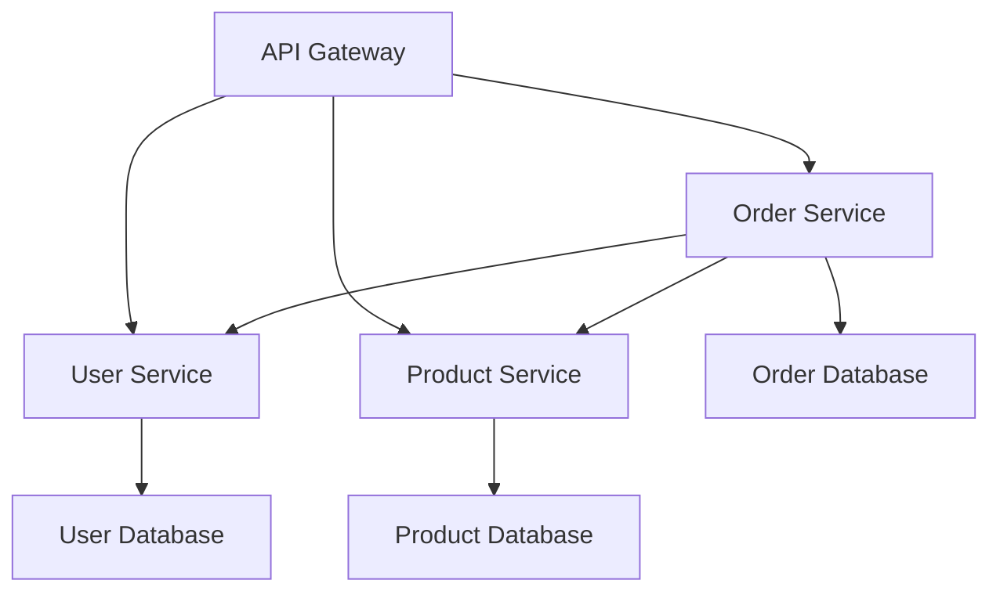

# Microservices Example

Build microservices architecture with Velithon, including service discovery and communication.

## Overview

This example demonstrates how to build a microservices system with Velithon, featuring:

- Multiple independent services
- Service-to-service communication
- API Gateway pattern
- Health checks and monitoring
- Load balancing

## Architecture



## 1. User Service

```python
# user_service.py
from velithon import Velithon
from velithon.responses import JSONResponse
from velithon.exceptions import HTTPException
from pydantic import BaseModel
from typing import List, Optional
import asyncio

app = Velithon(title="User Service", version="1.0.0")

# Models
class User(BaseModel):
    id: int
    username: str
    email: str
    full_name: str
    is_active: bool = True

class UserCreate(BaseModel):
    username: str
    email: str
    full_name: str

# In-memory storage (use database in production)
users_db = {}
next_user_id = 1

# Endpoints
@app.post("/users", response_model=User, tags=["users"])
async def create_user(user: UserCreate):
    global next_user_id
    
    # Check if user exists
    for existing_user in users_db.values():
        if existing_user.username == user.username:
            raise HTTPException(status_code=409, detail="Username already exists")
        if existing_user.email == user.email:
            raise HTTPException(status_code=409, detail="Email already exists")
    
    new_user = User(
        id=next_user_id,
        **user.dict()
    )
    users_db[next_user_id] = new_user
    next_user_id += 1
    
    return JSONResponse(new_user.dict(), status_code=201)

@app.get("/users", response_model=List[User], tags=["users"])
async def list_users():
    return JSONResponse([user.dict() for user in users_db.values()])

@app.get("/users/{user_id}", response_model=User, tags=["users"])
async def get_user(user_id: int):
    user = users_db.get(user_id)
    if not user:
        raise HTTPException(status_code=404, detail="User not found")
    return JSONResponse(user.dict())

@app.get("/health")
async def health_check():
    return {"service": "user-service", "status": "healthy", "version": "1.0.0"}

if __name__ == "__main__":
    app.run(host="0.0.0.0", port=8001)
```

## 2. Product Service

```python
# product_service.py
from velithon import Velithon
from velithon.responses import JSONResponse
from velithon.exceptions import HTTPException
from pydantic import BaseModel
from typing import List, Optional
from decimal import Decimal

app = Velithon(title="Product Service", version="1.0.0")

# Models
class Product(BaseModel):
    id: int
    name: str
    description: Optional[str] = None
    price: float
    stock: int
    category: str

class ProductCreate(BaseModel):
    name: str
    description: Optional[str] = None
    price: float
    stock: int
    category: str

# In-memory storage
products_db = {}
next_product_id = 1

# Sample data
sample_products = [
    ProductCreate(name="Laptop", description="Gaming laptop", price=1299.99, stock=10, category="Electronics"),
    ProductCreate(name="Coffee Mug", description="Ceramic mug", price=12.99, stock=50, category="Kitchenware"),
    ProductCreate(name="Book", description="Python guide", price=39.99, stock=25, category="Books"),
]

# Initialize with sample data
for product_data in sample_products:
    product = Product(id=next_product_id, **product_data.dict())
    products_db[next_product_id] = product
    next_product_id += 1

# Endpoints
@app.post("/products", response_model=Product, tags=["products"])
async def create_product(product: ProductCreate):
    global next_product_id
    
    new_product = Product(
        id=next_product_id,
        **product.dict()
    )
    products_db[next_product_id] = new_product
    next_product_id += 1
    
    return JSONResponse(new_product.dict(), status_code=201)

@app.get("/products", response_model=List[Product], tags=["products"])
async def list_products(category: Optional[str] = None):
    products = list(products_db.values())
    if category:
        products = [p for p in products if p.category.lower() == category.lower()]
    return JSONResponse([product.dict() for product in products])

@app.get("/products/{product_id}", response_model=Product, tags=["products"])
async def get_product(product_id: int):
    product = products_db.get(product_id)
    if not product:
        raise HTTPException(status_code=404, detail="Product not found")
    return JSONResponse(product.dict())

@app.put("/products/{product_id}/stock", tags=["products"])
async def update_stock(product_id: int, stock_change: int):
    product = products_db.get(product_id)
    if not product:
        raise HTTPException(status_code=404, detail="Product not found")
    
    new_stock = product.stock + stock_change
    if new_stock < 0:
        raise HTTPException(status_code=400, detail="Insufficient stock")
    
    product.stock = new_stock
    return JSONResponse({"product_id": product_id, "new_stock": new_stock})

@app.get("/health")
async def health_check():
    return {"service": "product-service", "status": "healthy", "version": "1.0.0"}

if __name__ == "__main__":
    app.run(host="0.0.0.0", port=8002)
```

## 3. Order Service

```python
# order_service.py
from velithon import Velithon
from velithon.responses import JSONResponse
from velithon.exceptions import HTTPException
from pydantic import BaseModel
from typing import List, Optional
import httpx
import datetime

app = Velithon(title="Order Service", version="1.0.0")

# Service URLs (use service discovery in production)
USER_SERVICE_URL = "http://localhost:8001"
PRODUCT_SERVICE_URL = "http://localhost:8002"

# Models
class OrderItem(BaseModel):
    product_id: int
    quantity: int
    price: float

class Order(BaseModel):
    id: int
    user_id: int
    items: List[OrderItem]
    total: float
    status: str
    created_at: datetime.datetime

class OrderCreate(BaseModel):
    user_id: int
    items: List[dict]  # {product_id: int, quantity: int}

# Storage
orders_db = {}
next_order_id = 1

async def get_user(user_id: int):
    """Get user from user service"""
    async with httpx.AsyncClient() as client:
        response = await client.get(f"{USER_SERVICE_URL}/users/{user_id}")
        if response.status_code == 404:
            return None
        response.raise_for_status()
        return response.json()

async def get_product(product_id: int):
    """Get product from product service"""
    async with httpx.AsyncClient() as client:
        response = await client.get(f"{PRODUCT_SERVICE_URL}/products/{product_id}")
        if response.status_code == 404:
            return None
        response.raise_for_status()
        return response.json()

async def update_product_stock(product_id: int, quantity_change: int):
    """Update product stock"""
    async with httpx.AsyncClient() as client:
        response = await client.put(
            f"{PRODUCT_SERVICE_URL}/products/{product_id}/stock",
            params={"stock_change": quantity_change}
        )
        response.raise_for_status()
        return response.json()

# Endpoints
@app.post("/orders", response_model=Order, tags=["orders"])
async def create_order(order_data: OrderCreate):
    global next_order_id
    
    # Validate user exists
    user = await get_user(order_data.user_id)
    if not user:
        raise HTTPException(status_code=404, detail="User not found")
    
    # Validate products and calculate total
    order_items = []
    total = 0.0
    
    for item_data in order_data.items:
        product_id = item_data["product_id"]
        quantity = item_data["quantity"]
        
        # Get product details
        product = await get_product(product_id)
        if not product:
            raise HTTPException(status_code=404, detail=f"Product {product_id} not found")
        
        # Check stock
        if product["stock"] < quantity:
            raise HTTPException(
                status_code=400, 
                detail=f"Insufficient stock for product {product_id}"
            )
        
        # Calculate item total
        item_total = product["price"] * quantity
        total += item_total
        
        order_items.append(OrderItem(
            product_id=product_id,
            quantity=quantity,
            price=product["price"]
        ))
    
    # Create order
    order = Order(
        id=next_order_id,
        user_id=order_data.user_id,
        items=order_items,
        total=total,
        status="pending",
        created_at=datetime.datetime.now()
    )
    
    # Update stock for all products
    try:
        for item in order_items:
            await update_product_stock(item.product_id, -item.quantity)
    except Exception as e:
        raise HTTPException(status_code=500, detail="Failed to update stock")
    
    # Save order
    orders_db[next_order_id] = order
    next_order_id += 1
    
    # Update order status
    order.status = "confirmed"
    
    return JSONResponse(order.dict(), status_code=201)

@app.get("/orders", response_model=List[Order], tags=["orders"])
async def list_orders(user_id: Optional[int] = None):
    orders = list(orders_db.values())
    if user_id:
        orders = [order for order in orders if order.user_id == user_id]
    return JSONResponse([order.dict() for order in orders])

@app.get("/orders/{order_id}", response_model=Order, tags=["orders"])
async def get_order(order_id: int):
    order = orders_db.get(order_id)
    if not order:
        raise HTTPException(status_code=404, detail="Order not found")
    return JSONResponse(order.dict())

@app.get("/health")
async def health_check():
    return {"service": "order-service", "status": "healthy", "version": "1.0.0"}

if __name__ == "__main__":
    app.run(host="0.0.0.0", port=8003)
```

## 4. API Gateway

```python
# api_gateway.py
from velithon import Velithon
from velithon.responses import JSONResponse
from velithon.exceptions import HTTPException
import httpx
import asyncio
from typing import Dict, List

app = Velithon(title="API Gateway", version="1.0.0")

# Service registry
SERVICES = {
    "user-service": {"url": "http://localhost:8001", "health": "/health"},
    "product-service": {"url": "http://localhost:8002", "health": "/health"},
    "order-service": {"url": "http://localhost:8003", "health": "/health"},
}

class ServiceRegistry:
    def __init__(self):
        self.services = SERVICES
        self.healthy_services = set()
    
    async def check_service_health(self, service_name: str, service_info: dict):
        """Check if a service is healthy"""
        try:
            async with httpx.AsyncClient(timeout=5.0) as client:
                response = await client.get(f"{service_info['url']}{service_info['health']}")
                if response.status_code == 200:
                    self.healthy_services.add(service_name)
                    return True
        except:
            pass
        
        self.healthy_services.discard(service_name)
        return False
    
    async def health_check_all(self):
        """Check health of all services"""
        tasks = [
            self.check_service_health(name, info)
            for name, info in self.services.items()
        ]
        await asyncio.gather(*tasks, return_exceptions=True)
    
    def get_service_url(self, service_name: str) -> str:
        """Get URL for a healthy service"""
        if service_name not in self.healthy_services:
            raise HTTPException(status_code=503, detail=f"Service {service_name} unavailable")
        return self.services[service_name]["url"]

registry = ServiceRegistry()

# Periodic health checks
async def periodic_health_check():
    while True:
        await registry.health_check_all()
        await asyncio.sleep(30)  # Check every 30 seconds

# Start health checks
@app.on_event("startup")
async def startup():
    asyncio.create_task(periodic_health_check())

# Proxy endpoints
@app.api_route("/api/users/{path:path}", methods=["GET", "POST", "PUT", "DELETE"])
async def proxy_users(request):
    """Proxy requests to user service"""
    service_url = registry.get_service_url("user-service")
    
    async with httpx.AsyncClient() as client:
        # Forward the request
        response = await client.request(
            method=request.method,
            url=f"{service_url}{request.url.path}",
            params=request.query_params,
            content=await request.body(),
            headers={k: v for k, v in request.headers.items() if k.lower() != "host"}
        )
        
        return JSONResponse(
            response.json() if response.content else {},
            status_code=response.status_code
        )

@app.api_route("/api/products/{path:path}", methods=["GET", "POST", "PUT", "DELETE"])
async def proxy_products(request):
    """Proxy requests to product service"""
    service_url = registry.get_service_url("product-service")
    
    async with httpx.AsyncClient() as client:
        response = await client.request(
            method=request.method,
            url=f"{service_url}{request.url.path}",
            params=request.query_params,
            content=await request.body(),
            headers={k: v for k, v in request.headers.items() if k.lower() != "host"}
        )
        
        return JSONResponse(
            response.json() if response.content else {},
            status_code=response.status_code
        )

@app.api_route("/api/orders/{path:path}", methods=["GET", "POST", "PUT", "DELETE"])
async def proxy_orders(request):
    """Proxy requests to order service"""
    service_url = registry.get_service_url("order-service")
    
    async with httpx.AsyncClient() as client:
        response = await client.request(
            method=request.method,
            url=f"{service_url}{request.url.path}",
            params=request.query_params,
            content=await request.body(),
            headers={k: v for k, v in request.headers.items() if k.lower() != "host"}
        )
        
        return JSONResponse(
            response.json() if response.content else {},
            status_code=response.status_code
        )

# Gateway-specific endpoints
@app.get("/health")
async def gateway_health():
    """Gateway health check"""
    await registry.health_check_all()
    
    service_status = {}
    for service_name in registry.services:
        service_status[service_name] = service_name in registry.healthy_services
    
    overall_healthy = len(registry.healthy_services) == len(registry.services)
    
    return JSONResponse({
        "gateway": "healthy",
        "services": service_status,
        "overall_healthy": overall_healthy
    })

@app.get("/services")
async def list_services():
    """List all registered services"""
    await registry.health_check_all()
    
    services_info = []
    for name, info in registry.services.items():
        services_info.append({
            "name": name,
            "url": info["url"],
            "healthy": name in registry.healthy_services
        })
    
    return JSONResponse({"services": services_info})

if __name__ == "__main__":
    app.run(host="0.0.0.0", port=8000)
```

## Running the Microservices

### Using Docker Compose

```yaml
# docker-compose.yml
version: '3.8'

services:
  user-service:
    build: .
    command: python user_service.py
    ports:
      - "8001:8001"
    environment:
      - SERVICE_NAME=user-service
    
  product-service:
    build: .
    command: python product_service.py
    ports:
      - "8002:8002"
    environment:
      - SERVICE_NAME=product-service
    
  order-service:
    build: .
    command: python order_service.py
    ports:
      - "8003:8003"
    environment:
      - SERVICE_NAME=order-service
    depends_on:
      - user-service
      - product-service
    
  api-gateway:
    build: .
    command: python api_gateway.py
    ports:
      - "8000:8000"
    environment:
      - SERVICE_NAME=api-gateway
    depends_on:
      - user-service
      - product-service
      - order-service
```

### Manual Setup

```bash
# Terminal 1: User Service
python user_service.py

# Terminal 2: Product Service
python product_service.py

# Terminal 3: Order Service
python order_service.py

# Terminal 4: API Gateway
python api_gateway.py
```

## Usage Examples

### Create a User
```bash
curl -X POST "http://localhost:8000/api/users" \
  -H "Content-Type: application/json" \
  -d '{
    "username": "john_doe",
    "email": "john@example.com",
    "full_name": "John Doe"
  }'
```

### List Products
```bash
curl "http://localhost:8000/api/products"
```

### Create an Order
```bash
curl -X POST "http://localhost:8000/api/orders" \
  -H "Content-Type: application/json" \
  -d '{
    "user_id": 1,
    "items": [
      {"product_id": 1, "quantity": 2},
      {"product_id": 2, "quantity": 1}
    ]
  }'
```

### Check Service Health
```bash
curl "http://localhost:8000/health"
```

## Key Features Demonstrated

- **Service Separation**: Each service has a single responsibility
- **Inter-service Communication**: Services communicate via HTTP APIs
- **API Gateway Pattern**: Single entry point for client requests
- **Health Checks**: Monitor service availability
- **Service Registry**: Track healthy services
- **Request Proxying**: Forward requests to appropriate services
- **Error Handling**: Graceful failure handling
- **Async Operations**: Non-blocking service calls

## Production Considerations

1. **Service Discovery**: Use Consul, etcd, or Kubernetes for service discovery
2. **Load Balancing**: Add multiple instances of each service
3. **Database Per Service**: Each service should have its own database
4. **Event-Driven Architecture**: Use message queues for async communication
5. **Circuit Breakers**: Prevent cascade failures
6. **Distributed Tracing**: Track requests across services
7. **Centralized Logging**: Aggregate logs from all services
8. **Security**: Add authentication and authorization
9. **Configuration Management**: Externalize configuration
10. **Monitoring**: Add metrics and alerting

This example provides a foundation for building scalable microservices with Velithon.
