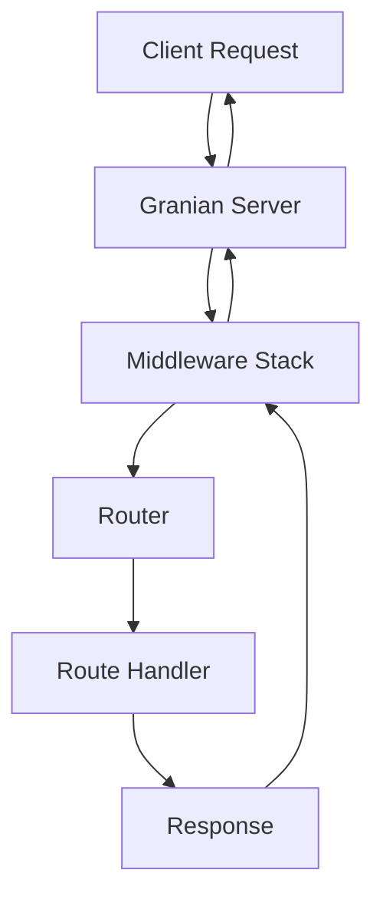

# Core Concepts

This section covers the fundamental concepts you need to understand to build applications with Velithon.

## Application Instance

The `Velithon` class is the central component of your application. It manages routing, middleware, dependency injection, and the application lifecycle.

```python
from velithon import Velithon

app = Velithon(
    title="My API",
    description="A sample API built with Velithon",
    version="1.0.0",
    openapi_url="/openapi.json",
    docs_url="/docs"
)
```

### Application Configuration

The `Velithon` constructor accepts many configuration options:

| Parameter | Type | Description | Default |
|-----------|------|-------------|---------|
| `title` | `str` | API title for documentation | `"Velithon"` |
| `description` | `str` | API description | `""` |
| `version` | `str` | API version | `"1.0.0"` |
| `openapi_version` | `str` | OpenAPI specification version | `"3.0.0"` |
| `openapi_url` | `str \| None` | OpenAPI schema URL | `"/openapi.json"` |
| `docs_url` | `str \| None` | Swagger UI documentation URL | `"/docs"` |
| `routes` | `Sequence[BaseRoute] \| None` | Initial routes | `None` |
| `middleware` | `Sequence[Middleware] \| None` | Middleware stack | `None` |
| `on_startup` | `Sequence[Callable] \| None` | Startup callbacks | `None` |
| `on_shutdown` | `Sequence[Callable] \| None` | Shutdown callbacks | `None` |
| `request_id_generator` | `Callable[[Request], str] \| None` | Custom request ID generator | `None` |
| `include_security_middleware` | `bool` | Include default security middleware | `False` |

## RSGI Protocol

Velithon is built on the **RSGI (Rust Server Gateway Interface)** protocol, which provides:

- **Ultra-high performance**: Direct Rust implementation with Python bindings
- **Granian server**: Uses Granian as the RSGI server (not ASGI/uvicorn)
- **Memory efficiency**: Optimized memory management
- **Concurrent processing**: Advanced concurrency patterns

### RSGI vs ASGI

Unlike ASGI frameworks, Velithon uses RSGI which offers:

```python
# Traditional ASGI application
async def asgi_app(scope, receive, send):
    # ASGI pattern
    pass

# Velithon RSGI application
async def rsgi_app(scope: Scope, protocol: Protocol):
    # RSGI pattern with typed interfaces
    pass
```

## Request-Response Cycle

### Basic Flow

1. **Request arrives** at the Granian server
2. **Middleware stack** processes the request
3. **Router** matches the path and method
4. **Route handler** executes (with DI if configured)
5. **Response** is returned through the middleware stack
6. **Granian** sends the response to the client



### Request Object

Every route handler receives a `Request` object:

```python
from velithon.requests import Request
from velithon.responses import JSONResponse

@app.get("/users/{user_id}")
async def get_user(request: Request):
    user_id = request.path_params["user_id"]
    query_param = request.query_params.get("include_details", False)
    
    # Access request headers
    auth_header = request.headers.get("authorization")
    
    # Access request body
    body = await request.json()
    
    return JSONResponse({"user_id": user_id, "data": body})
```

## Response Types

Velithon provides various response types for different use cases:

### JSONResponse

Optimized JSON responses using orjson:

```python
from velithon.responses import JSONResponse

@app.get("/data")
async def get_data():
    return JSONResponse({
        "message": "Hello World",
        "timestamp": "2025-01-01T00:00:00Z"
    })
```

### HTMLResponse

HTML responses for web pages:

```python
from velithon.responses import HTMLResponse

@app.get("/")
async def home():
    return HTMLResponse("""
    <html>
        <head><title>Velithon</title></head>
        <body><h1>Welcome to Velithon!</h1></body>
    </html>
    """)
```

### FileResponse

Serve static files:

```python
from velithon.responses import FileResponse

@app.get("/files/{filename}")
async def serve_file(filename: str):
    return FileResponse(f"static/{filename}")
```

### StreamingResponse

Stream large responses:

```python
from velithon.responses import StreamingResponse

@app.get("/stream")
async def stream_data():
    async def generate():
        for i in range(1000):
            yield f"data: {i}\n"
    
    return StreamingResponse(generate())
```

### SSEResponse

Server-Sent Events for real-time streaming:

```python
from velithon.responses import SSEResponse

@app.get("/events")
async def stream_events():
    async def event_generator():
        for i in range(100):
            yield {"event": "update", "data": f"Event {i}"}
            await asyncio.sleep(1)
    
    return SSEResponse(event_generator())
```

## Routing

### Basic Routes

Define routes using decorators:

```python
@app.get("/")
async def root():
    return {"message": "Hello World"}

@app.post("/items")
async def create_item():
    return {"message": "Item created"}

@app.put("/items/{item_id}")
async def update_item(item_id: int):
    return {"message": f"Updated item {item_id}"}

@app.delete("/items/{item_id}")
async def delete_item(item_id: int):
    return {"message": f"Deleted item {item_id}"}
```

### Path Parameters

Extract parameters from URLs:

```python
@app.get("/users/{user_id}")
async def get_user(user_id: int):
    return {"user_id": user_id}

@app.get("/posts/{post_id}/comments/{comment_id}")
async def get_comment(post_id: int, comment_id: int):
    return {"post_id": post_id, "comment_id": comment_id}
```

### Query Parameters

Handle query string parameters:

```python
@app.get("/search")
async def search(q: str, limit: int = 10, offset: int = 0):
    return {"query": q, "limit": limit, "offset": offset}
```

## Middleware

### Built-in Middleware

Velithon provides several built-in middleware components:

```python
from velithon.middleware import (
    LoggingMiddleware,
    CORSMiddleware,
    CompressionMiddleware,
    SessionMiddleware,
    AuthenticationMiddleware,
    PrometheusMiddleware
)

app = Velithon(
    middleware=[
        LoggingMiddleware(),
        CORSMiddleware(origins=["http://localhost:3000"]),
        CompressionMiddleware(),
        SessionMiddleware(secret_key="your-secret-key"),
        AuthenticationMiddleware(),
        PrometheusMiddleware()
    ]
)
```

### Custom Middleware

Create custom middleware:

```python
from velithon.middleware import BaseHTTPMiddleware
from velithon.requests import Request
from velithon.responses import Response

class CustomMiddleware(BaseHTTPMiddleware):
    async def dispatch(self, request: Request, call_next):
        # Pre-processing
        print(f"Processing request: {request.method} {request.url}")
        
        # Call next middleware/route handler
        response = await call_next(request)
        
        # Post-processing
        response.headers["X-Custom-Header"] = "Custom Value"
        
        return response

app = Velithon(middleware=[CustomMiddleware()])
```

## Dependency Injection

### Basic DI

Use dependency injection for clean, testable code:

```python
from velithon.di import inject, Provide

class DatabaseService:
    async def get_user(self, user_id: int):
        return {"id": user_id, "name": f"User {user_id}"}

@app.get("/users/{user_id}")
@inject
async def get_user(
    user_id: int,
    db: DatabaseService = Provide[DatabaseService]
):
    return await db.get_user(user_id)
```

### Service Container

Register services in a container:

```python
from velithon.di import ServiceContainer, SingletonProvider

class AppContainer(ServiceContainer):
    database_service = SingletonProvider(DatabaseService)
    cache_service = SingletonProvider(CacheService)

container = AppContainer()
app.register_container(container)
```

## Error Handling

### HTTP Exceptions

Raise HTTP exceptions for error responses:

```python
from velithon.exceptions import HTTPException

@app.get("/users/{user_id}")
async def get_user(user_id: int):
    if user_id < 1:
        raise HTTPException(status_code=400, detail="Invalid user ID")
    
    if user_id > 1000:
        raise HTTPException(status_code=404, detail="User not found")
    
    return {"user_id": user_id}
```

## WebSocket Support

### Basic WebSocket

Handle WebSocket connections:

```python
from velithon.websocket import WebSocket

@app.websocket("/ws")
async def websocket_endpoint(websocket: WebSocket):
    await websocket.accept()
    
    try:
        while True:
            data = await websocket.receive_text()
            await websocket.send_text(f"Message: {data}")
    except Exception:
        await websocket.close()
```

### WebSocket with Authentication

```python
@app.websocket("/ws/auth")
async def websocket_auth(websocket: WebSocket):
    # Check authentication
    token = websocket.query_params.get("token")
    if not token:
        await websocket.close(code=4001)
        return
    
    await websocket.accept()
    # Handle authenticated WebSocket connection
```

## Background Tasks

### Simple Background Tasks

Run tasks in the background:

```python
from velithon.background import BackgroundTask

@app.post("/send-email")
async def send_email(
    email: str,
    background_tasks: BackgroundTask
):
    background_tasks.add_task(send_email_task, email)
    return {"message": "Email queued for sending"}

async def send_email_task(email: str):
    # Simulate email sending
    await asyncio.sleep(5)
    print(f"Email sent to {email}")
```

## Application Lifecycle

### Startup and Shutdown

Register startup and shutdown handlers:

```python
@app.on_startup
async def startup():
    # Initialize database connections
    # Load configuration
    # Start background services
    print("Application starting up...")

@app.on_shutdown
async def shutdown():
    # Close database connections
    # Clean up resources
    # Stop background services
    print("Application shutting down...")
```

## Configuration Management

### Environment-based Configuration

```python
import os
from velithon import Velithon

app = Velithon(
    title=os.getenv("APP_TITLE", "Velithon API"),
    version=os.getenv("APP_VERSION", "1.0.0"),
    description=os.getenv("APP_DESCRIPTION", "")
)
```

### Settings Class

```python
from pydantic import BaseSettings

class Settings(BaseSettings):
    app_name: str = "Velithon"
    debug: bool = False
    database_url: str
    
    class Config:
        env_file = ".env"

settings = Settings()
app = Velithon(title=settings.app_name)
```

This covers the core concepts of Velithon. Each of these topics is explored in more detail in the following sections of the documentation.
