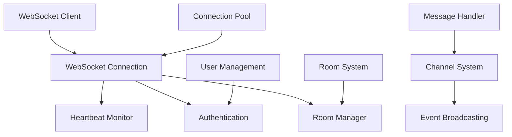

# WebSocket Support

Velithon provides comprehensive WebSocket support with advanced features including connection management, room-based messaging, heartbeat monitoring, and user authentication. The WebSocket implementation is designed for high performance and scalability.

## 🌟 Features

- **High Performance**: Rust-optimized WebSocket implementation
- **Connection Management**: Automatic connection lifecycle handling
- **Room System**: Group messaging and communication
- **Heartbeat Monitoring**: Connection health monitoring
- **User Authentication**: Secure WebSocket connections
- **Channel-based Messaging**: Structured message handling
- **Event Broadcasting**: Real-time event distribution
- **Graceful Disconnection**: Proper cleanup on disconnect

## 🏗️ WebSocket Architecture



## 🚀 Quick Start

### Basic WebSocket Endpoint

```python
from velithon import Velithon
from velithon.websocket import WebSocket, websocket_route

app = Velithon()

@app.websocket("/ws")
async def websocket_endpoint(websocket: WebSocket):
    # Accept the connection
    await websocket.accept()
    
    try:
        while True:
            # Receive message from client
            message = await websocket.receive_text()
            
            # Echo message back
            await websocket.send_text(f"Echo: {message}")
    
    except WebSocketDisconnect:
        print("Client disconnected")
```

### JSON Message Handling

```python
@app.websocket("/ws/json")
async def json_websocket(websocket: WebSocket):
    await websocket.accept()
    
    try:
        while True:
            # Receive JSON message
            data = await websocket.receive_json()
            
            # Process message
            response = {
                "type": "response",
                "message": f"Received: {data.get('message', '')}",
                "timestamp": datetime.utcnow().isoformat()
            }
            
            # Send JSON response
            await websocket.send_json(response)
    
    except WebSocketDisconnect:
        print("JSON WebSocket disconnected")
```

### Binary Data Handling

```python
@app.websocket("/ws/binary")
async def binary_websocket(websocket: WebSocket):
    await websocket.accept()
    
    try:
        while True:
            # Receive binary data
            data = await websocket.receive_bytes()
            
            # Process binary data (e.g., image processing)
            processed_data = process_binary_data(data)
            
            # Send binary response
            await websocket.send_bytes(processed_data)
    
    except WebSocketDisconnect:
        print("Binary WebSocket disconnected")
```

## 🔐 Authentication

### JWT Authentication

```python
from velithon.security import JWTHandler
from velithon.websocket import WebSocketDisconnect

jwt_handler = JWTHandler(secret_key="your-secret-key")

@app.websocket("/ws/authenticated")
async def authenticated_websocket(websocket: WebSocket):
    # Get token from query parameters or headers
    token = websocket.query_params.get("token")
    
    if not token:
        await websocket.close(code=4001, reason="Missing authentication token")
        return
    
    try:
        # Verify JWT token
        payload = jwt_handler.decode_token(token)
        user_id = payload.get("sub")
        
        # Accept authenticated connection
        await websocket.accept()
        websocket.state.user_id = user_id
        
        # Handle authenticated messages
        while True:
            message = await websocket.receive_text()
            response = f"Authenticated user {user_id}: {message}"
            await websocket.send_text(response)
    
    except JWTError:
        await websocket.close(code=4001, reason="Invalid token")
    except WebSocketDisconnect:
        print(f"Authenticated user {user_id} disconnected")
```

### API Key Authentication

```python
@app.websocket("/ws/api-key")
async def api_key_websocket(websocket: WebSocket):
    # Get API key from headers
    api_key = websocket.headers.get("x-api-key")
    
    if not validate_api_key(api_key):
        await websocket.close(code=4003, reason="Invalid API key")
        return
    
    await websocket.accept()
    # Continue with authenticated WebSocket logic
```

## 🏠 Room System

### Basic Room Management

```python
from velithon.websocket import RoomManager, Room

# Global room manager
room_manager = RoomManager()

@app.websocket("/ws/chat/{room_name}")
async def chat_room(websocket: WebSocket):
    room_name = websocket.path_params["room_name"]
    user_id = websocket.query_params.get("user_id", "anonymous")
    
    await websocket.accept()
    
    # Join room
    await room_manager.join_room(room_name, websocket, user_id=user_id)
    
    try:
        while True:
            message = await websocket.receive_text()
            
            # Broadcast message to all room members
            await room_manager.broadcast_to_room(
                room_name,
                {
                    "type": "message",
                    "user_id": user_id,
                    "message": message,
                    "timestamp": datetime.utcnow().isoformat()
                }
            )
    
    except WebSocketDisconnect:
        # Leave room on disconnect
        await room_manager.leave_room(room_name, websocket)
        print(f"User {user_id} left room {room_name}")
```

### Advanced Room Features

```python
from velithon.websocket import Room, RoomUser, UserRole

class ChatRoom(Room):
    def __init__(self, name: str):
        super().__init__(name)
        self.message_history = []
        self.max_history = 100
    
    async def on_user_join(self, user: RoomUser):
        # Send welcome message
        await user.websocket.send_json({
            "type": "welcome",
            "room": self.name,
            "user_count": len(self.users),
            "recent_messages": self.message_history[-10:]
        })
        
        # Notify other users
        await self.broadcast_except_user(user, {
            "type": "user_joined",
            "user_id": user.user_id,
            "user_count": len(self.users)
        })
    
    async def on_user_leave(self, user: RoomUser):
        # Notify remaining users
        await self.broadcast({
            "type": "user_left",
            "user_id": user.user_id,
            "user_count": len(self.users) - 1
        })
    
    async def handle_message(self, user: RoomUser, message: dict):
        # Store message in history
        chat_message = {
            "user_id": user.user_id,
            "message": message.get("content"),
            "timestamp": datetime.utcnow().isoformat()
        }
        
        self.message_history.append(chat_message)
        if len(self.message_history) > self.max_history:
            self.message_history.pop(0)
        
        # Broadcast to all users
        await self.broadcast({
            "type": "chat_message",
            **chat_message
        })

# Use custom room
@app.websocket("/ws/advanced-chat/{room_name}")
async def advanced_chat(websocket: WebSocket):
    room_name = websocket.path_params["room_name"]
    user_id = websocket.query_params.get("user_id")
    
    await websocket.accept()
    
    # Get or create custom room
    room = room_manager.get_or_create_room(room_name, ChatRoom)
    
    # Create user with role
    user = RoomUser(
        websocket=websocket,
        user_id=user_id,
        role=UserRole.MEMBER
    )
    
    await room.add_user(user)
    
    try:
        while True:
            data = await websocket.receive_json()
            await room.handle_message(user, data)
    
    except WebSocketDisconnect:
        await room.remove_user(user)
```

## 💓 Heartbeat Monitoring

### Automatic Heartbeat

```python
from velithon.websocket import HeartbeatManager

heartbeat_manager = HeartbeatManager(
    ping_interval=30,  # Send ping every 30 seconds
    pong_timeout=10,   # Wait 10 seconds for pong
    max_failures=3     # Disconnect after 3 failed pings
)

@app.websocket("/ws/heartbeat")
async def heartbeat_websocket(websocket: WebSocket):
    await websocket.accept()
    
    # Start heartbeat monitoring
    heartbeat = heartbeat_manager.start_heartbeat(websocket)
    
    try:
        while True:
            message = await websocket.receive_text()
            await websocket.send_text(f"Received: {message}")
    
    except WebSocketDisconnect:
        # Stop heartbeat monitoring
        heartbeat_manager.stop_heartbeat(websocket)
        print("WebSocket disconnected")
```

### Custom Heartbeat Logic

```python
from velithon.websocket import Heartbeat

class CustomHeartbeat(Heartbeat):
    async def on_ping_sent(self, websocket: WebSocket):
        print(f"Ping sent to {websocket.client.host}")
    
    async def on_pong_received(self, websocket: WebSocket):
        print(f"Pong received from {websocket.client.host}")
    
    async def on_heartbeat_failed(self, websocket: WebSocket):
        print(f"Heartbeat failed for {websocket.client.host}")
        await websocket.close(code=1000, reason="Heartbeat failed")

# Use custom heartbeat
custom_heartbeat = CustomHeartbeat(ping_interval=20, pong_timeout=5)
```

## 📡 Channel System

### Channel-based Messaging

```python
from velithon.websocket import Channel, ChannelMessage

# Create channels
user_channel = Channel("user_updates")
notification_channel = Channel("notifications")

@app.websocket("/ws/channels")
async def channel_websocket(websocket: WebSocket):
    await websocket.accept()
    
    # Subscribe to channels
    await user_channel.subscribe(websocket)
    await notification_channel.subscribe(websocket)
    
    try:
        while True:
            data = await websocket.receive_json()
            
            # Route message to appropriate channel
            if data.get("channel") == "user_updates":
                message = ChannelMessage(
                    channel="user_updates",
                    data=data.get("data"),
                    sender=websocket
                )
                await user_channel.publish(message)
    
    except WebSocketDisconnect:
        # Unsubscribe from channels
        await user_channel.unsubscribe(websocket)
        await notification_channel.unsubscribe(websocket)
```

### Broadcasting to Channels

```python
# Broadcast from HTTP endpoints
@app.post("/broadcast/notification")
async def broadcast_notification(request: Request):
    notification = await request.json()
    
    message = ChannelMessage(
        channel="notifications",
        data={
            "type": "notification",
            "title": notification.get("title"),
            "message": notification.get("message"),
            "timestamp": datetime.utcnow().isoformat()
        }
    )
    
    # Broadcast to all subscribers
    await notification_channel.publish(message)
    
    return {"status": "broadcast_sent"}
```

## 🎯 Real-time Features

### Live Data Updates

```python
import asyncio

@app.websocket("/ws/live-data")
async def live_data_websocket(websocket: WebSocket):
    await websocket.accept()
    
    async def send_live_updates():
        while True:
            try:
                # Fetch live data (e.g., from database, API, etc.)
                data = await get_live_data()
                
                await websocket.send_json({
                    "type": "live_update",
                    "data": data,
                    "timestamp": datetime.utcnow().isoformat()
                })
                
                await asyncio.sleep(1)  # Update every second
            
            except WebSocketDisconnect:
                break
            except Exception as e:
                print(f"Error sending live updates: {e}")
                break
    
    # Start background task for live updates
    update_task = asyncio.create_task(send_live_updates())
    
    try:
        # Handle incoming messages
        while True:
            message = await websocket.receive_text()
            # Process incoming messages if needed
    
    except WebSocketDisconnect:
        update_task.cancel()
        print("Live data WebSocket disconnected")
```

### Server-Sent Events Integration

```python
from velithon.responses import SSEResponse

# Hybrid approach: WebSocket for bidirectional, SSE for server-to-client
@app.get("/sse/live-updates")
async def sse_live_updates():
    async def event_stream():
        while True:
            data = await get_live_data()
            yield f"data: {json.dumps(data)}\n\n"
            await asyncio.sleep(1)
    
    return SSEResponse(event_stream())

@app.websocket("/ws/commands")
async def command_websocket(websocket: WebSocket):
    await websocket.accept()
    
    # Handle commands from client
    while True:
        command = await websocket.receive_json()
        result = await process_command(command)
        await websocket.send_json({"result": result})
```

## 🔧 Connection Management

### Connection Pool

```python
from velithon.websocket import WebSocketConnectionPool

connection_pool = WebSocketConnectionPool(
    max_connections=10000,
    cleanup_interval=300,  # Clean up dead connections every 5 minutes
    idle_timeout=600       # Disconnect idle connections after 10 minutes
)

@app.websocket("/ws/pooled")
async def pooled_websocket(websocket: WebSocket):
    await websocket.accept()
    
    # Add to connection pool
    connection_pool.add_connection(websocket)
    
    try:
        while True:
            message = await websocket.receive_text()
            await websocket.send_text(f"Echo: {message}")
    
    except WebSocketDisconnect:
        # Remove from pool
        connection_pool.remove_connection(websocket)
```

### Connection Limits

```python
from velithon.middleware import ConnectionLimitMiddleware

# Limit WebSocket connections per IP
connection_limit = ConnectionLimitMiddleware(
    max_connections_per_ip=10,
    max_total_connections=1000
)

app = Velithon(middleware=[Middleware(connection_limit)])
```

## 📊 Monitoring and Metrics

### WebSocket Metrics

```python
from velithon.websocket.metrics import WebSocketMetrics

metrics = WebSocketMetrics()

@app.websocket("/ws/monitored")
async def monitored_websocket(websocket: WebSocket):
    await websocket.accept()
    metrics.connection_opened()
    
    try:
        while True:
            message = await websocket.receive_text()
            metrics.message_received()
            
            await websocket.send_text(f"Echo: {message}")
            metrics.message_sent()
    
    except WebSocketDisconnect:
        metrics.connection_closed()

@app.get("/ws-metrics")
async def get_websocket_metrics():
    return {
        "total_connections": metrics.get_total_connections(),
        "active_connections": metrics.get_active_connections(),
        "messages_per_second": metrics.get_messages_per_second(),
        "average_connection_duration": metrics.get_average_connection_duration()
    }
```

## 🎮 Complete Chat Example

```python
from velithon import Velithon
from velithon.websocket import WebSocket, WebSocketDisconnect, RoomManager
from velithon.security import JWTHandler

app = Velithon()
room_manager = RoomManager()
jwt_handler = JWTHandler(secret_key="chat-secret")

class ChatMessage:
    def __init__(self, user_id: str, message: str, room: str):
        self.user_id = user_id
        self.message = message
        self.room = room
        self.timestamp = datetime.utcnow().isoformat()
    
    def to_dict(self):
        return {
            "user_id": self.user_id,
            "message": self.message,
            "room": self.room,
            "timestamp": self.timestamp
        }

@app.websocket("/ws/chat/{room_name}")
async def chat_websocket(websocket: WebSocket):
    room_name = websocket.path_params["room_name"]
    token = websocket.query_params.get("token")
    
    # Authenticate user
    if not token:
        await websocket.close(code=4001, reason="Missing token")
        return
    
    try:
        payload = jwt_handler.decode_token(token)
        user_id = payload.get("sub")
    except JWTError:
        await websocket.close(code=4001, reason="Invalid token")
        return
    
    await websocket.accept()
    
    # Join room
    await room_manager.join_room(room_name, websocket, user_id=user_id)
    
    # Send room info
    room_info = await room_manager.get_room_info(room_name)
    await websocket.send_json({
        "type": "room_info",
        "room": room_name,
        "user_count": room_info["user_count"],
        "users": room_info["users"]
    })
    
    try:
        while True:
            data = await websocket.receive_json()
            
            if data.get("type") == "chat_message":
                # Create chat message
                chat_msg = ChatMessage(
                    user_id=user_id,
                    message=data.get("message"),
                    room=room_name
                )
                
                # Broadcast to room
                await room_manager.broadcast_to_room(
                    room_name,
                    {
                        "type": "chat_message",
                        **chat_msg.to_dict()
                    }
                )
            
            elif data.get("type") == "typing"):
                # Broadcast typing indicator
                await room_manager.broadcast_to_room_except_user(
                    room_name,
                    websocket,
                    {
                        "type": "user_typing",
                        "user_id": user_id,
                        "is_typing": data.get("is_typing", False)
                    }
                )
    
    except WebSocketDisconnect:
        await room_manager.leave_room(room_name, websocket)
        print(f"User {user_id} left room {room_name}")

# HTTP endpoints for chat management
@app.post("/chat/broadcast/{room_name}")
async def broadcast_to_room(request: Request):
    room_name = request.path_params["room_name"]
    data = await request.json()
    
    await room_manager.broadcast_to_room(room_name, {
        "type": "system_message",
        "message": data.get("message"),
        "timestamp": datetime.utcnow().isoformat()
    })
    
    return {"status": "message_sent"}

@app.get("/chat/rooms")
async def list_rooms():
    rooms = await room_manager.get_all_rooms()
    return {"rooms": rooms}

@app.get("/chat/rooms/{room_name}/users")
async def get_room_users(request: Request):
    room_name = request.path_params["room_name"]
    room_info = await room_manager.get_room_info(room_name)
    return room_info

if __name__ == "__main__":
    app.run()
```

## 🚀 Performance Optimization

### Connection Optimization

```python
# Configure WebSocket settings for high performance
@app.websocket("/ws/optimized")
async def optimized_websocket(websocket: WebSocket):
    await websocket.accept(
        subprotocol="chat",  # Use specific subprotocol
        headers={"X-Custom": "value"}
    )
    
    # Configure connection settings
    websocket.set_ping_interval(30)
    websocket.set_max_message_size(1024 * 1024)  # 1MB
    websocket.enable_compression(True)
```

### Memory Management

```python
# Use connection pooling for memory efficiency
connection_pool = WebSocketConnectionPool(
    max_connections=5000,
    memory_threshold=0.8,  # Clean up at 80% memory usage
    cleanup_strategy="least_recently_used"
)
```

## 📚 Next Steps

- **[Server-Sent Events](sse.md)** - Alternative real-time communication
- **[Real-time Examples](../examples/real-time.md)** - Real-world WebSocket examples
- **[Security](../security/authentication.md)** - WebSocket security patterns
- **[Performance Optimization](../advanced/performance.md)** - WebSocket performance tuning
